# Technical Specifications

## 1. INTRODUCTION

### EXECUTIVE SUMMARY

The Documents View feature for Insure Pilot provides a dedicated, full-screen environment for users to review, process, and manage insurance-related documents. This feature addresses the critical business need for efficient document handling within insurance operations, where document review and metadata management are frequent, high-volume activities.

The primary stakeholders include claims adjusters, underwriters, and support staff who need to review documents and apply metadata, as well as supervisors and administrators who oversee document handling and ensure compliance. By centralizing document-related actions and maintaining a clear workflow, the Documents View feature will significantly improve operational efficiency, accuracy, and organization of document processing.

### SYSTEM OVERVIEW

#### Project Context

Insure Pilot operates in the insurance management software market, providing a comprehensive platform for policy, claims, and agent management. The Documents View feature enhances the platform's document management capabilities, addressing limitations in the current system where document viewing and metadata editing are disconnected processes requiring multiple screens or applications.

This feature integrates seamlessly with Insure Pilot's existing data architecture, leveraging established database schemas and relationships while providing a more streamlined user experience for document handling.

#### High-Level Description

The Documents View provides a full-screen lightbox interface with two primary panels:

- Left panel: Document display using Adobe Acrobat PDF viewer
- Right panel: Metadata fields, actions, and utility links

Key architectural decisions include:

- Integration with Adobe Acrobat PDF viewer for document display
- Comprehensive audit logging of all document actions
- Flexible metadata management with dynamic dropdown fields
- Clear state management for document processing status

The system follows a microservices architecture pattern, with the Documents View component interacting with several core services including DocumentManager, PolicyManager, and LossManager.

#### Success Criteria

| Success Criteria | Measurement Method |
| --- | --- |
| Reduced document processing time | 30% reduction in average time to process documents |
| Improved data accuracy | 50% reduction in metadata errors and corrections |
| Enhanced user satisfaction | User satisfaction score of 4.5/5 or higher in post-implementation survey |
| Streamlined workflow | Reduction in context switching between applications by 40% |

### SCOPE

#### In-Scope

**Core Features and Functionalities:**

| Feature | Description |
| --- | --- |
| Full-screen document viewer | Adobe Acrobat PDF integration with navigation controls |
| Metadata management | Editable fields for policy number, loss sequence, document type, etc. |
| Document actions | Mark as processed, trash document, view history |
| Audit trail | Comprehensive logging of all document changes and actions |

**Implementation Boundaries:**

| Boundary Type | Coverage |
| --- | --- |
| User Groups | Claims adjusters, underwriters, support staff, supervisors, administrators |
| System Integration | Integration with PolicyManager, LossManager, DocumentManager, and ProducerManager |
| Data Domains | Documents, policies, claims, producers, users, and related metadata |

#### Out-of-Scope

- Document creation and generation capabilities
- Optical character recognition (OCR) for document content
- Bulk document processing features
- Mobile-specific optimizations (future phase)
- Direct integration with external document management systems
- Document comparison tools
- Advanced search capabilities within document content
- Document annotation and markup tools

## 2. PRODUCT REQUIREMENTS

### 2.1 FEATURE CATALOG

#### Document Viewing & Interface (F-001)

| Metadata | Value |
| --- | --- |
| Feature Name | Document Viewing & Interface |
| Feature Category | Core Functionality |
| Priority Level | Critical |
| Status | Approved |

**Description:**

- **Overview**: Full-screen lightbox interface with dual-panel layout for document viewing and metadata management.
- **Business Value**: Centralizes document review workflow, reducing context switching and improving processing efficiency.
- **User Benefits**: Provides focused environment for document review with all necessary tools in one interface.
- **Technical Context**: Integrates Adobe Acrobat PDF viewer for document display with metadata editing capabilities.

**Dependencies:**

- **Prerequisite Features**: Document storage system
- **System Dependencies**: Adobe Acrobat PDF viewer integration
- **External Dependencies**: None
- **Integration Requirements**: Integration with document storage and retrieval system

#### Document Metadata Management (F-002)

| Metadata | Value |
| --- | --- |
| Feature Name | Document Metadata Management |
| Feature Category | Core Functionality |
| Priority Level | Critical |
| Status | Approved |

**Description:**

- **Overview**: Editable metadata fields for document categorization and organization.
- **Business Value**: Ensures accurate document classification and improves searchability.
- **User Benefits**: Allows users to properly categorize and link documents to relevant records.
- **Technical Context**: Connects to multiple database tables for relational data management.

**Dependencies:**

- **Prerequisite Features**: Document viewing interface (F-001)
- **System Dependencies**: Database integration for metadata storage
- **External Dependencies**: None
- **Integration Requirements**: Integration with policy, loss, and producer management systems

#### Document Processing Actions (F-003)

| Metadata | Value |
| --- | --- |
| Feature Name | Document Processing Actions |
| Feature Category | Core Functionality |
| Priority Level | High |
| Status | Approved |

**Description:**

- **Overview**: Actions for document workflow management including mark as processed and trash document.
- **Business Value**: Establishes clear document workflow states and prevents duplicate processing.
- **User Benefits**: Provides clear indication of document status and processing history.
- **Technical Context**: Updates document status in database and creates audit trail entries.

**Dependencies:**

- **Prerequisite Features**: Document viewing interface (F-001), Document metadata management (F-002)
- **System Dependencies**: Audit logging system
- **External Dependencies**: None
- **Integration Requirements**: Integration with document action tracking system

#### Document History & Audit Trail (F-004)

| Metadata | Value |
| --- | --- |
| Feature Name | Document History & Audit Trail |
| Feature Category | Compliance & Tracking |
| Priority Level | High |
| Status | Approved |

**Description:**

- **Overview**: Comprehensive logging of all document changes and actions with user attribution.
- **Business Value**: Provides accountability and compliance with regulatory requirements.
- **User Benefits**: Enables tracking of document changes and identification of processing history.
- **Technical Context**: Leverages action logging system to record all document interactions.

**Dependencies:**

- **Prerequisite Features**: Document processing actions (F-003)
- **System Dependencies**: Audit logging system
- **External Dependencies**: None
- **Integration Requirements**: Integration with user authentication system

#### Contextual Navigation (F-005)

| Metadata | Value |
| --- | --- |
| Feature Name | Contextual Navigation |
| Feature Category | User Experience |
| Priority Level | Medium |
| Status | Approved |

**Description:**

- **Overview**: Dynamic navigation options to related records based on document context.
- **Business Value**: Improves workflow efficiency by providing direct access to related information.
- **User Benefits**: Reduces time spent navigating between different system areas.
- **Technical Context**: Leverages document metadata to generate contextual navigation links.

**Dependencies:**

- **Prerequisite Features**: Document metadata management (F-002)
- **System Dependencies**: Policy, producer, and claimant management systems
- **External Dependencies**: None
- **Integration Requirements**: Integration with navigation system

#### Dynamic Dropdown Controls (F-006)

| Metadata | Value |
| --- | --- |
| Feature Name | Dynamic Dropdown Controls |
| Feature Category | User Experience |
| Priority Level | High |
| Status | Approved |

**Description:**

- **Overview**: Type-ahead filtering and dependent dropdown fields for efficient data entry.
- **Business Value**: Reduces data entry errors and improves processing speed.
- **User Benefits**: Simplifies selection of related data items and improves accuracy.
- **Technical Context**: Implements client-side filtering and server-side data fetching based on dependencies.

**Dependencies:**

- **Prerequisite Features**: Document metadata management (F-002)
- **System Dependencies**: Database integration for dropdown data sources
- **External Dependencies**: None
- **Integration Requirements**: Integration with policy, loss, and producer data systems

### 2.2 FUNCTIONAL REQUIREMENTS TABLE

#### Document Viewing & Interface (F-001)

| Requirement ID | Description | Acceptance Criteria | Priority |
| --- | --- | --- | --- |
| F-001-RQ-001 | The system must display documents in a full-screen lightbox overlay | Document viewer opens above the main interface and occupies the full screen | Must-Have |
| F-001-RQ-002 | The interface must be divided into left panel (document display) and right panel (metadata) | Interface clearly shows document on left and metadata fields on right | Must-Have |
| F-001-RQ-003 | The system must integrate with Adobe Acrobat PDF viewer | PDF documents display correctly with Adobe viewer controls | Must-Have |
| F-001-RQ-004 | Users must be able to scroll through multipage PDFs | Navigation through document pages works correctly | Must-Have |
| F-001-RQ-005 | The document filename must be displayed | Filename is visible and correctly retrieved from database | Should-Have |
| F-001-RQ-006 | The system must display saving/saved indicators during metadata changes | "Saving..." appears during changes and "Saved" appears when complete | Should-Have |

**Technical Specifications:**

- **Input Parameters**: Document ID, User authentication token
- **Output/Response**: Rendered document viewer with metadata panel
- **Performance Criteria**: Document viewer loads within 3 seconds
- **Data Requirements**: Document file access, metadata field values

**Validation Rules:**

- **Business Rules**: Only authenticated users can access documents
- **Data Validation**: Document must exist and be accessible to the user
- **Security Requirements**: Document access restricted based on user permissions
- **Compliance Requirements**: Document viewing must maintain audit trail

#### Document Metadata Management (F-002)

| Requirement ID | Description | Acceptance Criteria | Priority |
| --- | --- | --- | --- |
| F-002-RQ-001 | The system must display and allow editing of Policy Number field | Policy Number field shows available options and allows selection | Must-Have |
| F-002-RQ-002 | The system must display and allow editing of Loss Sequence field | Loss Sequence field shows options based on selected policy | Must-Have |
| F-002-RQ-003 | The system must display and allow editing of Claimant field | Claimant field shows options based on selected loss sequence | Must-Have |
| F-002-RQ-004 | The system must display and allow editing of Document Description field | Document Description field allows selection from predefined options | Must-Have |
| F-002-RQ-005 | The system must display and allow editing of Assigned To field | Assigned To field shows available users and groups | Should-Have |
| F-002-RQ-006 | The system must display and allow editing of Producer Number field | Producer Number field shows available options | Should-Have |
| F-002-RQ-007 | The system must update database records when metadata is changed | Database records reflect changes made in the interface | Must-Have |

**Technical Specifications:**

- **Input Parameters**: Document ID, Field values
- **Output/Response**: Updated metadata values, confirmation of changes
- **Performance Criteria**: Field updates complete within 2 seconds
- **Data Requirements**: Access to policy, loss, claimant, and producer data

**Validation Rules:**

- **Business Rules**: Field dependencies must be enforced (e.g., Loss Sequence depends on Policy Number)
- **Data Validation**: Field values must match available options from database
- **Security Requirements**: Field editing restricted based on user permissions
- **Compliance Requirements**: All metadata changes must be logged

#### Document Processing Actions (F-003)

| Requirement ID | Description | Acceptance Criteria | Priority |
| --- | --- | --- | --- |
| F-003-RQ-001 | The system must provide a "Mark as Processed" button | Button is visible and clickable in the interface | Must-Have |
| F-003-RQ-002 | When marked as processed, metadata fields must become read-only | Fields change to read-only state when processed | Must-Have |
| F-003-RQ-003 | The system must allow toggling processed state | Clicking processed button again reverts to editable state | Should-Have |
| F-003-RQ-004 | The system must provide a trash document function | Trash icon is visible and functional | Must-Have |
| F-003-RQ-005 | Trashed documents must be moved to "Recently Deleted" folder | Document appears in Recently Deleted after trashing | Must-Have |
| F-003-RQ-006 | The system must log all processing actions | Action records created for processed and trash actions | Must-Have |

**Technical Specifications:**

- **Input Parameters**: Document ID, Action type
- **Output/Response**: Updated document status, confirmation message
- **Performance Criteria**: Actions complete within 2 seconds
- **Data Requirements**: Access to document action tracking system

**Validation Rules:**

- **Business Rules**: Only unprocessed documents can be marked as processed
- **Data Validation**: Action type must be valid (processed, unprocessed, trashed)
- **Security Requirements**: Actions restricted based on user permissions
- **Compliance Requirements**: All actions must be logged with user attribution

#### Document History & Audit Trail (F-004)

| Requirement ID | Description | Acceptance Criteria | Priority |
| --- | --- | --- | --- |
| F-004-RQ-001 | The system must provide a "Document History" link | Link is visible and clickable in the interface | Must-Have |
| F-004-RQ-002 | Document history must show last edited timestamp and user | Last edited information displays correctly | Must-Have |
| F-004-RQ-003 | Document history must show chronological list of changes | Changes display in reverse chronological order | Must-Have |
| F-004-RQ-004 | The system must track document creation details | Created by and created at information is available | Must-Have |
| F-004-RQ-005 | The system must provide a back button to return to metadata panel | Back button returns user to main metadata view | Should-Have |

**Technical Specifications:**

- **Input Parameters**: Document ID
- **Output/Response**: Rendered history panel with action records
- **Performance Criteria**: History loads within 2 seconds
- **Data Requirements**: Access to document action records

**Validation Rules:**

- **Business Rules**: All document changes must be tracked
- **Data Validation**: History records must be associated with the correct document
- **Security Requirements**: History viewing restricted based on user permissions
- **Compliance Requirements**: Complete audit trail must be maintained

#### Contextual Navigation (F-005)

| Requirement ID | Description | Acceptance Criteria | Priority |
| --- | --- | --- | --- |
| F-005-RQ-001 | The system must provide an ellipsis menu for navigation options | Ellipsis menu is visible when applicable | Should-Have |
| F-005-RQ-002 | The system must show "Go to Producer View" when producer_id is present | Producer option appears when producer is associated | Should-Have |
| F-005-RQ-003 | The system must show "Go to Policy" when policy_id is present | Policy option appears when policy is associated | Should-Have |
| F-005-RQ-004 | The system must show "Go to Claimant View" when claimant_id is present | Claimant option appears when claimant is associated | Should-Have |
| F-005-RQ-005 | Navigation links must direct to the correct detail pages | Clicking links navigates to the appropriate detail page | Must-Have |

**Technical Specifications:**

- **Input Parameters**: Document metadata (producer_id, policy_id, claimant_id)
- **Output/Response**: Contextual navigation menu with relevant options
- **Performance Criteria**: Menu loads instantly with document metadata
- **Data Requirements**: Access to document relationship data

**Validation Rules:**

- **Business Rules**: Navigation options only appear when related records exist
- **Data Validation**: Related record IDs must be valid
- **Security Requirements**: Navigation restricted based on user permissions
- **Compliance Requirements**: Navigation actions should be logged

#### Dynamic Dropdown Controls (F-006)

| Requirement ID | Description | Acceptance Criteria | Priority |
| --- | --- | --- | --- |
| F-006-RQ-001 | All dropdown fields must support type-ahead filtering | Typing in dropdown filters available options | Must-Have |
| F-006-RQ-002 | Dependent fields must update based on parent field selection | Changing Policy Number updates Loss Sequence options | Must-Have |
| F-006-RQ-003 | Loss Sequence field must depend on Policy Number selection | Loss Sequence options limited to selected policy | Must-Have |
| F-006-RQ-004 | Claimant field must depend on Loss Sequence selection | Claimant options limited to selected loss sequence | Must-Have |
| F-006-RQ-005 | Producer Number must filter Policy Number options when present | Selecting Producer Number filters available policies | Should-Have |

**Technical Specifications:**

- **Input Parameters**: Parent field values, Search text
- **Output/Response**: Filtered dropdown options
- **Performance Criteria**: Filtering occurs within 500ms
- **Data Requirements**: Access to relational data for dropdown options

**Validation Rules:**

- **Business Rules**: Field dependencies must be enforced
- **Data Validation**: Selected values must exist in the database
- **Security Requirements**: Data access restricted based on user permissions
- **Compliance Requirements**: Field interactions should maintain data integrity

### 2.3 FEATURE RELATIONSHIPS

#### Feature Dependencies Map

| Feature ID | Depends On | Relationship Type |
| --- | --- | --- |
| F-001 (Document Viewing) | Document storage system | External System |
| F-002 (Metadata Management) | F-001 (Document Viewing) | Required Prerequisite |
| F-003 (Processing Actions) | F-001, F-002 | Required Prerequisite |
| F-004 (History & Audit) | F-003 (Processing Actions) | Required Prerequisite |
| F-005 (Contextual Navigation) | F-002 (Metadata Management) | Required Prerequisite |
| F-006 (Dynamic Dropdowns) | F-002 (Metadata Management) | Required Prerequisite |

#### Integration Points

| Feature ID | Integration Point | Description |
| --- | --- | --- |
| F-001 | Adobe Acrobat PDF Viewer | Document display integration |
| F-002 | Database Tables | Metadata field mapping to database tables |
| F-003 | Action Logging System | Processing action tracking |
| F-004 | Audit Trail System | Document history retrieval |
| F-005 | Navigation System | Links to related record views |
| F-006 | Data Retrieval Services | Dynamic data loading for dropdowns |

#### Shared Components

| Component | Used By Features | Purpose |
| --- | --- | --- |
| Lightbox Container | F-001, F-002, F-003, F-004, F-005 | Main document view container |
| Metadata Panel | F-002, F-003, F-005 | Right panel for metadata display |
| Document Viewer | F-001 | Left panel for document display |
| History Panel | F-004 | Overlay for document history |
| Dropdown Control | F-002, F-006 | Reusable dropdown with filtering |

#### Common Services

| Service | Used By Features | Purpose |
| --- | --- | --- |
| Document Retrieval | F-001 | Fetches document file for viewing |
| Metadata Service | F-002, F-006 | Manages document metadata |
| Action Logging | F-003, F-004 | Records document actions |
| User Authentication | F-001, F-002, F-003, F-004 | Validates user access |

### 2.4 IMPLEMENTATION CONSIDERATIONS

#### Document Viewing & Interface (F-001)

- **Technical Constraints**:

  - Must integrate with Adobe Acrobat PDF viewer
  - Must support various PDF sizes and formats
  - Must handle large documents efficiently

- **Performance Requirements**:

  - Document viewer must load within 3 seconds
  - PDF navigation must be responsive with minimal lag
  - Interface must remain responsive during document loading

- **Scalability Considerations**:

  - Must handle concurrent document viewing sessions
  - Must support various screen sizes and resolutions

- **Security Implications**:

  - Document access must be restricted based on user permissions
  - Document viewing must be secure with no data leakage

- **Maintenance Requirements**:

  - Adobe Acrobat integration may require updates with new versions
  - Interface should be modular for easy updates

#### Document Metadata Management (F-002)

- **Technical Constraints**:

  - Must integrate with multiple database tables
  - Must handle complex data relationships
  - Must support real-time validation

- **Performance Requirements**:

  - Metadata fields must load within 2 seconds
  - Field updates must complete within 2 seconds
  - Dropdown data must load efficiently

- **Scalability Considerations**:

  - Must handle large volumes of metadata fields
  - Must support growing number of related records

- **Security Implications**:

  - Field editing must be restricted based on user permissions
  - Data validation must prevent injection attacks

- **Maintenance Requirements**:

  - Field mappings may require updates with schema changes
  - New metadata fields may need to be added over time

#### Document Processing Actions (F-003)

- **Technical Constraints**:

  - Must integrate with action logging system
  - Must handle state transitions correctly
  - Must prevent race conditions during updates

- **Performance Requirements**:

  - Actions must complete within 2 seconds
  - State changes must be immediately visible
  - Action confirmation must be clear

- **Scalability Considerations**:

  - Must handle high volume of processing actions
  - Must support concurrent action processing

- **Security Implications**:

  - Actions must be restricted based on user permissions
  - Action validation must prevent unauthorized state changes

- **Maintenance Requirements**:

  - New action types may need to be added
  - Action workflows may need to be modified

#### Document History & Audit Trail (F-004)

- **Technical Constraints**:

  - Must integrate with audit logging system
  - Must retrieve and display chronological history
  - Must handle potentially large history records

- **Performance Requirements**:

  - History must load within 2 seconds
  - History navigation must be responsive
  - History updates must be real-time

- **Scalability Considerations**:

  - Must handle documents with extensive history
  - Must support efficient history retrieval

- **Security Implications**:

  - History viewing must be restricted based on user permissions
  - History data must be protected from tampering

- **Maintenance Requirements**:

  - History display may need to be enhanced over time
  - New history event types may need to be supported

#### Contextual Navigation (F-005)

- **Technical Constraints**:

  - Must integrate with navigation system
  - Must dynamically generate navigation options
  - Must handle missing related records

- **Performance Requirements**:

  - Navigation options must load instantly
  - Navigation actions must be responsive
  - Target pages must load efficiently

- **Scalability Considerations**:

  - Must support additional navigation options
  - Must handle complex relationship navigation

- **Security Implications**:

  - Navigation must be restricted based on user permissions
  - Target page access must be validated

- **Maintenance Requirements**:

  - New navigation options may need to be added
  - Navigation paths may need to be updated

#### Dynamic Dropdown Controls (F-006)

- **Technical Constraints**:

  - Must handle dependent field relationships
  - Must support client-side filtering
  - Must integrate with data retrieval services

- **Performance Requirements**:

  - Filtering must occur within 500ms
  - Dependent field updates must be immediate
  - Data loading must be efficient

- **Scalability Considerations**:

  - Must handle large option sets
  - Must support complex field dependencies

- **Security Implications**:

  - Data access must be restricted based on user permissions
  - Input validation must prevent injection attacks

- **Maintenance Requirements**:

  - New field dependencies may need to be added
  - Filtering logic may need to be enhanced

### 2.5 TRACEABILITY MATRIX

| Requirement ID | Feature ID | Business Need | Technical Implementation |
| --- | --- | --- | --- |
| F-001-RQ-001 | F-001 | Focused document review | Lightbox overlay component |
| F-001-RQ-002 | F-001 | Dual-panel workflow | Split panel layout |
| F-001-RQ-003 | F-001 | PDF document viewing | Adobe Acrobat integration |
| F-002-RQ-001 | F-002 | Policy association | Policy dropdown with database mapping |
| F-002-RQ-002 | F-002 | Loss association | Loss sequence dropdown with filtering |
| F-002-RQ-003 | F-002 | Claimant association | Claimant dropdown with filtering |
| F-003-RQ-001 | F-003 | Document workflow | Process button with state management |
| F-003-RQ-004 | F-003 | Document removal | Trash function with status update |
| F-004-RQ-001 | F-004 | Audit compliance | History link and panel |
| F-004-RQ-002 | F-004 | Change tracking | Last edited information display |
| F-005-RQ-001 | F-005 | Contextual workflow | Ellipsis menu with dynamic options |
| F-006-RQ-001 | F-006 | Efficient data entry | Type-ahead filtering implementation |
| F-006-RQ-002 | F-006 | Data relationship enforcement | Dependent field logic |

## 3. TECHNOLOGY STACK

### 3.1 PROGRAMMING LANGUAGES

| Language | Component | Justification |
| --- | --- | --- |
| PHP 8.2+ | Backend services | Primary language for Laravel framework; provides robust OOP capabilities and performance improvements over previous versions |
| JavaScript/TypeScript | Frontend | Used for React components and interactive UI elements; TypeScript adds type safety for complex document operations |
| SQL | Database queries | Required for complex data relationships in document metadata and audit trails |
| HTML/CSS | Frontend templates | Used for document viewer layout and styling |

PHP 8.2+ is selected as the primary backend language due to its compatibility with the Laravel framework and the existing codebase. The newer version offers performance improvements and modern language features that benefit document processing operations.

### 3.2 FRAMEWORKS & LIBRARIES

#### Backend Frameworks

| Framework | Version | Purpose | Justification |
| --- | --- | --- | --- |
| Laravel | 10.x | Primary backend framework | Provides robust ORM, middleware, and authentication capabilities needed for document management |
| Laravel Sanctum | 3.x | Authentication | Handles token-based authentication for secure document access |
| Barryvdh/Laravel-Snappy | 1.x | PDF generation | Enables PDF document generation and manipulation |

#### Frontend Frameworks

| Framework | Version | Purpose | Justification |
| --- | --- | --- | --- |
| React | 18.x | UI component library | Provides efficient rendering for document interface components |
| Minimal UI Kit | Latest | UI design system | Ensures consistent styling across the document viewer interface |
| Tailwind CSS | 3.x | Utility-first CSS | Enables rapid styling of document viewer components |

#### Supporting Libraries

| Library | Version | Purpose | Justification |
| --- | --- | --- | --- |
| Adobe Acrobat PDF Viewer | Latest | Document display | Required for viewing PDF documents in the left panel |
| Axios | 1.x | API requests | Handles asynchronous requests for document metadata |
| React Query | 4.x | Data fetching | Manages document data fetching, caching, and synchronization |

Laravel is chosen as the primary backend framework due to its robust ORM capabilities, which are essential for managing the complex document metadata relationships. The Adobe Acrobat PDF Viewer integration is critical for providing a reliable and feature-rich document viewing experience.

### 3.3 DATABASES & STORAGE

| Component | Technology | Purpose | Justification |
| --- | --- | --- | --- |
| Primary Database | MariaDB 10.6+ | Transactional data storage | Handles relational data for documents, metadata, and audit trails |
| Caching Layer | Redis 7.x | Performance optimization | Caches frequently accessed document metadata and user permissions |
| File Storage | NFS | Document file storage | Provides shared storage for document files across services |

MariaDB is selected for its robust relational capabilities, which are essential for managing the complex relationships between documents, policies, losses, and other entities. Redis caching improves performance for frequently accessed document metadata, reducing database load during high-volume document processing.

### 3.4 THIRD-PARTY SERVICES

| Service | Purpose | Integration Method | Justification |
| --- | --- | --- | --- |
| Adobe Acrobat PDF Viewer | Document display | JavaScript SDK | Provides reliable PDF viewing capabilities with navigation controls |
| SendGrid | Email notifications | API | Handles document-related notifications to users |
| LGTM Stack (Grafana) | Monitoring and logging | API/Agent | Tracks document processing metrics and system performance |

The Adobe Acrobat PDF Viewer is essential for providing a reliable and feature-rich document viewing experience. SendGrid enables reliable delivery of document-related notifications, while the LGTM Stack provides comprehensive monitoring and logging capabilities for tracking document processing operations.

### 3.5 DEVELOPMENT & DEPLOYMENT

| Component | Technology | Purpose | Justification |
| --- | --- | --- | --- |
| IDE | PhpStorm/VSCode | Development environment | Provides robust PHP and JavaScript development capabilities |
| Version Control | Git/GitLab | Code management | Enables collaborative development and version tracking |
| Containerization | Docker | Environment consistency | Ensures consistent development and deployment environments |
| Orchestration | Kubernetes | Container management | Manages deployment and scaling of document processing services |
| CI/CD | GitLab CI/CD | Automated deployment | Automates testing and deployment of document management features |

Docker and Kubernetes are selected for containerization and orchestration to ensure consistent deployment environments and scalable document processing capabilities. GitLab CI/CD provides automated testing and deployment, ensuring reliable releases of document management features.

### 3.6 ARCHITECTURE DIAGRAM

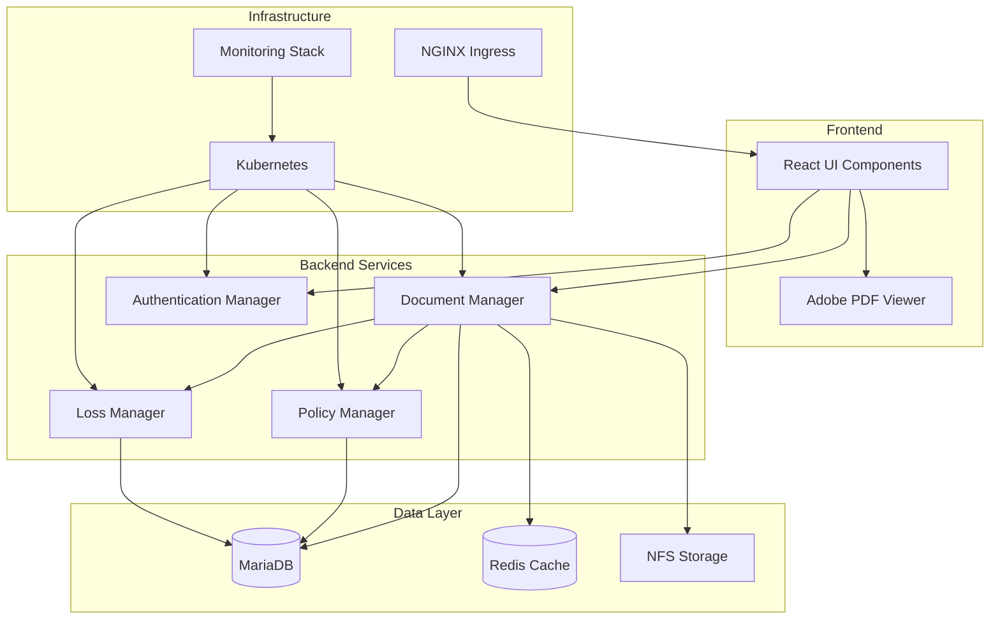
```mermaid
flowchart TB
    subgraph "Frontend"
        UI[React UI Components]
        PDF[Adobe PDF Viewer]
        UI --> PDF
    end
    
    subgraph "Backend Services"
        DM[Document Manager]
        PM[Policy Manager]
        LM[Loss Manager]
        AM[Authentication Manager]
    end
    
    subgraph "Data Layer"
        DB[(MariaDB)]
        Cache[(Redis Cache)]
        NFS[NFS Storage]
    end
    
    UI --> AM
    UI --> DM
    DM --> DB
    DM --> Cache
    DM --> NFS
    DM --> PM
    DM --> LM
    PM --> DB
    LM --> DB
    
    subgraph "Infrastructure"
        K8S[Kubernetes]
        NGINX[NGINX Ingress]
        LGTM[Monitoring Stack]
    end
    
    NGINX --> UI
    K8S --> DM
    K8S --> PM
    K8S --> LM
    K8S --> AM
    LGTM --> K8S
```

This architecture diagram illustrates the relationships between the frontend components, backend services, data layer, and infrastructure components. The Document Manager service interacts with the Policy Manager and Loss Manager services to retrieve and update document-related data, while the Authentication Manager ensures secure access to documents.

### 3.7 TECHNOLOGY CONSTRAINTS & CONSIDERATIONS

1. **Performance Requirements**

   - Document viewer must load within 3 seconds
   - Metadata updates must complete within 2 seconds
   - PDF navigation must be responsive with minimal lag

2. **Security Considerations**

   - All document access must be authenticated via Laravel Sanctum
   - Document permissions must be enforced at the service level
   - Audit logging must track all document actions

3. **Scalability Requirements**

   - System must handle concurrent document viewing sessions
   - Document processing must scale horizontally during peak usage
   - Caching strategy must optimize for frequently accessed documents

4. **Integration Requirements**

   - Adobe Acrobat PDF Viewer must be properly integrated for document display
   - Document actions must trigger appropriate notifications via SendGrid
   - Monitoring must track document processing metrics via LGTM Stack

The technology stack is designed to meet these constraints while providing a robust and scalable solution for document management within the Insure Pilot platform.

## 4. PROCESS FLOWCHART

### 4.1 SYSTEM WORKFLOWS

#### 4.1.1 Core Business Processes

##### Document Viewing and Processing Workflow

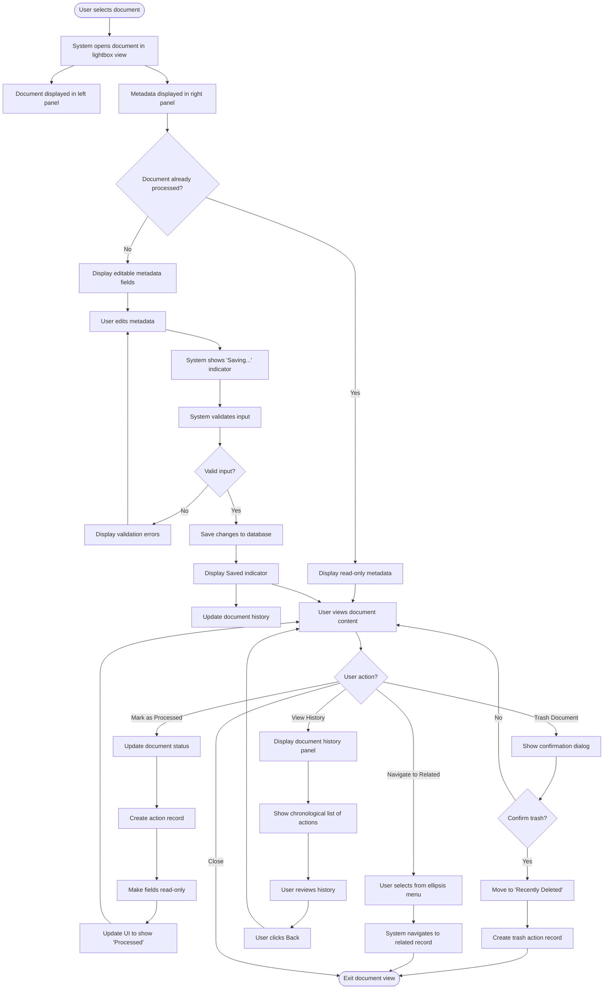
```mermaid
flowchart TD
    Start([User selects document]) --> A[System opens document in lightbox view]
    A --> B[Document displayed in left panel]
    A --> C[Metadata displayed in right panel]
    
    C --> D{Document already processed?}
    D -->|Yes| E[Display read-only metadata]
    D -->|No| F[Display editable metadata fields]
    
    F --> G[User edits metadata]
    G --> H[System shows 'Saving...' indicator]
    H --> I[System validates input]
    I --> J{Valid input?}
    J -->|No| K[Display validation errors]
    K --> G
    J -->|Yes| L[Save changes to database]
    L --> M[Display Saved indicator]
    M --> N[Update document history]
    
    E --> O[User views document content]
    M --> O
    
    O --> P{User action?}
    P -->|Mark as Processed| Q[Update document status]
    Q --> R[Create action record]
    R --> S[Make fields read-only]
    S --> T[Update UI to show 'Processed']
    
    P -->|Trash Document| U[Show confirmation dialog]
    U --> V{Confirm trash?}
    V -->|No| O
    V -->|Yes| W[Move to 'Recently Deleted']
    W --> X[Create trash action record]
    X --> End([Exit document view])
    
    P -->|View History| Y[Display document history panel]
    Y --> Z[Show chronological list of actions]
    Z --> AA[User reviews history]
    AA --> AB[User clicks Back]
    AB --> O
    
    P -->|Navigate to Related| AC[User selects from ellipsis menu]
    AC --> AD[System navigates to related record]
    AD --> End
    
    P -->|Close| End
    
    T --> O
```

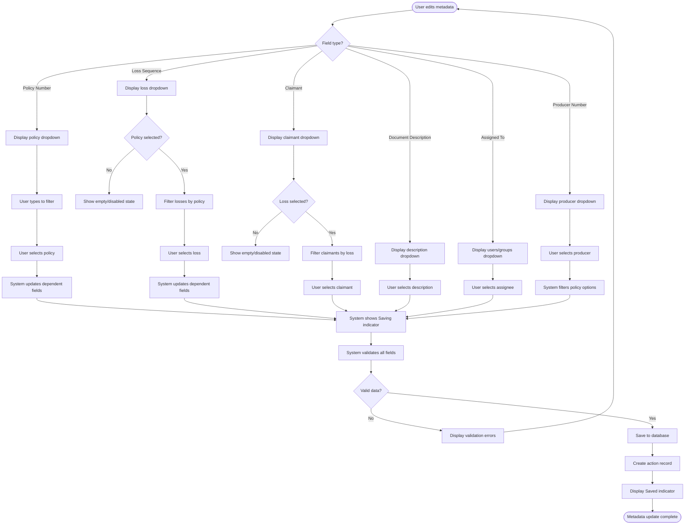
```mermaid
flowchart TD
    Start([User edits metadata]) --> A{Field type?}
    
    A -->|Policy Number| B[Display policy dropdown]
    B --> C[User types to filter]
    C --> D[User selects policy]
    D --> E[System updates dependent fields]
    
    A -->|Loss Sequence| F[Display loss dropdown]
    F --> G{Policy selected?}
    G -->|No| H[Show empty/disabled state]
    G -->|Yes| I[Filter losses by policy]
    I --> J[User selects loss]
    J --> K[System updates dependent fields]
    
    A -->|Claimant| L[Display claimant dropdown]
    L --> M{Loss selected?}
    M -->|No| N[Show empty/disabled state]
    M -->|Yes| O[Filter claimants by loss]
    O --> P[User selects claimant]
    
    A -->|Document Description| Q[Display description dropdown]
    Q --> R[User selects description]
    
    A -->|Assigned To| S[Display users/groups dropdown]
    S --> T[User selects assignee]
    
    A -->|Producer Number| U[Display producer dropdown]
    U --> V[User selects producer]
    V --> W[System filters policy options]
    
    E --> X[System shows Saving indicator]
    K --> X
    P --> X
    R --> X
    T --> X
    W --> X
    
    X --> Y[System validates all fields]
    Y --> Z{Valid data?}
    Z -->|No| AA[Display validation errors]
    AA --> Start
    Z -->|Yes| AB[Save to database]
    AB --> AC[Create action record]
    AC --> AD[Display Saved indicator]
    AD --> End([Metadata update complete])
```

#### 4.1.2 Integration Workflows

##### Document System Integration Flow

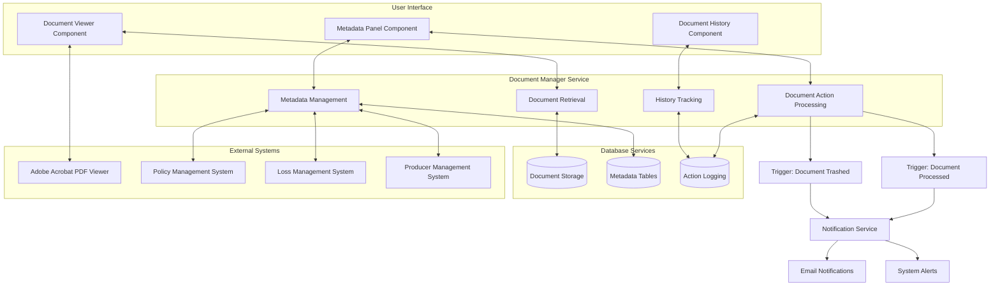
```mermaid
flowchart TD
    subgraph User Interface
        A[Document Viewer Component]
        B[Metadata Panel Component]
        C[Document History Component]
    end
    
    subgraph Document Manager Service
        D[Document Retrieval]
        E[Metadata Management]
        F[Document Action Processing]
        G[History Tracking]
    end
    
    subgraph Database Services
        H[(Document Storage)]
        I[(Metadata Tables)]
        J[(Action Logging)]
    end
    
    subgraph External Systems
        K[Adobe Acrobat PDF Viewer]
        L[Policy Management System]
        M[Loss Management System]
        N[Producer Management System]
    end
    
    A <--> D
    A <--> K
    B <--> E
    B <--> F
    C <--> G
    
    D <--> H
    E <--> I
    F <--> J
    G <--> J
    
    E <--> L
    E <--> M
    E <--> N
    
    F --> O[Trigger: Document Processed]
    F --> P[Trigger: Document Trashed]
    
    O --> Q[Notification Service]
    P --> Q
    
    Q --> R[Email Notifications]
    Q --> S[System Alerts]
```

##### Document Action Event Processing

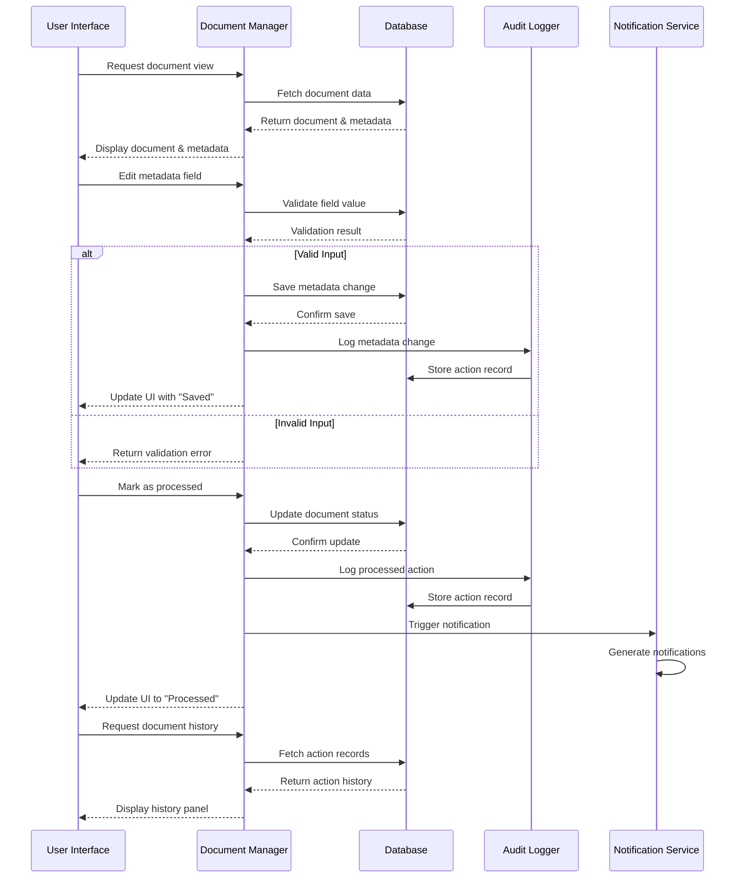
```mermaid
sequenceDiagram
    participant UI as User Interface
    participant DM as Document Manager
    participant DB as Database
    participant AL as Audit Logger
    participant NS as Notification Service
    
    UI->>DM: Request document view
    DM->>DB: Fetch document data
    DB-->>DM: Return document & metadata
    DM-->>UI: Display document & metadata
    
    UI->>DM: Edit metadata field
    DM->>DB: Validate field value
    DB-->>DM: Validation result
    
    alt Valid Input
        DM->>DB: Save metadata change
        DB-->>DM: Confirm save
        DM->>AL: Log metadata change
        AL->>DB: Store action record
        DM-->>UI: Update UI with "Saved"
    else Invalid Input
        DM-->>UI: Return validation error
    end
    
    UI->>DM: Mark as processed
    DM->>DB: Update document status
    DB-->>DM: Confirm update
    DM->>AL: Log processed action
    AL->>DB: Store action record
    DM->>NS: Trigger notification
    NS->>NS: Generate notifications
    DM-->>UI: Update UI to "Processed"
    
    UI->>DM: Request document history
    DM->>DB: Fetch action records
    DB-->>DM: Return action history
    DM-->>UI: Display history panel
```

### 4.2 FLOWCHART REQUIREMENTS

#### 4.2.1 Document Processing Decision Flow

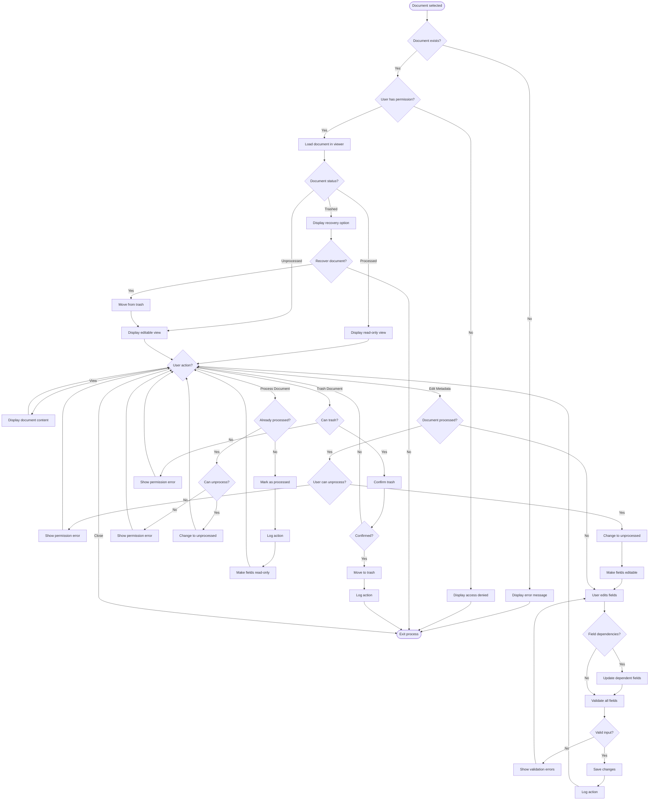
```mermaid
flowchart TD
    Start([Document selected]) --> A{Document exists?}
    A -->|No| B[Display error message]
    B --> End([Exit process])
    
    A -->|Yes| C{User has permission?}
    C -->|No| D[Display access denied]
    D --> End
    
    C -->|Yes| E[Load document in viewer]
    E --> F{Document status?}
    
    F -->|Processed| G[Display read-only view]
    F -->|Unprocessed| H[Display editable view]
    F -->|Trashed| I[Display recovery option]
    I --> J{Recover document?}
    J -->|Yes| K[Move from trash]
    K --> H
    J -->|No| End
    
    G --> L{User action?}
    H --> L
    
    L -->|View| M[Display document content]
    M --> L
    
    L -->|Edit Metadata| N{Document processed?}
    N -->|Yes| O{User can unprocess?}
    O -->|No| P[Show permission error]
    P --> L
    O -->|Yes| Q[Change to unprocessed]
    Q --> R[Make fields editable]
    R --> S[User edits fields]
    
    N -->|No| S
    
    S --> T{Field dependencies?}
    T -->|Yes| U[Update dependent fields]
    U --> V[Validate all fields]
    T -->|No| V
    
    V --> W{Valid input?}
    W -->|No| X[Show validation errors]
    X --> S
    W -->|Yes| Y[Save changes]
    Y --> Z[Log action]
    Z --> L
    
    L -->|Process Document| AA{Already processed?}
    AA -->|Yes| AB{Can unprocess?}
    AB -->|No| AC[Show permission error]
    AC --> L
    AB -->|Yes| AD[Change to unprocessed]
    AD --> L
    
    AA -->|No| AE[Mark as processed]
    AE --> AF[Log action]
    AF --> AG[Make fields read-only]
    AG --> L
    
    L -->|Trash Document| AH{Can trash?}
    AH -->|No| AI[Show permission error]
    AI --> L
    AH -->|Yes| AJ[Confirm trash]
    AJ --> AK{Confirmed?}
    AK -->|No| L
    AK -->|Yes| AL[Move to trash]
    AL --> AM[Log action]
    AM --> End
    
    L -->|Close| End
```

#### 4.2.2 Validation Rules Flow

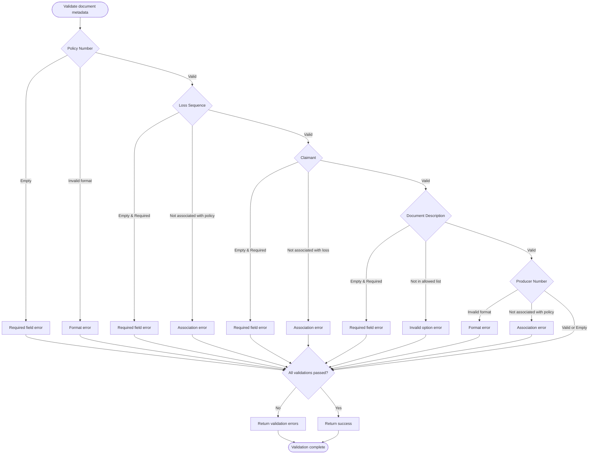
```mermaid
flowchart TD
    Start([Validate document metadata]) --> A{Policy Number}
    
    A -->|Empty| B[Required field error]
    A -->|Invalid format| C[Format error]
    A -->|Valid| D{Loss Sequence}
    
    D -->|Empty & Required| E[Required field error]
    D -->|Not associated with policy| F[Association error]
    D -->|Valid| G{Claimant}
    
    G -->|Empty & Required| H[Required field error]
    G -->|Not associated with loss| I[Association error]
    G -->|Valid| J{Document Description}
    
    J -->|Empty & Required| K[Required field error]
    J -->|Not in allowed list| L[Invalid option error]
    J -->|Valid| M{Producer Number}
    
    M -->|Invalid format| N[Format error]
    M -->|Not associated with policy| O[Association error]
    M -->|Valid or Empty| P{All validations passed?}
    
    B --> P
    C --> P
    E --> P
    F --> P
    H --> P
    I --> P
    K --> P
    L --> P
    N --> P
    O --> P
    
    P -->|No| Q[Return validation errors]
    Q --> End([Validation complete])
    
    P -->|Yes| R[Return success]
    R --> End
```

### 4.3 TECHNICAL IMPLEMENTATION

#### 4.3.1 Document State Management

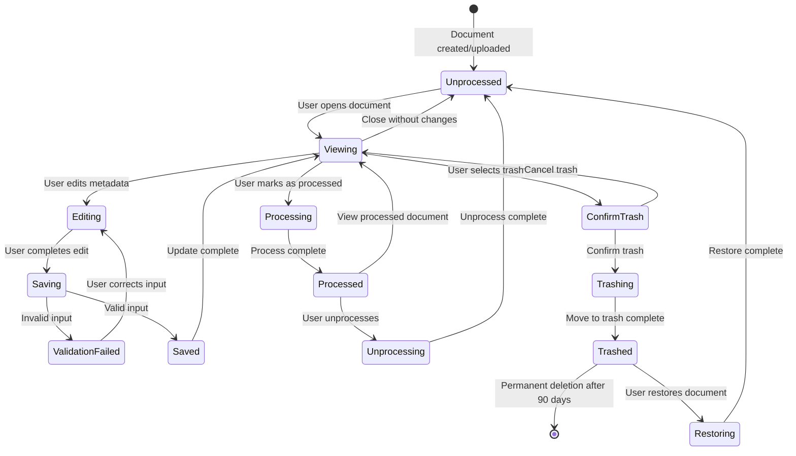
```mermaid
stateDiagram-v2
    [*] --> Unprocessed: Document created/uploaded
    
    Unprocessed --> Viewing: User opens document
    Viewing --> Unprocessed: Close without changes
    
    Viewing --> Editing: User edits metadata
    Editing --> Saving: User completes edit
    Saving --> ValidationFailed: Invalid input
    ValidationFailed --> Editing: User corrects input
    
    Saving --> Saved: Valid input
    Saved --> Viewing: Update complete
    
    Viewing --> Processing: User marks as processed
    Processing --> Processed: Process complete
    
    Processed --> Viewing: View processed document
    Processed --> Unprocessing: User unprocesses
    Unprocessing --> Unprocessed: Unprocess complete
    
    Viewing --> ConfirmTrash: User selects trash
    ConfirmTrash --> Viewing: Cancel trash
    ConfirmTrash --> Trashing: Confirm trash
    Trashing --> Trashed: Move to trash complete
    
    Trashed --> [*]: Permanent deletion after 90 days
    Trashed --> Restoring: User restores document
    Restoring --> Unprocessed: Restore complete
```

#### 4.3.2 Error Handling Flow

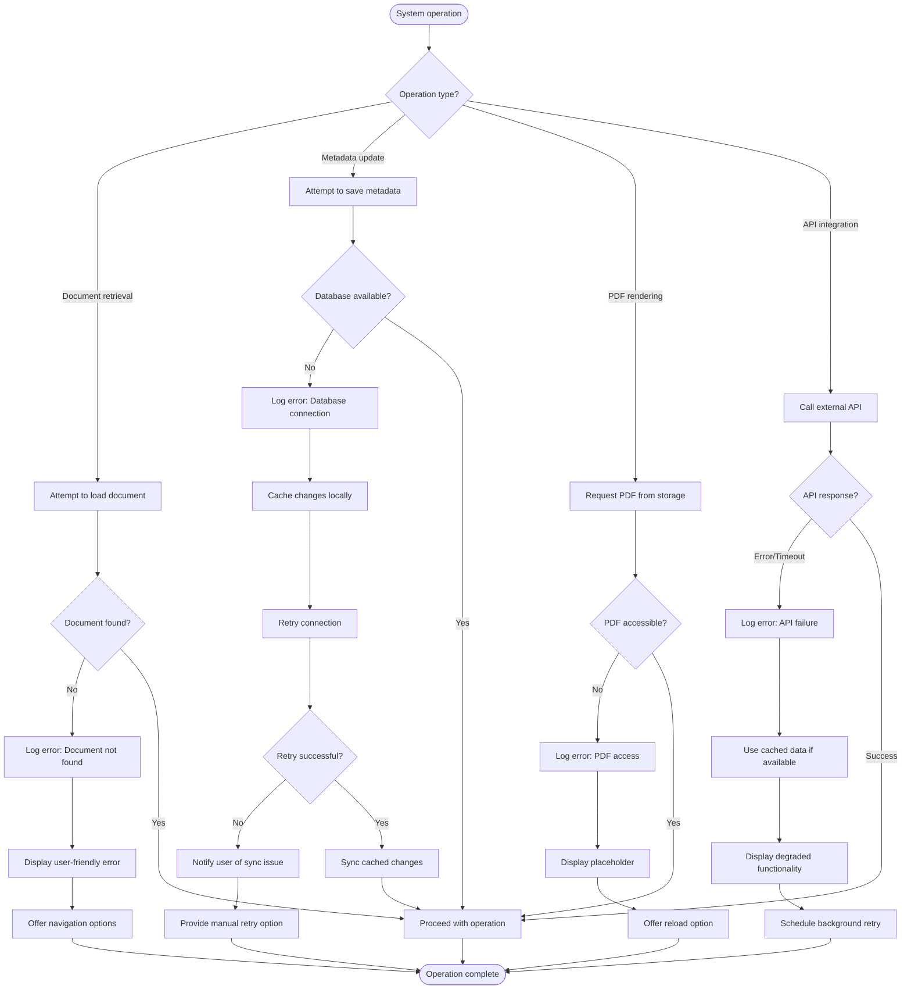
```mermaid
flowchart TD
    Start([System operation]) --> A{Operation type?}
    
    A -->|Document retrieval| B[Attempt to load document]
    B --> C{Document found?}
    C -->|No| D[Log error: Document not found]
    D --> E[Display user-friendly error]
    E --> F[Offer navigation options]
    
    A -->|Metadata update| G[Attempt to save metadata]
    G --> H{Database available?}
    H -->|No| I[Log error: Database connection]
    I --> J[Cache changes locally]
    J --> K[Retry connection]
    K --> L{Retry successful?}
    L -->|No| M[Notify user of sync issue]
    M --> N[Provide manual retry option]
    L -->|Yes| O[Sync cached changes]
    
    A -->|PDF rendering| P[Request PDF from storage]
    P --> Q{PDF accessible?}
    Q -->|No| R[Log error: PDF access]
    R --> S[Display placeholder]
    S --> T[Offer reload option]
    
    A -->|API integration| U[Call external API]
    U --> V{API response?}
    V -->|Error/Timeout| W[Log error: API failure]
    W --> X[Use cached data if available]
    X --> Y[Display degraded functionality]
    Y --> Z[Schedule background retry]
    
    C -->|Yes| AA[Proceed with operation]
    H -->|Yes| AA
    Q -->|Yes| AA
    V -->|Success| AA
    O --> AA
    
    AA --> End([Operation complete])
    F --> End
    N --> End
    T --> End
    Z --> End
```

### 4.4 REQUIRED DIAGRAMS

#### 4.4.1 High-Level System Workflow

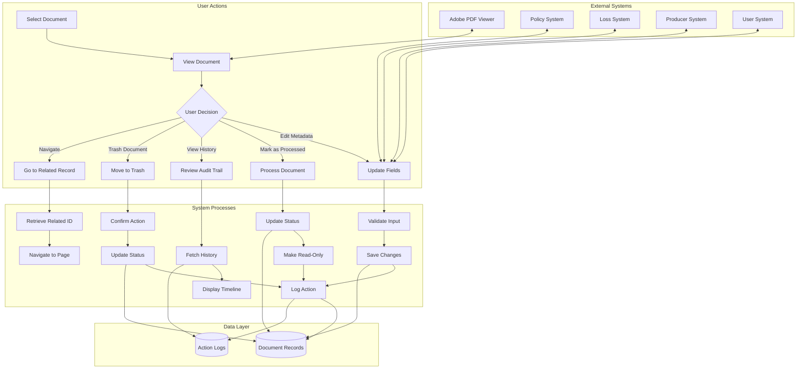
```mermaid
flowchart TD
    subgraph User Actions
        A[Select Document] --> B[View Document]
        B --> C{User Decision}
        C -->|Edit Metadata| D[Update Fields]
        C -->|Mark as Processed| E[Process Document]
        C -->|View History| F[Review Audit Trail]
        C -->|Trash Document| G[Move to Trash]
        C -->|Navigate| H[Go to Related Record]
    end
    
    subgraph System Processes
        D --> I[Validate Input]
        I --> J[Save Changes]
        J --> K[Log Action]
        
        E --> L[Update Status]
        L --> M[Make Read-Only]
        M --> K
        
        F --> N[Fetch History]
        N --> O[Display Timeline]
        
        G --> P[Confirm Action]
        P --> Q[Update Status]
        Q --> K
        
        H --> R[Retrieve Related ID]
        R --> S[Navigate to Page]
    end
    
    subgraph Data Layer
        K --> T[(Document Records)]
        K --> U[(Action Logs)]
        J --> T
        L --> T
        Q --> T
        N --> U
    end
    
    subgraph External Systems
        V[Adobe PDF Viewer] <--> B
        W[Policy System] <--> D
        X[Loss System] <--> D
        Y[Producer System] <--> D
        Z[User System] <--> D
    end
```

#### 4.4.2 Detailed Process Flow: Document Metadata Management

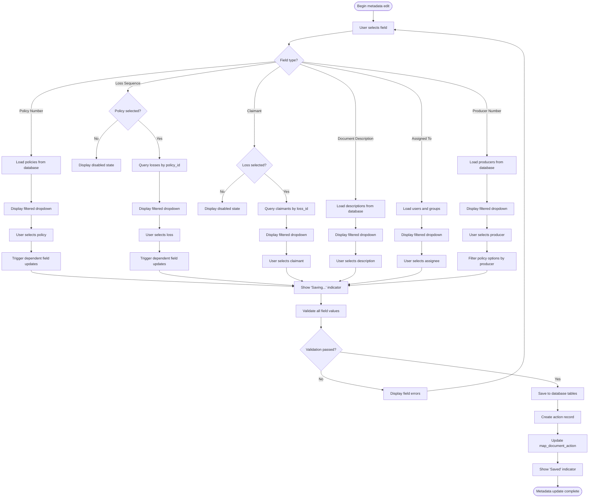
```mermaid
flowchart TD
    Start([Begin metadata edit]) --> A[User selects field]
    
    A --> B{Field type?}
    
    B -->|Policy Number| C[Load policies from database]
    C --> D[Display filtered dropdown]
    D --> E[User selects policy]
    E --> F[Trigger dependent field updates]
    
    B -->|Loss Sequence| G{Policy selected?}
    G -->|No| H[Display disabled state]
    G -->|Yes| I[Query losses by policy_id]
    I --> J[Display filtered dropdown]
    J --> K[User selects loss]
    K --> L[Trigger dependent field updates]
    
    B -->|Claimant| M{Loss selected?}
    M -->|No| N[Display disabled state]
    M -->|Yes| O[Query claimants by loss_id]
    O --> P[Display filtered dropdown]
    P --> Q[User selects claimant]
    
    B -->|Document Description| R[Load descriptions from database]
    R --> S[Display filtered dropdown]
    S --> T[User selects description]
    
    B -->|Assigned To| U[Load users and groups]
    U --> V[Display filtered dropdown]
    V --> W[User selects assignee]
    
    B -->|Producer Number| X[Load producers from database]
    X --> Y[Display filtered dropdown]
    Y --> Z[User selects producer]
    Z --> AA[Filter policy options by producer]
    
    F --> AB["Show 'Saving...' indicator"]
    L --> AB
    Q --> AB
    T --> AB
    W --> AB
    AA --> AB
    
    AB --> AC[Validate all field values]
    AC --> AD{Validation passed?}
    AD -->|No| AE[Display field errors]
    AE --> A
    
    AD -->|Yes| AF[Save to database tables]
    AF --> AG[Create action record]
    AG --> AH[Update map_document_action]
    AH --> AI["Show 'Saved' indicator"]
    AI --> End([Metadata update complete])
```

#### 4.4.3 Error Handling Flowchart

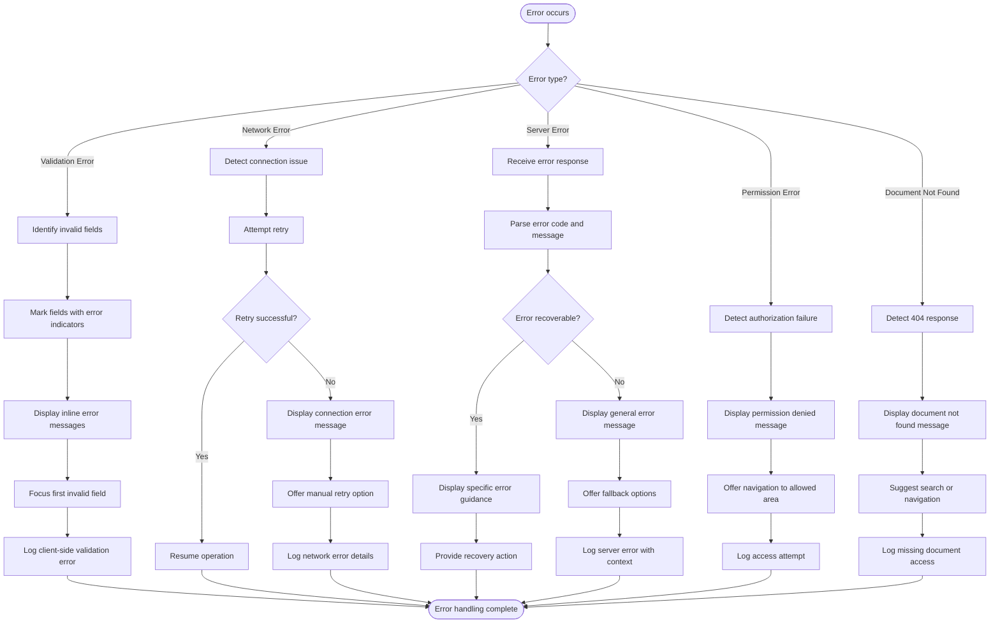
```mermaid
flowchart TD
    Start([Error occurs]) --> A{Error type?}
    
    A -->|Validation Error| B[Identify invalid fields]
    B --> C[Mark fields with error indicators]
    C --> D[Display inline error messages]
    D --> E[Focus first invalid field]
    E --> F[Log client-side validation error]
    
    A -->|Network Error| G[Detect connection issue]
    G --> H[Attempt retry]
    H --> I{Retry successful?}
    I -->|Yes| J[Resume operation]
    I -->|No| K[Display connection error message]
    K --> L[Offer manual retry option]
    L --> M[Log network error details]
    
    A -->|Server Error| N[Receive error response]
    N --> O[Parse error code and message]
    O --> P{Error recoverable?}
    P -->|Yes| Q[Display specific error guidance]
    Q --> R[Provide recovery action]
    P -->|No| S[Display general error message]
    S --> T[Offer fallback options]
    T --> U[Log server error with context]
    
    A -->|Permission Error| V[Detect authorization failure]
    V --> W[Display permission denied message]
    W --> X[Offer navigation to allowed area]
    X --> Y[Log access attempt]
    
    A -->|Document Not Found| Z[Detect 404 response]
    Z --> AA[Display document not found message]
    AA --> AB[Suggest search or navigation]
    AB --> AC[Log missing document access]
    
    F --> End([Error handling complete])
    J --> End
    M --> End
    R --> End
    U --> End
    Y --> End
    AC --> End
```

#### 4.4.4 Integration Sequence Diagram

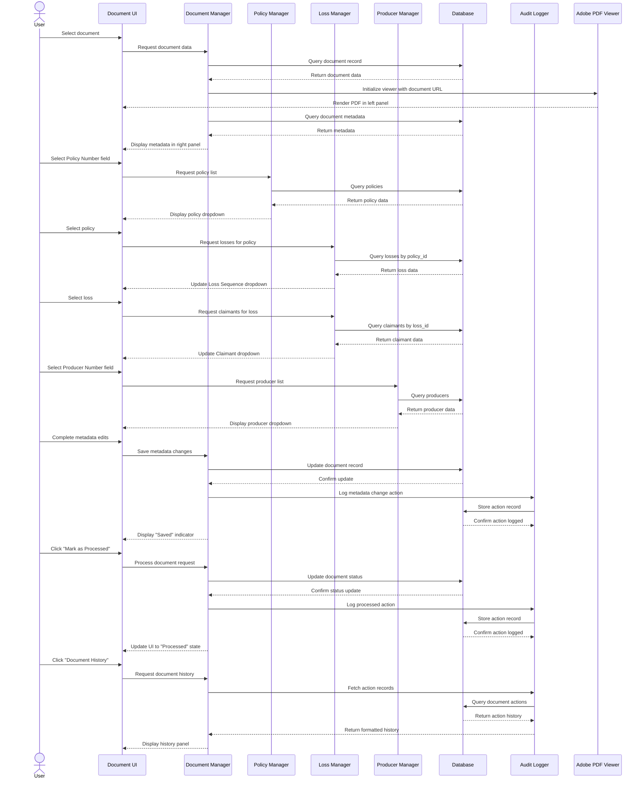
```mermaid
sequenceDiagram
    actor User
    participant UI as Document UI
    participant DM as Document Manager
    participant PM as Policy Manager
    participant LM as Loss Manager
    participant PrM as Producer Manager
    participant DB as Database
    participant AL as Audit Logger
    participant PDF as Adobe PDF Viewer
    
    User->>UI: Select document
    UI->>DM: Request document data
    DM->>DB: Query document record
    DB-->>DM: Return document data
    DM->>PDF: Initialize viewer with document URL
    PDF-->>UI: Render PDF in left panel
    
    DM->>DB: Query document metadata
    DB-->>DM: Return metadata
    DM-->>UI: Display metadata in right panel
    
    User->>UI: Select Policy Number field
    UI->>PM: Request policy list
    PM->>DB: Query policies
    DB-->>PM: Return policy data
    PM-->>UI: Display policy dropdown
    
    User->>UI: Select policy
    UI->>LM: Request losses for policy
    LM->>DB: Query losses by policy_id
    DB-->>LM: Return loss data
    LM-->>UI: Update Loss Sequence dropdown
    
    User->>UI: Select loss
    UI->>LM: Request claimants for loss
    LM->>DB: Query claimants by loss_id
    DB-->>LM: Return claimant data
    LM-->>UI: Update Claimant dropdown
    
    User->>UI: Select Producer Number field
    UI->>PrM: Request producer list
    PrM->>DB: Query producers
    DB-->>PrM: Return producer data
    PrM-->>UI: Display producer dropdown
    
    User->>UI: Complete metadata edits
    UI->>DM: Save metadata changes
    DM->>DB: Update document record
    DB-->>DM: Confirm update
    DM->>AL: Log metadata change action
    AL->>DB: Store action record
    DB-->>AL: Confirm action logged
    DM-->>UI: Display "Saved" indicator
    
    User->>UI: Click "Mark as Processed"
    UI->>DM: Process document request
    DM->>DB: Update document status
    DB-->>DM: Confirm status update
    DM->>AL: Log processed action
    AL->>DB: Store action record
    DB-->>AL: Confirm action logged
    DM-->>UI: Update UI to "Processed" state
    
    User->>UI: Click "Document History"
    UI->>DM: Request document history
    DM->>AL: Fetch action records
    AL->>DB: Query document actions
    DB-->>AL: Return action history
    AL-->>DM: Return formatted history
    DM-->>UI: Display history panel
```

#### 4.4.5 State Transition Diagram for Document Processing

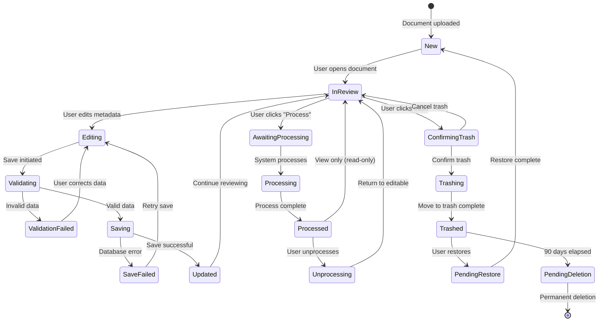
```mermaid
stateDiagram-v2
    [*] --> New: Document uploaded
    
    New --> InReview: User opens document
    InReview --> Editing: User edits metadata
    
    Editing --> Validating: Save initiated
    Validating --> ValidationFailed: Invalid data
    ValidationFailed --> Editing: User corrects data
    
    Validating --> Saving: Valid data
    Saving --> SaveFailed: Database error
    SaveFailed --> Editing: Retry save
    
    Saving --> Updated: Save successful
    Updated --> InReview: Continue reviewing
    
    InReview --> AwaitingProcessing: User clicks "Process"
    AwaitingProcessing --> Processing: System processes
    Processing --> Processed: Process complete
    
    Processed --> InReview: View only (read-only)
    Processed --> Unprocessing: User unprocesses
    Unprocessing --> InReview: Return to editable
    
    InReview --> ConfirmingTrash: User clicks trash
    ConfirmingTrash --> InReview: Cancel trash
    ConfirmingTrash --> Trashing: Confirm trash
    Trashing --> Trashed: Move to trash complete
    
    Trashed --> PendingRestore: User restores
    PendingRestore --> New: Restore complete
    
    Trashed --> PendingDeletion: 90 days elapsed
    PendingDeletion --> [*]: Permanent deletion
```

## 5. SYSTEM ARCHITECTURE

### 5.1 HIGH-LEVEL ARCHITECTURE

#### 5.1.1 System Overview

The Documents View feature follows a layered architecture pattern with clear separation of concerns between presentation, business logic, and data access layers. The system is designed as a component within the larger Insure Pilot platform, integrating with existing services while maintaining its own focused responsibility.

**Architectural Style and Rationale:**

- The architecture employs a hybrid approach combining elements of Model-View-Controller (MVC) and microservices patterns
- The MVC pattern provides clear separation between the document display (View), metadata management (Model), and user interaction handling (Controller)
- Microservices integration allows the Documents View to interact with specialized services like DocumentManager and PolicyManager

**Key Architectural Principles:**

- Separation of concerns between document viewing, metadata management, and processing actions
- Stateless operation where possible, with document state tracked in the database
- Event-driven approach for document actions and audit logging
- Responsive design with asynchronous operations for metadata updates

**System Boundaries and Interfaces:**

- Integrates with Adobe Acrobat PDF viewer for document display
- Connects to multiple database tables for metadata management
- Interfaces with existing Insure Pilot services for policy, loss, and producer data
- Provides a RESTful API for document operations and metadata retrieval

#### 5.1.2 Core Components Table

| Component Name | Primary Responsibility | Key Dependencies | Critical Considerations |
| --- | --- | --- | --- |
| Document Viewer | Renders PDF documents and provides navigation controls | Adobe Acrobat PDF SDK, DocumentManager | Must handle various document sizes and formats efficiently |
| Metadata Panel | Displays and manages document metadata fields | PolicyManager, LossManager, ProducerManager | Must handle complex field dependencies and validation |
| Action Controller | Processes document actions (mark as processed, trash) | DocumentManager, Audit Logger | Must ensure atomic operations and consistent state |
| History Tracker | Displays and manages document history and audit trail | Audit Logger, DocumentManager | Must provide chronological and accurate audit information |
| Field Validator | Validates metadata field values and dependencies | Database schema, Business rules engine | Must enforce complex field relationships and constraints |

#### 5.1.3 Data Flow Description

The Documents View feature follows a structured data flow pattern that begins when a user selects a document to view:

1. **Document Selection and Loading:**

   - User selects a document from a list or search results
   - The system retrieves the document file from storage via DocumentManager
   - Adobe Acrobat PDF viewer loads and renders the document in the left panel
   - Simultaneously, document metadata is retrieved from relevant database tables

2. **Metadata Management Flow:**

   - When a user selects a field (e.g., Policy Number), the system queries related data
   - As the user types, dynamic filtering narrows available options
   - When a parent field changes (e.g., Policy Number), dependent fields (e.g., Loss Sequence) are updated
   - Field changes trigger "Saving..." indicators and asynchronous database updates
   - Upon successful save, an audit record is created and "Saved" indicator appears

3. **Document Processing Flow:**

   - When a user marks a document as processed, the system creates an action record
   - The document's state changes to processed, and metadata fields become read-only
   - If a document is trashed, it's moved to "Recently Deleted" with an action record
   - All actions are logged with user attribution for audit purposes

4. **History and Audit Flow:**

   - When viewing document history, the system retrieves chronological action records
   - These records show who performed actions and when they occurred
   - The history panel displays this information in a user-friendly format

#### 5.1.4 External Integration Points

| System Name | Integration Type | Data Exchange Pattern | Protocol/Format | SLA Requirements |
| --- | --- | --- | --- | --- |
| Adobe Acrobat PDF Viewer | UI Component | Document rendering and navigation | JavaScript SDK | Document loading \< 3 seconds |
| PolicyManager | Service | Policy data retrieval and filtering | REST API / JSON | Response time \< 500ms |
| LossManager | Service | Loss and claimant data retrieval | REST API / JSON | Response time \< 500ms |
| ProducerManager | Service | Producer data retrieval and filtering | REST API / JSON | Response time \< 500ms |
| DocumentManager | Service | Document storage and retrieval | REST API / Binary | Document retrieval \< 2 seconds |

### 5.2 COMPONENT DETAILS

#### 5.2.1 Document Viewer Component

**Purpose and Responsibilities:**

- Renders PDF documents in the left panel of the Documents View
- Provides navigation controls for multipage documents
- Displays document filename and basic metadata
- Handles document zooming and scrolling

**Technologies and Frameworks:**

- Adobe Acrobat PDF SDK for document rendering
- React for component structure and state management
- JavaScript for interaction handling

**Key Interfaces:**

- DocumentManager API for document retrieval
- Adobe Acrobat PDF SDK API for rendering control

**Data Persistence Requirements:**

- Document viewing state is maintained in client memory
- No direct persistence requirements beyond document retrieval

**Scaling Considerations:**

- Must handle documents of various sizes efficiently
- Should support concurrent document viewing sessions
- Caching of frequently accessed documents may improve performance

**Component Interaction Diagram:**

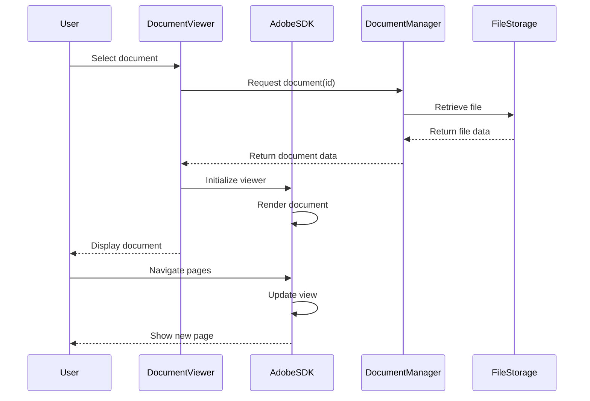
```mermaid
sequenceDiagram
    participant User
    participant DocumentViewer
    participant AdobeSDK
    participant DocumentManager
    participant FileStorage
    
    User->>DocumentViewer: Select document
    DocumentViewer->>DocumentManager: Request document(id)
    DocumentManager->>FileStorage: Retrieve file
    FileStorage-->>DocumentManager: Return file data
    DocumentManager-->>DocumentViewer: Return document data
    DocumentViewer->>AdobeSDK: Initialize viewer
    AdobeSDK->>AdobeSDK: Render document
    DocumentViewer-->>User: Display document
    
    User->>AdobeSDK: Navigate pages
    AdobeSDK->>AdobeSDK: Update view
    AdobeSDK-->>User: Show new page
```

#### 5.2.2 Metadata Panel Component

**Purpose and Responsibilities:**

- Displays editable metadata fields in the right panel
- Manages field dependencies and dynamic updates
- Provides type-ahead filtering for dropdown fields
- Shows saving/saved indicators during updates

**Technologies and Frameworks:**

- React for component structure and state management
- Redux or Context API for state management
- Axios for API communication

**Key Interfaces:**

- PolicyManager API for policy data
- LossManager API for loss and claimant data
- ProducerManager API for producer data
- DocumentManager API for metadata updates

**Data Persistence Requirements:**

- Metadata changes must be persisted to database tables
- Action records must be created for audit purposes

**Scaling Considerations:**

- Must handle complex field dependencies efficiently
- Should optimize API calls to minimize network traffic
- Caching of reference data may improve performance

**State Transition Diagram:**

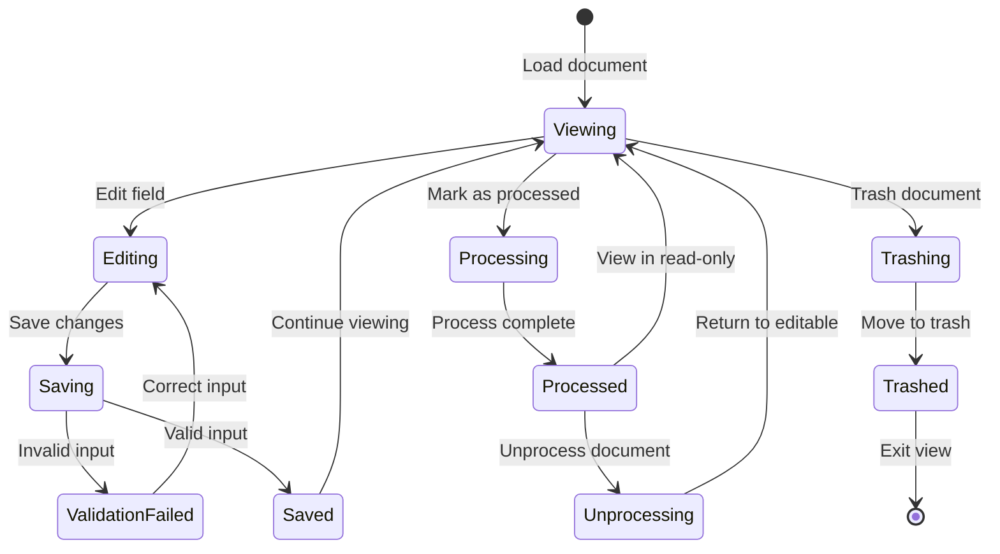
```mermaid
stateDiagram-v2
    [*] --> Viewing: Load document
    
    Viewing --> Editing: Edit field
    Editing --> Saving: Save changes
    Saving --> ValidationFailed: Invalid input
    ValidationFailed --> Editing: Correct input
    
    Saving --> Saved: Valid input
    Saved --> Viewing: Continue viewing
    
    Viewing --> Processing: Mark as processed
    Processing --> Processed: Process complete
    Processed --> Viewing: View in read-only
    
    Processed --> Unprocessing: Unprocess document
    Unprocessing --> Viewing: Return to editable
    
    Viewing --> Trashing: Trash document
    Trashing --> Trashed: Move to trash
    Trashed --> [*]: Exit view
```

#### 5.2.3 Action Controller Component

**Purpose and Responsibilities:**

- Processes document actions like "Mark as Processed" and "Trash Document"
- Manages document state transitions
- Creates audit records for actions
- Handles error conditions and validation

**Technologies and Frameworks:**

- Laravel controllers for backend processing
- React for frontend action handling
- Event-driven architecture for action logging

**Key Interfaces:**

- DocumentManager API for document state updates
- Audit Logger for action recording
- Database tables for state persistence

**Data Persistence Requirements:**

- Document state changes must be persisted to database
- Action records must be created in map_document_action table
- All changes must include user attribution

**Scaling Considerations:**

- Must handle concurrent action requests
- Should use database transactions for consistency
- May need rate limiting for high-volume scenarios

**Sequence Diagram for Mark as Processed:**

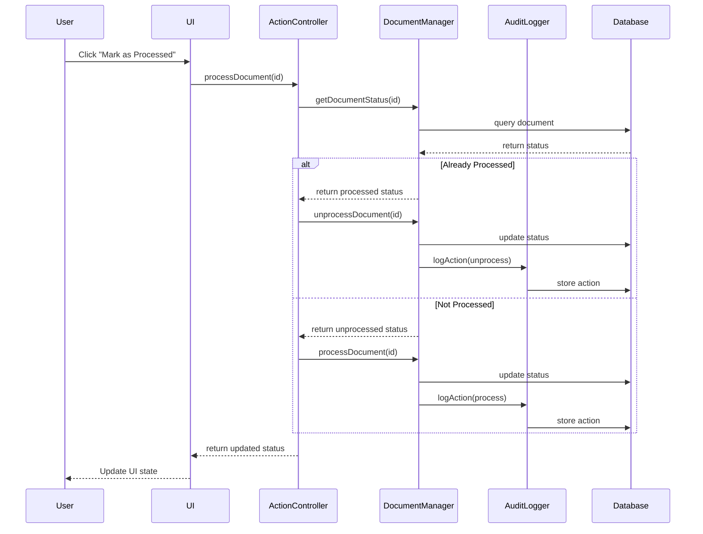
```mermaid
sequenceDiagram
    participant User
    participant UI
    participant ActionController
    participant DocumentManager
    participant AuditLogger
    participant Database
    
    User->>UI: Click "Mark as Processed"
    UI->>ActionController: processDocument(id)
    ActionController->>DocumentManager: getDocumentStatus(id)
    DocumentManager->>Database: query document
    Database-->>DocumentManager: return status
    
    alt Already Processed
        DocumentManager-->>ActionController: return processed status
        ActionController->>DocumentManager: unprocessDocument(id)
        DocumentManager->>Database: update status
        DocumentManager->>AuditLogger: logAction(unprocess)
        AuditLogger->>Database: store action
    else Not Processed
        DocumentManager-->>ActionController: return unprocessed status
        ActionController->>DocumentManager: processDocument(id)
        DocumentManager->>Database: update status
        DocumentManager->>AuditLogger: logAction(process)
        AuditLogger->>Database: store action
    end
    
    ActionController-->>UI: return updated status
    UI-->>User: Update UI state
```

#### 5.2.4 History Tracker Component

**Purpose and Responsibilities:**

- Retrieves and displays document action history
- Shows chronological list of document changes
- Provides user attribution for actions
- Allows navigation back to metadata panel

**Technologies and Frameworks:**

- React for component structure
- Laravel controllers for data retrieval
- Timeline visualization for history display

**Key Interfaces:**

- Audit Logger API for history retrieval
- DocumentManager API for document metadata

**Data Persistence Requirements:**

- No direct persistence, reads from action records
- May cache history data for performance

**Scaling Considerations:**

- Must handle documents with extensive history
- Should implement pagination for large history sets
- May need optimization for frequent history access

**Component Interaction Diagram:**

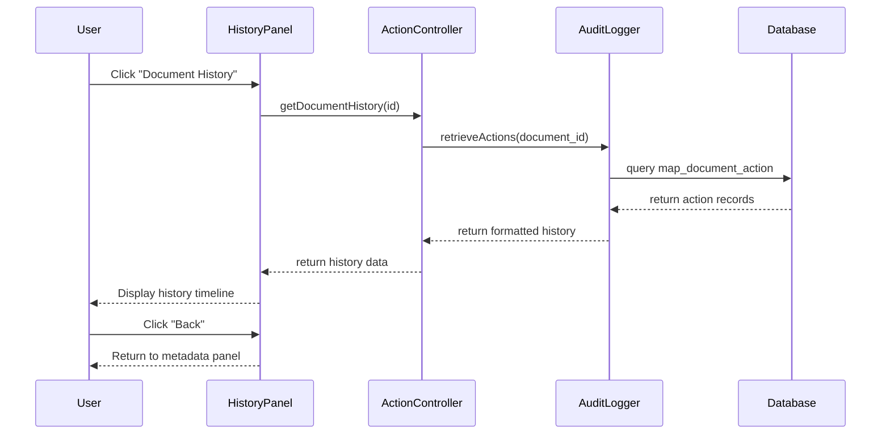
```mermaid
sequenceDiagram
    participant User
    participant HistoryPanel
    participant ActionController
    participant AuditLogger
    participant Database
    
    User->>HistoryPanel: Click "Document History"
    HistoryPanel->>ActionController: getDocumentHistory(id)
    ActionController->>AuditLogger: retrieveActions(document_id)
    AuditLogger->>Database: query map_document_action
    Database-->>AuditLogger: return action records
    AuditLogger-->>ActionController: return formatted history
    ActionController-->>HistoryPanel: return history data
    HistoryPanel-->>User: Display history timeline
    
    User->>HistoryPanel: Click "Back"
    HistoryPanel-->>User: Return to metadata panel
```

#### 5.2.5 Field Validator Component

**Purpose and Responsibilities:**

- Validates metadata field values
- Enforces field dependencies and business rules
- Provides real-time validation feedback
- Ensures data integrity before persistence

**Technologies and Frameworks:**

- Laravel validation rules for backend validation
- React form validation for frontend feedback
- Business rules engine for complex validations

**Key Interfaces:**

- PolicyManager API for policy validation
- LossManager API for loss validation
- DocumentManager API for document validation

**Data Persistence Requirements:**

- No direct persistence, validates before save operations
- May log validation failures for analysis

**Scaling Considerations:**

- Must handle complex validation rules efficiently
- Should optimize validation for responsive user experience
- May cache validation rules for performance

**Error Handling Flow:**

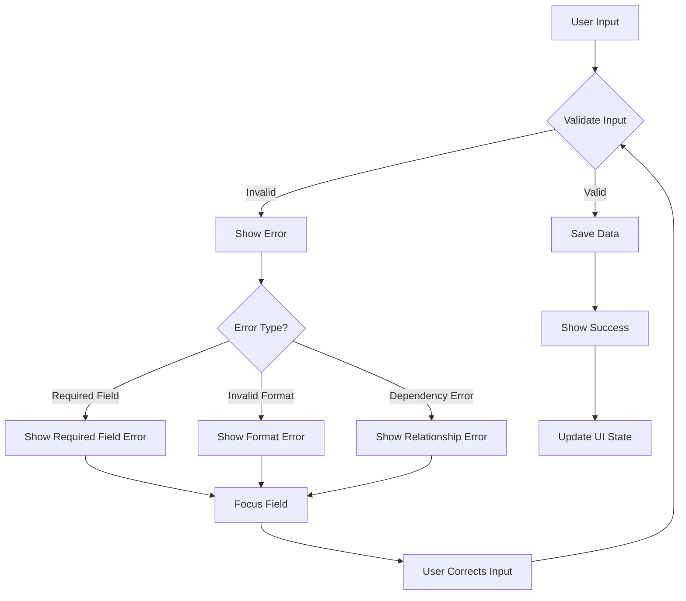
```mermaid
flowchart TD
    A[User Input] --> B{Validate Input}
    B -->|Valid| C[Save Data]
    B -->|Invalid| D[Show Error]
    D --> E{Error Type?}
    
    E -->|Required Field| F[Show Required Field Error]
    E -->|Invalid Format| G[Show Format Error]
    E -->|Dependency Error| H[Show Relationship Error]
    
    F --> I[Focus Field]
    G --> I
    H --> I
    
    I --> J[User Corrects Input]
    J --> B
    
    C --> K[Show Success]
    K --> L[Update UI State]
```

### 5.3 TECHNICAL DECISIONS

#### 5.3.1 Architecture Style Decisions

| Decision Area | Selected Approach | Alternatives Considered | Rationale |
| --- | --- | --- | --- |
| Overall Architecture | Layered MVC with Microservices Integration | Pure Microservices, Monolithic | Balances separation of concerns with integration needs; leverages existing Insure Pilot architecture |
| UI Architecture | React Component-Based | Angular, Vue.js | Aligns with existing frontend technology; provides efficient rendering for document interface |
| State Management | Context API with Hooks | Redux, MobX | Simpler approach for focused feature; reduces boilerplate while maintaining state isolation |
| Backend Architecture | Laravel Controllers with Service Layer | Express.js, Django | Maintains consistency with existing backend; provides robust ORM for complex data relationships |

**Architecture Decision Record: Document Viewer Integration**

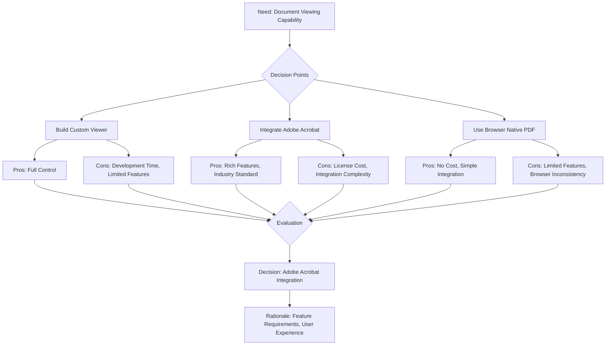
```mermaid
flowchart TD
    A[Need: Document Viewing Capability] --> B{Decision Points}
    B --> C[Build Custom Viewer]
    B --> D[Integrate Adobe Acrobat]
    B --> E[Use Browser Native PDF]
    
    C --> F[Pros: Full Control]
    C --> G[Cons: Development Time, Limited Features]
    
    D --> H[Pros: Rich Features, Industry Standard]
    D --> I[Cons: License Cost, Integration Complexity]
    
    E --> J[Pros: No Cost, Simple Integration]
    E --> K[Cons: Limited Features, Browser Inconsistency]
    
    F --> L{Evaluation}
    G --> L
    H --> L
    I --> L
    J --> L
    K --> L
    
    L --> M[Decision: Adobe Acrobat Integration]
    M --> N[Rationale: Feature Requirements, User Experience]
```

#### 5.3.2 Communication Pattern Choices

| Pattern | Implementation | Use Cases | Justification |
| --- | --- | --- | --- |
| Request-Response | REST API | Document retrieval, metadata updates | Simple, stateless communication for CRUD operations |
| Publish-Subscribe | Event system | Audit logging, state changes | Decouples action execution from logging; enables extensibility |
| Asynchronous Processing | Background jobs | Document processing, trash cleanup | Improves user experience for long-running operations |
| Real-time Updates | WebSockets (optional) | Collaborative editing, notifications | Enables future enhancements for multi-user scenarios |

#### 5.3.3 Data Storage Solution Rationale

| Data Category | Storage Solution | Alternatives Considered | Rationale |
| --- | --- | --- | --- |
| Document Files | NFS with database references | Database BLOBs, S3-compatible storage | Balances performance with scalability; leverages existing infrastructure |
| Document Metadata | MariaDB relational tables | NoSQL, Graph database | Complex relationships between entities require relational model; consistent with existing data architecture |
| Audit Trail | MariaDB with dedicated action tables | Event logs, Document history | Provides structured, queryable audit data; maintains referential integrity with documents |
| User Session State | Redis | Browser storage, Database | Fast access for session data; supports distributed deployment |

#### 5.3.4 Caching Strategy Justification

| Cache Type | Implementation | Data Cached | Justification |
| --- | --- | --- | --- |
| Document Metadata | Redis | Frequently accessed documents | Reduces database load; improves response time for common operations |
| Dropdown Options | Application cache | Policy, loss, producer lists | Reduces API calls for reference data; improves UI responsiveness |
| User Permissions | Redis | User access rights | Fast access for frequent permission checks; reduces authentication overhead |
| Document History | Redis (time-limited) | Recent document actions | Improves performance for history panel; reduces database queries |

#### 5.3.5 Security Mechanism Selection

| Security Aspect | Implementation | Alternatives Considered | Rationale |
| --- | --- | --- | --- |
| Authentication | Laravel Sanctum | JWT, OAuth2 | Seamless integration with existing auth system; supports token and session auth |
| Authorization | Role-based access control | ACLs, Attribute-based access | Aligns with existing permission model; granular control over document operations |
| Data Protection | Field-level permissions | Document-level only | Provides fine-grained control over sensitive metadata; supports partial document access |
| Audit Logging | Comprehensive action tracking | System logs only | Ensures accountability and compliance; supports forensic analysis |

### 5.4 CROSS-CUTTING CONCERNS

#### 5.4.1 Monitoring and Observability Approach

The Documents View feature implements a comprehensive monitoring strategy to ensure reliable operation and quick issue resolution:

- **Application Performance Monitoring:**

  - Integration with the LGTM stack (Loki, Grafana, Tempo, Mimir)
  - Custom metrics for document operations (view, edit, process, trash)
  - Dashboard for document processing volumes and response times

- **User Experience Monitoring:**

  - Tracking of document load times and rendering performance
  - Measurement of metadata field interaction times
  - Monitoring of error rates and validation failures

- **Resource Utilization:**

  - Database query performance for metadata operations
  - File system performance for document retrieval
  - Cache hit/miss ratios for optimized data access

- **Business Metrics:**

  - Document processing rates and volumes
  - User productivity metrics (documents processed per hour)
  - Error and correction rates for metadata fields

#### 5.4.2 Logging and Tracing Strategy

| Log Category | Implementation | Data Captured | Retention Policy |
| --- | --- | --- | --- |
| Application Logs | Loki | Error conditions, warnings, info messages | 30 days |
| Audit Logs | Database + Loki | User actions, document changes | 7 years (compliance) |
| Performance Traces | Tempo | Request timing, database queries, API calls | 14 days |
| Security Logs | Loki + Database | Authentication attempts, permission checks | 90 days |

**Logging Implementation Details:**

- Structured logging format (JSON) for machine parsing
- Consistent correlation IDs across service boundaries
- Log level filtering based on environment (development vs. production)
- PII redaction in logs to maintain data privacy

#### 5.4.3 Error Handling Patterns

The Documents View implements a layered error handling strategy to provide appropriate responses at each level:

- **UI Layer Error Handling:**

  - Form validation errors with clear user feedback
  - Network error detection and retry mechanisms
  - Graceful degradation when services are unavailable

- **Service Layer Error Handling:**

  - Structured error responses with error codes and messages
  - Transaction management to ensure data consistency
  - Circuit breakers for dependent service failures

- **Data Layer Error Handling:**

  - Database exception handling and retry logic
  - Data validation before persistence
  - Fallback mechanisms for cache failures

**Error Handling Flow:**

```mermaid
flowchart TD
    A[Operation Request] --> B{Input Validation}
    B -->|Invalid| C[Return Validation Error]
    B -->|Valid| D[Process Request]
    
    D --> E{Service Available?}
    E -->|No| F[Log Outage]
    F --> G[Return Service Unavailable]
    
    E -->|Yes| H{Database Operation}
    H -->|Success| I[Return Success Response]
    H -->|Failure| J[Log Error]
    
    J --> K{Recoverable?}
    K -->|Yes| L[Retry Operation]
    L --> H
    K -->|No| M[Return Error Response]
    
    C --> N[Client Displays Error]
    G --> N
    M --> N
    I --> O[Client Updates UI]
```

#### 5.4.4 Authentication and Authorization Framework

The Documents View leverages Insure Pilot's existing authentication framework while implementing document-specific authorization controls:

- **Authentication Mechanism:**

  - Laravel Sanctum for token-based authentication
  - Session persistence for web clients
  - API token support for service-to-service communication

- **Authorization Model:**

  - Role-based permissions for document operations
  - Document ownership and assignment controls
  - Hierarchical access based on organizational structure

- **Permission Granularity:**

  - View-only access for basic document viewing
  - Edit access for metadata modification
  - Process access for marking documents as processed
  - Admin access for trashing documents and overriding locks

- **Integration Points:**

  - User service for identity management
  - Role service for permission assignment
  - Audit service for access logging

#### 5.4.5 Performance Requirements and SLAs

| Operation | Performance Target | Degraded Threshold | Critical Threshold |
| --- | --- | --- | --- |
| Document Loading | \< 3 seconds | 3-5 seconds | \> 5 seconds |
| Metadata Field Update | \< 1 second | 1-2 seconds | \> 2 seconds |
| Document Processing | \< 2 seconds | 2-4 seconds | \> 4 seconds |
| History Retrieval | \< 2 seconds | 2-3 seconds | \> 3 seconds |

**Additional Performance Requirements:**

- System must support at least 100 concurrent document viewing sessions
- Metadata updates must be atomic and consistent
- Document viewer must remain responsive during metadata operations
- Type-ahead filtering must respond within 300ms

#### 5.4.6 Disaster Recovery Procedures

The Documents View implements comprehensive disaster recovery procedures to ensure business continuity:

- **Data Backup Strategy:**

  - Database backups: Daily full backups, hourly incremental backups
  - Document file backups: Daily incremental backups with weekly full backups
  - Backup verification through automated restoration tests

- **Recovery Time Objectives (RTO):**

  - Document viewing capability: 1 hour
  - Metadata editing capability: 4 hours
  - Full system functionality: 8 hours

- **Recovery Point Objectives (RPO):**

  - Document metadata: 15 minutes maximum data loss
  - Document files: 24 hours maximum data loss
  - Audit trail: 15 minutes maximum data loss

- **Failover Procedures:**

  - Database failover to replica instances
  - Application server redundancy with load balancing
  - Document storage replication across multiple locations

- **Testing and Validation:**

  - Quarterly disaster recovery drills
  - Automated recovery testing for critical components
  - Documentation and runbooks for manual recovery procedures

## 6. SYSTEM COMPONENTS DESIGN

### 6.1 COMPONENT ARCHITECTURE

The Documents View feature is composed of several key components that work together to provide a comprehensive document management experience. Each component has specific responsibilities and interfaces with other components to create a cohesive system.

#### 6.1.1 Core Components Overview

| Component | Primary Responsibility | Key Dependencies | Technical Implementation |
| --- | --- | --- | --- |
| DocumentViewerContainer | Manages the overall lightbox container and coordinates child components | React, Context API | React functional component with context provider |
| DocumentDisplay | Renders PDF documents in the left panel | Adobe Acrobat PDF SDK | React component with Adobe SDK integration |
| MetadataPanel | Displays and manages document metadata in the right panel | React, Redux/Context | React component with form controls |
| DropdownControl | Provides type-ahead filtering for dropdown fields | React | Reusable component with filtering logic |
| ActionController | Processes document actions (mark as processed, trash) | React, Context API | Service layer with action handlers |
| HistoryPanel | Displays document history and audit trail | React | React component with timeline display |
| NavigationMenu | Provides contextual navigation options | React | Dropdown menu component |

#### 6.1.2 Component Interaction Diagram

```mermaid
graph TD
    A[DocumentViewerContainer] --> B[DocumentDisplay]
    A --> C[MetadataPanel]
    A --> D[HistoryPanel]
    
    C --> E[DropdownControl]
    C --> F[ActionButtons]
    C --> G[NavigationMenu]
    
    H[Context API] --> A
    H --> B
    H --> C
    H --> D
    
    I[Backend Services] --> H
    
    J[Adobe PDF SDK] --> B
    
    K[User] --> A
    K --> B
    K --> C
    K --> D
    K --> E
    K --> F
    K --> G
```

#### 6.1.3 Component Responsibilities

**DocumentViewerContainer:**

- Serves as the main container for the lightbox overlay
- Manages the overall state of the document view
- Coordinates communication between child components
- Handles keyboard shortcuts and global events

**DocumentDisplay:**

- Integrates with Adobe Acrobat PDF viewer
- Renders the document in the left panel
- Provides navigation controls for multipage documents
- Displays document filename and basic metadata

**MetadataPanel:**

- Displays editable metadata fields in the right panel
- Manages field dependencies and validation
- Shows saving/saved indicators during updates
- Contains action buttons for document processing

**DropdownControl:**

- Provides type-ahead filtering for dropdown fields
- Manages dependent field relationships
- Handles field validation and error display
- Supports keyboard navigation and accessibility

**ActionController:**

- Processes document actions like "Mark as Processed"
- Manages document state transitions
- Creates audit records for actions
- Handles error conditions and validation

**HistoryPanel:**

- Displays document action history and audit trail
- Shows chronological list of document changes
- Provides user attribution for actions
- Allows navigation back to metadata panel

**NavigationMenu:**

- Provides contextual navigation options
- Dynamically generates menu items based on document context
- Handles navigation to related records

### 6.2 DETAILED COMPONENT SPECIFICATIONS

#### 6.2.1 DocumentViewerContainer

**Purpose:**
The DocumentViewerContainer serves as the main container for the Documents View feature, providing a full-screen lightbox overlay that houses all child components and manages the overall state and interactions.

**Properties:**

- `documentId`: The ID of the document being viewed
- `onClose`: Callback function to close the lightbox
- `initialTab`: Optional parameter to specify which tab to show initially (metadata or history)

**State Management:**

- `activeTab`: Tracks whether the metadata panel or history panel is currently displayed
- `documentData`: Stores the document metadata and file information
- `isLoading`: Indicates whether the document is currently loading
- `hasChanges`: Tracks whether there are unsaved changes in the metadata

**Methods:**

- `loadDocument()`: Fetches document data from the backend
- `saveChanges()`: Persists metadata changes to the backend
- `handleTabChange()`: Switches between metadata and history panels
- `handleKeyDown()`: Processes keyboard shortcuts (Escape to close, Ctrl+S to save)

**Events:**

- `onDocumentLoad`: Triggered when the document is successfully loaded
- `onSaveComplete`: Triggered when metadata changes are saved
- `onError`: Triggered when an error occurs during loading or saving

**Rendering Logic:**

- Renders a full-screen overlay with a close button
- Divides the screen into left panel (DocumentDisplay) and right panel (MetadataPanel or HistoryPanel)
- Shows loading indicator during document retrieval
- Handles error states with appropriate messages

**Technical Implementation:**

```
// Component structure (no actual code as per requirements)
DocumentViewerContainer
  - Uses React Context for state management
  - Implements useEffect for document loading
  - Handles keyboard events with useCallback
  - Provides context values to child components
```

#### 6.2.2 DocumentDisplay

**Purpose:**
The DocumentDisplay component integrates with Adobe Acrobat PDF viewer to render documents in the left panel of the Documents View, providing navigation controls and displaying the document filename.

**Properties:**

- `documentUrl`: The URL to the document file
- `filename`: The name of the document file
- `onLoadComplete`: Callback function when document loading completes
- `onError`: Callback function when document loading fails

**State Management:**

- `isLoading`: Indicates whether the document is currently loading
- `currentPage`: Tracks the current page being viewed in multipage documents
- `totalPages`: Stores the total number of pages in the document
- `zoomLevel`: Manages the current zoom level of the document

**Methods:**

- `initializeViewer()`: Sets up the Adobe Acrobat PDF viewer
- `navigateToPage()`: Changes the current page being viewed
- `setZoom()`: Adjusts the zoom level of the document
- `handleViewerError()`: Processes errors from the PDF viewer

**Events:**

- `onPageChange`: Triggered when the user navigates to a different page
- `onZoomChange`: Triggered when the zoom level is adjusted
- `onViewerReady`: Triggered when the Adobe viewer is fully initialized

**Rendering Logic:**

- Renders the Adobe Acrobat PDF viewer in the left panel
- Displays the document filename at the top
- Shows page navigation controls for multipage documents
- Provides zoom controls for adjusting document view
- Handles loading and error states appropriately

**Technical Implementation:**

```
// Component structure (no actual code as per requirements)
DocumentDisplay
  - Integrates with Adobe Acrobat PDF SDK
  - Uses useRef to maintain viewer instance
  - Implements useEffect for initialization and cleanup
  - Handles viewer events with callback functions
```

#### 6.2.3 MetadataPanel

**Purpose:**
The MetadataPanel component displays and manages document metadata in the right panel of the Documents View, providing editable fields, action buttons, and utility links.

**Properties:**

- `documentId`: The ID of the document being viewed
- `metadata`: The current metadata values for the document
- `isProcessed`: Boolean indicating whether the document is marked as processed
- `onMetadataChange`: Callback function when metadata is changed
- `onProcessDocument`: Callback function when document is marked as processed
- `onTrashDocument`: Callback function when document is trashed
- `onViewHistory`: Callback function to view document history

**State Management:**

- `formValues`: Stores the current values of all metadata fields
- `formErrors`: Tracks validation errors for metadata fields
- `isSaving`: Indicates whether metadata changes are being saved
- `saveStatus`: Tracks the status of the save operation (saving, saved, error)
- `dependentFieldsData`: Stores options for dependent dropdown fields

**Methods:**

- `handleFieldChange()`: Updates form values when a field is changed
- `validateField()`: Performs validation on a specific field
- `loadDependentOptions()`: Fetches options for dependent fields
- `handleProcessClick()`: Processes the document marking action
- `handleTrashClick()`: Handles the document trash action
- `handleSave()`: Saves metadata changes to the backend

**Events:**

- `onFieldFocus`: Triggered when a field receives focus
- `onFieldBlur`: Triggered when a field loses focus
- `onFormSubmit`: Triggered when the form is submitted (implicitly on field change)

**Rendering Logic:**

- Renders all metadata fields with appropriate controls
- Shows field labels and validation errors
- Displays action buttons (Mark as Processed, Trash)
- Shows utility links (Document History)
- Indicates saving/saved status during metadata changes
- Handles read-only state when document is processed

**Technical Implementation:**

```
// Component structure (no actual code as per requirements)
MetadataPanel
  - Uses React hooks for form state management
  - Implements useEffect for dependent field loading
  - Uses debounce for field changes to prevent excessive API calls
  - Handles field dependencies with useCallback
```

#### 6.2.4 DropdownControl

**Purpose:**
The DropdownControl component provides type-ahead filtering for dropdown fields, manages dependent field relationships, and handles field validation and error display.

**Properties:**

- `name`: The name of the field
- `label`: The display label for the field
- `value`: The current value of the field
- `options`: Array of available options for the dropdown
- `onChange`: Callback function when the value changes
- `onBlur`: Callback function when the field loses focus
- `error`: Error message to display if validation fails
- `disabled`: Boolean indicating whether the field is disabled
- `dependsOn`: Optional field name that this dropdown depends on
- `placeholder`: Placeholder text for the dropdown

**State Management:**

- `inputValue`: Stores the current input value for filtering
- `filteredOptions`: Stores the filtered list of options based on input
- `isOpen`: Tracks whether the dropdown menu is open
- `highlightedIndex`: Tracks the currently highlighted option for keyboard navigation

**Methods:**

- `filterOptions()`: Filters options based on input text
- `handleInputChange()`: Updates input value and filters options
- `handleOptionSelect()`: Selects an option and updates the field value
- `handleKeyDown()`: Processes keyboard navigation (arrow keys, Enter, Escape)
- `fetchDependentOptions()`: Retrieves options based on parent field value

**Events:**

- `onFocus`: Triggered when the field receives focus
- `onBlur`: Triggered when the field loses focus
- `onKeyDown`: Triggered when a key is pressed while the field has focus

**Rendering Logic:**

- Renders an input field with dropdown menu
- Shows filtered options based on input text
- Highlights the currently selected option
- Displays error messages when validation fails
- Handles disabled state appropriately
- Supports keyboard navigation for accessibility

**Technical Implementation:**

```
// Component structure (no actual code as per requirements)
DropdownControl
  - Uses React hooks for state management
  - Implements useEffect for dependent option loading
  - Uses useRef to maintain focus and dropdown references
  - Handles keyboard events for accessibility
```

#### 6.2.5 ActionController

**Purpose:**
The ActionController component processes document actions like "Mark as Processed" and "Trash Document," manages document state transitions, and creates audit records for actions.

**Properties:**

- `documentId`: The ID of the document being acted upon
- `isProcessed`: Boolean indicating whether the document is currently processed
- `onActionComplete`: Callback function when an action is completed
- `onError`: Callback function when an action fails

**State Management:**

- `isProcessing`: Indicates whether an action is currently being processed
- `confirmationOpen`: Tracks whether a confirmation dialog is open
- `actionType`: Stores the type of action being confirmed

**Methods:**

- `processDocument()`: Marks the document as processed or unprocessed
- `trashDocument()`: Moves the document to the trash
- `confirmAction()`: Shows a confirmation dialog for destructive actions
- `executeAction()`: Performs the actual action after confirmation
- `createActionRecord()`: Creates an audit record for the action

**Events:**

- `onProcessClick`: Triggered when the process button is clicked
- `onTrashClick`: Triggered when the trash button is clicked
- `onConfirm`: Triggered when an action is confirmed
- `onCancel`: Triggered when an action is canceled

**Rendering Logic:**

- Renders action buttons with appropriate labels
- Shows confirmation dialogs for destructive actions
- Displays processing indicators during action execution
- Handles error states with appropriate messages

**Technical Implementation:**

```
// Component structure (no actual code as per requirements)
ActionController
  - Uses React hooks for state management
  - Implements useEffect for action processing
  - Uses context for document state access
  - Handles API calls with async/await
```

#### 6.2.6 HistoryPanel

**Purpose:**
The HistoryPanel component displays document history and audit trail, showing a chronological list of document changes with user attribution.

**Properties:**

- `documentId`: The ID of the document whose history is being viewed
- `onBack`: Callback function to return to the metadata panel

**State Management:**

- `historyData`: Stores the document history records
- `isLoading`: Indicates whether history data is currently loading
- `error`: Stores any error that occurs during history loading

**Methods:**

- `loadHistory()`: Fetches document history from the backend
- `formatTimestamp()`: Formats timestamps for display
- `formatActionType()`: Converts action types to user-friendly labels
- `handleBack()`: Returns to the metadata panel

**Events:**

- `onHistoryLoad`: Triggered when history data is successfully loaded
- `onError`: Triggered when an error occurs during history loading

**Rendering Logic:**

- Renders a header with document information and back button
- Shows last edited information (timestamp and user)
- Displays a chronological list of actions and changes
- Handles loading and error states appropriately
- Provides a back button to return to the metadata panel

**Technical Implementation:**

```
// Component structure (no actual code as per requirements)
HistoryPanel
  - Uses React hooks for state management
  - Implements useEffect for history loading
  - Uses date-fns for timestamp formatting
  - Handles API calls with async/await
```

#### 6.2.7 NavigationMenu

**Purpose:**
The NavigationMenu component provides contextual navigation options based on document metadata, allowing users to navigate to related records.

**Properties:**

- `documentId`: The ID of the document being viewed
- `metadata`: The current metadata values for the document
- `onNavigate`: Callback function when a navigation option is selected

**State Management:**

- `menuOpen`: Tracks whether the navigation menu is open
- `navigationOptions`: Stores the available navigation options based on metadata

**Methods:**

- `generateOptions()`: Creates navigation options based on document metadata
- `handleMenuToggle()`: Opens or closes the navigation menu
- `handleOptionSelect()`: Processes the selected navigation option
- `navigateTo()`: Performs the actual navigation to the selected record

**Events:**

- `onMenuOpen`: Triggered when the navigation menu is opened
- `onMenuClose`: Triggered when the navigation menu is closed
- `onOptionSelect`: Triggered when a navigation option is selected

**Rendering Logic:**

- Renders an ellipsis button to open the menu
- Shows a dropdown menu with navigation options
- Dynamically generates menu items based on document metadata
- Handles empty state when no navigation options are available

**Technical Implementation:**

```
// Component structure (no actual code as per requirements)
NavigationMenu
  - Uses React hooks for state management
  - Implements useEffect for option generation
  - Uses useRef to maintain menu reference
  - Handles click outside to close menu
```

### 6.3 DATA MODELS AND SCHEMAS

#### 6.3.1 Frontend Data Models

**DocumentModel:**

```typescript
// TypeScript interface (for reference only)
interface DocumentModel {
  id: number;
  filename: string;
  fileUrl: string;
  description: string;
  documentTypeId: number;
  documentTypeName: string;
  isProcessed: boolean;
  createdAt: string;
  createdBy: {
    id: number;
    username: string;
  };
  updatedAt: string;
  updatedBy: {
    id: number;
    username: string;
  };
  metadata: DocumentMetadataModel;
}
```

**DocumentMetadataModel:**

```typescript
// TypeScript interface (for reference only)
interface DocumentMetadataModel {
  policyNumber: string;
  policyId: number;
  lossSequence: string;
  lossId: number;
  claimant: string;
  claimantId: number;
  documentDescription: string;
  assignedTo: string;
  assignedToId: number;
  assignedToType: 'user' | 'group';
  producerNumber: string;
  producerId: number;
}
```

**DocumentHistoryModel:**

```typescript
// TypeScript interface (for reference only)
interface DocumentHistoryModel {
  id: number;
  documentId: number;
  actionType: string;
  actionTypeId: number;
  description: string;
  createdAt: string;
  createdBy: {
    id: number;
    username: string;
  };
}
```

**DropdownOptionModel:**

```typescript
// TypeScript interface (for reference only)
interface DropdownOptionModel {
  id: number | string;
  label: string;
  value: number | string;
  disabled?: boolean;
  metadata?: Record<string, any>;
}
```

#### 6.3.2 Database Schema Relationships

The Documents View feature interacts with multiple database tables to manage document metadata and actions. The key relationships are illustrated below:

```mermaid
erDiagram
    document ||--o{ map_document_action : "tracked by"
    document ||--o{ map_document_file : "has"
    document ||--o{ map_user_document : "assigned to"
    document ||--o{ map_user_group_document : "assigned to"
    
    action ||--o{ map_document_action : "referenced in"
    action_type ||--o{ action : "categorizes"
    
    file ||--o{ map_document_file : "referenced in"
    
    user ||--o{ map_user_document : "assigned in"
    user_group ||--o{ map_user_group_document : "assigned in"
    
    policy ||--o{ map_producer_policy : "linked to"
    producer ||--o{ map_producer_policy : "linked to"
    
    policy ||--o{ map_policy_loss : "has"
    loss ||--o{ map_policy_loss : "belongs to"
    
    loss ||--o{ map_loss_claimant : "has"
    claimant ||--o{ map_loss_claimant : "belongs to"
    
    document {
        bigint id PK
        text name
        date date_received
        text description
        boolean signature_required
        bigint status_id FK
        bigint created_by FK
        bigint updated_by FK
        timestamp created_at
        timestamp updated_at
    }
    
    map_document_action {
        bigint id PK
        bigint document_id FK
        bigint action_id FK
        text description
        bigint status_id FK
        bigint created_by FK
        bigint updated_by FK
        timestamp created_at
        timestamp updated_at
    }
    
    action {
        bigint id PK
        bigint record_id
        bigint action_type_id FK
        text description
        bigint status_id FK
        bigint created_by FK
        bigint updated_by FK
        timestamp created_at
        timestamp updated_at
    }
    
    action_type {
        bigint id PK
        varchar(50) name
        text description
        bigint status_id FK
        bigint created_by FK
        bigint updated_by FK
        timestamp created_at
        timestamp updated_at
    }
```

#### 6.3.3 API Endpoints

The Documents View feature interacts with the following API endpoints:

**Document Retrieval:**

- `GET /api/documents/{id}`: Retrieves document details and metadata
- `GET /api/documents/{id}/file`: Retrieves the document file for viewing

**Metadata Management:**

- `PUT /api/documents/{id}/metadata`: Updates document metadata
- `GET /api/policies`: Retrieves policy options for dropdown
- `GET /api/policies/{id}/losses`: Retrieves loss options for a specific policy
- `GET /api/losses/{id}/claimants`: Retrieves claimant options for a specific loss
- `GET /api/producers`: Retrieves producer options for dropdown

**Document Actions:**

- `POST /api/documents/{id}/process`: Marks a document as processed or unprocessed
- `POST /api/documents/{id}/trash`: Moves a document to the trash

**Document History:**

- `GET /api/documents/{id}/history`: Retrieves document action history

**Navigation:**

- `GET /api/producers/{id}/url`: Retrieves the URL for producer view
- `GET /api/policies/{id}/url`: Retrieves the URL for policy view
- `GET /api/claimants/{id}/url`: Retrieves the URL for claimant view

### 6.4 COMPONENT INTERACTIONS

#### 6.4.1 User Interaction Flows

**Document Viewing Flow:**

```mermaid
sequenceDiagram
    participant User
    participant DocumentViewerContainer as Container
    participant DocumentDisplay as Display
    participant MetadataPanel as Metadata
    participant Backend
    
    User->>Container: Select document to view
    Container->>Backend: GET /api/documents/{id}
    Backend-->>Container: Return document data
    Container->>Display: Initialize with document URL
    Container->>Metadata: Initialize with metadata
    
    Display->>Backend: GET /api/documents/{id}/file
    Backend-->>Display: Return document file
    Display-->>User: Render PDF document
    
    Metadata-->>User: Display metadata fields
    
    User->>Display: Navigate document pages
    Display-->>User: Update document view
    
    User->>Metadata: Edit metadata field
    Metadata->>Backend: PUT /api/documents/{id}/metadata
    Metadata-->>User: Show "Saving..." indicator
    Backend-->>Metadata: Confirm save
    Metadata-->>User: Show "Saved" indicator
```

**Metadata Editing Flow:**

```mermaid
sequenceDiagram
    participant User
    participant MetadataPanel as Metadata
    participant DropdownControl as Dropdown
    participant Backend
    
    User->>Dropdown: Click Policy Number field
    Dropdown->>Backend: GET /api/policies
    Backend-->>Dropdown: Return policy options
    Dropdown-->>User: Display filtered options
    
    User->>Dropdown: Select policy
    Dropdown->>Metadata: Update Policy Number value
    Metadata->>Backend: PUT /api/documents/{id}/metadata
    Backend-->>Metadata: Confirm save
    
    Metadata->>Backend: GET /api/policies/{id}/losses
    Backend-->>Metadata: Return loss options
    Metadata->>Dropdown: Update Loss Sequence options
    Dropdown-->>User: Display filtered loss options
    
    User->>Dropdown: Select loss sequence
    Dropdown->>Metadata: Update Loss Sequence value
    Metadata->>Backend: PUT /api/documents/{id}/metadata
    Backend-->>Metadata: Confirm save
    
    Metadata->>Backend: GET /api/losses/{id}/claimants
    Backend-->>Metadata: Return claimant options
    Metadata->>Dropdown: Update Claimant options
    Dropdown-->>User: Display filtered claimant options
```

**Document Processing Flow:**

```mermaid
sequenceDiagram
    participant User
    participant MetadataPanel as Metadata
    participant ActionController as Actions
    participant Backend
    
    User->>Metadata: Click "Mark as Processed"
    Metadata->>Actions: Process document request
    Actions->>Backend: POST /api/documents/{id}/process
    Backend-->>Actions: Confirm processed state
    Actions->>Metadata: Update UI state
    Metadata-->>User: Display "Processed" button
    Metadata-->>User: Make fields read-only
    
    User->>Metadata: Click "Processed" button again
    Metadata->>Actions: Unprocess document request
    Actions->>Backend: POST /api/documents/{id}/process (toggle)
    Backend-->>Actions: Confirm unprocessed state
    Actions->>Metadata: Update UI state
    Metadata-->>User: Display "Mark as Processed" button
    Metadata-->>User: Make fields editable
```

**Document History Flow:**

```mermaid
sequenceDiagram
    participant User
    participant MetadataPanel as Metadata
    participant HistoryPanel as History
    participant Backend
    
    User->>Metadata: Click "Document History"
    Metadata->>History: Show history panel
    History->>Backend: GET /api/documents/{id}/history
    Backend-->>History: Return history data
    History-->>User: Display history timeline
    
    User->>History: Review history entries
    
    User->>History: Click "Back"
    History->>Metadata: Show metadata panel
    Metadata-->>User: Display metadata fields
```

#### 6.4.2 Component Communication Patterns

The Documents View feature uses several communication patterns to ensure efficient interaction between components:

**Parent-Child Communication:**

- The DocumentViewerContainer passes props down to child components (DocumentDisplay, MetadataPanel, HistoryPanel)
- Child components emit events up to the parent through callback functions

**Context-Based Communication:**

- A DocumentContext provides shared state to all components within the Documents View
- Components can access and update context values without prop drilling

**Service-Based Communication:**

- The ActionController provides services that can be called by multiple components
- Services handle complex operations like document processing and trash actions

**Event-Based Communication:**

- Components emit events when significant actions occur (document loaded, metadata changed)
- Other components can subscribe to these events and react accordingly

#### 6.4.3 State Management

The Documents View feature uses a combination of local component state and context-based state management:

**Local Component State:**

- Used for UI-specific state that doesn't need to be shared (dropdown open/closed, field focus)
- Managed with React's useState and useReducer hooks

**Context-Based State:**

- Used for shared state that multiple components need to access (document data, metadata values)
- Implemented with React's Context API and useContext hook

**State Update Flow:**

1. User interacts with a component (e.g., changes a metadata field)
2. Component updates local state and calls context update function
3. Context provider updates shared state
4. Components that consume the context re-render with new values

**Optimizations:**

- Memoization with useMemo and useCallback to prevent unnecessary re-renders
- Debouncing for frequent updates (e.g., type-ahead filtering)
- Selective context updates to avoid full re-renders

### 6.5 ERROR HANDLING AND EDGE CASES

#### 6.5.1 Error Handling Strategy

The Documents View feature implements a comprehensive error handling strategy to ensure a robust user experience:

**Frontend Error Handling:**

- Form validation errors are displayed inline with the affected fields
- Network errors are caught and displayed with appropriate messages
- Unexpected errors are logged and displayed with user-friendly messages

**Backend Error Handling:**

- API endpoints return structured error responses with error codes and messages
- Validation errors include field-specific details for frontend display
- Server errors are logged for debugging and monitoring

**Error Recovery:**

- Automatic retry for transient network errors
- Graceful degradation when services are unavailable
- Data preservation during errors to prevent loss of user input

#### 6.5.2 Common Error Scenarios

| Error Scenario | Handling Approach | User Experience |
| --- | --- | --- |
| Document not found | Display error message with navigation options | "Document not found. It may have been deleted or moved. Return to document list?" |
| Network error during load | Retry with exponential backoff, show error if persistent | "Unable to load document. Check your connection and try again." |
| Validation error in metadata | Display inline error messages for affected fields | Field highlighted in red with specific error message below |
| Permission denied | Show access error with contact information | "You don't have permission to view this document. Contact your administrator." |
| Concurrent editing conflict | Notify user of conflict with resolution options | "This document is being edited by another user. View in read-only mode?" |

#### 6.5.3 Edge Cases

**Large Documents:**

- Implement progressive loading for large PDF files
- Show loading progress indicator during document retrieval
- Optimize rendering to maintain responsiveness

**Slow Network Connections:**

- Implement timeout handling with appropriate user feedback
- Cache frequently accessed data to reduce network dependencies
- Provide offline capabilities where possible

**Missing Metadata:**

- Handle null or undefined values gracefully in the UI
- Provide default values or placeholder text for empty fields
- Maintain data integrity during saves with proper validation

**Browser Compatibility:**

- Ensure compatibility with supported browsers (Chrome, Firefox, Safari, Edge)
- Implement feature detection and fallbacks for older browsers
- Test thoroughly across different browser versions and platforms

**Accessibility Edge Cases:**

- Support keyboard navigation for all interactive elements
- Ensure screen reader compatibility for all components
- Maintain focus management during modal interactions

### 6.6 PERFORMANCE CONSIDERATIONS

#### 6.6.1 Performance Optimization Strategies

The Documents View feature implements several strategies to ensure optimal performance:

**Lazy Loading:**

- Load document content and metadata asynchronously
- Implement code splitting to reduce initial bundle size
- Defer loading of non-critical components until needed

**Caching:**

- Cache document metadata to reduce API calls
- Store frequently used dropdown options in memory
- Implement service worker caching for document files

**Rendering Optimization:**

- Use React.memo to prevent unnecessary re-renders
- Implement virtualization for long lists (history entries)
- Optimize component update cycles with shouldComponentUpdate or React.memo

**Network Optimization:**

- Batch API requests where possible
- Implement request debouncing for frequent operations
- Use compression for document transfer

#### 6.6.2 Performance Metrics and Targets

| Metric | Target | Measurement Method |
| --- | --- | --- |
| Initial Load Time | \< 3 seconds | Navigation Timing API |
| Time to Interactive | \< 4 seconds | Lighthouse Performance Score |
| Document Render Time | \< 2 seconds | Custom Performance Marks |
| Metadata Save Time | \< 1 second | API Response Timing |
| Memory Usage | \< 100MB | Chrome DevTools Memory Profile |
| CPU Usage | \< 30% during normal operation | Performance Monitor |

#### 6.6.3 Resource Utilization

**Memory Management:**

- Implement proper cleanup in component lifecycle methods
- Avoid memory leaks in event listeners and subscriptions
- Monitor memory usage during development and testing

**CPU Utilization:**

- Optimize expensive calculations with memoization
- Use web workers for CPU-intensive operations
- Implement throttling for frequent UI updates

**Network Bandwidth:**

- Compress API responses with gzip or Brotli
- Implement pagination for large data sets
- Use efficient data formats (JSON) with minimal overhead

### 6.7 SECURITY CONSIDERATIONS

#### 6.7.1 Authentication and Authorization

**Authentication:**

- All document operations require authenticated users
- Authentication is handled via Laravel Sanctum
- Session timeout and automatic logout for inactive users

**Authorization:**

- Role-based access control for document operations
- Permission checks for sensitive actions (trash, process)
- Field-level permissions for metadata editing

**Security Headers:**

- Implement Content Security Policy (CSP) to prevent XSS
- Use X-Frame-Options to prevent clickjacking
- Set Strict-Transport-Security for HTTPS enforcement

#### 6.7.2 Data Protection

**Input Validation:**

- Validate all user inputs on both client and server
- Implement strict type checking for API parameters
- Sanitize data to prevent XSS and injection attacks

**Output Encoding:**

- Encode all dynamic content before rendering
- Use React's built-in XSS protection
- Implement proper HTML escaping for user-generated content

**Sensitive Data Handling:**

- Avoid storing sensitive data in client-side storage
- Implement proper access controls for document content
- Log access to sensitive documents for audit purposes

#### 6.7.3 Audit Logging

**Action Logging:**

- Log all document operations with user attribution
- Store timestamps for all actions
- Maintain comprehensive audit trail for compliance

**Security Event Logging:**

- Log authentication attempts and failures
- Track permission violations and access attempts
- Monitor for suspicious activity patterns

**Log Protection:**

- Ensure logs are tamper-proof and immutable
- Implement proper retention policies for audit logs
- Protect log data with appropriate access controls

### 6.8 ACCESSIBILITY CONSIDERATIONS

#### 6.8.1 Accessibility Standards Compliance

The Documents View feature is designed to comply with WCAG 2.1 AA standards:

**Keyboard Navigation:**

- All interactive elements are keyboard accessible
- Focus order follows a logical sequence
- Keyboard shortcuts are provided for common actions

**Screen Reader Support:**

- Proper ARIA attributes for custom components
- Meaningful alt text for images and icons
- Descriptive labels for form fields and buttons

**Color and Contrast:**

- Sufficient color contrast for text and UI elements
- Visual indicators beyond color for state changes
- High contrast mode support

#### 6.8.2 Accessibility Features

**Focus Management:**

- Visible focus indicators for all interactive elements
- Focus trap in modal dialogs to prevent keyboard navigation outside
- Focus restoration when returning to previous views

**Semantic Markup:**

- Proper heading structure for document organization
- Semantic HTML elements for better screen reader support
- Landmark regions for easier navigation

**Assistive Technology Support:**

- Screen reader announcements for dynamic content changes
- Support for screen magnification and zoom
- Compatibility with voice recognition software

#### 6.8.3 Accessibility Testing

**Automated Testing:**

- Implement axe-core for automated accessibility checks
- Include accessibility tests in CI/CD pipeline
- Regular scanning for common accessibility issues

**Manual Testing:**

- Keyboard-only navigation testing
- Screen reader testing with NVDA and VoiceOver
- Testing with users who rely on assistive technologies

### 6.9 INTERNATIONALIZATION AND LOCALIZATION

#### 6.9.1 Internationalization Framework

The Documents View feature is designed with internationalization (i18n) support:

**Text Externalization:**

- All user-facing strings are externalized in resource files
- Dynamic text composition for complex messages
- Support for pluralization and gender-specific text

**Date and Time Formatting:**

- Locale-aware date and time formatting
- Support for different date formats (MM/DD/YYYY, DD/MM/YYYY)
- Time zone handling for accurate timestamp display

**Number Formatting:**

- Locale-specific number formatting
- Support for different decimal and thousands separators
- Currency formatting based on user locale

#### 6.9.2 Supported Languages

The initial release supports the following languages:

- English (US) - Default
- Spanish (Latin America)
- French (Canada)

Additional languages can be added in future releases based on business requirements.

#### 6.9.3 Localization Considerations

**Text Expansion:**

- UI design accommodates text expansion in translated strings
- Flexible layouts that adapt to different text lengths
- Ellipsis for truncated text with tooltips for full content

**Cultural Considerations:**

- Culturally appropriate icons and symbols
- Awareness of color meanings in different cultures
- Support for right-to-left (RTL) languages in future releases

**Testing:**

- Automated tests for each supported locale
- Visual regression testing for layout issues
- Native speaker review of translations

### 6.10 DEPLOYMENT AND CONFIGURATION

#### 6.10.1 Deployment Strategy

The Documents View feature follows a structured deployment approach:

**Environment Progression:**

- Development: For active development and initial testing
- Staging: For QA and user acceptance testing
- Production: For live user access

**Deployment Process:**

1. Build and package frontend assets
2. Deploy backend API changes
3. Update database schema if needed
4. Configure environment variables
5. Run smoke tests to verify deployment
6. Enable feature for users

**Rollback Plan:**

- Maintain previous version for quick rollback
- Database migration rollback scripts
- Automated rollback process if critical issues detected

#### 6.10.2 Configuration Parameters

The Documents View feature supports the following configuration parameters:

| Parameter | Description | Default Value | Environment |
| --- | --- | --- | --- |
| `DOCUMENT_VIEWER_ENABLED` | Toggle feature availability | `true` | All |
| `DOCUMENT_VIEWER_ADOBE_SDK_URL` | URL to Adobe PDF SDK | `https://documentcloud.adobe.com/view-sdk/main.js` | All |
| `DOCUMENT_VIEWER_MAX_FILE_SIZE` | Maximum file size in MB | `50` | All |
| `DOCUMENT_VIEWER_ALLOWED_TYPES` | Allowed document types | `pdf,docx,xlsx,pptx` | All |
| `DOCUMENT_VIEWER_CACHE_TTL` | Cache time-to-live in seconds | `3600` | All |
| `DOCUMENT_VIEWER_AUDIT_ENABLED` | Enable detailed audit logging | `true` | All |

#### 6.10.3 Feature Flags

The Documents View feature implements feature flags for controlled rollout:

**Core Feature Flags:**

- `enable_document_viewer`: Master toggle for the entire feature
- `enable_document_history`: Toggle for document history functionality
- `enable_document_processing`: Toggle for document processing actions

**Progressive Rollout Flags:**

- `document_viewer_user_group_{id}`: Enable feature for specific user groups
- `document_viewer_beta_users`: Enable feature for beta testers
- `document_viewer_percentage_rollout`: Enable for percentage of users

**Experimental Feature Flags:**

- `enable_document_annotations`: Toggle for document annotation features (future)
- `enable_document_sharing`: Toggle for document sharing features (future)
- `enable_document_comparison`: Toggle for document comparison features (future)

## 6.1 CORE SERVICES ARCHITECTURE

### 6.1.1 SERVICE COMPONENTS

The Documents View feature is built on a service-oriented architecture that divides functionality into distinct services with clear boundaries and responsibilities. This approach enables better maintainability, scalability, and resilience while supporting the complex document management workflows required by insurance operations.

#### Service Boundaries and Responsibilities

| Service | Primary Responsibilities | Key Dependencies |
| --- | --- | --- |
| DocumentManager | Document storage, retrieval, and metadata management | FileStorage, DatabaseService |
| PolicyManager | Policy data retrieval and validation | DatabaseService |
| LossManager | Loss and claimant data management | PolicyManager, DatabaseService |
| ProducerManager | Producer information and relationship management | DatabaseService |
| AuthenticationManager | User authentication and authorization | DatabaseService, CacheService |
| AuditService | Action logging and history tracking | DatabaseService, EventBus |
| NotificationService | User notifications for document actions | CacheService, CommunicationService |

#### Inter-Service Communication Patterns

The Documents View implements multiple communication patterns to ensure efficient and reliable service interactions:

```mermaid
flowchart TD
    subgraph "Communication Patterns"
        A[REST API] --> B[Synchronous Request-Response]
        C[Event Bus] --> D[Asynchronous Publish-Subscribe]
        E[Cache] --> F[Data Sharing]
    end
    
    subgraph "Services"
        UI[Document UI]
        DM[DocumentManager]
        PM[PolicyManager]
        LM[LossManager]
        PrM[ProducerManager]
        AM[AuthenticationManager]
        AS[AuditService]
        NS[NotificationService]
    end
    
    UI -- REST --> DM
    UI -- REST --> AM
    DM -- REST --> PM
    DM -- REST --> LM
    DM -- REST --> PrM
    DM -- Events --> AS
    DM -- Events --> NS
    
    AS -- Cache --> NS
```

**Communication Pattern Details:**

| Pattern | Implementation | Use Cases |
| --- | --- | --- |
| REST API | JSON over HTTPS | Primary service-to-service communication for CRUD operations |
| Event Bus | Laravel Events | Document state changes, audit logging, notifications |
| Cache Sharing | Redis | Frequently accessed metadata, user permissions, dropdown options |
| Database Queries | Direct DB access | Complex data relationships, reporting, analytics |

#### Service Discovery and Load Balancing

```mermaid
flowchart TD
    subgraph "External Access"
        Client[Client Browser]
        API[API Gateway]
    end
    
    subgraph "Service Discovery & Load Balancing"
        NGINX[NGINX Ingress Controller]
        K8S[Kubernetes Service Discovery]
        LB[Load Balancer]
    end
    
    subgraph "Document Services"
        DM1[DocumentManager-1]
        DM2[DocumentManager-2]
        DM3[DocumentManager-3]
    end
    
    Client --> API
    API --> NGINX
    NGINX --> LB
    LB --> DM1
    LB --> DM2
    LB --> DM3
    
    K8S -- "Service Registry" --> LB
```

**Service Discovery Implementation:**

| Mechanism | Implementation | Purpose |
| --- | --- | --- |
| Kubernetes Services | DNS-based service discovery | Internal service-to-service communication |
| NGINX Ingress | Path-based routing | External API access and load distribution |
| Service Registry | Kubernetes etcd | Maintains service endpoint information |

#### Circuit Breaker and Resilience Patterns

The Documents View implements circuit breaker patterns to prevent cascading failures when dependent services experience issues:

```mermaid
sequenceDiagram
    participant UI as Document UI
    participant CB as Circuit Breaker
    participant DM as DocumentManager
    participant PM as PolicyManager
    
    UI->>CB: Request policy data
    
    alt Service Healthy
        CB->>PM: Forward request
        PM->>CB: Return policy data
        CB->>UI: Return policy data
    else Service Degraded
        CB->>PM: Forward request
        PM--xCB: Timeout/Error
        CB->>CB: Increment failure count
    else Circuit Open
        CB->>UI: Return fallback data
        Note over CB: Circuit remains open for timeout period
    end
```

**Circuit Breaker Implementation:**

| Pattern | Implementation | Configuration |
| --- | --- | --- |
| Circuit Breaker | Laravel Resilience Library | Threshold: 5 failures, Timeout: 30 seconds |
| Retry Mechanism | Exponential backoff | Max attempts: 3, Initial delay: 1s, Max delay: 5s |
| Fallback Strategy | Cached data or default values | Cache TTL: 1 hour for non-critical data |

### 6.1.2 SCALABILITY DESIGN

The Documents View is designed to scale horizontally to handle increasing load while maintaining performance and reliability. The architecture supports both automatic and manual scaling based on resource utilization and traffic patterns.

#### Scaling Approach

```mermaid
flowchart TD
    subgraph "Load Monitoring"
        PM[Performance Metrics]
        HPA[Horizontal Pod Autoscaler]
    end
    
    subgraph "Scaling Decisions"
        AT[Auto-scaling Triggers]
        MT[Manual Triggers]
    end
    
    subgraph "Service Scaling"
        DM[DocumentManager Pods]
        DB[Database Replicas]
        FS[File Storage]
        Cache[Redis Cache]
    end
    
    PM --> HPA
    HPA --> AT
    MT --> DM
    AT --> DM
    AT --> Cache
    MT --> DB
    
    DM --> DB
    DM --> FS
    DM --> Cache
```

**Scaling Strategy:**

| Component | Scaling Approach | Scaling Triggers | Resource Allocation |
| --- | --- | --- | --- |
| DocumentManager | Horizontal | CPU \> 70%, Memory \> 80% | 2-10 pods, 1 CPU, 2GB RAM each |
| PolicyManager | Horizontal | CPU \> 70%, Request rate \> 100/s | 2-8 pods, 1 CPU, 2GB RAM each |
| Database | Read replicas | Manual scaling | Primary: 4 CPU, 8GB RAM; Replicas: 2 CPU, 4GB RAM |
| Redis Cache | Horizontal | Memory \> 70% | 2-4 pods, 1 CPU, 4GB RAM each |

#### Auto-Scaling Configuration

| Service | Min Pods | Max Pods | Scale Up Trigger | Scale Down Trigger | Stabilization Period |
| --- | --- | --- | --- | --- | --- |
| DocumentManager | 2 | 10 | CPU \> 70% for 3 min | CPU \< 50% for 5 min | 5 minutes |
| PolicyManager | 2 | 8 | CPU \> 70% for 3 min | CPU \< 50% for 5 min | 5 minutes |
| LossManager | 2 | 6 | CPU \> 70% for 3 min | CPU \< 50% for 5 min | 5 minutes |
| ProducerManager | 2 | 6 | CPU \> 70% for 3 min | CPU \< 50% for 5 min | 5 minutes |

#### Performance Optimization Techniques

| Technique | Implementation | Impact |
| --- | --- | --- |
| Data Caching | Redis for metadata and dropdown options | Reduces database load by 40-60% |
| Query Optimization | Indexed fields, optimized joins | Improves query response time by 30-50% |
| Connection Pooling | Database connection reuse | Reduces connection overhead by 20-30% |
| Asset Compression | Gzip for API responses | Reduces bandwidth usage by 60-80% |

#### Capacity Planning Guidelines

The Documents View is designed to handle the following capacity requirements:

| Metric | Baseline | Peak | Growth Plan |
| --- | --- | --- | --- |
| Concurrent Users | 500 | 2,000 | Add 1 pod per 200 additional users |
| Document Views/Hour | 5,000 | 20,000 | Scale cache and DB read replicas |
| Document Updates/Hour | 1,000 | 5,000 | Scale DocumentManager pods |
| Storage Requirements | 500GB | 2TB | Implement tiered storage strategy |

### 6.1.3 RESILIENCE PATTERNS

The Documents View implements multiple resilience patterns to ensure high availability and fault tolerance, even during partial system failures or maintenance periods.

#### Fault Tolerance Architecture

```mermaid
flowchart TD
    subgraph "Client Layer"
        UI[Document UI]
    end
    
    subgraph "API Gateway"
        NGINX[NGINX Ingress]
        LB[Load Balancer]
    end
    
    subgraph "Service Layer"
        DM1[DocumentManager-1]
        DM2[DocumentManager-2]
        PM1[PolicyManager-1]
        PM2[PolicyManager-2]
    end
    
    subgraph "Data Layer"
        PDB[(Primary DB)]
        RDB[(Replica DB)]
        RC1[(Redis Cache-1)]
        RC2[(Redis Cache-2)]
        FS1[File Storage-1]
        FS2[File Storage-2]
    end
    
    UI --> NGINX
    NGINX --> LB
    
    LB --> DM1
    LB --> DM2
    LB --> PM1
    LB --> PM2
    
    DM1 --> PDB
    DM2 --> PDB
    DM1 -.-> RDB
    DM2 -.-> RDB
    
    DM1 --> RC1
    DM2 --> RC2
    
    DM1 --> FS1
    DM2 --> FS2
    
    PDB -- Replication --> RDB
```

#### Resilience Mechanisms

| Mechanism | Implementation | Recovery Time Objective |
| --- | --- | --- |
| Database Redundancy | Primary-replica replication | \< 1 minute failover |
| Service Redundancy | Multiple pods across nodes | \< 30 seconds |
| Cache Redundancy | Redis cluster with persistence | \< 1 minute |
| File Storage Redundancy | Replicated NFS or cloud storage | \< 1 minute |

#### Disaster Recovery Procedures

| Scenario | Recovery Procedure | Recovery Time | Data Loss |
| --- | --- | --- | --- |
| Single Pod Failure | Kubernetes auto-healing | \< 1 minute | None |
| Node Failure | Pod rescheduling to healthy nodes | \< 3 minutes | None |
| Database Failure | Automatic failover to replica | \< 1 minute | \< 10 seconds |
| Region Failure | Manual failover to DR region | \< 30 minutes | \< 5 minutes |

#### Service Degradation Policies

When facing partial system failures, the Documents View implements graceful degradation to maintain core functionality:

```mermaid
flowchart TD
    subgraph "Normal Operation"
        A[Full Functionality]
    end
    
    subgraph "Degraded States"
        B[Read-Only Mode]
        C[Limited Metadata]
        D[Basic Viewing]
        E[Maintenance Page]
    end
    
    A -- "DB Write Issues" --> B
    A -- "Policy/Loss Service Down" --> C
    A -- "Multiple Services Down" --> D
    A -- "Critical Failure" --> E
    
    B -- "Recovery" --> A
    C -- "Recovery" --> A
    D -- "Recovery" --> A
    E -- "Recovery" --> A
```

**Degradation Policies:**

| Degradation Level | Trigger Conditions | Available Features | Restricted Features |
| --- | --- | --- | --- |
| Read-Only Mode | Database write issues | Document viewing, history | Metadata editing, processing |
| Limited Metadata | Policy/Loss service down | Document viewing, basic metadata | Related record data, filtering |
| Basic Viewing | Multiple services down | Document viewing only | All metadata and processing |
| Maintenance Mode | Critical system failure | Status page | All system features |

### 6.1.4 SERVICE INTERACTION DIAGRAMS

#### Document Viewing and Metadata Flow

```mermaid
sequenceDiagram
    participant User
    participant UI as Document UI
    participant AM as AuthenticationManager
    participant DM as DocumentManager
    participant PM as PolicyManager
    participant LM as LossManager
    participant PrM as ProducerManager
    participant AS as AuditService
    participant FS as File Storage
    
    User->>UI: Select document
    UI->>AM: Authenticate request
    AM->>UI: Return auth token
    
    UI->>DM: Request document(id)
    DM->>FS: Retrieve document file
    FS-->>DM: Return file data
    DM->>PM: Get policy data
    PM-->>DM: Return policy info
    DM->>LM: Get loss/claimant data
    LM-->>DM: Return loss/claimant info
    DM->>PrM: Get producer data
    PrM-->>DM: Return producer info
    
    DM-->>UI: Return document with metadata
    DM->>AS: Log document view
    
    UI-->>User: Display document and metadata
```

#### Document Processing and Action Flow

```mermaid
sequenceDiagram
    participant User
    participant UI as Document UI
    participant DM as DocumentManager
    participant AS as AuditService
    participant NS as NotificationService
    
    User->>UI: Mark document as processed
    UI->>DM: Process document(id)
    DM->>DM: Update document status
    DM->>AS: Log process action
    AS-->>DM: Confirm action logged
    
    DM->>NS: Notify relevant users
    NS-->>DM: Confirm notification sent
    
    DM-->>UI: Return updated status
    UI-->>User: Update UI (processed state)
```

### 6.1.5 SCALABILITY ARCHITECTURE

```mermaid
flowchart TD
    subgraph "Client Tier"
        Users[Users]
        CDN[Content Delivery Network]
    end
    
    subgraph "Web Tier"
        LB[Load Balancer]
        NGINX1[NGINX-1]
        NGINX2[NGINX-2]
        NGINX3[NGINX-3]
    end
    
    subgraph "Application Tier"
        API[API Gateway]
        
        subgraph "Document Services"
            DM1[DocumentManager-1]
            DM2[DocumentManager-2]
            DM3[DocumentManager-3]
        end
        
        subgraph "Policy Services"
            PM1[PolicyManager-1]
            PM2[PolicyManager-2]
        end
        
        subgraph "Loss Services"
            LM1[LossManager-1]
            LM2[LossManager-2]
        end
        
        subgraph "Producer Services"
            PrM1[ProducerManager-1]
            PrM2[ProducerManager-2]
        end
        
        subgraph "Auth Services"
            AM1[AuthManager-1]
            AM2[AuthManager-2]
        end
    end
    
    subgraph "Data Tier"
        subgraph "Database Cluster"
            PDB[(Primary DB)]
            RDB1[(Replica DB-1)]
            RDB2[(Replica DB-2)]
        end
        
        subgraph "Cache Cluster"
            RC1[(Redis-1)]
            RC2[(Redis-2)]
            RC3[(Redis-3)]
        end
        
        subgraph "File Storage"
            FS1[Storage Node-1]
            FS2[Storage Node-2]
            FS3[Storage Node-3]
        end
    end
    
    Users --> CDN
    Users --> LB
    
    LB --> NGINX1
    LB --> NGINX2
    LB --> NGINX3
    
    NGINX1 --> API
    NGINX2 --> API
    NGINX3 --> API
    
    API --> DM1
    API --> DM2
    API --> DM3
    API --> PM1
    API --> PM2
    API --> LM1
    API --> LM2
    API --> PrM1
    API --> PrM2
    API --> AM1
    API --> AM2
    
    DM1 --> PDB
    DM2 --> PDB
    DM3 --> PDB
    
    DM1 -.-> RDB1
    DM2 -.-> RDB1
    DM3 -.-> RDB2
    
    PM1 --> PDB
    PM2 --> PDB
    PM1 -.-> RDB1
    PM2 -.-> RDB2
    
    LM1 --> PDB
    LM2 --> PDB
    LM1 -.-> RDB1
    LM2 -.-> RDB2
    
    PrM1 --> PDB
    PrM2 --> PDB
    PrM1 -.-> RDB1
    PrM2 -.-> RDB2
    
    DM1 --> RC1
    DM2 --> RC2
    DM3 --> RC3
    
    DM1 --> FS1
    DM2 --> FS2
    DM3 --> FS3
    
    PDB -- Replication --> RDB1
    PDB -- Replication --> RDB2
    
    RC1 -- Replication --> RC2
    RC1 -- Replication --> RC3
```

### 6.1.6 RESILIENCE PATTERN IMPLEMENTATIONS

#### Circuit Breaker Implementation

```mermaid
stateDiagram-v2
    [*] --> Closed
    
    Closed --> Open: Failure threshold exceeded
    Open --> HalfOpen: Timeout period elapsed
    HalfOpen --> Closed: Success threshold met
    HalfOpen --> Open: Failure occurs
    
    state Closed {
        [*] --> Normal
        Normal --> Degraded: Failure occurs
        Degraded --> Normal: Success occurs
        Degraded --> [*]: Threshold exceeded
    }
    
    state Open {
        [*] --> Failing
        Failing --> [*]: Timeout period elapses
    }
    
    state HalfOpen {
        [*] --> Testing
        Testing --> Success: Request succeeds
        Testing --> Failure: Request fails
        Success --> [*]: Threshold met
        Failure --> [*]: Failure occurs
    }
```

#### Failover Configuration

```mermaid
flowchart TD
    subgraph "Primary Region"
        LB1[Load Balancer]
        
        subgraph "Services"
            S1[Service Cluster]
        end
        
        subgraph "Data"
            DB1[(Database)]
            FS1[File Storage]
        end
    end
    
    subgraph "DR Region"
        LB2[Load Balancer]
        
        subgraph "Services DR"
            S2[Service Cluster]
        end
        
        subgraph "Data DR"
            DB2[(Database)]
            FS2[File Storage]
        end
    end
    
    DNS[DNS Routing]
    
    DNS --> LB1
    DNS -.-> LB2
    
    DB1 -- Replication --> DB2
    FS1 -- Replication --> FS2
    
    subgraph "Monitoring"
        HM[Health Monitor]
    end
    
    HM -- Checks --> S1
    HM -- Checks --> DB1
    HM -- Checks --> LB1
    
    HM -- Failover --> DNS
```

#### Data Redundancy Approach

```mermaid
flowchart TD
    subgraph "Application Layer"
        DM[DocumentManager]
    end
    
    subgraph "Database Layer"
        PDB[(Primary DB)]
        RDB1[(Replica DB-1)]
        RDB2[(Replica DB-2)]
    end
    
    subgraph "Cache Layer"
        RC1[(Redis Primary)]
        RC2[(Redis Replica)]
    end
    
    subgraph "File Storage Layer"
        FS1[Storage Node-1]
        FS2[Storage Node-2]
        FS3[Storage Node-3]
    end
    
    DM -- Writes --> PDB
    DM -- Reads --> RDB1
    DM -- Reads --> RDB2
    
    PDB -- Sync Replication --> RDB1
    PDB -- Async Replication --> RDB2
    
    DM -- Cache Reads/Writes --> RC1
    RC1 -- Replication --> RC2
    
    DM -- File Writes --> FS1
    DM -- File Reads --> FS1
    DM -- File Reads --> FS2
    DM -- File Reads --> FS3
    
    FS1 -- Replication --> FS2
    FS1 -- Replication --> FS3
```

## 6.2 DATABASE DESIGN

### 6.2.1 SCHEMA DESIGN

#### Entity Relationships

The Documents View feature interacts with multiple database tables to manage document metadata, actions, and relationships. The core entities and their relationships are outlined below:

```mermaid
erDiagram
    document ||--o{ map_document_action : "tracked by"
    document ||--o{ map_document_file : "has"
    document ||--o{ map_user_document : "assigned to"
    document ||--o{ map_user_group_document : "assigned to"
    
    policy ||--o{ map_producer_policy : "linked to"
    producer ||--o{ map_producer_policy : "linked to"
    
    policy ||--o{ map_policy_loss : "has"
    loss ||--o{ map_policy_loss : "belongs to"
    
    loss ||--o{ map_loss_claimant : "has"
    claimant ||--o{ map_loss_claimant : "belongs to"
    
    action ||--o{ map_document_action : "referenced in"
    action_type ||--o{ action : "categorizes"
    
    file ||--o{ map_document_file : "referenced in"
    
    user ||--o{ map_user_document : "assigned in"
    user_group ||--o{ map_user_group_document : "assigned in"
    
    user ||--o{ document : "creates/updates"
```

#### Data Models and Structures

The primary tables involved in the Documents View feature are:

**Core Document Tables:**

| Table | Purpose | Key Fields |
| --- | --- | --- |
| document | Stores document metadata | id, name, description, status_id, created_by, updated_by |
| map_document_file | Links documents to physical files | document_id, file_id |
| map_document_action | Tracks document actions | document_id, action_id |
| file | Stores file metadata and paths | id, name, path, mime_type |

**Relationship Tables:**

| Table | Purpose | Key Fields |
| --- | --- | --- |
| map_producer_policy | Links producers to policies | producer_id, policy_id |
| map_policy_loss | Links policies to losses | policy_id, loss_id |
| map_loss_claimant | Links losses to claimants | loss_id, claimant_id |
| map_user_document | Assigns documents to users | user_id, document_id |
| map_user_group_document | Assigns documents to user groups | user_group_id, document_id |

**Reference Tables:**

| Table | Purpose | Key Fields |
| --- | --- | --- |
| action_type | Defines types of actions | id, name, description |
| action | Records specific actions | id, action_type_id, description |
| status | Defines status values | id, name, description |

#### Indexing Strategy

The Documents View feature implements a comprehensive indexing strategy to ensure optimal performance for document-related queries:

| Table | Index Type | Columns | Purpose |
| --- | --- | --- | --- |
| document | Primary | id | Unique document identifier |
| document | Index | status_id | Filter documents by status |
| document | Index | created_by | Filter documents by creator |
| document | Index | updated_by | Filter documents by last updater |
| map_document_action | Primary | id | Unique mapping identifier |
| map_document_action | Index | document_id | Find actions for a document |
| map_document_action | Index | action_id | Find documents for an action |
| map_document_file | Primary | id | Unique mapping identifier |
| map_document_file | Index | document_id | Find files for a document |
| map_document_file | Index | file_id | Find documents for a file |

#### Partitioning Approach

The database uses a vertical partitioning approach, separating different aspects of document management into distinct tables:

1. **Document Metadata Partition**: The `document` table stores core document information.
2. **Document Relationships Partition**: Mapping tables (`map_document_file`, `map_document_action`, etc.) store relationships.
3. **Document History Partition**: The `action` and `map_document_action` tables store historical actions.

For large-scale deployments, horizontal partitioning may be implemented:

1. **Time-Based Partitioning**: The `map_document_action` table may be partitioned by date ranges to improve query performance for historical data.
2. **Status-Based Partitioning**: The `document` table may be partitioned by status to optimize queries for active vs. archived documents.

#### Replication Configuration

The database uses a primary-replica replication model to ensure high availability and performance:

```mermaid
graph TD
    subgraph "Primary Database"
        PDB[(Primary DB)]
    end
    
    subgraph "Read Replicas"
        RDB1[(Read Replica 1)]
        RDB2[(Read Replica 2)]
    end
    
    PDB -- "Synchronous Replication" --> RDB1
    PDB -- "Asynchronous Replication" --> RDB2
    
    subgraph "Application Servers"
        AS1[App Server 1]
        AS2[App Server 2]
        AS3[App Server 3]
    end
    
    AS1 -- "Writes" --> PDB
    AS2 -- "Writes" --> PDB
    AS3 -- "Writes" --> PDB
    
    AS1 -- "Reads" --> RDB1
    AS2 -- "Reads" --> RDB1
    AS3 -- "Reads" --> RDB2
```

**Replication Configuration Details:**

1. **Primary Database**: Handles all write operations (INSERT, UPDATE, DELETE).
2. **Read Replicas**: Handle read operations to distribute database load.
3. **Replication Mode**:
   - Synchronous replication for critical read replicas (Replica 1)
   - Asynchronous replication for secondary read replicas (Replica 2)

#### Backup Architecture

The Documents View implements a comprehensive backup strategy to ensure data durability and disaster recovery:

```mermaid
graph TD
    subgraph "Database Servers"
        PDB[(Primary DB)]
        RDB[(Replica DB)]
    end
    
    subgraph "Backup Systems"
        FB[Full Backup]
        IB[Incremental Backup]
        BL[Binary Logs]
    end
    
    subgraph "Storage Systems"
        PS[Primary Storage]
        OS[Offsite Storage]
        CS[Cloud Storage]
    end
    
    PDB -- "Daily" --> FB
    PDB -- "Hourly" --> IB
    PDB -- "Continuous" --> BL
    
    FB --> PS
    IB --> PS
    BL --> PS
    
    PS -- "Weekly" --> OS
    PS -- "Daily" --> CS
```

**Backup Schedule:**

| Backup Type | Frequency | Retention | Storage |
| --- | --- | --- | --- |
| Full Backup | Daily | 30 days | Primary & Offsite |
| Incremental Backup | Hourly | 7 days | Primary |
| Binary Logs | Continuous | 14 days | Primary & Cloud |
| Offsite Backup | Weekly | 90 days | Offsite |
| Cloud Backup | Daily | 365 days | Cloud |

### 6.2.2 DATA MANAGEMENT

#### Migration Procedures

The Documents View feature uses Laravel's migration system to manage database schema changes:

1. **Migration Creation**: New migrations are created using Laravel's artisan command:

   ```
   php artisan make:migration create_document_table
   ```

2. **Migration Structure**: Each migration includes both `up()` and `down()` methods to ensure reversibility.

3. **Migration Execution**: Migrations are applied using:

   ```
   php artisan migrate
   ```

4. **Rollback Capability**: Migrations can be rolled back if needed:

   ```
   php artisan migrate:rollback
   ```

**Migration Workflow:**

1. Develop and test migrations in local environment
2. Apply migrations to staging environment for validation
3. Schedule migration deployment to production during maintenance window
4. Execute migrations with minimal downtime
5. Verify database integrity post-migration

#### Versioning Strategy

The database schema follows a versioning strategy aligned with the application versioning:

1. **Schema Version Tracking**: A dedicated `schema_versions` table tracks applied migrations.

2. **Semantic Versioning**: Migrations are grouped by semantic version (e.g., v1.0.0, v1.1.0).

3. **Backward Compatibility**: Schema changes maintain backward compatibility where possible.

4. **Feature Flags**: New schema features can be toggled via feature flags until fully adopted.

**Version Control Integration:**

| Migration Type | Naming Convention | Example |
| --- | --- | --- |
| New Table | create_tablename_table | create_document_action_table |
| Modify Table | update_tablename_add_column | update_document_add_status_id |
| Remove Feature | deprecate_tablename_column | deprecate_document_old_field |
| Data Migration | migrate_tablename_data | migrate_document_status_data |

#### Archival Policies

The Documents View implements data archival policies to manage database growth while maintaining access to historical data:

1. **Document Archival**: Documents marked as "processed" for over 2 years are moved to archive tables.

2. **Action History Archival**: Document actions older than 1 year are moved to archive tables.

3. **Trashed Document Handling**: Documents in "trash" status for over 90 days are permanently deleted or archived based on configuration.

**Archival Process:**

```mermaid
graph TD
    A[Active Documents] -- "Processed > 2 years" --> B[Archive Candidate]
    B -- "Archive Process" --> C[Document Archive]
    B -- "Compliance Hold" --> A
    
    D[Document Actions] -- "Age > 1 year" --> E[Action Archive]
    
    F[Trashed Documents] -- "In Trash > 90 days" --> G{Compliance Check}
    G -- "Required for Compliance" --> H[Archive Storage]
    G -- "Not Required" --> I[Permanent Deletion]
```

**Archival Schedule:**

| Data Type | Archival Trigger | Retention in Archive | Final Disposition |
| --- | --- | --- | --- |
| Processed Documents | 2 years inactive | 5 years | Compliance review |
| Document Actions | 1 year old | 7 years | Compliance review |
| Trashed Documents | 90 days in trash | 1 year | Permanent deletion |

#### Data Storage and Retrieval Mechanisms

The Documents View uses a hybrid approach for data storage and retrieval:

1. **Document Metadata**: Stored in MariaDB relational tables for structured querying.

2. **Document Files**: Stored on NFS with references in the database for efficient retrieval.

3. **Document Actions**: Stored in relational tables with efficient indexing for audit trails.

**Storage Mechanisms:**

| Data Type | Storage Location | Access Method | Backup Strategy |
| --- | --- | --- | --- |
| Document Metadata | MariaDB | SQL Queries | Database Backup |
| Document Files | NFS | File System API | File System Backup |
| Document Actions | MariaDB | SQL Queries | Database Backup |
| Cached Metadata | Redis | Key-Value Lookup | Persistence + Backup |

**Retrieval Patterns:**

1. **Document Viewing**: Retrieves document metadata from database and file content from NFS.
2. **Document History**: Queries action records with efficient indexing.
3. **Document Search**: Uses database indexes for metadata search and potential full-text search for content.

#### Caching Policies

The Documents View implements a multi-level caching strategy to optimize performance:

1. **Metadata Caching**: Frequently accessed document metadata is cached in Redis.

2. **Dropdown Data Caching**: Reference data for dropdown fields is cached to reduce database load.

3. **Query Result Caching**: Common query results are cached with appropriate invalidation strategies.

**Cache Configuration:**

| Cache Type | Implementation | TTL | Invalidation Trigger |
| --- | --- | --- | --- |
| Document Metadata | Redis | 30 minutes | Document update |
| Dropdown Options | Redis | 60 minutes | Reference data change |
| User Permissions | Redis | 15 minutes | Permission change |
| Query Results | Redis | 10 minutes | Related data change |

**Cache Layers:**

```mermaid
graph TD
    A[Client Request] --> B{Cache Check}
    B -- "Cache Hit" --> C[Return Cached Data]
    B -- "Cache Miss" --> D[Query Database]
    D --> E[Process Data]
    E --> F[Store in Cache]
    F --> G[Return Data]
    
    H[Data Change] --> I[Invalidate Cache]
    I --> J[Update Database]
```

### 6.2.3 COMPLIANCE CONSIDERATIONS

#### Data Retention Rules

The Documents View adheres to strict data retention policies to ensure compliance with regulatory requirements:

| Data Category | Retention Period | Justification | Disposal Method |
| --- | --- | --- | --- |
| Active Documents | 7 years | Regulatory requirement | Archive then delete |
| Processed Documents | 7 years | Regulatory requirement | Archive then delete |
| Document Actions | 7 years | Audit requirements | Archive then delete |
| Trashed Documents | 90 days in trash + 1 year in archive | Recovery window | Secure deletion |

**Retention Implementation:**

1. **Retention Flagging**: Documents are flagged for retention based on status and age.
2. **Automated Archival**: Scheduled jobs move data to archive storage when retention period begins.
3. **Secure Deletion**: Data past retention period is securely deleted with audit trail.

#### Backup and Fault Tolerance Policies

The Documents View implements comprehensive backup and fault tolerance measures:

**Backup Policies:**

| Backup Type | Frequency | Retention | Verification |
| --- | --- | --- | --- |
| Full Database | Daily | 30 days | Weekly restore test |
| Incremental Database | Hourly | 7 days | Daily integrity check |
| Document Files | Daily | 30 days | Weekly integrity check |
| Configuration | After changes | 90 days | Change validation |

**Fault Tolerance Measures:**

1. **Database Replication**: Primary-replica setup with automatic failover.
2. **Redundant Storage**: Document files stored with redundancy (RAID or distributed storage).
3. **Geographic Distribution**: Backups stored in multiple physical locations.
4. **Recovery Testing**: Regular disaster recovery drills to validate procedures.

#### Privacy Controls

The Documents View implements privacy controls to protect sensitive information:

1. **Data Classification**: Documents are classified based on sensitivity level.
2. **Access Controls**: Fine-grained permissions restrict document access.
3. **Data Minimization**: Only necessary metadata is stored and displayed.
4. **Encryption**: Sensitive data is encrypted at rest and in transit.

**Privacy Implementation:**

| Privacy Measure | Implementation | Scope | Verification Method |
| --- | --- | --- | --- |
| Field-level Encryption | Database encryption | PII fields | Security audit |
| Transport Encryption | TLS 1.3 | All connections | Regular scanning |
| Access Logging | Comprehensive audit trail | All document access | Log review |
| Data Minimization | Schema design | All tables | Design review |

#### Audit Mechanisms

The Documents View implements comprehensive audit mechanisms to track all document-related activities:

1. **Action Logging**: All document actions are recorded in the `action` and `map_document_action` tables.
2. **User Attribution**: Every action is linked to the user who performed it.
3. **Timestamp Tracking**: Creation and modification times are recorded for all records.
4. **Change Tracking**: The specific changes made to documents are recorded in action descriptions.

**Audit Implementation:**

```mermaid
graph TD
    A[User Action] --> B[Application Logic]
    B --> C[Execute Database Change]
    B --> D[Create Action Record]
    D --> E[Link Action to Document]
    D --> F[Store User Attribution]
    D --> G[Record Timestamp]
    D --> H[Document Changes]
```

**Audit Fields:**

| Table | Audit Fields | Purpose |
| --- | --- | --- |
| document | created_by, updated_by, created_at, updated_at | Track document changes |
| action | created_by, created_at, description | Record specific actions |
| map_document_action | created_by, created_at | Link actions to documents |

#### Access Controls

The Documents View implements a multi-layered access control system:

1. **Authentication**: Users must authenticate via Laravel Sanctum.
2. **Role-Based Access**: User roles determine document access permissions.
3. **Field-Level Permissions**: Certain fields may be restricted based on user role.
4. **Action Permissions**: Actions like "Mark as Processed" or "Trash Document" are restricted by role.

**Access Control Implementation:**

| Access Level | Implementation | Enforcement Point | Verification |
| --- | --- | --- | --- |
| Authentication | Laravel Sanctum | API Gateway | Token validation |
| Role Verification | User role check | Controller | Permission check |
| Field Access | Field-level policies | Model | Policy enforcement |
| Action Permission | Action-specific checks | Service layer | Permission validation |

**Permission Hierarchy:**

```mermaid
graph TD
    A[System Access] --> B[Document Module Access]
    B --> C[View Document Permission]
    C --> D[Edit Document Permission]
    D --> E[Process Document Permission]
    D --> F[Trash Document Permission]
    
    G[User] -- "Has Role" --> H[Role]
    H -- "Grants" --> C
    H -- "Grants" --> D
    H -- "Grants" --> E
    H -- "Grants" --> F
```

### 6.2.4 PERFORMANCE OPTIMIZATION

#### Query Optimization Patterns

The Documents View implements several query optimization patterns to ensure efficient database operations:

1. **Eager Loading**: Related data is loaded efficiently using Laravel's eager loading.
2. **Selective Columns**: Queries retrieve only necessary columns to reduce data transfer.
3. **Chunked Processing**: Large datasets are processed in chunks to manage memory usage.
4. **Indexed Filtering**: Queries utilize indexed columns for filtering operations.

**Query Optimization Examples:**

| Query Pattern | Implementation | Performance Impact |
| --- | --- | --- |
| Eager Loading | Load document with related actions | Reduces N+1 query problem |
| Selective Columns | Select specific fields for document list | Reduces data transfer |
| Indexed Filtering | Filter by status_id using index | Improves query speed |
| Pagination | Limit result sets with offset/limit | Manages memory usage |

**Query Optimization Techniques:**

1. **Compound Indexes**: Created for frequently combined filter conditions.
2. **Query Analysis**: Regular EXPLAIN analysis to identify slow queries.
3. **Query Caching**: Frequently executed queries are cached in Redis.
4. **Optimized Joins**: Careful design of join conditions to utilize indexes.

#### Caching Strategy

The Documents View implements a comprehensive caching strategy to reduce database load:

1. **Application-Level Cache**: Frequently accessed data cached in Redis.
2. **Query Cache**: Common query results cached with appropriate TTL.
3. **Metadata Cache**: Document metadata cached for quick access.
4. **Reference Data Cache**: Dropdown options and lookup values cached.

**Cache Implementation:**

| Cache Type | Data Cached | TTL | Invalidation Strategy |
| --- | --- | --- | --- |
| Document Cache | Document metadata | 30 minutes | On document update |
| Dropdown Cache | Policy, loss, producer options | 60 minutes | Scheduled refresh |
| User Permission Cache | User access rights | 15 minutes | On permission change |
| Query Result Cache | Common document queries | 10 minutes | On data change |

**Cache Hierarchy:**

```mermaid
graph TD
    A[Request] --> B{Check Application Cache}
    B -- "Hit" --> C[Return Cached Result]
    B -- "Miss" --> D{Check Query Cache}
    D -- "Hit" --> C
    D -- "Miss" --> E[Execute Database Query]
    E --> F[Store in Cache]
    F --> G[Return Result]
    
    H[Data Change] --> I[Invalidate Related Cache]
```

#### Connection Pooling

The Documents View utilizes connection pooling to efficiently manage database connections:

1. **Persistent Connections**: Database connections are reused across requests.
2. **Connection Limits**: Maximum connections per server are configured to prevent overload.
3. **Connection Timeout**: Idle connections are closed after a timeout period.
4. **Connection Distribution**: Connections are distributed across replicas for read operations.

**Connection Pool Configuration:**

| Parameter | Value | Purpose |
| --- | --- | --- |
| Min Connections | 5 | Minimum idle connections |
| Max Connections | 50 | Maximum total connections |
| Idle Timeout | 60 seconds | Close idle connections |
| Max Lifetime | 30 minutes | Recycle long-lived connections |

**Connection Management:**

```mermaid
graph TD
    A[Request] --> B{Connection Available?}
    B -- "Yes" --> C[Use Existing Connection]
    B -- "No" --> D{Pool Full?}
    D -- "No" --> E[Create New Connection]
    D -- "Yes" --> F[Wait for Connection]
    F -- "Timeout" --> G[Connection Error]
    F -- "Available" --> C
    
    C --> H[Execute Query]
    H --> I[Return Connection to Pool]
    
    E --> H
```

#### Read/Write Splitting

The Documents View implements read/write splitting to optimize database performance:

1. **Write Operations**: Directed to the primary database server.
2. **Read Operations**: Distributed across read replicas.
3. **Consistency Management**: Critical reads that require immediate consistency go to the primary.
4. **Load Balancing**: Read queries are distributed based on server load and capacity.

**Read/Write Configuration:**

| Operation Type | Database Target | Consistency Level | Use Case |
| --- | --- | --- | --- |
| Write Operations | Primary | Strong | Document updates, actions |
| Critical Reads | Primary | Strong | Document processing |
| Standard Reads | Read Replicas | Eventually Consistent | Document viewing |
| Report Queries | Read Replicas | Eventually Consistent | History retrieval |

**Read/Write Flow:**

```mermaid
graph TD
    A[Database Operation] --> B{Operation Type?}
    B -- "Write" --> C[Primary Database]
    B -- "Read" --> D{Consistency Required?}
    D -- "Strong" --> C
    D -- "Eventually Consistent" --> E[Load Balancer]
    E --> F[Read Replica 1]
    E --> G[Read Replica 2]
    E --> H[Read Replica 3]
```

#### Batch Processing Approach

The Documents View implements batch processing for efficient handling of large-scale operations:

1. **Chunked Queries**: Large result sets are processed in manageable chunks.
2. **Background Jobs**: Time-consuming operations are offloaded to background jobs.
3. **Bulk Operations**: Multiple records are updated in a single transaction where possible.
4. **Scheduled Processing**: Regular maintenance tasks run during off-peak hours.

**Batch Processing Implementation:**

| Process Type | Implementation | Chunk Size | Scheduling |
| --- | --- | --- | --- |
| Document Archival | Background job | 1,000 records | Daily, off-peak |
| Action Cleanup | Background job | 5,000 records | Weekly, off-peak |
| Trash Purging | Background job | 500 records | Daily, off-peak |
| Index Maintenance | Database job | N/A | Weekly, off-peak |

**Batch Processing Flow:**

```mermaid
graph TD
    A[Batch Process Trigger] --> B[Identify Records]
    B --> C[Split into Chunks]
    C --> D[Process First Chunk]
    D --> E{More Chunks?}
    E -- "Yes" --> F[Process Next Chunk]
    F --> E
    E -- "No" --> G[Complete Process]
    
    D --> H[Log Progress]
    F --> H
```

### 6.2.5 DATABASE SCHEMA DIAGRAMS

#### Core Document Schema

```mermaid
erDiagram
    document {
        bigint id PK
        text name
        date date_received
        text description
        boolean signature_required
        bigint status_id FK
        bigint created_by FK
        bigint updated_by FK
        timestamp created_at
        timestamp updated_at
    }
    
    map_document_file {
        bigint id PK
        bigint document_id FK
        bigint file_id FK
        text description
        bigint status_id FK
        bigint created_by FK
        bigint updated_by FK
        timestamp created_at
        timestamp updated_at
    }
    
    file {
        bigint id PK
        varchar name
        varchar path
        varchar mime_type
        bigint size
        bigint status_id FK
        bigint created_by FK
        bigint updated_by FK
        timestamp created_at
        timestamp updated_at
    }
    
    document ||--o{ map_document_file : "has"
    file ||--o{ map_document_file : "referenced in"
```

#### Document Action Schema

```mermaid
erDiagram
    document {
        bigint id PK
        text name
        date date_received
        text description
        boolean signature_required
        bigint status_id FK
        bigint created_by FK
        bigint updated_by FK
        timestamp created_at
        timestamp updated_at
    }
    
    map_document_action {
        bigint id PK
        bigint document_id FK
        bigint action_id FK
        text description
        bigint status_id FK
        bigint created_by FK
        bigint updated_by FK
        timestamp created_at
        timestamp updated_at
    }
    
    action {
        bigint id PK
        bigint record_id
        bigint action_type_id FK
        text description
        bigint status_id FK
        bigint created_by FK
        bigint updated_by FK
        timestamp created_at
        timestamp updated_at
    }
    
    action_type {
        bigint id PK
        varchar name
        text description
        bigint status_id FK
        bigint created_by FK
        bigint updated_by FK
        timestamp created_at
        timestamp updated_at
    }
    
    document ||--o{ map_document_action : "tracked by"
    action ||--o{ map_document_action : "referenced in"
    action_type ||--o{ action : "categorizes"
```

#### Document Assignment Schema

```mermaid
erDiagram
    document {
        bigint id PK
        text name
        date date_received
        text description
        boolean signature_required
        bigint status_id FK
        bigint created_by FK
        bigint updated_by FK
        timestamp created_at
        timestamp updated_at
    }
    
    map_user_document {
        bigint id PK
        bigint user_id FK
        bigint document_id FK
        text description
        bigint status_id FK
        bigint created_by FK
        bigint updated_by FK
        timestamp created_at
        timestamp updated_at
    }
    
    map_user_group_document {
        bigint id PK
        bigint user_group_id FK
        bigint document_id FK
        text description
        bigint status_id FK
        bigint created_by FK
        bigint updated_by FK
        timestamp created_at
        timestamp updated_at
    }
    
    user {
        bigint id PK
        bigint user_type_id FK
        bigint user_group_id FK
        varchar username
        varchar email
        varchar password
        text description
        bigint status_id FK
        bigint created_by FK
        bigint updated_by FK
        timestamp created_at
        timestamp updated_at
    }
    
    user_group {
        bigint id PK
        varchar name
        text description
        bigint status_id FK
        bigint created_by FK
        bigint updated_by FK
        timestamp created_at
        timestamp updated_at
    }
    
    document ||--o{ map_user_document : "assigned to"
    document ||--o{ map_user_group_document : "assigned to"
    user ||--o{ map_user_document : "assigned in"
    user_group ||--o{ map_user_group_document : "assigned in"
```

#### Policy and Loss Schema

```mermaid
erDiagram
    policy {
        bigint id PK
        bigint policy_prefix_id FK
        varchar number
        bigint policy_type_id FK
        date effective_date
        date inception_date
        date expiration_date
        date renewal_date
        bigint status_id FK
        bigint term_id FK
        text description
        bigint created_by FK
        bigint updated_by FK
        timestamp created_at
        timestamp updated_at
    }
    
    policy_prefix {
        bigint id PK
        varchar name
        text description
        bigint status_id FK
        bigint created_by FK
        bigint updated_by FK
        timestamp created_at
        timestamp updated_at
    }
    
    map_policy_loss {
        bigint id PK
        bigint policy_id FK
        bigint loss_id FK
        text description
        bigint status_id FK
        bigint created_by FK
        bigint updated_by FK
        timestamp created_at
        timestamp updated_at
    }
    
    loss {
        bigint id PK
        varchar name
        date date
        text description
        bigint status_id FK
        bigint loss_type_id FK
        bigint created_by FK
        bigint updated_by FK
        timestamp created_at
        timestamp updated_at
    }
    
    map_loss_claimant {
        bigint id PK
        bigint loss_id FK
        bigint claimant_id FK
        text description
        bigint status_id FK
        bigint created_by FK
        bigint updated_by FK
        timestamp created_at
        timestamp updated_at
    }
    
    claimant {
        bigint id PK
        bigint name_id FK
        bigint policy_id FK
        bigint loss_id FK
        text description
        bigint status_id FK
        bigint claimant_type_id FK
        bigint created_by FK
        bigint updated_by FK
        timestamp created_at
        timestamp updated_at
    }
    
    policy ||--o{ map_policy_loss : "has"
    loss ||--o{ map_policy_loss : "belongs to"
    loss ||--o{ map_loss_claimant : "has"
    claimant ||--o{ map_loss_claimant : "belongs to"
    policy_prefix ||--o{ policy : "categorizes"
```

#### Producer Schema

```mermaid
erDiagram
    producer {
        bigint id PK
        bigint producer_code_id FK
        varchar number
        varchar name
        text description
        bigint status_id FK
        bigint producer_type_id FK
        boolean signature_required
        bigint created_by FK
        bigint updated_by FK
        timestamp created_at
        timestamp updated_at
    }
    
    map_producer_policy {
        bigint id PK
        bigint producer_id FK
        bigint policy_id FK
        text description
        bigint status_id FK
        bigint created_by FK
        bigint updated_by FK
        timestamp created_at
        timestamp updated_at
    }
    
    policy {
        bigint id PK
        bigint policy_prefix_id FK
        varchar number
        bigint policy_type_id FK
        date effective_date
        date inception_date
        date expiration_date
        date renewal_date
        bigint status_id FK
        bigint term_id FK
        text description
        bigint created_by FK
        bigint updated_by FK
        timestamp created_at
        timestamp updated_at
    }
    
    producer ||--o{ map_producer_policy : "linked to"
    policy ||--o{ map_producer_policy : "linked to"
```

### 6.2.6 DATA FLOW DIAGRAMS

#### Document Metadata Flow

```mermaid
graph TD
    A[User Interface] --> B[Document Controller]
    B --> C{Operation Type}
    
    C -- "View Document" --> D[Retrieve Document]
    D --> E[Query document table]
    E --> F[Query map_document_file]
    F --> G[Query file table]
    G --> H[Return Document Data]
    H --> I[Display Document]
    
    C -- "Edit Metadata" --> J[Update Document]
    J --> K[Validate Input]
    K --> L[Update document table]
    L --> M[Create action record]
    M --> N[Link action to document]
    N --> O[Return Updated Document]
    O --> P[Display Updated Document]
    
    C -- "Process Document" --> Q[Mark as Processed]
    Q --> R[Update document status]
    R --> S[Create process action]
    S --> T[Link action to document]
    T --> U[Return Processed Status]
    U --> V[Update UI State]
```

#### Document Action Flow

```mermaid
graph TD
    A[User Action] --> B{Action Type}
    
    B -- "View Document" --> C[Read Operation]
    C --> D[Log View Action]
    D --> E[Return Document]
    
    B -- "Edit Metadata" --> F[Update Operation]
    F --> G[Validate Changes]
    G --> H[Save to Database]
    H --> I[Create Update Action]
    I --> J[Return Success]
    
    B -- "Mark as Processed" --> K[Process Operation]
    K --> L[Update Document Status]
    L --> M[Create Process Action]
    M --> N[Return Success]
    
    B -- "Trash Document" --> O[Trash Operation]
    O --> P[Update Document Status]
    P --> Q[Create Trash Action]
    Q --> R[Return Success]
    
    S[System Process] --> T[Background Job]
    T -- "Archive Old Documents" --> U[Archive Operation]
    U --> V[Move to Archive]
    V --> W[Create Archive Action]
    W --> X[Return Success]
```

#### Document Relationship Flow

```mermaid
graph TD
    A[Document View] --> B[Load Document Metadata]
    B --> C[Query document table]
    
    B --> D[Load Related Entities]
    
    D --> E[Query Policy Data]
    E --> F[map_producer_policy]
    F --> G[policy table]
    G --> H[policy_prefix table]
    
    D --> I[Query Loss Data]
    I --> J[map_policy_loss]
    J --> K[loss table]
    
    D --> L[Query Claimant Data]
    L --> M[map_loss_claimant]
    M --> N[claimant table]
    
    D --> O[Query Producer Data]
    O --> P[map_producer_policy]
    P --> Q[producer table]
    
    R[Document Metadata Panel] --> S[Display Related Data]
    S --> T[Policy Dropdown]
    S --> U[Loss Dropdown]
    S --> V[Claimant Dropdown]
    S --> W[Producer Dropdown]
```

### 6.2.7 REPLICATION ARCHITECTURE

#### Database Replication Architecture

```mermaid
graph TD
    subgraph "Primary Database Cluster"
        PDB[(Primary DB)]
    end
    
    subgraph "Read Replica Cluster"
        RDB1[(Read Replica 1)]
        RDB2[(Read Replica 2)]
        RDB3[(Read Replica 3)]
    end
    
    subgraph "Application Servers"
        AS1[App Server 1]
        AS2[App Server 2]
        AS3[App Server 3]
        AS4[App Server 4]
    end
    
    subgraph "Load Balancers"
        WLB[Write Load Balancer]
        RLB[Read Load Balancer]
    end
    
    AS1 -- "Writes" --> WLB
    AS2 -- "Writes" --> WLB
    AS3 -- "Writes" --> WLB
    AS4 -- "Writes" --> WLB
    
    WLB -- "All Writes" --> PDB
    
    AS1 -- "Reads" --> RLB
    AS2 -- "Reads" --> RLB
    AS3 -- "Reads" --> RLB
    AS4 -- "Reads" --> RLB
    
    RLB -- "Distributed Reads" --> RDB1
    RLB -- "Distributed Reads" --> RDB2
    RLB -- "Distributed Reads" --> RDB3
    
    PDB -- "Synchronous Replication" --> RDB1
    PDB -- "Asynchronous Replication" --> RDB2
    PDB -- "Asynchronous Replication" --> RDB3
    
    subgraph "Monitoring & Management"
        MM[Replication Manager]
    end
    
    MM -- "Monitor" --> PDB
    MM -- "Monitor" --> RDB1
    MM -- "Monitor" --> RDB2
    MM -- "Monitor" --> RDB3
    
    subgraph "Failover Mechanism"
        FM[Automatic Failover]
    end
    
    FM -- "Promote if Primary fails" --> RDB1
```

#### Replication Data Flow

```mermaid
graph TD
    subgraph "Primary Database"
        A[Write Transaction] --> B[Transaction Log]
        B --> C[Commit Transaction]
    end
    
    subgraph "Replication Process"
        C --> D[Binary Log]
        D --> E{Replication Type}
    end
    
    subgraph "Synchronous Replica"
        E -- "Synchronous" --> F[Replica 1 Relay Log]
        F --> G[Apply Changes]
        G --> H[Acknowledge]
        H --> C
    end
    
    subgraph "Asynchronous Replicas"
        E -- "Asynchronous" --> I[Replica 2 Relay Log]
        E -- "Asynchronous" --> J[Replica 3 Relay Log]
        
        I --> K[Apply Changes]
        J --> L[Apply Changes]
    end
    
    subgraph "Monitoring"
        M[Replication Monitor]
        
        M --> N[Check Lag]
        N --> O[Alert if Threshold Exceeded]
    end
```

#### Geographic Replication Architecture

```mermaid
graph TD
    subgraph "Primary Data Center"
        PDB[(Primary DB)]
        RDB1[(Local Replica)]
    end
    
    subgraph "Secondary Data Center"
        RDB2[(DR Replica)]
    end
    
    subgraph "Cloud Backup"
        CBS[(Cloud Backup Storage)]
    end
    
    PDB -- "Synchronous Replication" --> RDB1
    PDB -- "Asynchronous Replication" --> RDB2
    
    PDB -- "Daily Backup" --> CBS
    RDB2 -- "Daily Backup" --> CBS
    
    subgraph "Application Tier - Primary"
        AS1[App Server 1]
        AS2[App Server 2]
    end
    
    subgraph "Application Tier - Secondary"
        AS3[App Server 3]
        AS4[App Server 4]
    end
    
    AS1 -- "Active Connections" --> PDB
    AS2 -- "Active Connections" --> PDB
    AS1 -- "Read Connections" --> RDB1
    AS2 -- "Read Connections" --> RDB1
    
    AS3 -. "Standby" .-> RDB2
    AS4 -. "Standby" .-> RDB2
    
    subgraph "Failover Control"
        FC[Failover Controller]
    end
    
    FC -- "Monitor" --> PDB
    FC -- "Monitor" --> RDB1
    FC -- "Monitor" --> RDB2
    
    FC -. "Activate if Primary fails" .-> AS3
    FC -. "Activate if Primary fails" .-> AS4
    FC -. "Promote if Primary fails" .-> RDB2
```

## 6.3 INTEGRATION ARCHITECTURE

### 6.3.1 API DESIGN

The Documents View feature integrates with several internal services and external systems through a well-defined API architecture. This section outlines the API design principles, protocols, and standards used for these integrations.

#### Protocol Specifications

| Protocol | Usage | Justification |
| --- | --- | --- |
| REST | Primary API protocol | Stateless, cacheable, and widely supported for document operations |
| WebSockets | Real-time updates | Used for collaborative document viewing and editing notifications |
| GraphQL | Complex data queries | Optional for advanced document filtering and relationship queries |

The Documents View primarily uses RESTful APIs for most operations due to their simplicity and compatibility with the existing Laravel backend. WebSockets provide real-time updates for collaborative scenarios, while GraphQL is available for complex document relationship queries.

#### Authentication Methods

| Method | Implementation | Use Case |
| --- | --- | --- |
| Bearer Token | Laravel Sanctum | Primary authentication for all API requests |
| API Keys | Static keys | Adobe PDF integration and third-party services |
| OAuth2 | Laravel Passport | Optional for external system integrations |

Authentication is primarily handled through Laravel Sanctum, which provides token-based authentication for API requests. This ensures that all document operations are properly authenticated and authorized.

```mermaid
sequenceDiagram
    participant Client
    participant API Gateway
    participant Auth Service
    participant Document Service
    
    Client->>API Gateway: Request with Bearer Token
    API Gateway->>Auth Service: Validate Token
    Auth Service-->>API Gateway: Token Valid/Invalid
    
    alt Token Valid
        API Gateway->>Document Service: Forward Request
        Document Service-->>API Gateway: Response
        API Gateway-->>Client: Return Response
    else Token Invalid
        API Gateway-->>Client: 401 Unauthorized
    end
```

#### Authorization Framework

The Documents View implements a role-based access control (RBAC) system with the following permission levels:

| Permission Level | Description | Example Actions |
| --- | --- | --- |
| View | Read-only access | View documents and metadata |
| Edit | Modify document metadata | Update fields, link to policies |
| Process | Change document status | Mark as processed, unprocess |
| Admin | Full control | Trash documents, override locks |

Authorization is enforced at multiple levels:

1. API Gateway level - Basic permission checks
2. Service level - Detailed business rule validation
3. Data level - Row-level security for document access

#### Rate Limiting Strategy

| Endpoint Type | Rate Limit | Window | Burst Allowance |
| --- | --- | --- | --- |
| Document Retrieval | 100 requests | Per minute | 150 requests |
| Metadata Updates | 60 requests | Per minute | 100 requests |
| Document Processing | 30 requests | Per minute | 50 requests |
| Bulk Operations | 10 requests | Per minute | 15 requests |

Rate limiting is implemented using Redis to track request counts and enforce limits. The system uses a sliding window algorithm to prevent abuse while allowing legitimate traffic patterns.

#### Versioning Approach

The API follows a URI-based versioning strategy:

```
/api/v1/documents/{id}
/api/v2/documents/{id}
```

Version compatibility is maintained through:

1. Backward compatibility guarantees for minor versions
2. Deprecation notices before removing endpoints
3. Version lifecycle documentation

#### Documentation Standards

API documentation follows the OpenAPI 3.0 specification and includes:

1. Endpoint descriptions and parameters
2. Request and response schemas
3. Authentication requirements
4. Error codes and handling
5. Example requests and responses

Documentation is generated automatically from code annotations and maintained in a central repository accessible to all developers.

### 6.3.2 MESSAGE PROCESSING

The Documents View implements several message processing patterns to handle asynchronous operations, event notifications, and background tasks.

#### Event Processing Patterns

| Event Type | Processing Pattern | Example Use Case |
| --- | --- | --- |
| Document Created | Publish-Subscribe | Notify relevant users, update indexes |
| Metadata Updated | Event Sourcing | Track document history, audit trail |
| Document Processed | Command Pattern | Trigger workflow actions, notifications |
| Document Trashed | Event-Driven | Update search indexes, archive data |

Event processing is implemented using Laravel's event system with Redis as the message broker for distributed environments.

```mermaid
flowchart TD
    A[Document Action] --> B{Event Type}
    B -->|Created| C[DocumentCreatedEvent]
    B -->|Updated| D[DocumentUpdatedEvent]
    B -->|Processed| E[DocumentProcessedEvent]
    B -->|Trashed| F[DocumentTrashedEvent]
    
    C --> G[Notification Service]
    C --> H[Search Indexer]
    D --> I[Audit Service]
    D --> H
    E --> J[Workflow Engine]
    E --> G
    F --> K[Archive Service]
    F --> H
```

#### Message Queue Architecture

The Documents View uses a multi-tier message queue architecture to handle different types of document operations:

| Queue | Priority | Processing | Use Case |
| --- | --- | --- | --- |
| document-critical | High | Immediate | User-facing operations |
| document-background | Medium | Batch | Index updates, notifications |
| document-maintenance | Low | Scheduled | Cleanup, archiving |

Message queues are implemented using Laravel's queue system with Redis as the backend. Failed jobs are automatically retried with exponential backoff before being moved to a dead-letter queue for manual inspection.

#### Stream Processing Design

For real-time document updates and collaborative features, the system implements a stream processing architecture:

```mermaid
flowchart LR
    A[Document Updates] --> B[Event Stream]
    B --> C[Processing Service]
    C --> D[Notification Stream]
    D --> E[User Notifications]
    D --> F[Search Updates]
    D --> G[Audit Logs]
```

Stream processing is particularly important for:

1. Real-time collaboration on documents
2. Live updates to document status
3. Immediate notification of document changes

#### Batch Processing Flows

Batch processing is used for operations that can be processed asynchronously:

| Batch Process | Schedule | Description |
| --- | --- | --- |
| Document Indexing | Every 5 minutes | Update search indexes |
| Cleanup Trashed | Daily | Process documents in trash \> 90 days |
| Audit Consolidation | Weekly | Aggregate audit data for reporting |

Batch processes are implemented as Laravel commands and scheduled using the task scheduler. Each batch operation includes checkpointing to allow for resumption in case of failure.

#### Error Handling Strategy

The message processing system implements a comprehensive error handling strategy:

```mermaid
flowchart TD
    A[Message Processing] --> B{Success?}
    B -->|Yes| C[Complete Processing]
    B -->|No| D{Retry Count < Max?}
    D -->|Yes| E[Exponential Backoff]
    E --> A
    D -->|No| F[Move to Dead Letter Queue]
    F --> G[Alert Operations]
    F --> H[Log Detailed Error]
```

Key aspects of the error handling strategy include:

1. Automatic retries with exponential backoff
2. Dead-letter queues for failed messages
3. Detailed error logging and monitoring
4. Operational alerts for critical failures
5. Manual intervention tools for message recovery

### 6.3.3 EXTERNAL SYSTEMS

The Documents View integrates with several external systems to provide comprehensive document management capabilities.

#### Third-Party Integration Patterns

| Integration Pattern | Implementation | External System |
| --- | --- | --- |
| Direct API | REST/JSON | Adobe Acrobat PDF Viewer |
| Webhook | Event-driven | Notification services |
| Batch File | Scheduled | Archival systems |
| Service Mesh | gRPC | Internal microservices |

The primary external integration is with Adobe Acrobat PDF Viewer, which is integrated via their JavaScript SDK to provide document viewing capabilities in the left panel of the Documents View.

#### Legacy System Interfaces

The Documents View must interface with several existing systems within the Insure Pilot platform:

| Legacy System | Interface Method | Data Exchange |
| --- | --- | --- |
| Policy System | REST API | Policy data retrieval |
| Claims System | REST API | Loss and claimant data |
| Producer System | REST API | Producer information |
| Document Archive | File System API | Historical document access |

Legacy system integration is handled through adapter services that translate between the modern API of the Documents View and the existing interfaces of legacy systems.

```mermaid
flowchart TD
    A[Documents View] --> B[Adapter Layer]
    B --> C[Policy System API]
    B --> D[Claims System API]
    B --> E[Producer System API]
    B --> F[Document Archive API]
    
    C --> G[(Policy Data)]
    D --> H[(Claims Data)]
    E --> I[(Producer Data)]
    F --> J[(Archived Documents)]
```

#### API Gateway Configuration

The Documents View is exposed through an API Gateway that provides:

1. Request routing to appropriate microservices
2. Authentication and authorization
3. Rate limiting and throttling
4. Request/response transformation
5. Monitoring and logging

```mermaid
flowchart LR
    A[Client] --> B[API Gateway]
    B --> C[Authentication Service]
    B --> D[Document Service]
    B --> E[Metadata Service]
    B --> F[Search Service]
    
    C --> G[User Database]
    D --> H[Document Storage]
    E --> I[Metadata Database]
    F --> J[Search Index]
```

The API Gateway is implemented using NGINX with custom modules for authentication, rate limiting, and request routing.

#### External Service Contracts

The Documents View defines clear service contracts for all external integrations:

| Service | Contract Type | Version Control |
| --- | --- | --- |
| Adobe PDF Viewer | SDK Integration | Pinned version |
| Policy Service | REST API Contract | Semantic versioning |
| Loss Service | REST API Contract | Semantic versioning |
| Producer Service | REST API Contract | Semantic versioning |

Service contracts are maintained in a central repository and include:

1. Endpoint specifications
2. Data schemas
3. Authentication requirements
4. Error handling protocols
5. Performance SLAs

### 6.3.4 INTEGRATION FLOW DIAGRAMS

#### Document Viewing Integration Flow

```mermaid
sequenceDiagram
    participant User
    participant UI as Documents View UI
    participant API as API Gateway
    participant DM as Document Manager
    participant Adobe as Adobe PDF Viewer
    participant FS as File Storage
    
    User->>UI: Select document to view
    UI->>API: GET /api/documents/{id}
    API->>DM: Retrieve document metadata
    DM->>FS: Fetch document file
    FS-->>DM: Return file data
    DM-->>API: Return document metadata and file URL
    API-->>UI: Document data response
    
    UI->>Adobe: Initialize viewer with document URL
    Adobe->>FS: Request document file
    FS-->>Adobe: Return document content
    Adobe-->>UI: Render document in viewer
    
    UI-->>User: Display document and metadata
```

#### Metadata Update Integration Flow

```mermaid
sequenceDiagram
    participant User
    participant UI as Documents View UI
    participant API as API Gateway
    participant DM as Document Manager
    participant PM as Policy Manager
    participant LM as Loss Manager
    participant DB as Database
    participant ES as Event Service
    
    User->>UI: Update document metadata
    UI->>API: PUT /api/documents/{id}/metadata
    API->>DM: Process metadata update
    
    alt Policy Number Changed
        DM->>PM: Validate policy number
        PM-->>DM: Return policy validation result
    end
    
    alt Loss Sequence Changed
        DM->>LM: Validate loss sequence
        LM-->>DM: Return loss validation result
    end
    
    DM->>DB: Update document metadata
    DB-->>DM: Confirm update
    
    DM->>ES: Publish DocumentUpdatedEvent
    ES-->>DM: Confirm event published
    
    DM-->>API: Return updated metadata
    API-->>UI: Updated document response
    UI-->>User: Display "Saved" indicator
```

#### Document Processing Integration Flow

```mermaid
sequenceDiagram
    participant User
    participant UI as Documents View UI
    participant API as API Gateway
    participant DM as Document Manager
    participant AL as Audit Logger
    participant NS as Notification Service
    participant DB as Database
    
    User->>UI: Mark document as processed
    UI->>API: POST /api/documents/{id}/process
    API->>DM: Process document request
    
    DM->>DB: Update document status
    DB-->>DM: Confirm status update
    
    DM->>AL: Create process action record
    AL->>DB: Store action record
    DB-->>AL: Confirm record created
    AL-->>DM: Action logged
    
    DM->>NS: Send notification
    NS-->>DM: Notification sent
    
    DM-->>API: Return processed status
    API-->>UI: Document processed response
    UI-->>User: Update UI to processed state
```

### 6.3.5 API ARCHITECTURE DIAGRAMS

#### Overall API Architecture

```mermaid
flowchart TD
    subgraph "Client Layer"
        A[Web Client]
        B[Mobile Client]
        C[Internal Services]
    end
    
    subgraph "API Gateway"
        D[NGINX Ingress]
        E[Authentication]
        F[Rate Limiting]
        G[Request Routing]
    end
    
    subgraph "Service Layer"
        H[Document Service]
        I[Metadata Service]
        J[Search Service]
        K[Audit Service]
    end
    
    subgraph "Data Layer"
        L[(Document DB)]
        M[(Metadata DB)]
        N[(Search Index)]
        O[(Audit Logs)]
    end
    
    A --> D
    B --> D
    C --> D
    
    D --> E
    E --> F
    F --> G
    
    G --> H
    G --> I
    G --> J
    G --> K
    
    H --> L
    I --> M
    J --> N
    K --> O
```

#### Document Service API Structure

```mermaid
flowchart LR
    subgraph "Document API"
        A["/api/documents"]
        B["/api/documents/{id}"]
        C["/api/documents/{id}/metadata"]
        D["/api/documents/{id}/process"]
        E["/api/documents/{id}/trash"]
        F["/api/documents/{id}/history"]
    end
    
    subgraph "HTTP Methods"
        G[GET]
        H[POST]
        I[PUT]
        J[DELETE]
    end
    
    G --> A
    G --> B
    G --> C
    G --> F
    
    H --> A
    H --> D
    H --> E
    
    I --> B
    I --> C
    
    J --> B
```

#### Authentication and Authorization Flow

```mermaid
flowchart TD
    A[API Request] --> B{Has Token?}
    B -->|No| C[Return 401 Unauthorized]
    B -->|Yes| D[Validate Token]
    
    D --> E{Token Valid?}
    E -->|No| C
    E -->|Yes| F[Extract User Info]
    
    F --> G{Has Permission?}
    G -->|No| H[Return 403 Forbidden]
    G -->|Yes| I[Process Request]
    
    I --> J[Generate Response]
    J --> K[Return Response]
```

### 6.3.6 MESSAGE FLOW DIAGRAMS

#### Document Event Processing Flow

```mermaid
flowchart TD
    A[Document Action] --> B{Action Type}
    
    B -->|Create| C[DocumentCreatedEvent]
    B -->|Update| D[DocumentUpdatedEvent]
    B -->|Process| E[DocumentProcessedEvent]
    B -->|Trash| F[DocumentTrashedEvent]
    
    C --> G[Event Bus]
    D --> G
    E --> G
    F --> G
    
    G --> H[Notification Handler]
    G --> I[Search Indexer]
    G --> J[Audit Logger]
    G --> K[Analytics Service]
    
    H --> L[Email Service]
    H --> M[In-App Notifications]
    
    I --> N[Update Search Index]
    
    J --> O[Create Audit Record]
    
    K --> P[Update Analytics Dashboard]
```

#### Asynchronous Processing Flow

```mermaid
sequenceDiagram
    participant Client
    participant API as API Gateway
    participant Service as Document Service
    participant Queue as Message Queue
    participant Worker as Background Worker
    participant DB as Database
    
    Client->>API: Request document operation
    API->>Service: Process request
    Service->>DB: Update primary data
    Service->>Queue: Enqueue background task
    Service-->>API: Return immediate response
    API-->>Client: Operation accepted
    
    Queue->>Worker: Dequeue task
    Worker->>DB: Perform background processing
    
    alt Success
        Worker->>Queue: Mark task complete
    else Failure
        Worker->>Queue: Retry or move to DLQ
    end
```

#### Real-time Notification Flow

```mermaid
flowchart LR
    A[Document Update] --> B[Event Publisher]
    B --> C[Redis PubSub]
    
    C --> D[WebSocket Server]
    C --> E[Notification Service]
    
    D --> F[User 1 WebSocket]
    D --> G[User 2 WebSocket]
    D --> H[User 3 WebSocket]
    
    E --> I[Email Service]
    E --> J[SMS Service]
    E --> K[Push Notification]
```

### 6.3.7 EXTERNAL DEPENDENCIES

The Documents View feature has the following external dependencies:

| Dependency | Version | Purpose | Integration Method |
| --- | --- | --- | --- |
| Adobe Acrobat PDF Viewer | Latest | Document display | JavaScript SDK |
| Laravel Sanctum | 3.x | Authentication | Composer package |
| Redis | 7.x | Caching, queues | PHP extension |
| SendGrid | API v3 | Email notifications | REST API |
| LGTM Stack | Latest | Monitoring and logging | API/Agent |

These dependencies are critical for the proper functioning of the Documents View feature and must be properly managed through version control and dependency management tools.

## 6.4 SECURITY ARCHITECTURE

### 6.4.1 AUTHENTICATION FRAMEWORK

The Documents View feature implements a comprehensive authentication framework to ensure secure access to document data and functionality. This framework integrates with Insure Pilot's existing authentication system while adding document-specific security controls.

#### Identity Management

| Component | Implementation | Purpose |
| --- | --- | --- |
| User Identity | Laravel Sanctum | Authenticates users via token-based system |
| Identity Storage | MariaDB user tables | Stores user credentials and profile information |
| Identity Verification | Email verification | Ensures valid email addresses for account recovery |
| Account Lockout | Progressive delays | Prevents brute force attacks with increasing timeouts |

#### Multi-Factor Authentication

The Documents View supports Insure Pilot's multi-factor authentication (MFA) implementation:

| MFA Method | Implementation | Applicability |
| --- | --- | --- |
| Time-based OTP | Google Authenticator compatible | Required for administrative users |
| Email Verification | One-time codes | Optional for standard users |
| SMS Verification | Twilio integration | Optional for standard users |

MFA is specifically enforced for sensitive document operations such as:

- Bulk document processing
- Document deletion/restoration
- Override of processed document status

#### Session Management

```mermaid
stateDiagram-v2
    [*] --> Unauthenticated
    Unauthenticated --> Authenticating: Login attempt
    Authenticating --> Authenticated: Valid credentials
    Authenticating --> Unauthenticated: Invalid credentials
    
    Authenticated --> Active: User activity
    Active --> Idle: Inactivity (15 min)
    Idle --> Active: User activity
    Idle --> Expired: Inactivity (30 min)
    
    Expired --> Unauthenticated: Session terminated
    Authenticated --> Unauthenticated: Logout
    
    Active --> MFARequired: Sensitive operation
    MFARequired --> Active: MFA successful
    MFARequired --> Unauthenticated: MFA failed
```

| Session Parameter | Value | Description |
| --- | --- | --- |
| Session Timeout | 30 minutes | Automatic logout after inactivity |
| Idle Warning | 15 minutes | Warning displayed after initial inactivity |
| Concurrent Sessions | Allowed | Multiple devices permitted with separate tokens |
| Session Revocation | Immediate | Admin can force logout of any user session |

#### Token Handling

The Documents View uses Laravel Sanctum for token-based authentication:

| Token Aspect | Implementation | Details |
| --- | --- | --- |
| Token Type | Bearer token | JWT-based authentication token |
| Token Lifespan | 24 hours | Tokens expire after 24 hours |
| Token Storage | HttpOnly cookies | Prevents JavaScript access to tokens |
| Token Refresh | Sliding expiration | Activity extends token lifespan |

Token validation occurs at multiple levels:

1. API Gateway level for initial request validation
2. Application level for fine-grained permission checks
3. Service level for document-specific authorization

#### Password Policies

| Policy | Requirement | Enforcement |
| --- | --- | --- |
| Minimum Length | 12 characters | Validated during password creation/change |
| Complexity | Letters, numbers, symbols | Must include at least one of each |
| History | No reuse of last 5 passwords | Checked against password history |
| Expiration | 90 days | Users prompted to change password |
| Failed Attempts | 5 attempts before lockout | Progressive delays between attempts |

### 6.4.2 AUTHORIZATION SYSTEM

The Documents View implements a robust authorization system to control access to documents and related functionality based on user roles and permissions.

#### Role-Based Access Control

```mermaid
flowchart TD
    User[User] --> Role[Role Assignment]
    Role --> Permissions[Permission Set]
    Permissions --> Resources[Resource Access]
    
    subgraph "Roles"
        Admin[Administrator]
        Manager[Manager]
        Adjuster[Claims Adjuster]
        Underwriter[Underwriter]
        Support[Support Staff]
        ReadOnly[Read-Only User]
    end
    
    subgraph "Document Permissions"
        View[View Documents]
        Edit[Edit Metadata]
        Process[Mark as Processed]
        Trash[Trash Documents]
        Restore[Restore Documents]
        Delete[Permanently Delete]
        Override[Override Locks]
    end
    
    Admin --> View & Edit & Process & Trash & Restore & Delete & Override
    Manager --> View & Edit & Process & Trash & Restore & Override
    Adjuster --> View & Edit & Process
    Underwriter --> View & Edit & Process
    Support --> View & Edit
    ReadOnly --> View
```

#### Permission Management

| Permission | Description | Default Roles |
| --- | --- | --- |
| document.view | View document content and metadata | All roles |
| document.edit | Edit document metadata | Admin, Manager, Adjuster, Underwriter, Support |
| document.process | Mark documents as processed | Admin, Manager, Adjuster, Underwriter |
| document.trash | Move documents to trash | Admin, Manager |
| document.restore | Restore documents from trash | Admin, Manager |
| document.delete | Permanently delete documents | Admin |
| document.override | Override document locks | Admin, Manager |

Permissions are stored in the database and associated with roles through a many-to-many relationship. This allows for flexible permission assignment and modification without code changes.

#### Resource Authorization

The Documents View implements resource-level authorization to control access to specific documents:

```mermaid
flowchart TD
    Request[User Request] --> Auth[Authentication Check]
    Auth --> Permission[Permission Check]
    Permission --> Resource[Resource Access Check]
    Resource --> BusinessRules[Business Rules Check]
    BusinessRules --> Grant[Access Granted]
    BusinessRules --> Deny[Access Denied]
    
    subgraph "Resource Checks"
        PolicyCheck[Policy Ownership]
        ProducerCheck[Producer Association]
        DepartmentCheck[Department Assignment]
        StatusCheck[Document Status]
    end
    
    Resource --> PolicyCheck
    Resource --> ProducerCheck
    Resource --> DepartmentCheck
    Resource --> StatusCheck
```

Resource authorization is enforced through Laravel policies that check:

1. User's role and permissions
2. Document ownership or association
3. Document status (e.g., processed, trashed)
4. Business rules (e.g., department restrictions)

#### Policy Enforcement Points

Authorization is enforced at multiple points in the application:

| Enforcement Point | Implementation | Purpose |
| --- | --- | --- |
| Controller Layer | Laravel Policies | Validates permissions before actions |
| Service Layer | Authorization checks | Enforces business rules |
| View Layer | Conditional rendering | Shows/hides UI elements based on permissions |
| API Gateway | Token validation | Prevents unauthorized API access |

Each document operation is protected by appropriate policy enforcement:

```mermaid
sequenceDiagram
    participant User
    participant Controller
    participant Policy
    participant Service
    participant Database
    
    User->>Controller: Request document action
    Controller->>Policy: Check authorization
    
    alt Authorized
        Policy-->>Controller: Authorized
        Controller->>Service: Process request
        Service->>Database: Execute operation
        Database-->>Service: Operation result
        Service-->>Controller: Operation result
        Controller-->>User: Success response
    else Unauthorized
        Policy-->>Controller: Unauthorized
        Controller-->>User: 403 Forbidden
    end
```

#### Audit Logging

All security-relevant events are logged for audit purposes:

| Event Type | Data Logged | Retention |
| --- | --- | --- |
| Authentication | User ID, timestamp, IP address, success/failure | 1 year |
| Authorization | User ID, resource, action, result | 1 year |
| Document Access | User ID, document ID, action type | 7 years |
| Permission Changes | Admin ID, affected user, permission changes | 7 years |

Audit logs are stored in the `map_document_action` table with appropriate `action_type_id` values to indicate security events. This ensures a comprehensive audit trail for compliance and security investigations.

### 6.4.3 DATA PROTECTION

The Documents View implements multiple layers of data protection to secure sensitive document content and metadata.

#### Encryption Standards

| Data Type | Encryption Standard | Implementation |
| --- | --- | --- |
| Document Content | AES-256 | Encrypted at rest in file storage |
| Document Metadata | Column-level encryption | Sensitive fields encrypted in database |
| Authentication Tokens | HMAC SHA-256 | Secure token generation and validation |
| Passwords | Bcrypt | One-way hashing with work factor 12 |

All encryption implementations follow industry best practices and are regularly reviewed for security vulnerabilities.

#### Key Management

```mermaid
flowchart TD
    subgraph "Key Hierarchy"
        MK[Master Key]
        DEK1[Data Encryption Key 1]
        DEK2[Data Encryption Key 2]
        DEK3[Data Encryption Key 3]
    end
    
    subgraph "Key Storage"
        HSM[Hardware Security Module]
        Vault[HashiCorp Vault]
        App[Application Memory]
    end
    
    MK --> DEK1 & DEK2 & DEK3
    MK --- HSM
    DEK1 & DEK2 & DEK3 --- Vault
    Vault --> App
    
    subgraph "Data Protection"
        App --> EncryptedData[Encrypted Data]
    end
```

| Key Type | Storage Location | Rotation Policy | Access Control |
| --- | --- | --- | --- |
| Master Key | Hardware Security Module | Annual | Security administrators only |
| Data Encryption Keys | HashiCorp Vault | Quarterly | Application service accounts |
| Session Keys | Memory only | Per session | Authenticated users only |

Key rotation is performed according to the defined schedule, with automated processes to re-encrypt data with new keys as needed.

#### Data Masking Rules

Sensitive data is masked in the Documents View interface based on user roles and context:

| Data Element | Masking Rule | Visible To |
| --- | --- | --- |
| Policy Number | Last 4 digits visible | All authenticated users |
| Claimant SSN | Completely masked | Adjusters, Managers, Admins |
| Financial Data | Partially masked | Underwriters, Managers, Admins |
| Document History | Full visibility | Document owners, Managers, Admins |

Data masking is implemented at the application level to ensure consistent protection across all interfaces.

#### Secure Communication

All communication between components of the Documents View feature is secured:

```mermaid
flowchart TD
    subgraph "Client Zone"
        Browser[User Browser]
    end
    
    subgraph "DMZ"
        LB[Load Balancer]
        WAF[Web Application Firewall]
    end
    
    subgraph "Application Zone"
        API[API Gateway]
        App[Document Application]
    end
    
    subgraph "Data Zone"
        DB[(Database)]
        FS[File Storage]
    end
    
    Browser <-->|TLS 1.3| LB
    LB <-->|TLS 1.3| WAF
    WAF <-->|TLS 1.3| API
    API <-->|TLS 1.3| App
    App <-->|TLS 1.3| DB
    App <-->|TLS 1.3| FS
```

| Connection | Protocol | Encryption | Certificate Management |
| --- | --- | --- | --- |
| Client to Load Balancer | HTTPS | TLS 1.3 | Auto-renewed Let's Encrypt |
| Internal Services | HTTPS | TLS 1.3 | Internal CA, 1-year validity |
| Database Connections | TLS | TLS 1.3 | Internal CA, 1-year validity |
| File Storage Access | HTTPS | TLS 1.3 | Internal CA, 1-year validity |

All certificates are managed through an automated lifecycle process, with alerts for upcoming expirations and automated renewal where possible.

#### Compliance Controls

The Documents View implements controls to meet regulatory requirements:

| Regulation | Control | Implementation |
| --- | --- | --- |
| GDPR | Data Access Controls | Role-based access to personal data |
| GDPR | Right to be Forgotten | Document deletion workflow with verification |
| HIPAA | PHI Protection | Encryption of health information in documents |
| HIPAA | Access Logging | Comprehensive audit trail of PHI access |
| SOC 2 | Change Management | Documented approval process for system changes |
| SOC 2 | Access Reviews | Quarterly review of user access rights |

Compliance controls are regularly audited and updated to ensure ongoing adherence to regulatory requirements.

### 6.4.4 SECURITY ZONES AND ARCHITECTURE

The Documents View feature operates within a multi-layered security architecture:

```mermaid
flowchart TD
    subgraph "Public Zone"
        Internet[Internet]
        User[End User]
    end
    
    subgraph "DMZ"
        WAF[Web Application Firewall]
        LB[Load Balancer]
        CDN[Content Delivery Network]
    end
    
    subgraph "Application Zone"
        API[API Gateway]
        Auth[Authentication Service]
        DocApp[Document Application]
        MetaApp[Metadata Service]
    end
    
    subgraph "Data Zone"
        DB[(Database)]
        Cache[(Redis Cache)]
        FS[File Storage]
        Vault[HashiCorp Vault]
    end
    
    subgraph "Monitoring Zone"
        Log[Logging Service]
        Monitor[Monitoring Service]
        SIEM[Security Information and Event Management]
    end
    
    User --> Internet
    Internet --> WAF
    WAF --> LB
    LB --> CDN
    LB --> API
    
    API --> Auth
    API --> DocApp
    API --> MetaApp
    
    Auth --> DB
    Auth --> Cache
    Auth --> Vault
    
    DocApp --> DB
    DocApp --> FS
    DocApp --> Cache
    DocApp --> Vault
    
    MetaApp --> DB
    MetaApp --> Cache
    MetaApp --> Vault
    
    DocApp --> Log
    MetaApp --> Log
    Auth --> Log
    API --> Log
    
    Log --> SIEM
    Monitor --> SIEM
```

#### Zone Security Controls

| Security Zone | Purpose | Access Controls | Monitoring |
| --- | --- | --- | --- |
| Public Zone | User access | None | Traffic analysis |
| DMZ | Edge security | IP filtering, rate limiting | WAF alerts, traffic logs |
| Application Zone | Business logic | Service authentication | Application logs, metrics |
| Data Zone | Data storage | Network isolation, encryption | Access logs, data integrity checks |
| Monitoring Zone | Security monitoring | Admin-only access | System health, security alerts |

Each zone has specific security controls and monitoring to ensure defense in depth.

### 6.4.5 THREAT MITIGATION

The Documents View implements specific controls to mitigate common security threats:

| Threat | Mitigation | Implementation |
| --- | --- | --- |
| SQL Injection | Parameterized queries | Laravel Eloquent ORM |
| XSS | Output encoding | React's built-in XSS protection |
| CSRF | Anti-forgery tokens | Laravel CSRF protection |
| Broken Authentication | Secure session management | Laravel Sanctum |
| Sensitive Data Exposure | Encryption, access controls | Field-level encryption, RBAC |
| Broken Access Control | Authorization checks | Laravel Policies |
| Security Misconfiguration | Hardened defaults | Security-focused configuration |
| Insecure Deserialization | Input validation | Type checking, schema validation |
| Using Components with Known Vulnerabilities | Dependency scanning | Automated vulnerability scanning |
| Insufficient Logging & Monitoring | Comprehensive audit logs | Centralized logging with alerts |

Regular security testing, including penetration testing and vulnerability scanning, is performed to identify and address potential security issues.

### 6.4.6 SECURITY MONITORING AND INCIDENT RESPONSE

The Documents View is integrated with Insure Pilot's security monitoring and incident response framework:

| Component | Purpose | Implementation |
| --- | --- | --- |
| Real-time Monitoring | Detect security events | LGTM stack with security dashboards |
| Alerting | Notify security team | Threshold-based alerts for suspicious activity |
| Log Analysis | Identify patterns | Log correlation and anomaly detection |
| Incident Response | Address security incidents | Documented procedures for common scenarios |

Security incidents related to document access or manipulation are prioritized based on the sensitivity of the affected documents and the potential impact of the incident.

### 6.4.7 SECURITY COMPLIANCE MATRIX

| Requirement | Implementation | Verification Method |
| --- | --- | --- |
| Authentication | Laravel Sanctum with MFA | Penetration testing, code review |
| Authorization | Role-based access control | Access control testing, code review |
| Data Protection | Encryption at rest and in transit | Encryption verification, code review |
| Audit Logging | Comprehensive event logging | Log review, compliance testing |
| Session Management | Secure session handling | Session testing, code review |
| Input Validation | Server-side validation | Security testing, code review |
| Output Encoding | Context-appropriate encoding | XSS testing, code review |
| Error Handling | Secure error messages | Error testing, code review |
| Secure Configuration | Hardened defaults | Configuration review, scanning |
| Secure Deployment | CI/CD security checks | Pipeline review, deployment testing |

This compliance matrix ensures that all security requirements are properly implemented and verified throughout the development and deployment lifecycle.

## 6.5 MONITORING AND OBSERVABILITY

### 6.5.1 MONITORING INFRASTRUCTURE

The Documents View feature implements a comprehensive monitoring infrastructure to ensure reliable operation, quick issue detection, and efficient troubleshooting. This infrastructure leverages the LGTM stack (Loki, Grafana, Tempo, Mimir) as specified in the technology stack requirements.

#### Metrics Collection

The metrics collection system captures both system-level and application-specific metrics to provide a complete view of the Documents View feature's health and performance.

| Metric Type | Collection Method | Storage | Retention |
| --- | --- | --- | --- |
| System Metrics | Node Exporter | Mimir | 30 days |
| Application Metrics | Custom Instrumentation | Mimir | 30 days |
| Database Metrics | MariaDB Exporter | Mimir | 30 days |
| API Metrics | Middleware Instrumentation | Mimir | 30 days |

Key metrics collected include:

- Document load times
- Metadata update latency
- PDF rendering performance
- API endpoint response times
- Database query performance
- Cache hit/miss ratios
- Error rates by component

#### Log Aggregation

The log aggregation system centralizes logs from all components of the Documents View feature, enabling efficient troubleshooting and analysis.

| Log Source | Collection Method | Storage | Retention |
| --- | --- | --- | --- |
| Application Logs | Promtail | Loki | 14 days |
| System Logs | Promtail | Loki | 7 days |
| Access Logs | Promtail | Loki | 30 days |
| Audit Logs | Promtail | Loki | 90 days |

Log levels are configured appropriately for each environment:

- Development: DEBUG and above
- Staging: INFO and above
- Production: WARNING and above (with selective INFO for critical components)

#### Distributed Tracing

Distributed tracing provides end-to-end visibility into request flows across the Documents View feature's components.

| Tracing Aspect | Implementation | Storage | Retention |
| --- | --- | --- | --- |
| Request Tracing | OpenTelemetry | Tempo | 7 days |
| Database Queries | Laravel Query Tracing | Tempo | 7 days |
| API Calls | Middleware Instrumentation | Tempo | 7 days |
| PDF Rendering | Custom Spans | Tempo | 7 days |

Each trace captures:

- Request path through the system
- Component-level latency
- Error contexts
- User and document identifiers (anonymized)

#### Alert Management

The alert management system proactively notifies the appropriate teams when issues are detected in the Documents View feature.

| Alert Category | Trigger Conditions | Notification Channels | Priority |
| --- | --- | --- | --- |
| Availability | Service downtime, API errors | Email, Slack, PagerDuty | High |
| Performance | Latency thresholds exceeded | Email, Slack | Medium |
| Error Rates | Elevated error counts | Email, Slack | Medium |
| Capacity | Resource utilization thresholds | Email, Slack | Low |

Alert thresholds are configured based on service level objectives (SLOs) and adjusted over time based on operational experience.

#### Dashboard Design

Custom dashboards provide at-a-glance visibility into the Documents View feature's health and performance.

| Dashboard | Purpose | Target Audience | Refresh Rate |
| --- | --- | --- | --- |
| Operations Overview | High-level system health | Operations Team | 1 minute |
| Document Processing | Document workflow metrics | Product Managers | 5 minutes |
| Performance Metrics | Detailed latency and throughput | Developers | 30 seconds |
| Error Analysis | Error patterns and trends | Support Team | 1 minute |

### 6.5.2 OBSERVABILITY PATTERNS

#### Health Checks

The Documents View feature implements comprehensive health checks to ensure all components are functioning properly.

| Component | Health Check Type | Frequency | Failure Action |
| --- | --- | --- | --- |
| Document Viewer | HTTP Endpoint | 30 seconds | Alert, Auto-restart |
| Metadata Service | HTTP Endpoint | 30 seconds | Alert, Auto-restart |
| Database | Connection Test | 1 minute | Alert, Failover |
| PDF Renderer | Synthetic Test | 5 minutes | Alert |

Health check endpoints follow a consistent pattern:

- `/health` - Basic availability check
- `/health/ready` - Readiness check including dependencies
- `/health/live` - Liveness check for Kubernetes probes

#### Performance Metrics

Performance metrics track the responsiveness and efficiency of the Documents View feature.

| Metric | Description | Target | Critical Threshold |
| --- | --- | --- | --- |
| Document Load Time | Time to display document | \< 3 seconds | \> 5 seconds |
| Metadata Save Time | Time to save metadata changes | \< 1 second | \> 3 seconds |
| API Response Time | Average API endpoint latency | \< 200ms | \> 1 second |
| PDF Rendering Time | Time to render PDF in viewer | \< 2 seconds | \> 4 seconds |

These metrics are tracked across different dimensions:

- User role (adjuster, underwriter, etc.)
- Document type and size
- Time of day and load conditions
- Geographic location

#### Business Metrics

Business metrics provide insights into how the Documents View feature is being used and its impact on business operations.

| Metric | Description | Target | Tracking Method |
| --- | --- | --- | --- |
| Documents Processed | Count of documents marked as processed | Trending upward | Counter |
| Processing Time | Average time from view to processed | \< 5 minutes | Histogram |
| Error Correction Rate | Frequency of metadata corrections | \< 5% | Counter + Ratio |
| User Satisfaction | Derived from interaction patterns | \> 90% positive | Custom Logic |

Business metrics are reported daily and aggregated weekly for trend analysis.

#### SLA Monitoring

SLA monitoring ensures the Documents View feature meets its service level agreements.

| SLA Metric | Target | Measurement Method | Reporting Frequency |
| --- | --- | --- | --- |
| Availability | 99.9% uptime | Synthetic Probes | Daily |
| P95 Response Time | \< 3 seconds | Real User Monitoring | Hourly |
| Error Rate | \< 0.1% | Application Logs | Hourly |
| Data Accuracy | 100% | Validation Checks | Daily |

SLA violations trigger alerts and are tracked for continuous improvement.

#### Capacity Tracking

Capacity tracking monitors resource utilization to ensure the Documents View feature can handle current and future load.

| Resource | Utilization Target | Warning Threshold | Critical Threshold |
| --- | --- | --- | --- |
| CPU | \< 60% | 70% | 85% |
| Memory | \< 70% | 80% | 90% |
| Database Connections | \< 60% | 70% | 85% |
| Storage | \< 70% | 80% | 90% |

Capacity metrics are used for:

- Proactive scaling decisions
- Infrastructure planning
- Performance optimization priorities
- Cost management

### 6.5.3 INCIDENT RESPONSE

#### Alert Routing

Alerts are routed to the appropriate teams based on the component and severity of the issue.

| Component | Severity | Primary Responder | Secondary Responder |
| --- | --- | --- | --- |
| Document Viewer | High | Frontend Team | DevOps |
| Metadata Service | High | Backend Team | DevOps |
| Database | High | Database Team | DevOps |
| PDF Renderer | Medium | Frontend Team | Backend Team |

Alert routing rules ensure that the right expertise is engaged quickly when issues arise.

#### Escalation Procedures

Clear escalation procedures ensure that incidents are resolved efficiently.

| Escalation Level | Time Threshold | Responders | Communication Channel |
| --- | --- | --- | --- |
| Level 1 | Initial | On-call Engineer | Slack |
| Level 2 | 30 minutes | Team Lead | Slack, Phone |
| Level 3 | 1 hour | Engineering Manager | Phone, Email |
| Level 4 | 2 hours | CTO, Product Owner | Phone, Email |

The escalation process includes:

1. Initial assessment and acknowledgment
2. Regular status updates
3. Clear handoff procedures between teams
4. Post-resolution documentation

#### Runbooks

Runbooks provide step-by-step procedures for diagnosing and resolving common issues with the Documents View feature.

| Runbook | Purpose | Target Audience | Update Frequency |
| --- | --- | --- | --- |
| Document Loading Failures | Troubleshoot document display issues | Support Team | Quarterly |
| Metadata Update Errors | Resolve database-related issues | Backend Team | Quarterly |
| PDF Rendering Problems | Fix viewer integration issues | Frontend Team | Quarterly |
| Performance Degradation | Address slowness in the system | DevOps Team | Quarterly |

Each runbook includes:

- Initial diagnostic steps
- Common causes and solutions
- Escalation criteria
- Recovery procedures
- Verification steps

#### Post-Mortem Processes

Post-mortem processes ensure that incidents are thoroughly analyzed and lessons are learned.

| Process Step | Timeframe | Participants | Deliverables |
| --- | --- | --- | --- |
| Initial Review | 24 hours | Incident Responders | Timeline, Impact Assessment |
| Root Cause Analysis | 3 days | Technical Team | Cause Identification, Contributing Factors |
| Corrective Actions | 1 week | Cross-functional Team | Action Plan, Ownership |
| Implementation | 2 weeks | Development Teams | Code/Config Changes, Documentation |

The post-mortem template includes:

- Incident summary and timeline
- Impact assessment
- Root cause analysis
- Contributing factors
- Corrective actions
- Lessons learned

#### Improvement Tracking

Improvement tracking ensures that lessons from incidents lead to system enhancements.

| Improvement Type | Tracking Method | Review Frequency | Success Criteria |
| --- | --- | --- | --- |
| Process Improvements | JIRA Tickets | Bi-weekly | Process Adoption |
| Technical Debt | JIRA Epics | Monthly | Reduced Incident Rate |
| Monitoring Enhancements | JIRA Stories | Monthly | Improved Detection |
| Documentation Updates | Wiki Revisions | Quarterly | Completeness Check |

Improvements are prioritized based on:

- Impact on system reliability
- Frequency of related incidents
- Implementation effort
- Business criticality

### 6.5.4 MONITORING ARCHITECTURE DIAGRAMS

#### Overall Monitoring Architecture

```mermaid
flowchart TD
    subgraph "Documents View Components"
        DV[Document Viewer]
        MS[Metadata Service]
        PS[Processing Service]
        DB[(Database)]
    end
    
    subgraph "Instrumentation Layer"
        PE[Prometheus Exporters]
        PT[Promtail]
        OT[OpenTelemetry]
    end
    
    subgraph "Monitoring Stack"
        M[Mimir]
        L[Loki]
        T[Tempo]
        G[Grafana]
        AM[Alert Manager]
    end
    
    subgraph "Notification Channels"
        S[Slack]
        E[Email]
        PD[PagerDuty]
    end
    
    DV --> PE
    MS --> PE
    PS --> PE
    DB --> PE
    
    DV --> PT
    MS --> PT
    PS --> PT
    DB --> PT
    
    DV --> OT
    MS --> OT
    PS --> OT
    
    PE --> M
    PT --> L
    OT --> T
    
    M --> G
    L --> G
    T --> G
    
    M --> AM
    L --> AM
    
    AM --> S
    AM --> E
    AM --> PD
    
    G --> S
```

#### Alert Flow Diagram

```mermaid
sequenceDiagram
    participant System as System Component
    participant Exporter as Prometheus Exporter
    participant Mimir as Mimir
    participant AM as Alert Manager
    participant Engineer as On-Call Engineer
    participant Lead as Team Lead
    participant Manager as Engineering Manager
    
    System->>Exporter: Generate metrics
    Exporter->>Mimir: Collect metrics
    Mimir->>AM: Evaluate alert rules
    
    alt No Alert
        AM->>AM: Continue monitoring
    else Alert Triggered
        AM->>Engineer: Send Level 1 alert
        Engineer->>Engineer: Acknowledge alert
        
        alt Resolved within 30 minutes
            Engineer->>AM: Mark as resolved
        else Unresolved after 30 minutes
            AM->>Lead: Escalate to Level 2
            Lead->>Lead: Acknowledge escalation
            
            alt Resolved within 30 minutes
                Lead->>AM: Mark as resolved
            else Unresolved after 30 minutes
                AM->>Manager: Escalate to Level 3
                Manager->>Manager: Acknowledge escalation
                Manager->>AM: Mark as resolved
            end
        end
    end
    
    alt Incident Resolved
        Engineer->>System: Document post-mortem
        Lead->>System: Review post-mortem
        Manager->>System: Approve improvement actions
    end
```

#### Dashboard Layout

```mermaid
flowchart TD
    subgraph "Operations Overview Dashboard"
        direction TB
        subgraph "System Health"
            SH1[Service Status]
            SH2[Error Rates]
            SH3[Response Times]
        end
        
        subgraph "Document Processing"
            DP1[Documents Viewed]
            DP2[Documents Processed]
            DP3[Processing Time]
        end
        
        subgraph "Resource Utilization"
            RU1[CPU Usage]
            RU2[Memory Usage]
            RU3[Database Connections]
        end
        
        subgraph "Recent Alerts"
            RA1[Active Alerts]
            RA2[Recent History]
        end
    end
    
    subgraph "Performance Dashboard"
        direction TB
        subgraph "API Performance"
            AP1[Endpoint Latency]
            AP2[Request Volume]
            AP3[Error Breakdown]
        end
        
        subgraph "Document Viewer"
            DV1[Load Time]
            DV2[Rendering Time]
            DV3[User Interactions]
        end
        
        subgraph "Database"
            DB1[Query Performance]
            DB2[Connection Pool]
            DB3[Transaction Volume]
        end
        
        subgraph "Caching"
            C1[Hit Rate]
            C2[Miss Rate]
            C3[Eviction Rate]
        end
    end
```

### 6.5.5 ALERT THRESHOLD MATRIX

| Component | Metric | Warning Threshold | Critical Threshold | Recovery Threshold |
| --- | --- | --- | --- | --- |
| Document Viewer | Availability | \< 99.5% | \< 99% | ≥ 99.5% |
| Document Viewer | Load Time | \> 3 seconds | \> 5 seconds | ≤ 2.5 seconds |
| Metadata Service | Availability | \< 99.9% | \< 99.5% | ≥ 99.9% |
| Metadata Service | Response Time | \> 500ms | \> 1 second | ≤ 400ms |
| Database | Connection Errors | \> 1% | \> 5% | ≤ 0.5% |
| Database | Query Latency | \> 200ms | \> 500ms | ≤ 150ms |
| PDF Renderer | Error Rate | \> 2% | \> 5% | ≤ 1% |
| PDF Renderer | Rendering Time | \> 2 seconds | \> 4 seconds | ≤ 1.5 seconds |

### 6.5.6 SLA REQUIREMENTS

| Service | Metric | Target | Measurement Window | Exclusions |
| --- | --- | --- | --- | --- |
| Document Viewer | Availability | 99.9% | Monthly | Scheduled Maintenance |
| Document Viewer | P95 Load Time | \< 3 seconds | Daily | Files \> 10MB |
| Metadata Service | Availability | 99.95% | Monthly | Scheduled Maintenance |
| Metadata Service | P95 Response Time | \< 500ms | Hourly | Bulk Operations |
| Database | Availability | 99.99% | Monthly | Scheduled Maintenance |
| Database | Data Durability | 100% | Continuous | None |
| PDF Renderer | Success Rate | 99.5% | Daily | Corrupted Files |
| PDF Renderer | P95 Rendering Time | \< 2 seconds | Hourly | Files \> 5MB |

### 6.5.7 BUSINESS METRICS DASHBOARD

The business metrics dashboard provides insights into how the Documents View feature is being used and its impact on business operations.

```mermaid
flowchart TD
    subgraph "Document Processing Metrics"
        direction TB
        subgraph "Volume Metrics"
            VM1[Documents Viewed]
            VM2[Documents Processed]
            VM3[Documents Trashed]
        end
        
        subgraph "Efficiency Metrics"
            EM1[Avg. Processing Time]
            EM2[Metadata Edit Frequency]
            EM3[Error Correction Rate]
        end
        
        subgraph "User Metrics"
            UM1[Active Users]
            UM2[Documents per User]
            UM3[User Satisfaction]
        end
        
        subgraph "Trend Analysis"
            TA1[Daily Processing Volume]
            TA2[Weekly Efficiency Trends]
            TA3[Monthly User Adoption]
        end
    end
```

This comprehensive monitoring and observability framework ensures that the Documents View feature operates reliably and efficiently, with quick detection and resolution of any issues that may arise. The combination of metrics collection, log aggregation, distributed tracing, and alert management provides complete visibility into the system's health and performance, while the incident response procedures ensure that any problems are addressed promptly and systematically.

## 6.6 TESTING STRATEGY

### 6.6.1 TESTING APPROACH

#### Unit Testing

The Documents View feature requires comprehensive unit testing to ensure the reliability and correctness of individual components and functions.

| Framework/Tool | Purpose | Configuration |
| --- | --- | --- |
| PHPUnit | Backend unit testing for Laravel components | Run via Laravel's testing framework |
| Jest | Frontend unit testing for React components | Configured with React Testing Library |
| React Testing Library | Component rendering and interaction testing | Used with Jest for UI component tests |
| Mockery | PHP mocking library | Used within PHPUnit tests |

**Test Organization Structure:**

```
tests/
├── Unit/
│   ├── DocumentViewer/
│   │   ├── DocumentDisplayTest.php
│   │   ├── MetadataPanelTest.php
│   │   └── ActionControllerTest.php
│   ├── Services/
│   │   ├── DocumentManagerTest.php
│   │   ├── AuditLoggerTest.php
│   │   └── MetadataServiceTest.php
│   └── Validation/
│       └── FieldValidatorTest.php
├── Feature/
│   ├── DocumentViewTest.php
│   ├── MetadataUpdateTest.php
│   ├── DocumentProcessingTest.php
│   └── DocumentHistoryTest.php
└── Integration/
    ├── API/
    │   ├── DocumentApiTest.php
    │   └── MetadataApiTest.php
    └── Database/
        ├── DocumentRepositoryTest.php
        └── AuditRepositoryTest.php
```

**Mocking Strategy:**

| Component Type | Mocking Approach | Tools |
| --- | --- | --- |
| External Services | Interface-based mocking | Mockery, Jest mock functions |
| Database | Repository pattern with in-memory implementations | Laravel's database testing utilities |
| File System | Virtual filesystem for document operations | vfsStream for PHP, Jest mocks for JS |
| API Responses | Mock response data with expected structure | Laravel HTTP testing utilities, Axios mock adapter |

**Code Coverage Requirements:**

| Component | Minimum Coverage | Critical Paths |
| --- | --- | --- |
| Backend Services | 85% | Document processing, metadata validation |
| Frontend Components | 80% | User interactions, state management |
| Validation Logic | 90% | Field dependencies, business rules |
| API Controllers | 85% | Request handling, response formatting |

**Test Naming Conventions:**

```
test{MethodName}_Given{Precondition}_Should{ExpectedResult}
```

Examples:

- `testProcessDocument_GivenUnprocessedDocument_ShouldMarkAsProcessed`
- `testUpdateMetadata_GivenInvalidPolicyNumber_ShouldReturnValidationError`

**Test Data Management:**

| Data Type | Management Approach | Implementation |
| --- | --- | --- |
| Fixtures | JSON files for complex test data | Stored in `tests/fixtures` directory |
| Factories | Laravel model factories | Used for database entity creation |
| Seeders | Test-specific database seeders | Used for integration test setup |
| Stubs | Predefined response objects | Used for service mocking |

#### Integration Testing

Integration testing ensures that different components of the Documents View feature work together correctly.

| Test Type | Approach | Tools |
| --- | --- | --- |
| Service Integration | Test service interactions with real implementations | Laravel TestCase |
| API Testing | HTTP requests to API endpoints | Laravel HTTP testing utilities |
| Database Integration | Test database operations with test database | Laravel database migrations and transactions |
| External Service Integration | Mock external services at boundary | Mockery, API mocking libraries |

**Service Integration Test Approach:**

```mermaid
flowchart TD
    A[Test Case] --> B{Setup Test Environment}
    B --> C[Initialize Services with Real Implementations]
    C --> D[Execute Test Scenario]
    D --> E[Verify Expected Interactions]
    E --> F[Verify Expected State Changes]
    F --> G[Teardown Test Environment]
```

**API Testing Strategy:**

| API Endpoint | Test Scenarios | Validation Points |
| --- | --- | --- |
| GET /documents/{id} | Valid ID, Invalid ID, Unauthorized | Response code, document data, error handling |
| PUT /documents/{id}/metadata | Valid update, Invalid data, Field dependencies | Response code, updated data, validation errors |
| POST /documents/{id}/process | Mark as processed, Already processed, Unauthorized | Response code, document status, audit trail |
| GET /documents/{id}/history | History retrieval, No history, Unauthorized | Response code, history data, pagination |

**Database Integration Testing:**

| Test Focus | Approach | Validation |
| --- | --- | --- |
| Document Metadata | Create, update, and query document metadata | Data integrity, relationship consistency |
| Audit Logging | Verify action records for document operations | Audit trail completeness, user attribution |
| Transaction Integrity | Test multi-table operations | Atomic operations, rollback on failure |
| Query Performance | Test complex queries with realistic data volume | Query execution time, index usage |

**External Service Mocking:**

```mermaid
flowchart TD
    A[Integration Test] --> B{Setup Test Environment}
    B --> C[Initialize Real Services]
    B --> D[Configure Service Boundaries]
    D --> E[Setup Mock External Services]
    E --> F[Define Expected Interactions]
    C --> G[Execute Test Scenario]
    G --> H[Verify Internal State]
    G --> I[Verify External Service Interactions]
    I --> J[Teardown Test Environment]
```

**Test Environment Management:**

| Environment | Purpose | Setup Approach |
| --- | --- | --- |
| Local Testing | Developer-run tests | Docker containers with test configuration |
| CI Testing | Automated pipeline tests | Ephemeral containers with test database |
| Staging | Pre-production validation | Dedicated test environment with sample data |

#### End-to-End Testing

End-to-end testing validates the complete user workflows and ensures that all components work together correctly.

| E2E Test Scenario | Description | Critical Validations |
| --- | --- | --- |
| Document Viewing | Open document, navigate pages, view metadata | Document renders correctly, metadata displays accurately |
| Metadata Editing | Edit fields, validate dependencies, save changes | Field updates persist, dependent fields update correctly |
| Document Processing | Mark document as processed, verify read-only state | Status changes, audit trail created, UI state updates |
| Document History | View document history, verify audit trail | History displays chronologically, shows all actions |

**UI Automation Approach:**

| Tool | Purpose | Implementation |
| --- | --- | --- |
| Playwright | Browser automation for E2E tests | Used for cross-browser testing and UI interaction |
| Cypress | Component and integration testing | Used for focused UI component testing |
| GitHub Actions | CI/CD integration | Runs E2E tests on pull requests and deployments |

**Test Data Setup/Teardown:**

```mermaid
flowchart TD
    A[E2E Test] --> B{Setup Test Data}
    B --> C[Create Test Users]
    B --> D[Create Test Documents]
    B --> E[Configure Test Permissions]
    C --> F[Execute Test Scenario]
    D --> F
    E --> F
    F --> G{Validate Results}
    G --> H[Verify UI State]
    G --> I[Verify Database State]
    G --> J[Verify Audit Trail]
    H --> K[Teardown Test Data]
    I --> K
    J --> K
```

**Performance Testing Requirements:**

| Performance Test | Metrics | Thresholds |
| --- | --- | --- |
| Document Load Time | Time to display document | \< 3 seconds |
| Metadata Save Time | Time to save metadata changes | \< 1 second |
| API Response Time | Average API endpoint latency | \< 200ms |
| Concurrent Users | System stability under load | Support 100+ concurrent users |

**Cross-Browser Testing Strategy:**

| Browser | Versions | Test Frequency |
| --- | --- | --- |
| Chrome | Latest, Latest-1 | Every build |
| Firefox | Latest, Latest-1 | Every build |
| Safari | Latest | Weekly |
| Edge | Latest | Weekly |

### 6.6.2 TEST AUTOMATION

The Documents View feature requires comprehensive test automation to ensure consistent quality and rapid feedback during development.

**CI/CD Integration:**

```mermaid
flowchart TD
    A[Code Commit] --> B[CI Pipeline Triggered]
    B --> C[Static Analysis]
    C --> D[Unit Tests]
    D --> E[Integration Tests]
    E --> F[Build Artifacts]
    F --> G[Deploy to Test Environment]
    G --> H[E2E Tests]
    H --> I{All Tests Pass?}
    I -->|Yes| J[Deploy to Staging]
    I -->|No| K[Notify Developers]
    K --> L[Fix Issues]
    L --> A
```

**Automated Test Triggers:**

| Trigger | Test Types | Environment |
| --- | --- | --- |
| Pull Request | Unit, Integration | CI environment |
| Merge to Main | Unit, Integration, E2E | Test environment |
| Scheduled (Nightly) | All tests + Performance | Test environment |
| Pre-Release | All tests + Security | Staging environment |

**Parallel Test Execution:**

| Test Group | Parallelization Strategy | Resource Allocation |
| --- | --- | --- |
| Unit Tests | Run in parallel by test suite | 4 parallel runners |
| Integration Tests | Run in parallel by feature area | 2 parallel runners |
| E2E Tests | Run in parallel by browser | 1 runner per browser |

**Test Reporting Requirements:**

| Report Type | Content | Distribution |
| --- | --- | --- |
| Test Summary | Pass/fail counts, coverage metrics | Dashboard, Email |
| Failure Details | Stack traces, screenshots, logs | Dashboard, Slack |
| Performance Metrics | Response times, resource usage | Dashboard, Weekly report |
| Coverage Trends | Coverage changes over time | Dashboard, Weekly report |

**Failed Test Handling:**

```mermaid
flowchart TD
    A[Test Failure Detected] --> B{Failure Type?}
    B -->|Infrastructure| C[Mark as Infrastructure Issue]
    B -->|Test Flakiness| D[Mark as Flaky Test]
    B -->|Actual Bug| E[Create Bug Report]
    C --> F[Retry Test]
    D --> G[Add to Flaky Test Registry]
    E --> H[Assign to Developer]
    F -->|Passes| I[Log Intermittent Issue]
    F -->|Fails Again| J[Escalate Infrastructure Issue]
    G --> K[Schedule for Stabilization]
    H --> L[Fix and Verify]
```

**Flaky Test Management:**

| Strategy | Implementation | Monitoring |
| --- | --- | --- |
| Identification | Track tests with inconsistent results | Automated flaky test detector |
| Quarantine | Move flaky tests to separate suite | Weekly review of quarantined tests |
| Remediation | Prioritize fixing based on importance | Track flaky test fix rate |
| Prevention | Code reviews for test stability | Test stability guidelines |

### 6.6.3 QUALITY METRICS

The Documents View feature will be evaluated against the following quality metrics to ensure it meets the required standards.

**Code Coverage Targets:**

| Component | Line Coverage | Branch Coverage | Function Coverage |
| --- | --- | --- | --- |
| Backend Services | 85% | 80% | 90% |
| Frontend Components | 80% | 75% | 85% |
| Critical Paths | 95% | 90% | 100% |
| Overall | 85% | 80% | 90% |

**Test Success Rate Requirements:**

| Test Type | Required Success Rate | Stability Requirement |
| --- | --- | --- |
| Unit Tests | 100% | No flaky tests allowed |
| Integration Tests | 100% | \< 1% flaky tests allowed |
| E2E Tests | 98% | \< 2% flaky tests allowed |
| Performance Tests | 95% | Variance \< 10% allowed |

**Performance Test Thresholds:**

| Metric | Target | Warning Threshold | Critical Threshold |
| --- | --- | --- | --- |
| Document Load Time | \< 2 seconds | 2-3 seconds | \> 3 seconds |
| Metadata Save Time | \< 500ms | 500ms-1 second | \> 1 second |
| API Response Time | \< 200ms | 200-500ms | \> 500ms |
| UI Interaction Delay | \< 100ms | 100-300ms | \> 300ms |

**Quality Gates:**

```mermaid
flowchart TD
    A[Code Changes] --> B{Static Analysis}
    B -->|Fail| C[Fix Code Quality Issues]
    B -->|Pass| D{Unit Tests}
    D -->|Fail| E[Fix Failing Tests]
    D -->|Pass| F{Integration Tests}
    F -->|Fail| G[Fix Integration Issues]
    F -->|Pass| H{Code Coverage}
    H -->|Below Target| I[Add Missing Tests]
    H -->|Meets Target| J{Security Scan}
    J -->|Issues Found| K[Fix Security Issues]
    J -->|Pass| L[Approve for Deployment]
    C --> A
    E --> D
    G --> F
    I --> H
    K --> J
```

**Documentation Requirements:**

| Documentation Type | Content Requirements | Verification Method |
| --- | --- | --- |
| Test Plans | Test scenarios, coverage strategy | Manual review |
| Test Reports | Results summary, failure analysis | Automated generation |
| Test Data | Sample data documentation | Schema validation |
| Test Environment | Setup instructions, configuration | Environment validation |

### 6.6.4 TEST ENVIRONMENT ARCHITECTURE

The Documents View feature requires a comprehensive test environment architecture to support various testing activities.

```mermaid
flowchart TD
    subgraph "Developer Environment"
        A[Local Docker Environment]
        B[Unit Tests]
        C[Component Tests]
    end
    
    subgraph "CI Environment"
        D[Ephemeral Test Containers]
        E[Unit Tests]
        F[Integration Tests]
        G[Static Analysis]
    end
    
    subgraph "Test Environment"
        H[Test Kubernetes Cluster]
        I[E2E Tests]
        J[Performance Tests]
        K[Test Data Set]
    end
    
    subgraph "Staging Environment"
        L[Staging Kubernetes Cluster]
        M[Smoke Tests]
        N[Regression Tests]
        O[UAT]
        P[Production-like Data]
    end
    
    A --> B
    A --> C
    
    D --> E
    D --> F
    D --> G
    
    H --> I
    H --> J
    H --> K
    
    L --> M
    L --> N
    L --> O
    L --> P
    
    B --> D
    C --> D
    F --> H
    I --> L
```

**Test Data Flow:**

```mermaid
flowchart TD
    A[Test Data Definition] --> B{Environment Type}
    
    B -->|Developer| C[Minimal Test Data]
    C --> D[In-Memory Database]
    D --> E[Unit/Component Tests]
    
    B -->|CI| F[Generated Test Data]
    F --> G[Ephemeral Database]
    G --> H[Integration Tests]
    
    B -->|Test| I[Comprehensive Test Data]
    I --> J[Persistent Test Database]
    J --> K[E2E/Performance Tests]
    
    B -->|Staging| L[Anonymized Production Data]
    L --> M[Production-like Database]
    M --> N[UAT/Regression Tests]
    
    E --> O[Test Results]
    H --> O
    K --> O
    N --> O
    
    O --> P[Quality Metrics]
    P --> Q[Release Decision]
```

**Test Execution Flow:**

```mermaid
flowchart TD
    A[Code Changes] --> B[Pre-commit Hooks]
    B --> C[Static Analysis]
    C --> D[Unit Tests]
    
    D --> E[Pull Request]
    E --> F[CI Pipeline]
    
    F --> G[Unit Tests]
    F --> H[Integration Tests]
    F --> I[Code Coverage]
    
    G --> J{All Tests Pass?}
    H --> J
    I --> J
    
    J -->|No| K[Fix Issues]
    K --> A
    
    J -->|Yes| L[Merge to Main]
    L --> M[Deployment Pipeline]
    
    M --> N[Deploy to Test]
    N --> O[E2E Tests]
    N --> P[Performance Tests]
    
    O --> Q{Tests Pass?}
    P --> Q
    
    Q -->|No| R[Fix Issues]
    R --> A
    
    Q -->|Yes| S[Deploy to Staging]
    S --> T[Smoke Tests]
    S --> U[Regression Tests]
    S --> V[UAT]
    
    T --> W{All Pass?}
    U --> W
    V --> W
    
    W -->|No| X[Fix Issues]
    X --> A
    
    W -->|Yes| Y[Ready for Production]
```

### 6.6.5 SECURITY TESTING

The Documents View feature requires comprehensive security testing to ensure that sensitive document data is properly protected.

| Security Test Type | Focus Areas | Tools |
| --- | --- | --- |
| Static Application Security Testing (SAST) | Code vulnerabilities, insecure patterns | SonarQube, PHP_CodeSniffer |
| Dynamic Application Security Testing (DAST) | Runtime vulnerabilities, injection attacks | OWASP ZAP, Burp Suite |
| Dependency Scanning | Vulnerable dependencies | Composer audit, npm audit |
| Access Control Testing | Permission enforcement, authorization | Custom test suite |

**Security Test Scenarios:**

| Scenario | Description | Validation Points |
| --- | --- | --- |
| Unauthorized Access | Attempt to access documents without proper permissions | Access denied, proper error response |
| Cross-Site Scripting (XSS) | Inject malicious scripts in metadata fields | Input sanitization, output encoding |
| SQL Injection | Attempt SQL injection in search parameters | Parameterized queries, input validation |
| Authentication Bypass | Attempt to bypass authentication mechanisms | Session validation, token verification |
| Sensitive Data Exposure | Check for exposure of sensitive document data | Proper data masking, encryption |

**Security Testing Integration:**

```mermaid
flowchart TD
    A[Code Changes] --> B[SAST]
    A --> C[Dependency Scanning]
    
    B --> D{Security Issues?}
    C --> D
    
    D -->|Yes| E[Fix Security Issues]
    E --> A
    
    D -->|No| F[Deploy to Test Environment]
    F --> G[DAST]
    F --> H[Access Control Testing]
    
    G --> I{Security Issues?}
    H --> I
    
    I -->|Yes| J[Fix Security Issues]
    J --> A
    
    I -->|No| K[Security Approval]
    K --> L[Deploy to Staging]
```

### 6.6.6 ACCESSIBILITY TESTING

The Documents View feature must be accessible to all users, including those with disabilities. Accessibility testing ensures compliance with WCAG 2.1 AA standards.

| Accessibility Test | Focus Areas | Tools |
| --- | --- | --- |
| Automated Scanning | HTML structure, color contrast, ARIA | axe-core, Lighthouse |
| Keyboard Navigation | Tab order, keyboard traps, focus management | Manual testing, Playwright |
| Screen Reader Testing | Content readability, element descriptions | NVDA, VoiceOver |
| Color Contrast | Text legibility, UI element distinction | Contrast analyzers |

**Accessibility Test Scenarios:**

| Scenario | Description | Validation Points |
| --- | --- | --- |
| Keyboard Navigation | Navigate through the Documents View using only keyboard | All interactive elements accessible, logical tab order |
| Screen Reader Compatibility | Use screen reader to interact with Documents View | All content readable, proper ARIA attributes |
| Color Contrast | Check contrast ratios for all text and UI elements | WCAG 2.1 AA compliance (4.5:1 for normal text) |
| Focus Management | Verify focus handling during modal dialogs and state changes | Focus trapped in modals, focus restored after actions |

### 6.6.7 PERFORMANCE TESTING

Performance testing ensures that the Documents View feature meets the required performance standards under various conditions.

| Performance Test Type | Focus Areas | Tools |
| --- | --- | --- |
| Load Testing | System behavior under expected load | JMeter, k6 |
| Stress Testing | System behavior under extreme load | JMeter, k6 |
| Endurance Testing | System stability over time | Custom test scripts |
| Scalability Testing | System performance as load increases | Kubernetes scaling tests |

**Performance Test Scenarios:**

| Scenario | Description | Success Criteria |
| --- | --- | --- |
| Document Loading | Measure time to load documents of various sizes | \< 3 seconds for documents up to 10MB |
| Concurrent Users | Test system with multiple concurrent users | Support 100+ concurrent users with \< 10% degradation |
| Metadata Updates | Measure response time for metadata updates | \< 1 second for metadata save operations |
| Document Processing | Measure time to mark documents as processed | \< 2 seconds for process state change |

**Performance Monitoring:**

```mermaid
flowchart TD
    A[Performance Test Execution] --> B[Collect Metrics]
    
    B --> C[Response Time]
    B --> D[Throughput]
    B --> E[Error Rate]
    B --> F[Resource Utilization]
    
    C --> G[Compare to Baselines]
    D --> G
    E --> G
    F --> G
    
    G --> H{Performance Regression?}
    
    H -->|Yes| I[Investigate Root Cause]
    I --> J[Optimize Code]
    J --> A
    
    H -->|No| K[Performance Approval]
    K --> L[Document Results]
```

### 6.6.8 TEST RESOURCE REQUIREMENTS

The following resources are required to execute the testing strategy for the Documents View feature.

| Resource Type | Requirements | Purpose |
| --- | --- | --- |
| Testing Environment | Kubernetes cluster with test namespace | Running integration and E2E tests |
| Test Data | Sample documents, metadata, and user accounts | Providing realistic test scenarios |
| CI/CD Infrastructure | GitLab CI runners, Docker registry | Executing automated test pipelines |
| Testing Tools | PHPUnit, Jest, Playwright, JMeter | Implementing various test types |
| Monitoring Tools | Grafana, Prometheus | Tracking test metrics and performance |

**Resource Allocation:**

| Test Phase | CPU | Memory | Storage | Duration |
| --- | --- | --- | --- | --- |
| Unit Tests | 2 cores | 4GB | 10GB | 5-10 minutes |
| Integration Tests | 4 cores | 8GB | 20GB | 15-20 minutes |
| E2E Tests | 4 cores | 8GB | 20GB | 30-45 minutes |
| Performance Tests | 8 cores | 16GB | 50GB | 1-2 hours |

### 6.6.9 TEST DELIVERABLES

The testing process for the Documents View feature will produce the following deliverables:

| Deliverable | Description | Format |
| --- | --- | --- |
| Test Plan | Comprehensive testing strategy and approach | Markdown document |
| Test Cases | Detailed test scenarios and steps | JIRA test cases |
| Test Scripts | Automated test code | Git repository |
| Test Reports | Results of test execution | HTML reports, Dashboard |
| Performance Analysis | Detailed performance metrics and recommendations | PDF report |
| Security Assessment | Security vulnerabilities and remediation plan | PDF report |

### 6.6.10 RISK MANAGEMENT

The testing strategy addresses the following risks associated with the Documents View feature:

| Risk | Impact | Mitigation Strategy |
| --- | --- | --- |
| Complex Document Rendering | Poor user experience, slow performance | Performance testing with various document sizes |
| Data Integrity Issues | Incorrect metadata, lost changes | Comprehensive integration testing of save operations |
| Browser Compatibility | Inconsistent experience across browsers | Cross-browser testing with Playwright |
| Security Vulnerabilities | Data breaches, unauthorized access | Security testing, access control validation |

**Risk Assessment Matrix:**

| Risk | Probability | Impact | Severity | Mitigation Priority |
| --- | --- | --- | --- | --- |
| Complex Document Rendering | Medium | High | High | High |
| Data Integrity Issues | Low | High | Medium | Medium |
| Browser Compatibility | Medium | Medium | Medium | Medium |
| Security Vulnerabilities | Low | High | Medium | High |

## 7. USER INTERFACE DESIGN

### 7.1 OVERVIEW

The Documents View feature provides a dedicated, full-screen environment for users to review, process, and manage insurance-related documents. The interface follows a dual-panel layout with document display on the left and metadata management on the right, creating a focused workflow for document processing.

### 7.2 WIREFRAME KEY

```
SYMBOLS:
[?] - Help/Information tooltip
[x] - Close/Delete
[+] - Add/Create
[<] [>] - Navigation (back/forward)
[^] - Upload
[=] - Menu/Options
[!] - Alert/Warning
[@] - User/Profile
[v] - Dropdown menu
[ ] - Checkbox (empty)
[✓] - Checkbox (checked)
(...) - Text input field
[Button] - Action button
+-----+ - Container/Panel border
|     | - Container/Panel content
```

### 7.3 DOCUMENT VIEWER INTERFACE

#### 7.3.1 Full-Screen Lightbox Layout

```
+----------------------------------------------------------------------+
| Documents View - Policy_Renewal_Notice.pdf                       [x] |
+----------------------------------------------------------------------+
|                          |                                           |
|                          |  Policy Number [v]                        |
|                          |  PLCY-12345                               |
|                          |                                           |
|                          |  Loss Sequence [v]                        |
|                          |  1 - Vehicle Accident (03/15/2023)        |
|                          |                                           |
|                          |  Claimant [v]                             |
|                          |  1 - John Smith                           |
|                          |                                           |
|   [PDF DOCUMENT          |  Document Description [v]                 |
|    DISPLAY AREA]         |  Policy Renewal Notice                    |
|                          |                                           |
|   Policy_Renewal_        |  Assigned To [v]                          |
|   Notice.pdf             |  Claims Department                        |
|                          |                                           |
|   Page 1 of 3            |  Producer Number [v]                      |
|                          |  AG-789456                                |
|   [<] [>]                |                                           |
|                          |  [Mark as Processed]                      |
|                          |                                           |
|                          |  Document History | [=] | [x]             |
|                          |                                           |
|                          |  Saved                                    |
+----------------------------------------------------------------------+
```

#### 7.3.2 Document Viewer with Processed State

```
+----------------------------------------------------------------------+
| Documents View - Policy_Renewal_Notice.pdf                       [x] |
+----------------------------------------------------------------------+
|                          |                                           |
|                          |  Policy Number: PLCY-12345                |
|                          |                                           |
|                          |  Loss Sequence: 1 - Vehicle Accident      |
|                          |                 (03/15/2023)              |
|                          |                                           |
|                          |  Claimant: 1 - John Smith                 |
|                          |                                           |
|   [PDF DOCUMENT          |  Document Description: Policy Renewal     |
|    DISPLAY AREA]         |                      Notice               |
|                          |                                           |
|   Policy_Renewal_        |  Assigned To: Claims Department           |
|   Notice.pdf             |                                           |
|                          |  Producer Number: AG-789456               |
|   Page 2 of 3            |                                           |
|                          |  [Processed]                              |
|   [<] [>]                |                                           |
|                          |  Document History | [=] | [x]             |
|                          |                                           |
|                          |                                           |
+----------------------------------------------------------------------+
```

#### 7.3.3 Document History Panel

```
+----------------------------------------------------------------------+
| Documents View - Policy_Renewal_Notice.pdf                       [x] |
+----------------------------------------------------------------------+
|                          |                                           |
|                          |  Document History                   [<]   |
|                          |                                           |
|                          |  Last Edited: 05/12/2023 10:45 AM         |
|                          |  Last Edited By: Sarah Johnson             |
|                          |                                           |
|   [PDF DOCUMENT          |  +-----------------------------------+    |
|    DISPLAY AREA]         |  | 05/12/2023 10:45 AM - Sarah Johnson |  |
|                          |  | Marked as processed                 |  |
|   Policy_Renewal_        |  +-----------------------------------+    |
|   Notice.pdf             |                                           |
|                          |  +-----------------------------------+    |
|   Page 2 of 3            |  | 05/12/2023 10:42 AM - Sarah Johnson |  |
|                          |  | Changed Document Description from   |  |
|   [<] [>]                |  | "Policy Document" to "Policy        |  |
|                          |  | Renewal Notice"                     |  |
|                          |  +-----------------------------------+    |
|                          |                                           |
|                          |  +-----------------------------------+    |
|                          |  | 05/12/2023 10:40 AM - Sarah Johnson |  |
|                          |  | Document viewed                     |  |
|                          |  +-----------------------------------+    |
|                          |                                           |
|                          |  +-----------------------------------+    |
|                          |  | 05/10/2023 09:15 AM - System       |  |
|                          |  | Document uploaded                   |  |
|                          |  +-----------------------------------+    |
+----------------------------------------------------------------------+
```

#### 7.3.4 Ellipsis Menu Options

```
+----------------------------------------------------------------------+
| Documents View - Policy_Renewal_Notice.pdf                       [x] |
+----------------------------------------------------------------------+
|                          |                                           |
|                          |  Policy Number [v]                        |
|                          |  PLCY-12345                               |
|                          |                                           |
|                          |  Loss Sequence [v]                        |
|                          |  1 - Vehicle Accident (03/15/2023)        |
|                          |                                           |
|                          |  Claimant [v]                             |
|                          |  1 - John Smith                           |
|                          |                                           |
|   [PDF DOCUMENT          |  Document Description [v]                 |
|    DISPLAY AREA]         |  Policy Renewal Notice                    |
|                          |                                           |
|   Policy_Renewal_        |  Assigned To [v]                          |
|   Notice.pdf             |  Claims Department                        |
|                          |                                           |
|   Page 1 of 3            |  Producer Number [v]                      |
|                          |  AG-789456                                |
|   [<] [>]                |                                           |
|                          |  [Mark as Processed]                      |
|                          |                                           |
|                          |  Document History | [=] | [x]             |
|                          |  +-------------------------+              |
|                          |  | Go to Producer View     |              |
|                          |  | Go to Policy            |              |
|                          |  | Go to Claimant View     |              |
|                          |  +-------------------------+              |
+----------------------------------------------------------------------+
```

#### 7.3.5 Dropdown Field with Type-Ahead Filtering

```
+----------------------------------------------------------------------+
| Documents View - Policy_Renewal_Notice.pdf                       [x] |
+----------------------------------------------------------------------+
|                          |                                           |
|                          |  Policy Number [v]                        |
|                          |  (PLCY-123...)                            |
|                          |  +-------------------------+              |
|                          |  | PLCY-12345              |              |
|                          |  | PLCY-12346              |              |
|                          |  | PLCY-12347              |              |
|                          |  | PLCY-12348              |              |
|                          |  +-------------------------+              |
|   [PDF DOCUMENT          |                                           |
|    DISPLAY AREA]         |  Loss Sequence [v]                        |
|                          |  1 - Vehicle Accident (03/15/2023)        |
|   Policy_Renewal_        |                                           |
|   Notice.pdf             |  Claimant [v]                             |
|                          |  1 - John Smith                           |
|   Page 1 of 3            |                                           |
|                          |  Document Description [v]                 |
|   [<] [>]                |  Policy Renewal Notice                    |
|                          |                                           |
|                          |  [Mark as Processed]                      |
|                          |                                           |
|                          |  Document History | [=] | [x]             |
|                          |                                           |
|                          |  Saving...                                |
+----------------------------------------------------------------------+
```

#### 7.3.6 Trash Document Confirmation Dialog

```
+----------------------------------------------------------------------+
| Documents View - Policy_Renewal_Notice.pdf                       [x] |
+----------------------------------------------------------------------+
|                          |                                           |
|                          |  Policy Number [v]                        |
|                          |  PLCY-12345                               |
|                          |                                           |
|                          |  Loss Sequence [v]                        |
|                          |  1 - Vehicle Accident (03/15/2023)        |
|                          |                                           |
|   [PDF DOCUMENT          |  +-----------------------------------+    |
|    DISPLAY AREA]         |  |        Confirm Trash Document     |    |
|                          |  |                                   |    |
|   Policy_Renewal_        |  | Are you sure you want to move     |    |
|   Notice.pdf             |  | this document to Recently Deleted?|    |
|                          |  |                                   |    |
|   Page 1 of 3            |  | This document will be recoverable |    |
|                          |  | for 90 days.                      |    |
|   [<] [>]                |  |                                   |    |
|                          |  | [Cancel]        [Trash Document]  |    |
|                          |  +-----------------------------------+    |
|                          |                                           |
|                          |                                           |
+----------------------------------------------------------------------+
```

### 7.4 INTERACTION FLOWS

#### 7.4.1 Document Metadata Editing Flow

```
+------------------------------------------------------------------+
|                                                                  |
|  1. User selects document from list                              |
|     |                                                            |
|     v                                                            |
|  2. Document opens in full-screen lightbox view                  |
|     |                                                            |
|     v                                                            |
|  3. User edits metadata fields                                   |
|     |                                                            |
|     v                                                            |
|  4. "Saving..." indicator appears                                |
|     |                                                            |
|     v                                                            |
|  5. Changes are saved to database                                |
|     |                                                            |
|     v                                                            |
|  6. "Saved" indicator appears                                    |
|                                                                  |
+------------------------------------------------------------------+
```

#### 7.4.2 Document Processing Flow

```
+------------------------------------------------------------------+
|                                                                  |
|  1. User reviews document content and metadata                   |
|     |                                                            |
|     v                                                            |
|  2. User clicks "Mark as Processed"                              |
|     |                                                            |
|     v                                                            |
|  3. System updates document status                               |
|     |                                                            |
|     v                                                            |
|  4. Metadata fields become read-only                             |
|     |                                                            |
|     v                                                            |
|  5. Button changes to "Processed"                                |
|     |                                                            |
|     v                                                            |
|  6. User can click "Processed" to revert to editable state       |
|                                                                  |
+------------------------------------------------------------------+
```

#### 7.4.3 Document History Viewing Flow

```
+------------------------------------------------------------------+
|                                                                  |
|  1. User clicks "Document History" link                          |
|     |                                                            |
|     v                                                            |
|  2. History panel slides over metadata panel                     |
|     |                                                            |
|     v                                                            |
|  3. User views last edited information and action history        |
|     |                                                            |
|     v                                                            |
|  4. User clicks "Back" button                                    |
|     |                                                            |
|     v                                                            |
|  5. System returns to metadata panel                             |
|                                                                  |
+------------------------------------------------------------------+
```

#### 7.4.4 Contextual Navigation Flow

```
+------------------------------------------------------------------+
|                                                                  |
|  1. User clicks ellipsis menu                                    |
|     |                                                            |
|     v                                                            |
|  2. Menu displays available navigation options                   |
|     |                                                            |
|     v                                                            |
|  3. User selects an option (e.g., "Go to Policy")                |
|     |                                                            |
|     v                                                            |
|  4. Document view closes                                         |
|     |                                                            |
|     v                                                            |
|  5. System navigates to selected view                            |
|                                                                  |
+------------------------------------------------------------------+
```

### 7.5 RESPONSIVE BEHAVIOR

The Documents View is designed primarily for desktop use, but includes responsive considerations:

```
+------------------------------------------------------------------+
|                                                                  |
|  Desktop (1200px+)                                               |
|  - Full dual-panel layout                                        |
|  - PDF viewer and metadata panel side by side                    |
|                                                                  |
|  Tablet (768px - 1199px)                                         |
|  - Dual-panel layout with reduced padding                        |
|  - Scrollable panels if content exceeds viewport                 |
|                                                                  |
|  Mobile (< 768px)                                                |
|  - Stacked layout (PDF viewer above metadata)                    |
|  - Tab navigation between document and metadata                  |
|  - Optimized for touch interaction                               |
|                                                                  |
+------------------------------------------------------------------+
```

### 7.6 ACCESSIBILITY CONSIDERATIONS

```
+------------------------------------------------------------------+
|                                                                  |
|  Keyboard Navigation                                             |
|  - Tab order follows logical flow through interface              |
|  - Keyboard shortcuts for common actions                         |
|    - Esc: Close document viewer                                  |
|    - Ctrl+S: Save changes                                        |
|    - Ctrl+P: Mark as processed                                   |
|                                                                  |
|  Screen Reader Support                                           |
|  - All form fields have proper labels                            |
|  - PDF viewer includes ARIA attributes                           |
|  - Status messages announced to screen readers                   |
|                                                                  |
|  Visual Accessibility                                            |
|  - High contrast between text and background                     |
|  - Minimum 16px font size for readability                        |
|  - Focus indicators for keyboard navigation                      |
|                                                                  |
+------------------------------------------------------------------+
```

### 7.7 STATE MANAGEMENT

```
+------------------------------------------------------------------+
|                                                                  |
|  Document States                                                 |
|  - Unprocessed: Editable metadata fields                         |
|  - Processed: Read-only metadata fields                          |
|  - Trashed: Moved to Recently Deleted folder                     |
|                                                                  |
|  UI States                                                       |
|  - Loading: Document and metadata being retrieved                |
|  - Viewing: Normal document viewing state                        |
|  - Editing: User modifying metadata fields                       |
|  - Saving: Changes being saved to database                       |
|  - Saved: Changes successfully persisted                         |
|  - Error: Problem with loading or saving                         |
|                                                                  |
|  Panel States                                                    |
|  - Metadata Panel: Default right panel view                      |
|  - History Panel: Showing document history and audit trail       |
|  - Confirmation Dialog: Confirming destructive actions           |
|                                                                  |
+------------------------------------------------------------------+
```

### 7.8 ERROR HANDLING

```
+------------------------------------------------------------------+
|                                                                  |
|  Field Validation Errors                                         |
|  - Inline error messages below invalid fields                    |
|  - Red highlight on fields with errors                           |
|  - Error summary at top of form if multiple issues               |
|                                                                  |
|  System Errors                                                   |
|  - Document Not Found: Clear message with return option          |
|  - Save Failed: Error with retry option                          |
|  - Load Failed: Error with reload option                         |
|                                                                  |
|  Connection Issues                                               |
|  - Offline indicator if connection lost                          |
|  - Auto-retry for failed operations when connection restored     |
|  - Local caching of changes when possible                        |
|                                                                  |
+------------------------------------------------------------------+
```

### 7.9 INTEGRATION WITH ADOBE ACROBAT PDF VIEWER

```
+------------------------------------------------------------------+
|                                                                  |
|  Viewer Controls                                                 |
|  - Page navigation (previous/next)                               |
|  - Zoom in/out                                                   |
|  - Fit to width/page                                             |
|  - Rotate document                                               |
|                                                                  |
|  Document Information                                            |
|  - Filename display                                              |
|  - Page count and current page                                   |
|  - Document metadata (when available)                            |
|                                                                  |
|  Performance Considerations                                      |
|  - Progressive loading for large documents                       |
|  - Thumbnail generation for quick navigation                     |
|  - Memory management for optimal performance                     |
|                                                                  |
+------------------------------------------------------------------+
```

### 7.10 DESIGN SYSTEM COMPLIANCE

The Documents View adheres to the Insure Pilot design system, ensuring consistency with other parts of the application:

```
+------------------------------------------------------------------+
|                                                                  |
|  Typography                                                      |
|  - Headings: System font stack, 18-24px                          |
|  - Body text: System font stack, 16px                            |
|  - Field labels: System font stack, 14px, medium weight          |
|                                                                  |
|  Color Palette                                                   |
|  - Primary: #0066CC (buttons, links)                             |
|  - Secondary: #F5F5F5 (backgrounds, panels)                      |
|  - Accent: #FF9900 (highlights, important actions)               |
|  - Text: #333333 (primary text), #666666 (secondary text)        |
|  - Status: #28A745 (success), #DC3545 (error), #FFC107 (warning) |
|                                                                  |
|  Components                                                      |
|  - Buttons follow system button styling                          |
|  - Form fields match global form control styling                 |
|  - Panels use consistent border radius and shadow                |
|                                                                  |
+------------------------------------------------------------------+
```

## 8. INFRASTRUCTURE

### 8.1 DEPLOYMENT ENVIRONMENT

#### 8.1.1 Target Environment Assessment

The Documents View feature will be deployed within Insure Pilot's existing hybrid infrastructure, which combines on-premises servers with cloud resources for specific functions.

| Environment Type | Hybrid (On-premises + Cloud) |
| --- | --- |
| Primary Location | On-premises data centers with cloud backup |
| Geographic Distribution | Primary and secondary data centers with 50+ mile separation |
| Redundancy Model | Active-passive with automated failover |

**Resource Requirements:**

| Resource Type | Development | Staging | Production |
| --- | --- | --- | --- |
| Compute | 2 vCPUs per service | 4 vCPUs per service | 8 vCPUs per service, min 3 nodes |
| Memory | 4GB per service | 8GB per service | 16GB per service, min 3 nodes |
| Storage | 50GB SSD | 100GB SSD | 500GB SSD + NFS for documents |
| Network | 1 Gbps | 1 Gbps | 10 Gbps with redundant paths |

**Compliance and Regulatory Requirements:**

The Documents View feature must adhere to the following compliance requirements:

- Data residency requirements for insurance documents (stored within country borders)
- GDPR compliance for EU customer data
- SOC 2 Type II compliance for security controls
- Industry-specific regulations for document retention (7+ years for insurance records)
- Encryption requirements for data at rest and in transit

#### 8.1.2 Environment Management

**Infrastructure as Code (IaC) Approach:**

```mermaid
flowchart TD
    A[GitLab Repository] --> B[IaC Templates]
    B --> C{Environment Type}
    C -->|Development| D[Dev Environment]
    C -->|Staging| E[Staging Environment]
    C -->|Production| F[Production Environment]
    D --> G[Automated Testing]
    G --> H{Tests Pass?}
    H -->|Yes| E
    H -->|No| I[Fix Issues]
    I --> A
    E --> J[User Acceptance Testing]
    J --> K{UAT Pass?}
    K -->|Yes| F
    K -->|No| I
```

| IaC Component | Tool | Purpose |
| --- | --- | --- |
| Kubernetes Manifests | YAML files | Define service deployments, configs, and network policies |
| Helm Charts | Helm v3 | Package and deploy application components |
| Infrastructure Provisioning | Terraform | Manage underlying infrastructure resources |
| Configuration Management | Ansible | Configure servers and environments |

**Configuration Management Strategy:**

- GitOps workflow using GitLab repositories as the source of truth
- Environment-specific configuration stored in Kubernetes ConfigMaps and Secrets
- HashiCorp Vault for sensitive credential management
- Configuration changes tracked through version control with approval workflows

**Environment Promotion Strategy:**

```mermaid
flowchart LR
    A[Development] -->|Automated Tests| B[Staging]
    B -->|UAT & Performance Tests| C[Production]
    D[Hotfix Branch] -.->|Emergency Fix| C
```

| Environment | Purpose | Promotion Criteria |
| --- | --- | --- |
| Development | Feature development and initial testing | All unit and integration tests pass |
| Staging | Pre-production validation and UAT | UAT approval, performance test results within SLA |
| Production | Live system serving end users | Business approval, security scan clearance |

**Backup and Disaster Recovery Plans:**

| Component | Backup Strategy | Recovery Time Objective | Recovery Point Objective |
| --- | --- | --- | --- |
| Database | Daily full backup, hourly incremental | 1 hour | 15 minutes |
| Document Files | Daily incremental, weekly full | 4 hours | 24 hours |
| Application Config | Version-controlled, backed up with each change | 30 minutes | 5 minutes |
| Infrastructure State | Daily Terraform state backup | 2 hours | 24 hours |

### 8.2 CLOUD SERVICES

While the Documents View feature primarily runs on-premises, it leverages specific cloud services for redundancy, scalability, and specialized functions.

#### 8.2.1 Cloud Provider Selection

| Cloud Provider | AWS |
| --- | --- |
| Selection Justification | Existing organizational investment, compliance certifications, and integration with on-premises infrastructure |
| Deployment Model | Hybrid with AWS Direct Connect to on-premises data centers |

#### 8.2.2 Core Cloud Services

| Service | Purpose | Configuration |
| --- | --- | --- |
| S3 | Document backup storage | Standard tier with lifecycle policies |
| CloudFront | Content delivery for static assets | Edge locations in primary service regions |
| RDS | Database failover instance | MariaDB compatible, multi-AZ deployment |
| Direct Connect | Dedicated connection to on-premises | 1Gbps connection to primary data center |

#### 8.2.3 High Availability Design

```mermaid
flowchart TD
    subgraph "On-Premises"
        A[Primary Data Center] --- B[Secondary Data Center]
        A --- C[NFS Storage]
        B --- C
    end
    
    subgraph "AWS Cloud"
        D[S3 Backup]
        E[RDS Failover]
        F[CloudFront CDN]
    end
    
    A --- G[AWS Direct Connect] --- D
    A --- G --- E
    A --- G --- F
    
    H[End Users] --- A
    H --- F
```

#### 8.2.4 Cost Optimization Strategy

| Strategy | Implementation | Estimated Savings |
| --- | --- | --- |
| Reserved Instances | 1-year commitment for baseline capacity | 30-40% vs on-demand |
| S3 Lifecycle Policies | Transition older documents to lower-cost tiers | 50-70% for archival storage |
| CloudFront Caching | Cache static assets at edge locations | 40-60% bandwidth reduction |
| Right-sizing | Regular resource utilization review | 20-30% compute optimization |

**Monthly Cost Estimate:**

| Component | Development | Staging | Production |
| --- | --- | --- | --- |
| Compute Resources | $200 | $400 | $1,200 |
| Storage (S3 + EBS) | $50 | $100 | $500 |
| Data Transfer | $20 | $50 | $300 |
| CloudFront | $10 | $20 | $150 |
| Direct Connect | $0 | $0 | $250 |
| **Total** | **$280** | **$570** | **$2,400** |

#### 8.2.5 Security and Compliance Considerations

| Security Control | Implementation | Compliance Requirement |
| --- | --- | --- |
| Data Encryption | S3 server-side encryption, RDS encryption | SOC 2, GDPR |
| Network Security | VPC endpoints, security groups, NACLs | SOC 2 |
| Access Control | IAM roles with least privilege | SOC 2, internal policy |
| Audit Logging | CloudTrail, VPC Flow Logs | SOC 2, regulatory requirements |

### 8.3 CONTAINERIZATION

The Documents View feature is containerized to ensure consistent deployment across environments and efficient resource utilization.

#### 8.3.1 Container Platform Selection

| Platform | Docker |
| --- | --- |
| Orchestration | Kubernetes |
| Registry | GitLab Container Registry |
| Security Scanning | Trivy, GitLab Container Scanning |

#### 8.3.2 Base Image Strategy

| Component | Base Image | Justification |
| --- | --- | --- |
| Laravel Backend | php:8.2-fpm-alpine | Minimal size, security, official support |
| Frontend Assets | nginx:alpine | Lightweight, efficient for static content |
| Database | mariadb:10.6 | Version compatibility, stability |

#### 8.3.3 Image Versioning Approach

```mermaid
flowchart LR
    A[Git Commit] --> B[CI Pipeline]
    B --> C[Build Image]
    C --> D[Tag Image]
    D --> E{Branch Type}
    E -->|Feature Branch| F["feature-{branch}-{short-sha}"]
    E -->|Main Branch| G["latest, {semver}"]
    E -->|Tag| H["{tag-name}"]
    F --> I[Development]
    G --> J[Staging/Production]
    H --> J
```

| Tag Type | Format | Usage |
| --- | --- | --- |
| Feature | feature-{branch}-{short-sha} | Development testing |
| Latest | latest | Current stable build |
| Semantic Version | v1.2.3 | Production releases |
| SHA-based | {short-sha} | Immutable reference |

#### 8.3.4 Build Optimization Techniques

| Technique | Implementation | Benefit |
| --- | --- | --- |
| Multi-stage Builds | Separate build and runtime stages | Smaller final images |
| Layer Caching | Optimize Dockerfile order | Faster builds |
| Dependency Caching | Cache Composer/npm packages | Reduced build time |
| Image Scanning | Automated vulnerability scanning | Enhanced security |

#### 8.3.5 Security Scanning Requirements

| Scan Type | Tool | Frequency | Action on Failure |
| --- | --- | --- |
| Vulnerability Scanning | Trivy | Every build | Block promotion to production |
| Secret Detection | GitLab Secret Detection | Every commit | Block pipeline |
| Compliance Scanning | Docker Bench | Weekly | Alert security team |
| Runtime Scanning | Falco | Continuous | Alert and log |

### 8.4 ORCHESTRATION

The Documents View feature is deployed and managed using Kubernetes for container orchestration, providing scalability, resilience, and efficient resource utilization.

#### 8.4.1 Orchestration Platform Selection

| Platform | Kubernetes (K8s) |
| --- | --- |
| Version | 1.26+ |
| Distribution | On-premises: Rancher K3s, Cloud: EKS |
| Management | GitOps with ArgoCD |

#### 8.4.2 Cluster Architecture

```mermaid
flowchart TD
    subgraph "Kubernetes Cluster"
        A[Control Plane] --- B[Worker Node 1]
        A --- C[Worker Node 2]
        A --- D[Worker Node 3]
        
        subgraph "Namespaces"
            E[documents-dev]
            F[documents-staging]
            G[documents-prod]
        end
    end
    
    subgraph "External Services"
        H[NFS Storage]
        I[MariaDB]
        J[Redis]
    end
    
    B --- H
    C --- H
    D --- H
    B --- I
    C --- I
    D --- I
    B --- J
    C --- J
    D --- J
```

| Component | Quantity | Specifications | Purpose |
| --- | --- | --- | --- |
| Control Plane Nodes | 3 | 4 vCPU, 8GB RAM | Cluster management |
| Worker Nodes | 3+ | 8 vCPU, 16GB RAM | Application workloads |
| Storage Nodes | 2 | 4 vCPU, 8GB RAM, 2TB SSD | NFS document storage |

#### 8.4.3 Service Deployment Strategy

| Component | Deployment Type | Replicas | Resource Limits |
| --- | --- | --- | --- |
| Document Viewer | Deployment | 3-10 | CPU: 1, Memory: 2GB |
| API Services | Deployment | 3-10 | CPU: 2, Memory: 4GB |
| Background Workers | Deployment | 2-5 | CPU: 1, Memory: 2GB |
| Redis Cache | StatefulSet | 3 | CPU: 1, Memory: 4GB |

#### 8.4.4 Auto-scaling Configuration

| Component | Min Replicas | Max Replicas | Scale Trigger |
| --- | --- | --- | --- |
| Document Viewer | 3 | 10 | CPU \> 70% for 3 minutes |
| API Services | 3 | 10 | CPU \> 70% for 3 minutes |
| Background Workers | 2 | 5 | Queue depth \> 100 for 5 minutes |

```mermaid
flowchart LR
    A[Metrics Server] --> B[HPA Controller]
    B --> C{Scale Decision}
    C -->|Scale Up| D[Increase Replicas]
    C -->|Scale Down| E[Decrease Replicas]
    C -->|No Change| F[Maintain Current]
    
    G[Prometheus] --> H[Custom Metrics]
    H --> B
```

#### 8.4.5 Resource Allocation Policies

| Resource Type | Request | Limit | Namespace Quota |
| --- | --- | --- | --- |
| CPU | 50% of limit | Based on component | Max 80% of node capacity |
| Memory | 70% of limit | Based on component | Max 80% of node capacity |
| Storage | Based on component | Based on component | Monitored with alerts |

### 8.5 CI/CD PIPELINE

#### 8.5.1 Build Pipeline

```mermaid
flowchart TD
    A[Git Push] --> B[GitLab CI Trigger]
    B --> C[Static Code Analysis]
    C --> D[Unit Tests]
    D --> E[Build Docker Image]
    E --> F[Security Scan]
    F --> G{All Checks Pass?}
    G -->|Yes| H[Push to Registry]
    G -->|No| I[Notify Developers]
    I --> J[Fix Issues]
    J --> A
    H --> K[Deploy to Dev]
```

| Stage | Tool | Purpose | Timeout |
| --- | --- | --- | --- |
| Code Analysis | SonarQube | Code quality and security | 10 minutes |
| Unit Tests | PHPUnit, Jest | Verify component functionality | 15 minutes |
| Build | Docker | Create container images | 20 minutes |
| Security Scan | Trivy, GitLab Security | Vulnerability detection | 15 minutes |

**Quality Gates:**

| Gate | Criteria | Action on Failure |
| --- | --- | --- |
| Code Coverage | Minimum 80% | Block pipeline |
| Security Issues | No high/critical vulnerabilities | Block pipeline |
| Unit Tests | 100% pass rate | Block pipeline |
| Linting | No errors | Block pipeline |

#### 8.5.2 Deployment Pipeline

```mermaid
flowchart TD
    A[Artifact Ready] --> B[Deploy to Development]
    B --> C[Integration Tests]
    C --> D{Tests Pass?}
    D -->|Yes| E[Deploy to Staging]
    D -->|No| F[Fix Issues]
    F --> B
    E --> G[UAT & Performance Tests]
    G --> H{Approved?}
    H -->|Yes| I[Deploy to Production]
    H -->|No| F
    I --> J[Post-Deployment Validation]
    J --> K{Validation Pass?}
    K -->|Yes| L[Release Complete]
    K -->|No| M[Rollback]
    M --> F
```

**Deployment Strategy:**

| Environment | Strategy | Validation | Approval |
| --- | --- | --- | --- |
| Development | Direct deployment | Automated tests | Automatic |
| Staging | Blue-green deployment | UAT, performance tests | QA Team |
| Production | Canary deployment (10% → 50% → 100%) | Synthetic monitoring | Product Owner |

**Rollback Procedures:**

| Trigger | Action | Timeline | Notification |
| --- | --- | --- | --- |
| Failed validation | Automatic rollback | Immediate | Dev team, operations |
| Performance degradation | Manual rollback | Within 15 minutes | All stakeholders |
| Critical bug | Manual rollback | Within 30 minutes | All stakeholders |

**Release Management Process:**

1. Release planning with version definition
2. Feature freeze and QA cycle
3. Release candidate creation
4. Staging deployment and validation
5. Production deployment approval
6. Canary deployment to production
7. Post-deployment monitoring
8. Release retrospective

### 8.6 INFRASTRUCTURE MONITORING

#### 8.6.1 Resource Monitoring Approach

```mermaid
flowchart TD
    subgraph "Monitoring Stack"
        A[Prometheus] --> B[Grafana]
        C[Loki] --> B
        D[Tempo] --> B
        E[Mimir] --> B
    end
    
    subgraph "Alert Management"
        B --> F[AlertManager]
        F --> G[PagerDuty]
        F --> H[Slack]
        F --> I[Email]
    end
    
    subgraph "Data Sources"
        J[Kubernetes Metrics] --> A
        K[Application Metrics] --> A
        L[System Logs] --> C
        M[Application Logs] --> C
        N[Distributed Traces] --> D
        A --> E
    end
```

| Component | Tool | Metrics Collected | Retention |
| --- | --- | --- | --- |
| Infrastructure | Prometheus | CPU, memory, disk, network | 15 days |
| Application | Custom exporters | Request rate, errors, latency | 30 days |
| Logs | Loki | Application logs, system logs | 30 days |
| Traces | Tempo | Request traces, dependencies | 7 days |

#### 8.6.2 Performance Metrics Collection

| Metric Category | Key Metrics | Alert Threshold | Critical Threshold |
| --- | --- | --- | --- |
| Document Viewer | Load time, render time | \> 3 seconds | \> 5 seconds |
| API Services | Response time, error rate | \> 500ms, \> 1% | \> 1s, \> 5% |
| Database | Query time, connection count | \> 200ms, \> 80% | \> 500ms, \> 90% |
| Storage | IOPS, latency, utilization | \> 70% | \> 90% |

#### 8.6.3 Cost Monitoring and Optimization

| Approach | Tool | Frequency | Action |
| --- | --- | --- | --- |
| Resource Utilization | Prometheus + custom dashboards | Daily | Right-size underutilized resources |
| Cloud Cost Analysis | AWS Cost Explorer | Weekly | Identify optimization opportunities |
| Idle Resource Detection | Custom scripts | Daily | Shutdown or hibernate idle resources |
| Cost Anomaly Detection | AWS Cost Anomaly Detection | Real-time | Alert on unexpected spending |

#### 8.6.4 Security Monitoring

| Security Aspect | Monitoring Approach | Alert Trigger |
| --- | --- | --- |
| Access Control | Audit log analysis | Unauthorized access attempts |
| Network Traffic | Flow logs analysis | Unusual traffic patterns |
| Container Security | Image scanning, runtime monitoring | Vulnerable components, suspicious activity |
| Compliance | Automated compliance checks | Drift from baseline |

#### 8.6.5 Compliance Auditing

| Compliance Requirement | Auditing Approach | Frequency | Reporting |
| --- | --- | --- | --- |
| SOC 2 | Automated controls testing | Continuous | Monthly report |
| GDPR | Data access logging | Continuous | Quarterly review |
| Industry Regulations | Compliance scanning | Weekly | Monthly report |
| Internal Policies | Configuration drift detection | Daily | Weekly report |

### 8.7 NETWORK ARCHITECTURE

```mermaid
flowchart TD
    subgraph "External Network"
        A[Internet] --- B[Firewall/WAF]
        B --- C[Load Balancer]
    end
    
    subgraph "DMZ"
        C --- D[NGINX Ingress]
    end
    
    subgraph "Application Network"
        D --- E[Document Viewer Service]
        D --- F[API Services]
        E --- G[Document Storage]
        F --- G
        F --- H[Database]
        F --- I[Redis Cache]
    end
    
    subgraph "Management Network"
        J[Monitoring Tools]
        K[CI/CD Pipeline]
        L[Backup Systems]
    end
    
    J -.-> E
    J -.-> F
    J -.-> G
    J -.-> H
    J -.-> I
    
    K -.-> E
    K -.-> F
    
    L -.-> G
    L -.-> H
```

| Network Zone | Purpose | Access Controls | Traffic Encryption |
| --- | --- | --- | --- |
| External Network | User access | Firewall, WAF | TLS 1.3 |
| DMZ | Traffic routing | Network policies | TLS 1.3 |
| Application Network | Core services | Network policies, service mesh | mTLS |
| Management Network | Operations | IP restrictions, VPN | TLS 1.3, SSH |

### 8.8 DISASTER RECOVERY

#### 8.8.1 Disaster Recovery Strategy

| Component | Recovery Strategy | RTO | RPO |
| --- | --- | --- | --- |
| Application Services | Redeployment from images | 30 minutes | 0 (stateless) |
| Database | Failover to replica | 5 minutes | 5 minutes |
| Document Storage | Replicated NFS with cloud backup | 1 hour | 15 minutes |
| Configuration | GitOps-based recreation | 30 minutes | 0 (version controlled) |

#### 8.8.2 Backup Procedures

| Data Type | Backup Method | Frequency | Retention |
| --- | --- | --- | --- |
| Database | Logical dumps + binary logs | Hourly | 30 days |
| Document Files | Incremental sync to secondary + S3 | Daily | 7 years |
| Configuration | Git repository backup | On change | Indefinite |
| Container Images | Registry replication | On build | 90 days |

#### 8.8.3 Recovery Testing

| Test Type | Frequency | Scope | Success Criteria |
| --- | --- | --- | --- |
| Database Recovery | Monthly | Full restoration | \< 30 minute recovery time |
| Application Recovery | Quarterly | Full environment | \< 1 hour recovery time |
| DR Drill | Bi-annually | Complete failover | Business continuity maintained |

### 8.9 MAINTENANCE PROCEDURES

#### 8.9.1 Routine Maintenance

| Maintenance Type | Frequency | Impact | Notification |
| --- | --- | --- | --- |
| Security Patching | Monthly | Minimal (rolling updates) | 1 week advance |
| Database Optimization | Weekly | None | None required |
| Backup Verification | Monthly | None | None required |
| Certificate Rotation | Quarterly | None (automated) | None required |

#### 8.9.2 Major Upgrades

| Upgrade Type | Approach | Downtime | Planning Lead Time |
| --- | --- | --- | --- |
| Kubernetes Version | Blue-green cluster upgrade | None | 4 weeks |
| Database Version | Replica promotion | \< 5 minutes | 8 weeks |
| Application Major Version | Canary deployment | None | 4 weeks |

#### 8.9.3 Incident Response

| Severity | Response Time | Communication | Resolution Target |
| --- | --- | --- | --- |
| Critical | Immediate | All stakeholders | \< 2 hours |
| High | \< 30 minutes | Technical teams | \< 4 hours |
| Medium | \< 2 hours | Technical teams | \< 8 hours |
| Low | Next business day | Weekly report | \< 5 business days |

### 8.10 RESOURCE SIZING GUIDELINES

#### 8.10.1 Initial Deployment

| Component | Development | Staging | Production |
| --- | --- | --- | --- |
| Document Viewer | 1 replica, 0.5 CPU, 1GB RAM | 2 replicas, 1 CPU, 2GB RAM | 3 replicas, 2 CPU, 4GB RAM |
| API Services | 1 replica, 1 CPU, 2GB RAM | 2 replicas, 2 CPU, 4GB RAM | 3 replicas, 4 CPU, 8GB RAM |
| Database | Shared instance | Dedicated, 2 CPU, 4GB RAM | Cluster, 4 CPU, 8GB RAM per node |
| Document Storage | 50GB | 100GB | 500GB, expandable to 2TB |

#### 8.10.2 Scaling Guidelines

| Metric | Threshold | Scaling Action |
| --- | --- | --- |
| Concurrent Users | 100 per replica | Add 1 replica per 100 additional users |
| Document Views/Hour | 5,000 per replica | Add 1 replica per 5,000 additional views |
| API Requests/Second | 50 per replica | Add 1 replica per 50 additional RPS |
| Storage Utilization | 70% | Increase capacity by 50% |

#### 8.10.3 Performance Benchmarks

| Operation | Target Performance | Load Testing Validation |
| --- | --- | --- |
| Document Load Time | \< 3 seconds | Test with various document sizes |
| Metadata Update | \< 1 second | Test with concurrent updates |
| Search Operations | \< 2 seconds | Test with large document volumes |

### 8.11 EXTERNAL DEPENDENCIES

| Dependency | Purpose | Version | Contingency Plan |
| --- | --- | --- | --- |
| Adobe Acrobat PDF Viewer | Document display | Latest | Fallback to alternative PDF viewer |
| MariaDB | Data storage | 10.6+ | Backup restoration to alternative DB |
| Redis | Caching, queues | 7.x | In-memory fallback for critical functions |
| NFS | Document storage | v4 | Cloud storage fallback |

## APPENDICES

### GLOSSARY

| Term | Definition |
| --- | --- |
| Document | A file (typically PDF) that contains insurance-related information such as policies, claims, or correspondence |
| Metadata | Information about a document, such as policy number, loss sequence, and document type |
| Lightbox | A full-screen overlay that displays content (in this case, documents) above the main interface |
| Processed Document | A document that has been reviewed and marked as processed, making its metadata read-only |
| Trashed Document | A document that has been moved to the "Recently Deleted" folder but can be recovered within 90 days |
| Type-ahead Filtering | A UI pattern where dropdown options are filtered as the user types, narrowing down available choices |
| Dependent Field | A form field whose available options depend on the selection made in another field |
| Audit Trail | A chronological record of actions performed on a document, including who made changes and when |

### ACRONYMS

| Acronym | Definition |
| --- | --- |
| API | Application Programming Interface |
| CRUD | Create, Read, Update, Delete |
| CSR | Customer Service Representative |
| FNOL | First Notice of Loss |
| GDPR | General Data Protection Regulation |
| IAM | Identity and Access Management |
| JWT | JSON Web Token |
| K8s | Kubernetes |
| LGTM | Loki, Grafana, Tempo, Mimir (monitoring stack) |
| MFA | Multi-Factor Authentication |
| MVC | Model-View-Controller |
| NFS | Network File System |
| OAuth2 | Open Authorization 2.0 |
| OCR | Optical Character Recognition |
| RBAC | Role-Based Access Control |
| REST | Representational State Transfer |
| SLA | Service Level Agreement |
| SOC 2 | Service Organization Control 2 |
| TLS | Transport Layer Security |
| TPA | Third-Party Administrator |
| UI | User Interface |
| UX | User Experience |
| WAF | Web Application Firewall |
| WCAG | Web Content Accessibility Guidelines |
| XSS | Cross-Site Scripting |

### DATABASE QUERY EXAMPLES

The following examples illustrate common database queries that will be used in the Documents View feature:

#### Retrieving Document Metadata

```sql
SELECT d.id, d.name, d.description, d.status_id, 
       f.name as filename, f.path
FROM document d
JOIN map_document_file mdf ON d.id = mdf.document_id
JOIN file f ON mdf.file_id = f.id
WHERE d.id = ?
```

#### Fetching Document History

```sql
SELECT a.id, a.description, a.created_at, 
       u.username as created_by_username
FROM map_document_action mda
JOIN action a ON mda.action_id = a.id
JOIN user u ON a.created_by = u.id
WHERE mda.document_id = ?
ORDER BY a.created_at DESC
```

#### Retrieving Policy Options for Dropdown

```sql
SELECT p.id, CONCAT(pp.name, p.number) as policy_number
FROM policy p
JOIN policy_prefix pp ON p.policy_prefix_id = pp.id
WHERE p.status_id = ? -- Active status
ORDER BY p.number
```

#### Fetching Loss Sequences for a Policy

```sql
SELECT l.id, l.date, ROW_NUMBER() OVER (ORDER BY l.date ASC) as sequence
FROM map_policy_loss mpl
JOIN loss l ON mpl.loss_id = l.id
WHERE mpl.policy_id = ?
ORDER BY l.date ASC
```

#### Retrieving Claimants for a Loss

```sql
SELECT c.id, n.value as name, 
       ROW_NUMBER() OVER (ORDER BY c.created_at ASC) as sequence
FROM map_loss_claimant mlc
JOIN claimant c ON mlc.claimant_id = c.id
JOIN name n ON c.name_id = n.id
WHERE mlc.loss_id = ?
ORDER BY c.created_at ASC
```

### SECURITY CONSIDERATIONS

#### Data Protection Measures

| Measure | Implementation | Purpose |
| --- | --- | --- |
| Field-level Encryption | Sensitive fields encrypted in database | Protects PII and sensitive information |
| TLS 1.3 | All API communications and data transfers | Secures data in transit |
| Access Control | Role-based permissions for document operations | Prevents unauthorized access |
| Audit Logging | Comprehensive tracking of all document actions | Ensures accountability and compliance |

#### Authentication Flow

```mermaid
sequenceDiagram
    participant User
    participant Frontend
    participant AuthService
    participant DocumentService
    
    User->>Frontend: Login with credentials
    Frontend->>AuthService: Authenticate user
    AuthService->>Frontend: Return auth token
    
    User->>Frontend: Request document view
    Frontend->>DocumentService: Request with auth token
    DocumentService->>AuthService: Validate token
    AuthService->>DocumentService: Confirm user permissions
    DocumentService->>Frontend: Return document data
    Frontend->>User: Display document
```

#### Security Testing Checklist

| Test Category | Test Items | Frequency |
| --- | --- | --- |
| Authentication | Token validation, session management, MFA | Every release |
| Authorization | Permission checks, role-based access | Every release |
| Input Validation | Field validation, XSS prevention | Every code change |
| API Security | Rate limiting, CSRF protection | Every release |
| Audit Logging | Action tracking completeness | Monthly |

### PERFORMANCE OPTIMIZATION TECHNIQUES

#### Database Query Optimization

| Technique | Implementation | Benefit |
| --- | --- | --- |
| Indexing | Create indexes on frequently queried fields | Faster data retrieval |
| Query Caching | Cache common queries in Redis | Reduced database load |
| Eager Loading | Load related data in single query | Prevents N+1 query problem |
| Connection Pooling | Reuse database connections | Reduced connection overhead |

#### Frontend Performance Optimizations

| Technique | Implementation | Benefit |
| --- | --- | --- |
| Code Splitting | Load components on demand | Reduced initial load time |
| Memoization | Cache component renders | Prevents unnecessary re-renders |
| Asset Optimization | Compress and bundle assets | Faster resource loading |
| Lazy Loading | Defer loading of off-screen content | Improved initial render time |

### INTEGRATION TESTING SCENARIOS

| Scenario | Test Steps | Expected Outcome |
| --- | --- | --- |
| Document Viewing | 1. Select document<br>2. Open in lightbox<br>3. Verify PDF loads<br>4. Verify metadata displays | Document and metadata display correctly |
| Metadata Editing | 1. Edit policy number<br>2. Verify dependent fields update<br>3. Save changes<br>4. Verify "Saved" indicator | Fields update correctly and changes persist |
| Document Processing | 1. Mark document as processed<br>2. Verify fields become read-only<br>3. Verify audit trail updates | Document status changes and audit trail records action |
| Document History | 1. View document history<br>2. Verify chronological list<br>3. Verify user attribution | History displays correctly with all actions |

### DEPLOYMENT CHECKLIST

| Category | Item | Description |
| --- | --- | --- |
| Environment | Configuration | Verify environment variables and secrets |
| Database | Migrations | Run and verify all migrations |
| Assets | Compilation | Build and optimize frontend assets |
| Security | Permissions | Verify proper file and directory permissions |
| Testing | Smoke Tests | Run basic functionality tests post-deployment |
| Monitoring | Alerts | Configure monitoring and alerting |
| Rollback | Plan | Document rollback procedure if issues occur |
| Documentation | Update | Ensure documentation reflects current version |

### ERROR HANDLING STRATEGIES

| Error Type | Handling Strategy | User Experience |
| --- | --- | --- |
| Validation Errors | Display inline error messages | Field-level errors with clear guidance |
| Network Errors | Retry with exponential backoff | "Connection issue" message with retry option |
| Server Errors | Log detailed error, show generic message | User-friendly error with support reference |
| Permission Errors | Clear explanation of access limitation | Explain why access is denied and next steps |

### ACCESSIBILITY IMPLEMENTATION DETAILS

| WCAG Guideline | Implementation | Validation Method |
| --- | --- | --- |
| Keyboard Navigation | Tab order follows logical flow | Manual testing with keyboard only |
| Screen Reader Support | ARIA labels and semantic HTML | Testing with NVDA and VoiceOver |
| Color Contrast | Minimum 4.5:1 ratio for text | Automated contrast checking tools |
| Focus Indicators | Visible focus states for all interactive elements | Visual inspection and keyboard testing |