# Documents View - Architecture Document

## 1. Introduction

### 1.1 Purpose and Scope

This document describes the architecture for the Documents View feature of Insure Pilot. The Documents View provides a dedicated, full-screen environment for users to review, process, and manage insurance-related documents. This architecture addresses the critical business need for efficient document handling within insurance operations.

The scope of this architecture includes:
- Document viewing and navigation capabilities
- Metadata management and editing
- Document processing workflow
- Audit trail and history tracking
- Integration with existing Insure Pilot systems

### 1.2 Architectural Principles

The Documents View architecture adheres to the following principles:

1. **Separation of Concerns**: Clear distinction between document viewing, metadata management, and processing actions
2. **Stateless Operation**: Where possible, operations are stateless with document state tracked in the database
3. **Event-Driven Design**: Document actions generate events for audit logging and notifications
4. **Responsive Design**: Asynchronous operations for metadata updates to maintain UI responsiveness
5. **Security by Design**: Authentication, authorization, and audit controls integrated throughout
6. **Scalability**: Horizontal scaling capabilities to handle increasing document volumes
7. **Maintainability**: Modular components with clear interfaces for future enhancement

### 1.3 System Context

The Documents View operates within the larger Insure Pilot platform, integrating with several existing systems:

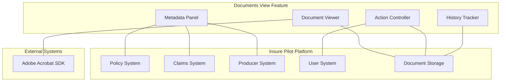
```mermaid
graph TD
    subgraph "Documents View Feature"
        DV[Document Viewer]
        MP[Metadata Panel]
        AC[Action Controller]
        HT[History Tracker]
    end
    
    subgraph "Insure Pilot Platform"
        PS[Policy System]
        CS[Claims System]
        PrS[Producer System]
        US[User System]
        DS[Document Storage]
    end
    
    subgraph "External Systems"
        Adobe[Adobe Acrobat SDK]
    end
    
    DV --- Adobe
    DV --- DS
    MP --- PS
    MP --- CS
    MP --- PrS
    AC --- DS
    AC --- US
    HT --- DS
```

Key stakeholders include claims adjusters, underwriters, and support staff who need to review documents and apply metadata, as well as supervisors and administrators who oversee document handling and ensure compliance.

## 2. High-Level Architecture

### 2.1 System Overview

The Documents View follows a layered architecture pattern with clear separation of concerns between presentation, business logic, and data access layers. The system is designed as a component within the larger Insure Pilot platform, integrating with existing services while maintaining its own focused responsibility.

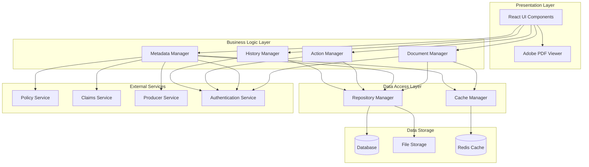
```mermaid
graph TD
    subgraph "Presentation Layer"
        UI[React UI Components]
        PDF[Adobe PDF Viewer]
    end
    
    subgraph "Business Logic Layer"
        DM[Document Manager]
        MM[Metadata Manager]
        AM[Action Manager]
        HM[History Manager]
    end
    
    subgraph "Data Access Layer"
        RM[Repository Manager]
        CM[Cache Manager]
    end
    
    subgraph "Data Storage"
        DB[(Database)]
        FS[File Storage]
        Cache[(Redis Cache)]
    end
    
    subgraph "External Services"
        PS[Policy Service]
        CS[Claims Service]
        PrS[Producer Service]
        AS[Authentication Service]
    end
    
    UI --> PDF
    UI --> DM
    UI --> MM
    UI --> AM
    UI --> HM
    
    DM --> RM
    MM --> RM
    AM --> RM
    HM --> RM
    
    DM --> CM
    MM --> CM
    
    RM --> DB
    RM --> FS
    CM --> Cache
    
    MM --> PS
    MM --> CS
    MM --> PrS
    DM --> AS
    MM --> AS
    AM --> AS
    HM --> AS
```

The architecture employs a hybrid approach combining elements of Model-View-Controller (MVC) and microservices patterns:
- The MVC pattern provides clear separation between the document display (View), metadata management (Model), and user interaction handling (Controller)
- Microservices integration allows the Documents View to interact with specialized services like DocumentManager and PolicyManager

### 2.2 Component Architecture

The Documents View consists of several key components that work together to provide a comprehensive document management experience:

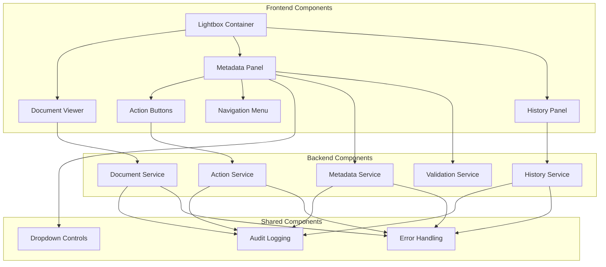
```mermaid
graph TD
    subgraph "Frontend Components"
        LB[Lightbox Container]
        DV[Document Viewer]
        MP[Metadata Panel]
        HP[History Panel]
        AC[Action Buttons]
        NM[Navigation Menu]
    end
    
    subgraph "Backend Components"
        DS[Document Service]
        MS[Metadata Service]
        AS[Action Service]
        HS[History Service]
        VS[Validation Service]
    end
    
    subgraph "Shared Components"
        DD[Dropdown Controls]
        EH[Error Handling]
        AL[Audit Logging]
    end
    
    LB --> DV
    LB --> MP
    LB --> HP
    MP --> AC
    MP --> NM
    MP --> DD
    
    DV --> DS
    MP --> MS
    MP --> VS
    AC --> AS
    HP --> HS
    
    DS --> AL
    MS --> AL
    AS --> AL
    HS --> AL
    
    MS --> EH
    DS --> EH
    AS --> EH
    HS --> EH
```

Each component has specific responsibilities:
- **Lightbox Container**: Manages the overall lightbox container and coordinates child components
- **Document Viewer**: Renders PDF documents in the left panel using Adobe Acrobat PDF SDK
- **Metadata Panel**: Displays and manages document metadata in the right panel
- **Action Buttons**: Processes document actions (mark as processed, trash)
- **History Panel**: Displays document history and audit trail
- **Navigation Menu**: Provides contextual navigation options
- **Dropdown Controls**: Provides type-ahead filtering for dropdown fields with dependency management

### 2.3 Data Flow

The Documents View follows a structured data flow pattern that begins when a user selects a document to view:

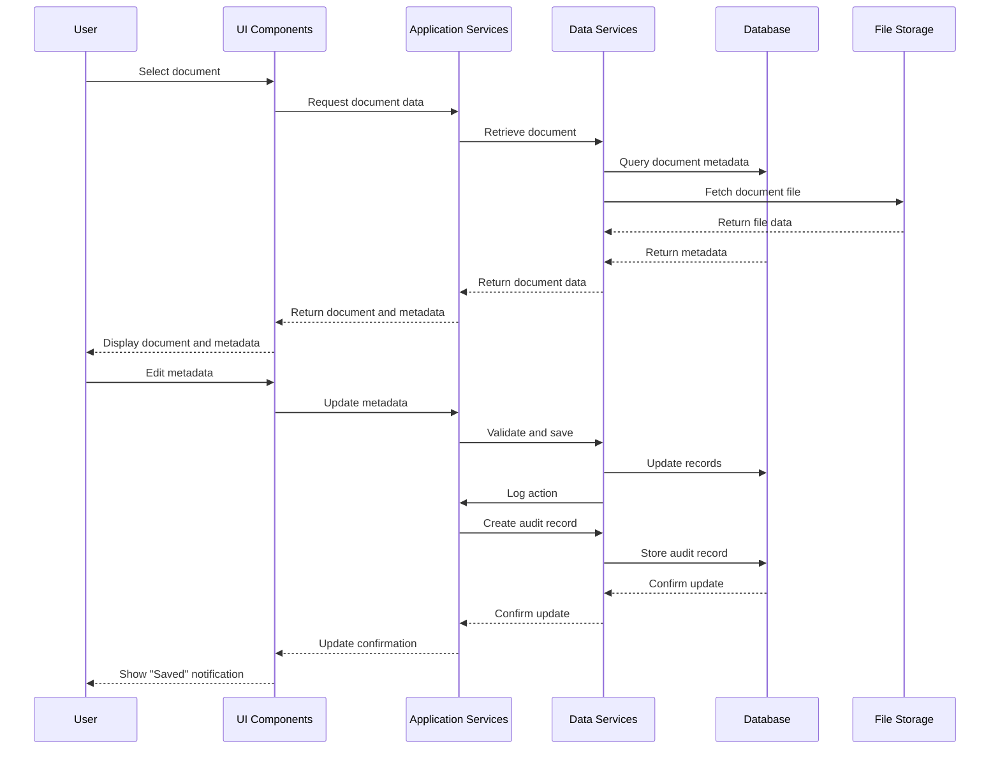
```mermaid
sequenceDiagram
    participant User
    participant UI as UI Components
    participant AS as Application Services
    participant DS as Data Services
    participant DB as Database
    participant FS as File Storage
    
    User->>UI: Select document
    UI->>AS: Request document data
    AS->>DS: Retrieve document
    DS->>DB: Query document metadata
    DS->>FS: Fetch document file
    FS-->>DS: Return file data
    DB-->>DS: Return metadata
    DS-->>AS: Return document data
    AS-->>UI: Return document and metadata
    UI-->>User: Display document and metadata
    
    User->>UI: Edit metadata
    UI->>AS: Update metadata
    AS->>DS: Validate and save
    DS->>DB: Update records
    DS->>AS: Log action
    AS->>DS: Create audit record
    DS->>DB: Store audit record
    DB-->>DS: Confirm update
    DS-->>AS: Confirm update
    AS-->>UI: Update confirmation
    UI-->>User: Show "Saved" notification
```

Key data flows include:
1. **Document Selection and Loading**:
   - User selects a document from a list or search results
   - System retrieves document file from storage
   - Adobe Acrobat PDF viewer loads and renders the document
   - Metadata is retrieved from database tables

2. **Metadata Management**:
   - When a user edits metadata, changes are validated
   - Valid changes trigger asynchronous database updates
   - Dependency logic updates related fields
   - Audit records are created for changes

3. **Document Processing**:
   - Document state changes (processed, trashed) are persisted
   - Actions generate audit records
   - UI state updates to reflect document status

4. **History and Audit**:
   - Action records retrieved chronologically
   - User attribution and timestamps displayed
   - Comprehensive audit trail maintained

### 2.4 External Integration Points

The Documents View integrates with several external systems to provide comprehensive functionality:

| System | Integration Type | Purpose |
|--------|------------------|---------|
| Adobe Acrobat PDF Viewer | JavaScript SDK | Document display and navigation |
| PolicyManager | REST API | Policy data retrieval and validation |
| LossManager | REST API | Loss and claimant data management |
| ProducerManager | REST API | Producer information and relationships |
| DocumentManager | REST API | Document storage and retrieval |
| AuthenticationManager | Token-based | User authentication and authorization |

Integration with these systems follows standardized patterns:
- REST APIs for data exchange
- Event-based communication for async operations
- Cached connections for performance
- Fault tolerance through circuit breakers

## 3. Component Details

### 3.1 Document Viewer Component

**Purpose and Responsibilities**:
- Renders PDF documents in the left panel of the Documents View
- Provides navigation controls for multipage documents
- Displays document filename and basic metadata
- Handles document zooming and scrolling

**Technologies and Frameworks**:
- Adobe Acrobat PDF SDK for document rendering
- React for component structure and state management
- JavaScript for interaction handling

**Key Interfaces**:
- DocumentManager API for document retrieval
- Adobe Acrobat PDF SDK API for rendering control

**Data Persistence Requirements**:
- Document viewing state is maintained in client memory
- No direct persistence requirements beyond document retrieval

**Component Interaction Diagram**:

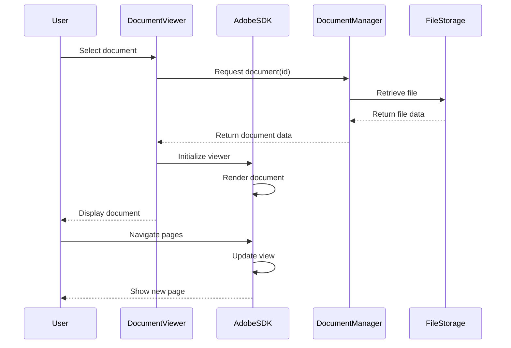
```mermaid
sequenceDiagram
    participant User
    participant DocumentViewer
    participant AdobeSDK
    participant DocumentManager
    participant FileStorage
    
    User->>DocumentViewer: Select document
    DocumentViewer->>DocumentManager: Request document(id)
    DocumentManager->>FileStorage: Retrieve file
    FileStorage-->>DocumentManager: Return file data
    DocumentManager-->>DocumentViewer: Return document data
    DocumentViewer->>AdobeSDK: Initialize viewer
    AdobeSDK->>AdobeSDK: Render document
    DocumentViewer-->>User: Display document
    
    User->>AdobeSDK: Navigate pages
    AdobeSDK->>AdobeSDK: Update view
    AdobeSDK-->>User: Show new page
```

### 3.2 Metadata Panel Component

**Purpose and Responsibilities**:
- Displays editable metadata fields in the right panel
- Manages field dependencies and dynamic updates
- Provides type-ahead filtering for dropdown fields
- Shows saving/saved indicators during updates

**Technologies and Frameworks**:
- React for component structure and state management
- Redux or Context API for state management
- Axios for API communication

**Key Interfaces**:
- PolicyManager API for policy data
- LossManager API for loss and claimant data
- ProducerManager API for producer data
- DocumentManager API for metadata updates

**Data Persistence Requirements**:
- Metadata changes must be persisted to database tables
- Action records must be created for audit purposes

**State Transition Diagram**:

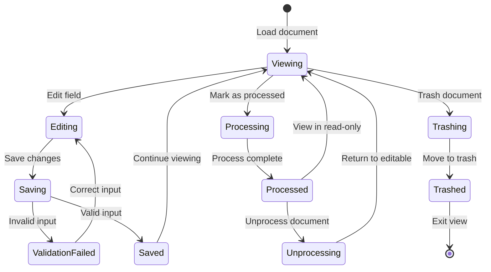
```mermaid
stateDiagram-v2
    [*] --> Viewing: Load document
    
    Viewing --> Editing: Edit field
    Editing --> Saving: Save changes
    Saving --> ValidationFailed: Invalid input
    ValidationFailed --> Editing: Correct input
    
    Saving --> Saved: Valid input
    Saved --> Viewing: Continue viewing
    
    Viewing --> Processing: Mark as processed
    Processing --> Processed: Process complete
    Processed --> Viewing: View in read-only
    
    Processed --> Unprocessing: Unprocess document
    Unprocessing --> Viewing: Return to editable
    
    Viewing --> Trashing: Trash document
    Trashing --> Trashed: Move to trash
    Trashed --> [*]: Exit view
```

### 3.3 Action Controller Component

**Purpose and Responsibilities**:
- Processes document actions like "Mark as Processed" and "Trash Document"
- Manages document state transitions
- Creates audit records for actions
- Handles error conditions and validation

**Technologies and Frameworks**:
- Laravel controllers for backend processing
- React for frontend action handling
- Event-driven architecture for action logging

**Key Interfaces**:
- DocumentManager API for document state updates
- Audit Logger for action recording
- Database tables for state persistence

**Sequence Diagram for Mark as Processed**:

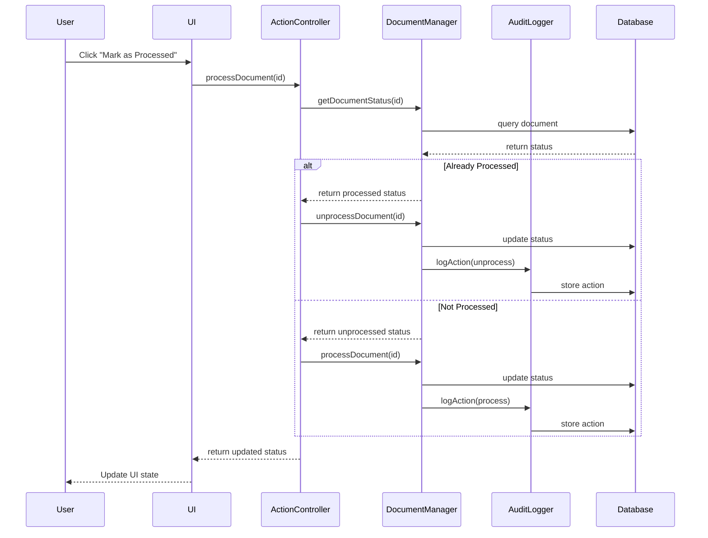
```mermaid
sequenceDiagram
    participant User
    participant UI
    participant ActionController
    participant DocumentManager
    participant AuditLogger
    participant Database
    
    User->>UI: Click "Mark as Processed"
    UI->>ActionController: processDocument(id)
    ActionController->>DocumentManager: getDocumentStatus(id)
    DocumentManager->>Database: query document
    Database-->>DocumentManager: return status
    
    alt Already Processed
        DocumentManager-->>ActionController: return processed status
        ActionController->>DocumentManager: unprocessDocument(id)
        DocumentManager->>Database: update status
        DocumentManager->>AuditLogger: logAction(unprocess)
        AuditLogger->>Database: store action
    else Not Processed
        DocumentManager-->>ActionController: return unprocessed status
        ActionController->>DocumentManager: processDocument(id)
        DocumentManager->>Database: update status
        DocumentManager->>AuditLogger: logAction(process)
        AuditLogger->>Database: store action
    end
    
    ActionController-->>UI: return updated status
    UI-->>User: Update UI state
```

### 3.4 History Tracker Component

**Purpose and Responsibilities**:
- Retrieves and displays document action history
- Shows chronological list of document changes
- Provides user attribution for actions
- Allows navigation back to metadata panel

**Technologies and Frameworks**:
- React for component structure
- Laravel controllers for data retrieval
- Timeline visualization for history display

**Key Interfaces**:
- Audit Logger API for history retrieval
- DocumentManager API for document metadata

**Component Interaction Diagram**:

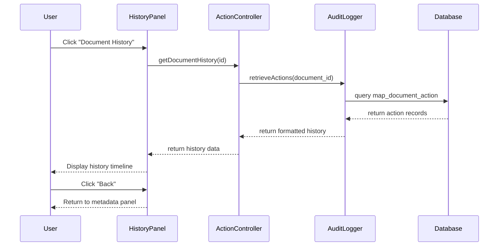
```mermaid
sequenceDiagram
    participant User
    participant HistoryPanel
    participant ActionController
    participant AuditLogger
    participant Database
    
    User->>HistoryPanel: Click "Document History"
    HistoryPanel->>ActionController: getDocumentHistory(id)
    ActionController->>AuditLogger: retrieveActions(document_id)
    AuditLogger->>Database: query map_document_action
    Database-->>AuditLogger: return action records
    AuditLogger-->>ActionController: return formatted history
    ActionController-->>HistoryPanel: return history data
    HistoryPanel-->>User: Display history timeline
    
    User->>HistoryPanel: Click "Back"
    HistoryPanel-->>User: Return to metadata panel
```

### 3.5 Field Validator Component

**Purpose and Responsibilities**:
- Validates metadata field values
- Enforces field dependencies and business rules
- Provides real-time validation feedback
- Ensures data integrity before persistence

**Technologies and Frameworks**:
- Laravel validation rules for backend validation
- React form validation for frontend feedback
- Business rules engine for complex validations

**Key Interfaces**:
- PolicyManager API for policy validation
- LossManager API for loss validation
- DocumentManager API for document validation

**Error Handling Flow**:

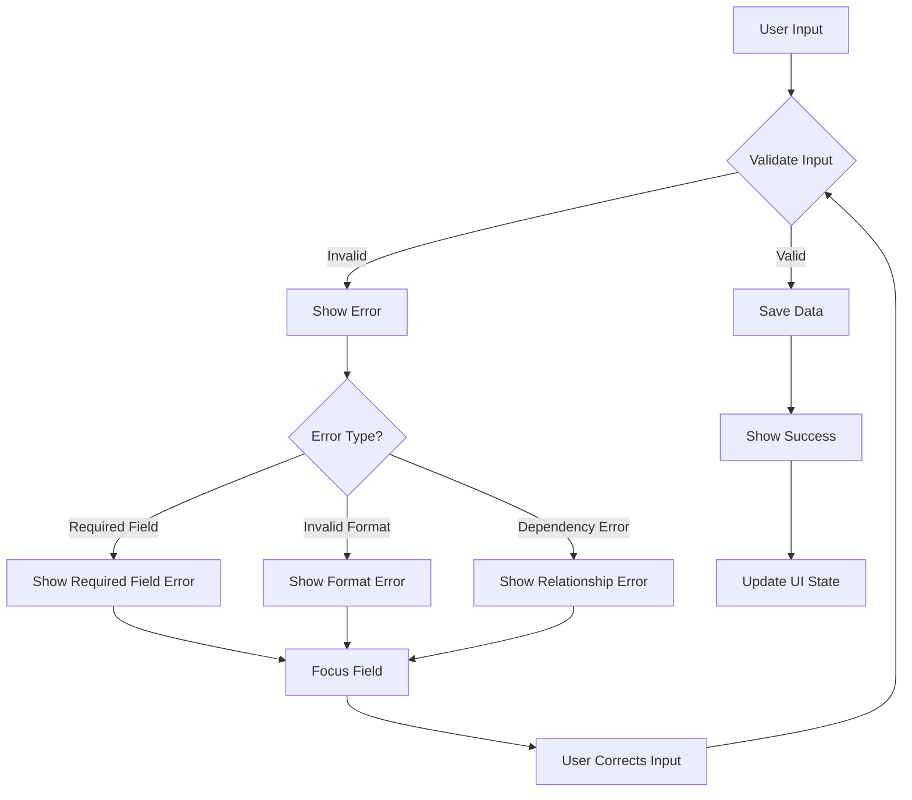
```mermaid
flowchart TD
    A[User Input] --> B{Validate Input}
    B -->|Valid| C[Save Data]
    B -->|Invalid| D[Show Error]
    D --> E{Error Type?}
    
    E -->|Required Field| F[Show Required Field Error]
    E -->|Invalid Format| G[Show Format Error]
    E -->|Dependency Error| H[Show Relationship Error]
    
    F --> I[Focus Field]
    G --> I
    H --> I
    
    I --> J[User Corrects Input]
    J --> B
    
    C --> K[Show Success]
    K --> L[Update UI State]
```

## 4. Service Architecture

### 4.1 Service Components

The Documents View is built on a service-oriented architecture that divides functionality into distinct services with clear boundaries and responsibilities:

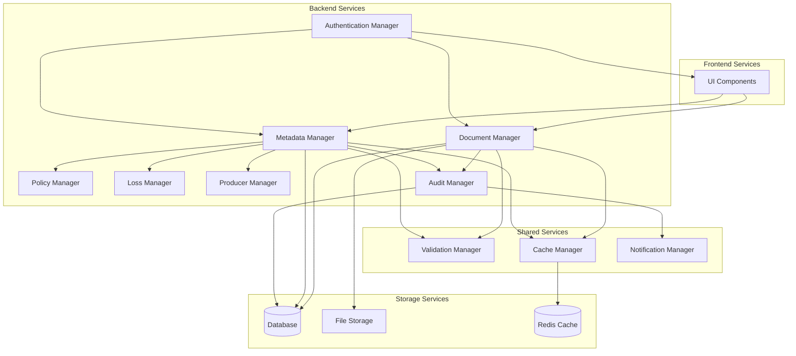
```mermaid
graph TD
    subgraph "Frontend Services"
        UI[UI Components]
    end
    
    subgraph "Backend Services"
        DM[Document Manager]
        MM[Metadata Manager]
        PM[Policy Manager]
        LM[Loss Manager]
        PrM[Producer Manager]
        AM[Authentication Manager]
        AuM[Audit Manager]
    end
    
    subgraph "Shared Services"
        VM[Validation Manager]
        CM[Cache Manager]
        NM[Notification Manager]
    end
    
    subgraph "Storage Services"
        DB[(Database)]
        FS[File Storage]
        RC[(Redis Cache)]
    end
    
    UI --> DM
    UI --> MM
    
    DM --> VM
    DM --> CM
    DM --> AuM
    
    MM --> VM
    MM --> CM
    MM --> AuM
    MM --> PM
    MM --> LM
    MM --> PrM
    
    AuM --> NM
    
    DM --> DB
    DM --> FS
    MM --> DB
    AuM --> DB
    
    CM --> RC
    
    AM --> UI
    AM --> DM
    AM --> MM
```

**Service Boundaries and Responsibilities**:

| Service | Primary Responsibilities | Key Dependencies |
|---------|--------------------------|------------------|
| Document Manager | Document storage, retrieval, and file operations | File Storage, Database |
| Metadata Manager | Metadata CRUD operations and field management | Policy Manager, Loss Manager, Producer Manager |
| Policy Manager | Policy data retrieval and validation | Database |
| Loss Manager | Loss and claimant data management | Database |
| Producer Manager | Producer data operations | Database |
| Authentication Manager | User authentication and authorization | Database |
| Audit Manager | Action logging and history tracking | Database, Notification Manager |
| Validation Manager | Field validation and dependency enforcement | Database |
| Cache Manager | Caching strategy and implementation | Redis |
| Notification Manager | User notifications for document actions | Redis |

### 4.2 Inter-Service Communication

The Documents View implements multiple communication patterns to ensure efficient and reliable service interactions:

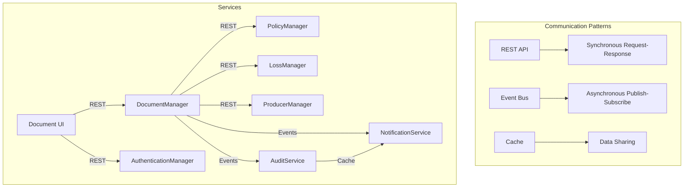
```mermaid
flowchart TD
    subgraph "Communication Patterns"
        A[REST API] --> B[Synchronous Request-Response]
        C[Event Bus] --> D[Asynchronous Publish-Subscribe]
        E[Cache] --> F[Data Sharing]
    end
    
    subgraph "Services"
        UI[Document UI]
        DM[DocumentManager]
        PM[PolicyManager]
        LM[LossManager]
        PrM[ProducerManager]
        AM[AuthenticationManager]
        AS[AuditService]
        NS[NotificationService]
    end
    
    UI -- REST --> DM
    UI -- REST --> AM
    DM -- REST --> PM
    DM -- REST --> LM
    DM -- REST --> PrM
    DM -- Events --> AS
    DM -- Events --> NS
    
    AS -- Cache --> NS
```

**Communication Pattern Details**:

| Pattern | Implementation | Use Cases |
|---------|----------------|-----------|
| REST API | JSON over HTTPS | Primary service-to-service communication for CRUD operations |
| Event Bus | Laravel Events | Document state changes, audit logging, notifications |
| Cache Sharing | Redis | Frequently accessed metadata, user permissions, dropdown options |
| Database Queries | Direct DB access | Complex data relationships, reporting, analytics |

**Circuit Breaker and Resilience Patterns**:

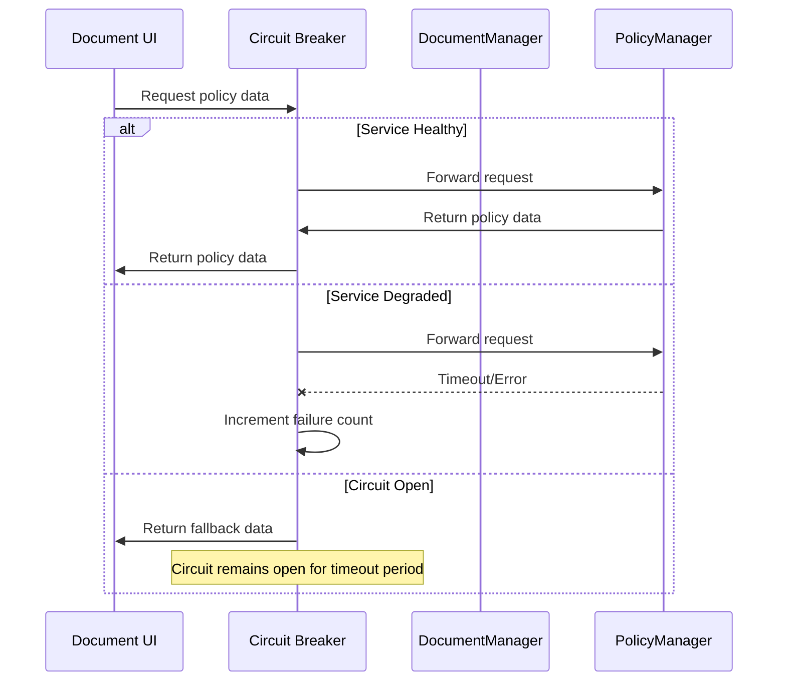
```mermaid
sequenceDiagram
    participant UI as Document UI
    participant CB as Circuit Breaker
    participant DM as DocumentManager
    participant PM as PolicyManager
    
    UI->>CB: Request policy data
    
    alt Service Healthy
        CB->>PM: Forward request
        PM->>CB: Return policy data
        CB->>UI: Return policy data
    else Service Degraded
        CB->>PM: Forward request
        PM--xCB: Timeout/Error
        CB->>CB: Increment failure count
    else Circuit Open
        CB->>UI: Return fallback data
        Note over CB: Circuit remains open for timeout period
    end
```

### 4.3 Scalability Design

The Documents View is designed to scale horizontally to handle increasing load while maintaining performance and reliability. The architecture supports both automatic and manual scaling based on resource utilization and traffic patterns.

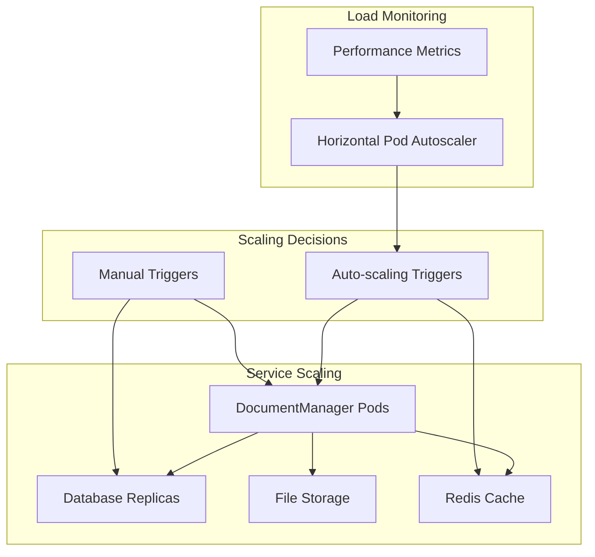
```mermaid
flowchart TD
    subgraph "Load Monitoring"
        PM[Performance Metrics]
        HPA[Horizontal Pod Autoscaler]
    end
    
    subgraph "Scaling Decisions"
        AT[Auto-scaling Triggers]
        MT[Manual Triggers]
    end
    
    subgraph "Service Scaling"
        DM[DocumentManager Pods]
        DB[Database Replicas]
        FS[File Storage]
        Cache[Redis Cache]
    end
    
    PM --> HPA
    HPA --> AT
    MT --> DM
    AT --> DM
    AT --> Cache
    MT --> DB
    
    DM --> DB
    DM --> FS
    DM --> Cache
```

**Scaling Strategy**:

| Component | Scaling Approach | Scaling Triggers | Resource Allocation |
|-----------|------------------|------------------|---------------------|
| DocumentManager | Horizontal | CPU > 70%, Memory > 80% | 2-10 pods, 1 CPU, 2GB RAM each |
| PolicyManager | Horizontal | CPU > 70%, Request rate > 100/s | 2-8 pods, 1 CPU, 2GB RAM each |
| Database | Read replicas | Manual scaling | Primary: 4 CPU, 8GB RAM; Replicas: 2 CPU, 4GB RAM |
| Redis Cache | Horizontal | Memory > 70% | 2-4 pods, 1 CPU, 4GB RAM each |

**Performance Optimization Techniques**:

| Technique | Implementation | Impact |
|-----------|----------------|--------|
| Data Caching | Redis for metadata and dropdown options | Reduces database load by 40-60% |
| Query Optimization | Indexed fields, optimized joins | Improves query response time by 30-50% |
| Connection Pooling | Database connection reuse | Reduces connection overhead by 20-30% |
| Asset Compression | Gzip for API responses | Reduces bandwidth usage by 60-80% |

### 4.4 Resilience Patterns

The Documents View implements multiple resilience patterns to ensure high availability and fault tolerance, even during partial system failures or maintenance periods.

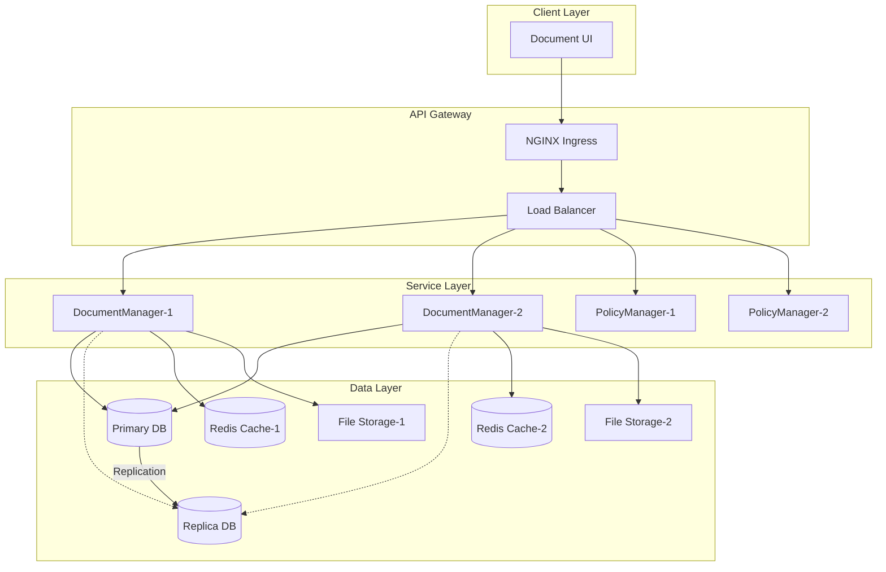
```mermaid
flowchart TD
    subgraph "Client Layer"
        UI[Document UI]
    end
    
    subgraph "API Gateway"
        NGINX[NGINX Ingress]
        LB[Load Balancer]
    end
    
    subgraph "Service Layer"
        DM1[DocumentManager-1]
        DM2[DocumentManager-2]
        PM1[PolicyManager-1]
        PM2[PolicyManager-2]
    end
    
    subgraph "Data Layer"
        PDB[(Primary DB)]
        RDB[(Replica DB)]
        RC1[(Redis Cache-1)]
        RC2[(Redis Cache-2)]
        FS1[File Storage-1]
        FS2[File Storage-2]
    end
    
    UI --> NGINX
    NGINX --> LB
    
    LB --> DM1
    LB --> DM2
    LB --> PM1
    LB --> PM2
    
    DM1 --> PDB
    DM2 --> PDB
    DM1 -.-> RDB
    DM2 -.-> RDB
    
    DM1 --> RC1
    DM2 --> RC2
    
    DM1 --> FS1
    DM2 --> FS2
    
    PDB -- Replication --> RDB
```

**Resilience Mechanisms**:

| Mechanism | Implementation | Recovery Time Objective |
|-----------|----------------|-------------------------|
| Database Redundancy | Primary-replica replication | < 1 minute failover |
| Service Redundancy | Multiple pods across nodes | < 30 seconds |
| Cache Redundancy | Redis cluster with persistence | < 1 minute |
| File Storage Redundancy | Replicated NFS or cloud storage | < 1 minute |

**Service Degradation Policies**:

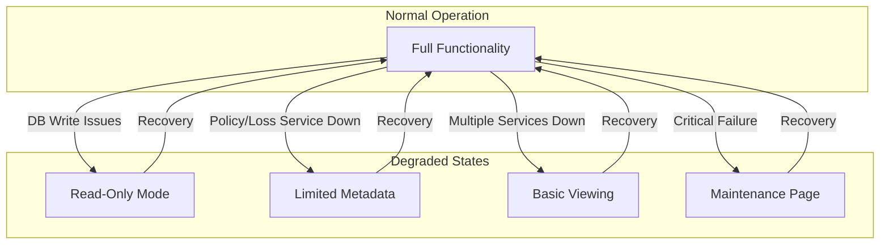
```mermaid
flowchart TD
    subgraph "Normal Operation"
        A[Full Functionality]
    end
    
    subgraph "Degraded States"
        B[Read-Only Mode]
        C[Limited Metadata]
        D[Basic Viewing]
        E[Maintenance Page]
    end
    
    A -- "DB Write Issues" --> B
    A -- "Policy/Loss Service Down" --> C
    A -- "Multiple Services Down" --> D
    A -- "Critical Failure" --> E
    
    B -- "Recovery" --> A
    C -- "Recovery" --> A
    D -- "Recovery" --> A
    E -- "Recovery" --> A
```

### 4.5 Service Interaction Diagrams

**Document Viewing and Metadata Flow**:

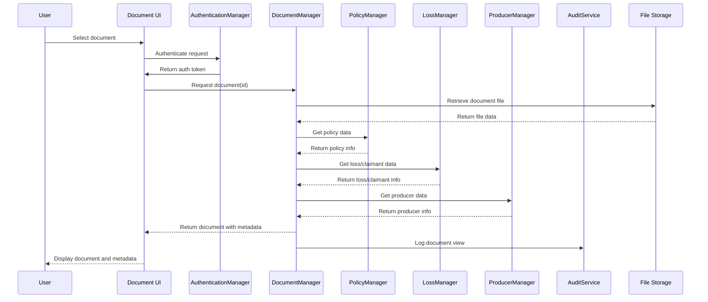
```mermaid
sequenceDiagram
    participant User
    participant UI as Document UI
    participant AM as AuthenticationManager
    participant DM as DocumentManager
    participant PM as PolicyManager
    participant LM as LossManager
    participant PrM as ProducerManager
    participant AS as AuditService
    participant FS as File Storage
    
    User->>UI: Select document
    UI->>AM: Authenticate request
    AM->>UI: Return auth token
    
    UI->>DM: Request document(id)
    DM->>FS: Retrieve document file
    FS-->>DM: Return file data
    DM->>PM: Get policy data
    PM-->>DM: Return policy info
    DM->>LM: Get loss/claimant data
    LM-->>DM: Return loss/claimant info
    DM->>PrM: Get producer data
    PrM-->>DM: Return producer info
    
    DM-->>UI: Return document with metadata
    DM->>AS: Log document view
    
    UI-->>User: Display document and metadata
```

**Document Processing and Action Flow**:

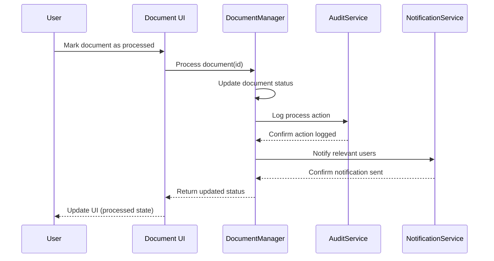
```mermaid
sequenceDiagram
    participant User
    participant UI as Document UI
    participant DM as DocumentManager
    participant AS as AuditService
    participant NS as NotificationService
    
    User->>UI: Mark document as processed
    UI->>DM: Process document(id)
    DM->>DM: Update document status
    DM->>AS: Log process action
    AS-->>DM: Confirm action logged
    
    DM->>NS: Notify relevant users
    NS-->>DM: Confirm notification sent
    
    DM-->>UI: Return updated status
    UI-->>User: Update UI (processed state)
```

## 5. Database Architecture

### 5.1 Schema Design

The Documents View feature interacts with multiple database tables to manage document metadata, actions, and relationships. The core entities and their relationships are outlined below:

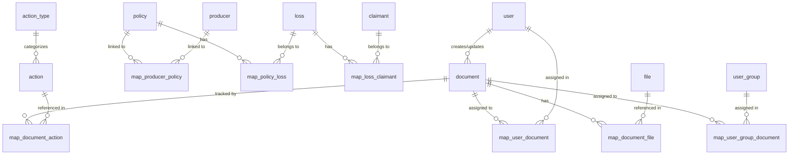
```mermaid
erDiagram
    document ||--o{ map_document_action : "tracked by"
    document ||--o{ map_document_file : "has"
    document ||--o{ map_user_document : "assigned to"
    document ||--o{ map_user_group_document : "assigned to"
    
    policy ||--o{ map_producer_policy : "linked to"
    producer ||--o{ map_producer_policy : "linked to"
    
    policy ||--o{ map_policy_loss : "has"
    loss ||--o{ map_policy_loss : "belongs to"
    
    loss ||--o{ map_loss_claimant : "has"
    claimant ||--o{ map_loss_claimant : "belongs to"
    
    action ||--o{ map_document_action : "referenced in"
    action_type ||--o{ action : "categorizes"
    
    file ||--o{ map_document_file : "referenced in"
    
    user ||--o{ map_user_document : "assigned in"
    user_group ||--o{ map_user_group_document : "assigned in"
    
    user ||--o{ document : "creates/updates"
```

### 5.2 Entity Relationships

The database uses several mapping tables to establish relationships between entities, enabling the complex document metadata management requirements:

**Document Relationships**:
- A document can be associated with a policy (through policy_id)
- A document can be associated with a loss (through loss_id)
- A document can be associated with a claimant (through claimant_id)
- A document can be associated with a producer (through producer_id)

**User Relationships**:
- A document can be assigned to users (through map_user_document)
- A document can be assigned to user groups (through map_user_group_document)
- A document tracks who created it and who last updated it

**Action Tracking**:
- All document actions are logged in the action table
- Document-action relationships are tracked in map_document_action
- Actions are categorized by action_type (view, edit, process, trash, etc.)

**File Storage**:
- Document files are tracked in the file table
- Document-file relationships are maintained in map_document_file

### 5.3 Data Models

**Core Tables**:

| Table | Purpose | Key Fields |
|-------|---------|------------|
| document | Stores document metadata | id, name, description, status_id, created_by, updated_by |
| file | Stores file details | id, name, path, mime_type, size |
| action | Records user actions | id, action_type_id, description, created_by |
| map_document_action | Links documents to actions | document_id, action_id |
| map_document_file | Links documents to files | document_id, file_id |

**Related Entities**:

| Table | Purpose | Key Fields |
|-------|---------|------------|
| policy | Stores policy information | id, policy_prefix_id, number, effective_date |
| loss | Stores loss/claim information | id, date, loss_type_id |
| claimant | Stores claimant details | id, name_id, policy_id, loss_id |
| producer | Stores producer information | id, number, name |

### 5.4 Indexing Strategy

The Documents View implements a comprehensive indexing strategy to ensure optimal performance:

| Table | Index | Columns | Purpose |
|-------|-------|---------|---------|
| document | Primary | id | Unique document identifier |
| document | Index | status_id | Filter documents by status |
| document | Index | created_by | Filter documents by creator |
| document | Index | updated_by | Filter documents by updater |
| map_document_action | Index | document_id | Find actions for a document |
| map_document_action | Index | action_id | Find documents for an action |
| map_document_file | Index | document_id | Find files for a document |
| map_document_file | Index | file_id | Find documents for a file |
| map_policy_loss | Index | policy_id | Find losses for a policy |
| map_policy_loss | Index | loss_id | Find policies for a loss |
| map_loss_claimant | Index | loss_id | Find claimants for a loss |
| map_loss_claimant | Index | claimant_id | Find losses for a claimant |

**Compound Indexes**:

| Table | Index | Columns | Purpose |
|-------|-------|---------|---------|
| document | Compound | policy_id, status_id | Efficient filtering of documents by policy and status |
| document | Compound | loss_id, status_id | Efficient filtering of documents by loss and status |
| action | Compound | created_by, created_at | Efficient retrieval of user actions by date |

### 5.5 Replication and Backup

**Database Replication Architecture**:

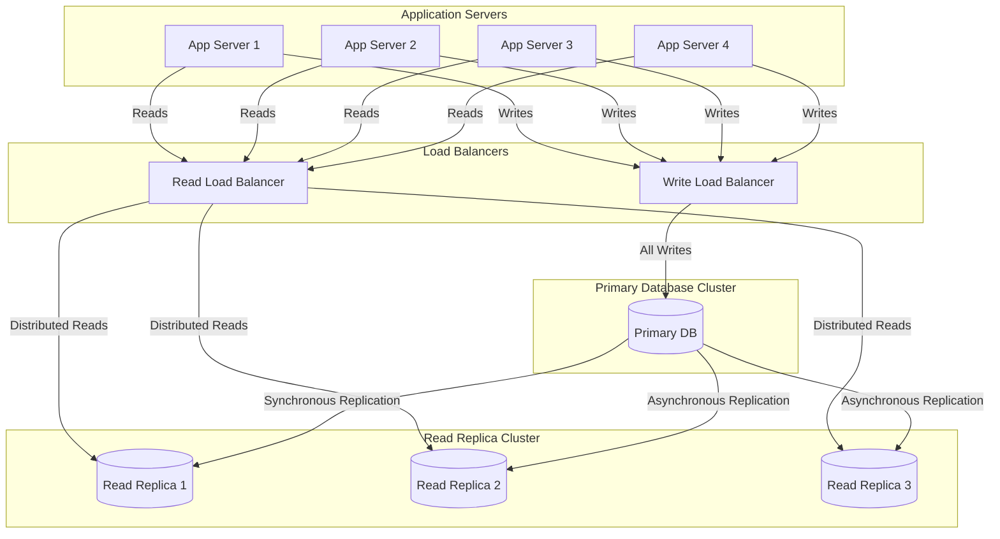
```mermaid
graph TD
    subgraph "Primary Database Cluster"
        PDB[(Primary DB)]
    end
    
    subgraph "Read Replica Cluster"
        RDB1[(Read Replica 1)]
        RDB2[(Read Replica 2)]
        RDB3[(Read Replica 3)]
    end
    
    subgraph "Application Servers"
        AS1[App Server 1]
        AS2[App Server 2]
        AS3[App Server 3]
        AS4[App Server 4]
    end
    
    subgraph "Load Balancers"
        WLB[Write Load Balancer]
        RLB[Read Load Balancer]
    end
    
    AS1 -- "Writes" --> WLB
    AS2 -- "Writes" --> WLB
    AS3 -- "Writes" --> WLB
    AS4 -- "Writes" --> WLB
    
    WLB -- "All Writes" --> PDB
    
    AS1 -- "Reads" --> RLB
    AS2 -- "Reads" --> RLB
    AS3 -- "Reads" --> RLB
    AS4 -- "Reads" --> RLB
    
    RLB -- "Distributed Reads" --> RDB1
    RLB -- "Distributed Reads" --> RDB2
    RLB -- "Distributed Reads" --> RDB3
    
    PDB -- "Synchronous Replication" --> RDB1
    PDB -- "Asynchronous Replication" --> RDB2
    PDB -- "Asynchronous Replication" --> RDB3
```

**Backup Strategy**:

| Backup Type | Frequency | Retention | Storage |
|-------------|-----------|-----------|---------|
| Full Backup | Daily | 30 days | Primary & Offsite |
| Incremental Backup | Hourly | 7 days | Primary |
| Binary Logs | Continuous | 14 days | Primary & Cloud |
| Offsite Backup | Weekly | 90 days | Offsite |
| Cloud Backup | Daily | 365 days | Cloud |

## 6. Integration Architecture

### 6.1 API Design

The Documents View feature integrates with several internal services and external systems through a well-defined API architecture.

**RESTful API Endpoints**:

| Endpoint | Method | Purpose |
|----------|--------|---------|
| `/api/documents/{id}` | GET | Retrieve document metadata |
| `/api/documents/{id}/file` | GET | Download document file |
| `/api/documents/{id}/metadata` | PUT | Update document metadata |
| `/api/documents/{id}/process` | POST | Mark document as processed/unprocessed |
| `/api/documents/{id}/trash` | POST | Move document to trash |
| `/api/documents/{id}/history` | GET | Retrieve document history |
| `/api/policies` | GET | Retrieve policy options |
| `/api/policies/{id}/losses` | GET | Retrieve losses for a policy |
| `/api/losses/{id}/claimants` | GET | Retrieve claimants for a loss |
| `/api/producers` | GET | Retrieve producer options |

**Authentication Methods**:

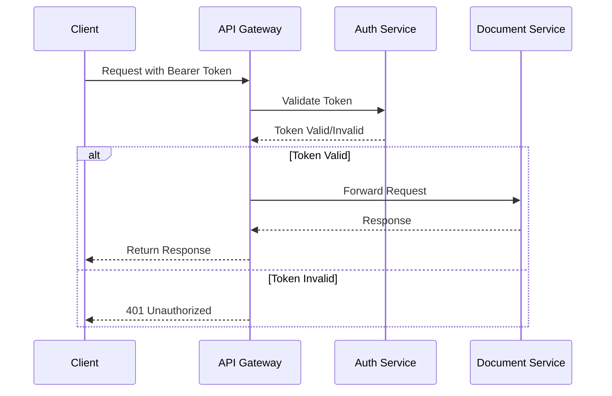
```mermaid
sequenceDiagram
    participant Client
    participant API Gateway
    participant Auth Service
    participant Document Service
    
    Client->>API Gateway: Request with Bearer Token
    API Gateway->>Auth Service: Validate Token
    Auth Service-->>API Gateway: Token Valid/Invalid
    
    alt Token Valid
        API Gateway->>Document Service: Forward Request
        Document Service-->>API Gateway: Response
        API Gateway-->>Client: Return Response
    else Token Invalid
        API Gateway-->>Client: 401 Unauthorized
    end
```

**API Versioning Strategy**:

The API follows a URI-based versioning strategy:

```
/api/v1/documents/{id}
/api/v2/documents/{id}
```

### 6.2 Message Processing

The Documents View implements several message processing patterns to handle asynchronous operations, event notifications, and background tasks.

**Event Processing Patterns**:

```mermaid
flowchart TD
    A[Document Action] --> B{Event Type}
    B -->|Created| C[DocumentCreatedEvent]
    B -->|Updated| D[DocumentUpdatedEvent]
    B -->|Processed| E[DocumentProcessedEvent]
    B -->|Trashed| F[DocumentTrashedEvent]
    
    C --> G[Notification Service]
    C --> H[Search Indexer]
    D --> I[Audit Service]
    D --> H
    E --> J[Workflow Engine]
    E --> G
    F --> K[Archive Service]
    F --> H
```

**Message Queue Architecture**:

| Queue | Priority | Processing | Use Case |
|-------|----------|------------|----------|
| document-critical | High | Immediate | User-facing operations |
| document-background | Medium | Batch | Index updates, notifications |
| document-maintenance | Low | Scheduled | Cleanup, archiving |

### 6.3 External Systems Integration

The Documents View integrates with several external systems to provide comprehensive document management capabilities.

**Integration with Adobe Acrobat PDF Viewer**:

```mermaid
sequenceDiagram
    participant User
    participant UI as Documents View UI
    participant API as API Gateway
    participant DM as Document Manager
    participant Adobe as Adobe PDF Viewer
    participant FS as File Storage
    
    User->>UI: Select document to view
    UI->>API: GET /api/documents/{id}
    API->>DM: Retrieve document metadata
    DM->>FS: Fetch document file
    FS-->>DM: Return file data
    DM-->>API: Return document metadata and file URL
    API-->>UI: Document data response
    
    UI->>Adobe: Initialize viewer with document URL
    Adobe->>FS: Request document file
    FS-->>Adobe: Return document content
    Adobe-->>UI: Render document in viewer
    
    UI-->>User: Display document and metadata
```

**Integration with Policy System**:

```mermaid
sequenceDiagram
    participant UI as Documents View UI
    participant API as API Gateway
    participant DM as Document Manager
    participant PM as Policy Manager
    participant DB as Database
    
    UI->>API: Request policy dropdown data
    API->>PM: GET /api/policies
    PM->>DB: Query policy data
    DB-->>PM: Return policy records
    PM-->>API: Format policy options
    API-->>UI: Return policy dropdown data
    
    UI->>UI: User selects policy
    UI->>API: Request losses for policy
    API->>PM: GET /api/policies/{id}/losses
    PM->>DB: Query losses by policy_id
    DB-->>PM: Return loss records
    PM-->>API: Format loss options
    API-->>UI: Return loss dropdown data
```

### 6.4 Integration Flow Diagrams

**Metadata Update Integration Flow**:

```mermaid
sequenceDiagram
    participant User
    participant UI as Documents View UI
    participant API as API Gateway
    participant DM as Document Manager
    participant PM as Policy Manager
    participant LM as Loss Manager
    participant DB as Database
    participant ES as Event Service
    
    User->>UI: Update document metadata
    UI->>API: PUT /api/documents/{id}/metadata
    API->>DM: Process metadata update
    
    alt Policy Number Changed
        DM->>PM: Validate policy number
        PM-->>DM: Return policy validation result
    end
    
    alt Loss Sequence Changed
        DM->>LM: Validate loss sequence
        LM-->>DM: Return loss validation result
    end
    
    DM->>DB: Update document metadata
    DB-->>DM: Confirm update
    
    DM->>ES: Publish DocumentUpdatedEvent
    ES-->>DM: Confirm event published
    
    DM-->>API: Return updated metadata
    API-->>UI: Updated document response
    UI-->>User: Display "Saved" indicator
```

## 7. Security Architecture

### 7.1 Authentication Framework

The Documents View feature implements a comprehensive authentication framework to ensure secure access to document data and functionality.

**Authentication Flow**:

```mermaid
sequenceDiagram
    participant User
    participant Frontend
    participant AuthService
    participant DocumentService
    
    User->>Frontend: Login with credentials
    Frontend->>AuthService: Authenticate user
    AuthService->>Frontend: Return auth token
    
    User->>Frontend: Request document view
    Frontend->>DocumentService: Request with auth token
    DocumentService->>AuthService: Validate token
    AuthService->>DocumentService: Confirm user permissions
    DocumentService->>Frontend: Return document data
    Frontend->>User: Display document
```

**Session Management**:

```mermaid
stateDiagram-v2
    [*] --> Unauthenticated
    Unauthenticated --> Authenticating: Login attempt
    Authenticating --> Authenticated: Valid credentials
    Authenticating --> Unauthenticated: Invalid credentials
    
    Authenticated --> Active: User activity
    Active --> Idle: Inactivity (15 min)
    Idle --> Active: User activity
    Idle --> Expired: Inactivity (30 min)
    
    Expired --> Unauthenticated: Session terminated
    Authenticated --> Unauthenticated: Logout
    
    Active --> MFARequired: Sensitive operation
    MFARequired --> Active: MFA successful
    MFARequired --> Unauthenticated: MFA failed
```

### 7.2 Authorization System

The Documents View implements a robust authorization system to control access to documents and related functionality based on user roles and permissions.

**Role-Based Access Control**:

```mermaid
flowchart TD
    User[User] --> Role[Role Assignment]
    Role --> Permissions[Permission Set]
    Permissions --> Resources[Resource Access]
    
    subgraph "Roles"
        Admin[Administrator]
        Manager[Manager]
        Adjuster[Claims Adjuster]
        Underwriter[Underwriter]
        Support[Support Staff]
        ReadOnly[Read-Only User]
    end
    
    subgraph "Document Permissions"
        View[View Documents]
        Edit[Edit Metadata]
        Process[Mark as Processed]
        Trash[Trash Documents]
        Restore[Restore Documents]
        Delete[Permanently Delete]
        Override[Override Locks]
    end
    
    Admin --> View & Edit & Process & Trash & Restore & Delete & Override
    Manager --> View & Edit & Process & Trash & Restore & Override
    Adjuster --> View & Edit & Process
    Underwriter --> View & Edit & Process
    Support --> View & Edit
    ReadOnly --> View
```

### 7.3 Data Protection

The Documents View implements multiple layers of data protection to secure sensitive document content and metadata.

**Encryption Strategy**:

| Data Type | Encryption Standard | Implementation |
|-----------|---------------------|----------------|
| Document Content | AES-256 | Encrypted at rest in file storage |
| Document Metadata | Column-level encryption | Sensitive fields encrypted in database |
| Authentication Tokens | HMAC SHA-256 | Secure token generation and validation |
| Passwords | Bcrypt | One-way hashing with work factor 12 |

**Key Management**:

```mermaid
flowchart TD
    subgraph "Key Hierarchy"
        MK[Master Key]
        DEK1[Data Encryption Key 1]
        DEK2[Data Encryption Key 2]
        DEK3[Data Encryption Key 3]
    end
    
    subgraph "Key Storage"
        HSM[Hardware Security Module]
        Vault[HashiCorp Vault]
        App[Application Memory]
    end
    
    MK --> DEK1 & DEK2 & DEK3
    MK --- HSM
    DEK1 & DEK2 & DEK3 --- Vault
    Vault --> App
    
    subgraph "Data Protection"
        App --> EncryptedData[Encrypted Data]
    end
```

### 7.4 Security Zones

The Documents View feature operates within a multi-layered security architecture:

```mermaid
flowchart TD
    subgraph "Public Zone"
        Internet[Internet]
        User[End User]
    end
    
    subgraph "DMZ"
        WAF[Web Application Firewall]
        LB[Load Balancer]
        CDN[Content Delivery Network]
    end
    
    subgraph "Application Zone"
        API[API Gateway]
        Auth[Authentication Service]
        DocApp[Document Application]
        MetaApp[Metadata Service]
    end
    
    subgraph "Data Zone"
        DB[(Database)]
        Cache[(Redis Cache)]
        FS[File Storage]
        Vault[HashiCorp Vault]
    end
    
    subgraph "Monitoring Zone"
        Log[Logging Service]
        Monitor[Monitoring Service]
        SIEM[Security Information and Event Management]
    end
    
    User --> Internet
    Internet --> WAF
    WAF --> LB
    LB --> CDN
    LB --> API
    
    API --> Auth
    API --> DocApp
    API --> MetaApp
    
    Auth --> DB
    Auth --> Cache
    Auth --> Vault
    
    DocApp --> DB
    DocApp --> FS
    DocApp --> Cache
    DocApp --> Vault
    
    MetaApp --> DB
    MetaApp --> Cache
    MetaApp --> Vault
    
    DocApp --> Log
    MetaApp --> Log
    Auth --> Log
    API --> Log
    
    Log --> SIEM
    Monitor --> SIEM
```

### 7.5 Threat Mitigation

The Documents View implements specific controls to mitigate common security threats:

| Threat | Mitigation | Implementation |
|--------|------------|----------------|
| SQL Injection | Parameterized queries | Laravel Eloquent ORM |
| XSS | Output encoding | React's built-in XSS protection |
| CSRF | Anti-forgery tokens | Laravel CSRF protection |
| Broken Authentication | Secure session management | Laravel Sanctum |
| Sensitive Data Exposure | Encryption, access controls | Field-level encryption, RBAC |
| Broken Access Control | Authorization checks | Laravel Policies |
| Security Misconfiguration | Hardened defaults | Security-focused configuration |
| Insecure Deserialization | Input validation | Type checking, schema validation |
| Using Components with Known Vulnerabilities | Dependency scanning | Automated vulnerability scanning |
| Insufficient Logging & Monitoring | Comprehensive audit logs | Centralized logging with alerts |

## 8. Monitoring and Observability

### 8.1 Monitoring Infrastructure

The Documents View feature implements a comprehensive monitoring infrastructure to ensure reliable operation, quick issue detection, and efficient troubleshooting.

**Monitoring Architecture**:

```mermaid
flowchart TD
    subgraph "Documents View Components"
        DV[Document Viewer]
        MS[Metadata Service]
        PS[Processing Service]
        DB[(Database)]
    end
    
    subgraph "Instrumentation Layer"
        PE[Prometheus Exporters]
        PT[Promtail]
        OT[OpenTelemetry]
    end
    
    subgraph "Monitoring Stack"
        M[Mimir]
        L[Loki]
        T[Tempo]
        G[Grafana]
        AM[Alert Manager]
    end
    
    subgraph "Notification Channels"
        S[Slack]
        E[Email]
        PD[PagerDuty]
    end
    
    DV --> PE
    MS --> PE
    PS --> PE
    DB --> PE
    
    DV --> PT
    MS --> PT
    PS --> PT
    DB --> PT
    
    DV --> OT
    MS --> OT
    PS --> OT
    
    PE --> M
    PT --> L
    OT --> T
    
    M --> G
    L --> G
    T --> G
    
    M --> AM
    L --> AM
    
    AM --> S
    AM --> E
    AM --> PD
    
    G --> S
```

### 8.2 Alerting Framework

The Documents View implements a comprehensive alerting framework to proactively identify and address issues.

**Alert Flow**:

```mermaid
sequenceDiagram
    participant System as System Component
    participant Exporter as Prometheus Exporter
    participant Mimir as Mimir
    participant AM as Alert Manager
    participant Engineer as On-Call Engineer
    participant Lead as Team Lead
    participant Manager as Engineering Manager
    
    System->>Exporter: Generate metrics
    Exporter->>Mimir: Collect metrics
    Mimir->>AM: Evaluate alert rules
    
    alt No Alert
        AM->>AM: Continue monitoring
    else Alert Triggered
        AM->>Engineer: Send Level 1 alert
        Engineer->>Engineer: Acknowledge alert
        
        alt Resolved within 30 minutes
            Engineer->>AM: Mark as resolved
        else Unresolved after 30 minutes
            AM->>Lead: Escalate to Level 2
            Lead->>Lead: Acknowledge escalation
            
            alt Resolved within 30 minutes
                Lead->>AM: Mark as resolved
            else Unresolved after 30 minutes
                AM->>Manager: Escalate to Level 3
                Manager->>Manager: Acknowledge escalation
                Manager->>AM: Mark as resolved
            end
        end
    end
```

**Alert Threshold Matrix**:

| Component | Metric | Warning Threshold | Critical Threshold | Recovery Threshold |
|-----------|--------|-------------------|--------------------|--------------------|
| Document Viewer | Availability | < 99.5% | < 99% | ≥ 99.5% |
| Document Viewer | Load Time | > 3 seconds | > 5 seconds | ≤ 2.5 seconds |
| Metadata Service | Availability | < 99.9% | < 99.5% | ≥ 99.9% |
| Metadata Service | Response Time | > 500ms | > 1 second | ≤ 400ms |
| Database | Connection Errors | > 1% | > 5% | ≤ 0.5% |
| Database | Query Latency | > 200ms | > 500ms | ≤ 150ms |
| PDF Renderer | Error Rate | > 2% | > 5% | ≤ 1% |
| PDF Renderer | Rendering Time | > 2 seconds | > 4 seconds | ≤ 1.5 seconds |

## 9. Performance Considerations

### 9.1 Performance Requirements

The Documents View feature must meet specific performance requirements to ensure a responsive user experience:

| Operation | Performance Target | Degraded Threshold | Critical Threshold |
|-----------|-------------------|---------------------|---------------------|
| Document Loading | < 3 seconds | 3-5 seconds | > 5 seconds |
| Metadata Field Update | < 1 second | 1-2 seconds | > 2 seconds |
| Document Processing | < 2 seconds | 2-4 seconds | > 4 seconds |
| History Retrieval | < 2 seconds | 2-3 seconds | > 3 seconds |

**Additional Requirements**:
- Support for at least 100 concurrent document viewing sessions
- Responsive UI during metadata operations
- Type-ahead filtering response within 300ms
- Smooth scrolling in PDF viewer

### 9.2 Caching Strategy

The Documents View implements a multi-level caching strategy to optimize performance:

```mermaid
flowchart TD
    A[Request] --> B{Check Application Cache}
    B -- "Hit" --> C[Return Cached Result]
    B -- "Miss" --> D{Check Query Cache}
    D -- "Hit" --> C
    D -- "Miss" --> E[Execute Database Query]
    E --> F[Store in Cache]
    F --> G[Return Result]
    
    H[Data Change] --> I[Invalidate Related Cache]
```

| Cache Type | Implementation | TTL | Invalidation Trigger |
|------------|----------------|-----|----------------------|
| Document Metadata | Redis | 30 minutes | Document update |
| Dropdown Options | Redis | 60 minutes | Reference data change |
| User Permissions | Redis | 15 minutes | Permission change |
| Query Results | Redis | 10 minutes | Related data change |

## 10. Disaster Recovery and Business Continuity

### 10.1 Backup Strategy

The Documents View implements a comprehensive backup strategy to ensure data durability and system recoverability:

| Component | Backup Method | Frequency | Retention | Storage Location |
|-----------|--------------|-----------|-----------|------------------|
| Database | Logical dumps + binary logs | Hourly | 30 days | Primary storage, offsite |
| Document Files | Incremental sync | Daily | 7 years | Secondary storage, cloud |
| Configuration | Git repository backup | On change | Indefinite | Git repository, backup |
| Application State | None (stateless) | N/A | N/A | N/A |

### 10.2 Recovery Procedures

**Recovery Time Objectives (RTO)**:

| Component | Recovery Time Objective | Recovery Point Objective |
|-----------|--------------------------|--------------------------|
| Document Viewing | 1 hour | N/A (stateless) |
| Metadata Editing | 4 hours | 15 minutes |
| Document Files | 8 hours | 24 hours |
| Full System | 8 hours | 24 hours |

## 11. Future Considerations

### 11.1 Extensibility Points

The Documents View architecture includes several extensibility points to accommodate future enhancements:

| Extensibility Point | Purpose | Implementation |
|--------------------|---------|----------------|
| Document Processing Pipeline | Enable custom document processing | Plugin architecture |
| Metadata Schema | Support additional metadata fields | Dynamic schema |
| UI Customization | Allow user-specific UI preferences | Configuration-driven UI |
| Integration APIs | Support additional external systems | Standard API interfaces |

### 11.2 Technology Evolution

The technology evolution plan ensures the architecture remains current and leverages new capabilities:

| Technology Area | Current | Future Direction | Timeline |
|----------------|---------|------------------|----------|
| Frontend Framework | React 18.x | Consider React Server Components | 2024 |
| Database | MariaDB | Evaluate PostgreSQL migration | 2024 |
| Document Processing | Server-based | Consider serverless functions | 2023 |
| Caching | Redis | Evaluate Redis Cluster | 2023 |
| PDF Rendering | Adobe SDK | Evaluate WebAssembly alternatives | 2024 |

## Appendix A: Technology Stack Details

| Component | Technology | Version | Description |
|-----------|------------|---------|-------------|
| Frontend | React | 18.x | UI component library |
| Frontend | Minimal UI Kit | Latest | UI design system |
| Frontend | Tailwind CSS | 3.x | Utility-first CSS framework |
| Backend | Laravel | 10.x | PHP framework |
| Backend | Laravel Sanctum | 3.x | Authentication |
| Database | MariaDB | 10.6+ | Relational database |
| Caching | Redis | 7.x | In-memory data store |
| PDF Viewing | Adobe Acrobat SDK | Latest | PDF display |
| Container | Docker | Latest | Containerization |
| Orchestration | Kubernetes | 1.26+ | Container orchestration |
| CI/CD | GitLab CI/CD | Latest | Continuous integration/delivery |
| Monitoring | LGTM Stack | Latest | Logging, monitoring, tracing |