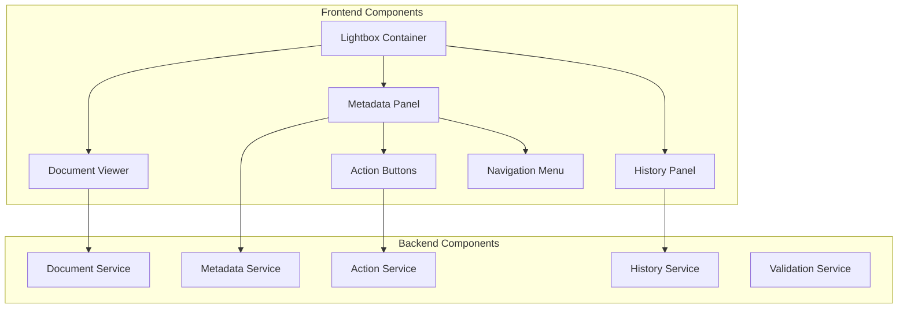
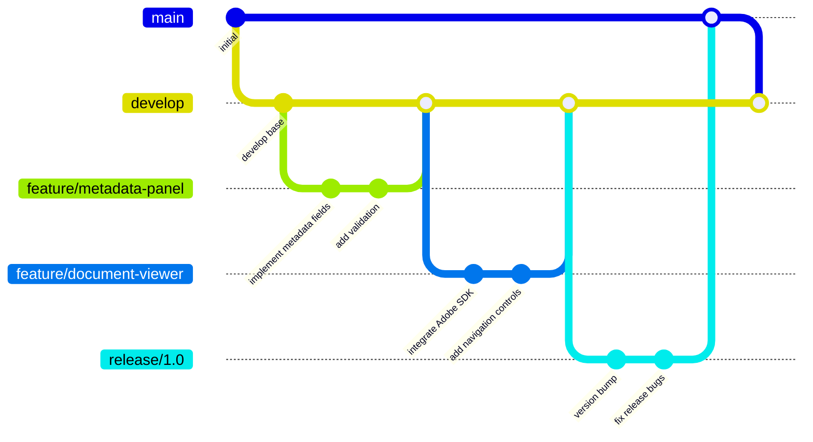
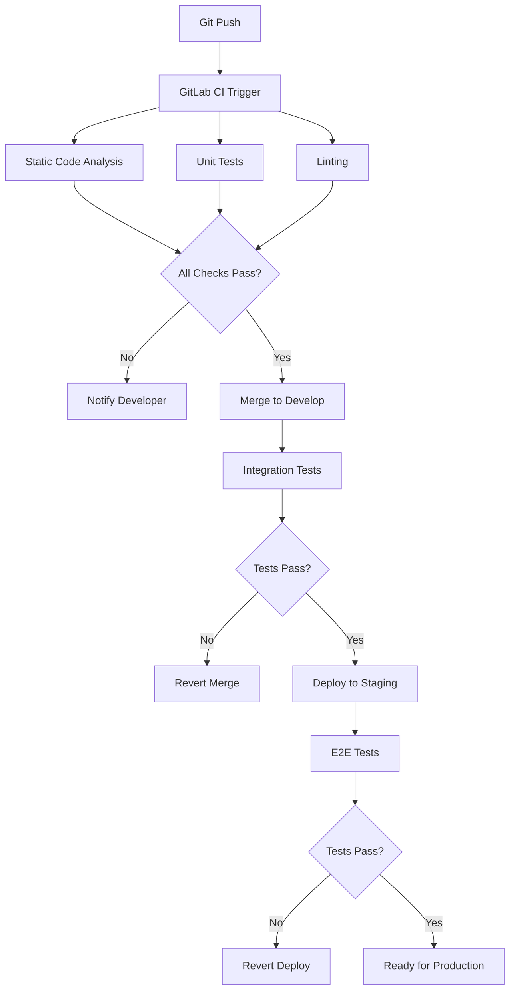
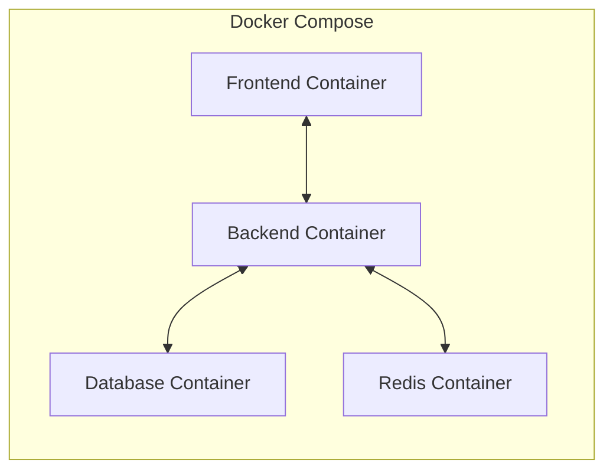
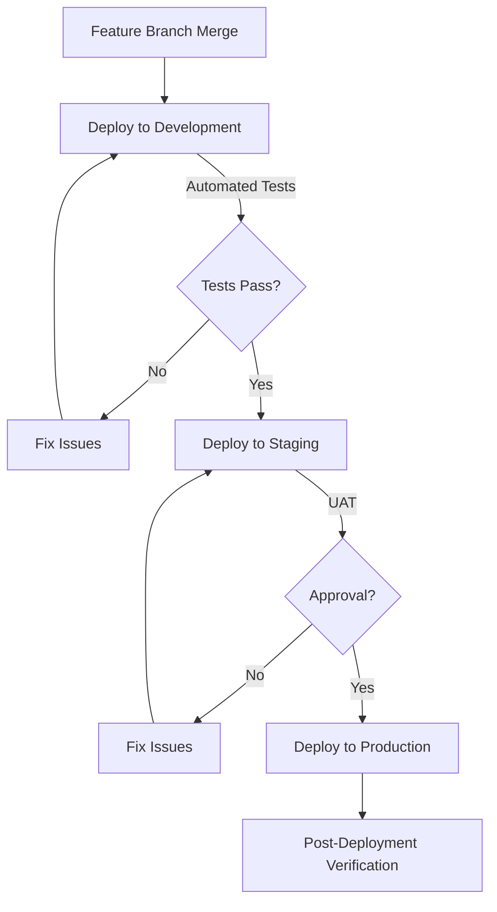

# Documents View Development Guide

## 1. Introduction

### 1.1 Purpose and Scope

This document serves as a comprehensive guide for developers working on the Documents View feature for Insure Pilot. It provides detailed instructions for setting up development environments, coding standards, workflow processes, and best practices for both frontend and backend development.

The Documents View feature provides a dedicated, full-screen environment for users to review, process, and manage insurance-related documents. This guide will help you understand how to develop and maintain this feature according to the project's standards and requirements.

### 1.2 Feature Overview

The Documents View follows a dual-panel layout:
- **Left panel**: Document display using Adobe Acrobat PDF viewer
- **Right panel**: Metadata fields, actions, and utility links

Key functionality includes:
- Document viewing and navigation
- Metadata editing with dynamic field dependencies
- Document processing actions (mark as processed, trash)
- Document history tracking and display
- Contextual navigation to related records

### 1.3 Development Philosophy

The development of the Documents View feature follows these principles:

- **Separation of Concerns**: Clear distinction between document viewing, metadata management, and processing actions
- **Maintainable Code**: Well-structured, documented, and tested code
- **Performance Focus**: Optimized for quick document loading and responsive user interactions
- **Accessibility**: WCAG 2.1 AA compliance for all user interfaces
- **Security by Design**: Authentication, authorization, and data protection at all levels

## 2. Development Environment Setup

### 2.1 System Requirements

Before you begin development, ensure your system meets the following requirements:

#### For Backend Development:
- PHP 8.2 or higher
- Composer
- MariaDB 10.6+
- Redis 7.x

#### For Frontend Development:
- Node.js 16.x or higher
- npm 8.x or higher

#### For Local Environment:
- Docker and Docker Compose
- Git
- IDE with PHP and JavaScript support (VS Code or PhpStorm recommended)

### 2.2 Backend Setup

Follow these steps to set up the backend development environment:

1. Clone the repository:
   ```bash
   git clone https://github.com/insurepilot/documents-view.git
   cd documents-view
   ```

2. Navigate to the backend directory:
   ```bash
   cd src/backend
   ```

3. Install dependencies:
   ```bash
   composer install
   ```

4. Copy the environment file:
   ```bash
   cp .env.example .env
   ```

5. Generate application key:
   ```bash
   php artisan key:generate
   ```

6. Configure database connection in `.env`:
   ```
   DB_CONNECTION=mysql
   DB_HOST=127.0.0.1
   DB_PORT=3306
   DB_DATABASE=insurepilot_documents
   DB_USERNAME=root
   DB_PASSWORD=
   ```

7. Run migrations:
   ```bash
   php artisan migrate
   ```

8. Seed the database:
   ```bash
   php artisan db:seed
   ```

9. Start the development server:
   ```bash
   php artisan serve
   ```

The backend API will be available at `http://localhost:8000`.

### 2.3 Frontend Setup

Follow these steps to set up the frontend development environment:

1. From the project root, navigate to the frontend directory:
   ```bash
   cd src/web
   ```

2. Install dependencies:
   ```bash
   npm install
   ```

3. Copy the environment file:
   ```bash
   cp .env.example .env
   ```

4. Configure environment variables in `.env`:
   ```
   REACT_APP_API_URL=http://localhost:8000/api
   REACT_APP_ADOBE_SDK_URL=https://documentcloud.adobe.com/view-sdk/main.js
   ```

5. Start the development server:
   ```bash
   npm start
   ```

The frontend application will be available at `http://localhost:3000`.

### 2.4 Docker Development Environment

For a containerized development environment, use Docker:

1. From the project root, build and start containers:
   ```bash
   docker-compose up -d
   ```

2. The services will be available at:
   - Frontend: `http://localhost:3000`
   - Backend API: `http://localhost:8000`
   - Database: `localhost:3306`
   - Redis: `localhost:6379`

3. To run commands inside containers:
   ```bash
   # For backend container
   docker-compose exec backend php artisan migrate
   
   # For frontend container
   docker-compose exec frontend npm test
   ```

### 2.5 IDE Configuration

#### VS Code

Recommended extensions for VS Code:
- PHP Intelephense
- Laravel Blade Snippets
- ESLint
- Prettier - Code formatter
- React Developer Tools
- Docker

Recommended workspace settings (`settings.json`):
```json
{
  "editor.formatOnSave": true,
  "editor.codeActionsOnSave": {
    "source.fixAll.eslint": true
  },
  "prettier.singleQuote": true,
  "prettier.trailingComma": "es5",
  "php.suggest.basic": false,
  "intelephense.files.maxSize": 5000000
}
```

#### PhpStorm

Recommended plugins for PhpStorm:
- Laravel Plugin
- Symfony Plugin
- React devtools
- ESLint
- Prettier

Configure code styles:
- PHP: PSR-12
- JavaScript: Airbnb JavaScript Style Guide

## 3. Architecture Overview

The Documents View feature follows a layered architecture with clear separation between frontend and backend components. For a comprehensive understanding of the system architecture, refer to the [Architecture Documentation](./architecture.md).

### 3.1 Component Structure

The Documents View consists of several key components:



### 3.2 Data Flow

The general data flow in the Documents View feature:

1. User selects a document, triggering a request to the backend
2. Backend retrieves document metadata and file information
3. Frontend renders the document using Adobe PDF Viewer and displays metadata
4. User interactions (editing metadata, processing document) trigger API calls
5. Backend processes requests, updates database, and returns responses
6. Frontend updates UI based on responses

### 3.3 Key Technologies

The Documents View is built using the following key technologies:

| Layer | Technologies |
|-------|--------------|
| Frontend | React 18.x, Adobe Acrobat PDF SDK, Minimal UI Kit, Tailwind CSS |
| Backend | Laravel 10.x, Laravel Sanctum |
| Database | MariaDB 10.6+ |
| Caching | Redis 7.x |
| Containerization | Docker, Kubernetes |
| CI/CD | GitLab CI/CD |
| Monitoring | LGTM Stack (Loki, Grafana, Tempo, Mimir) |

## 4. Backend Development

### 4.1 Project Structure

The backend follows Laravel's standard directory structure with some additional organization for the Documents View feature:

```
src/backend/
├── app/
│   ├── Http/
│   │   ├── Controllers/
│   │   │   ├── DocumentController.php
│   │   │   ├── DocumentActionController.php
│   │   │   ├── DocumentHistoryController.php
│   │   │   └── ...
│   │   ├── Requests/
│   │   │   ├── DocumentUpdateRequest.php
│   │   │   ├── DocumentProcessRequest.php
│   │   │   └── ...
│   │   └── Resources/
│   │       ├── DocumentResource.php
│   │       ├── DocumentHistoryResource.php
│   │       └── ...
│   ├── Models/
│   │   ├── Document.php
│   │   ├── Action.php
│   │   ├── File.php
│   │   └── ...
│   ├── Services/
│   │   ├── DocumentManager.php
│   │   ├── MetadataManager.php
│   │   ├── ActionLogger.php
│   │   └── ...
│   ├── Events/
│   │   ├── DocumentCreated.php
│   │   ├── DocumentUpdated.php
│   │   ├── DocumentProcessed.php
│   │   └── ...
│   └── Listeners/
│       ├── LogDocumentAction.php
│       ├── UpdateSearchIndex.php
│       └── ...
├── config/
├── database/
│   ├── migrations/
│   │   ├── ..._create_documents_table.php
│   │   ├── ..._create_actions_table.php
│   │   └── ...
│   └── seeders/
├── routes/
│   └── api.php
└── tests/
    ├── Unit/
    │   ├── DocumentManagerTest.php
    │   └── ...
    └── Feature/
        ├── DocumentAPITest.php
        └── ...
```

### 4.2 Coding Standards

The backend code follows the PSR-12 coding standard. Key guidelines include:

- Use namespaces according to PSR-4 autoloading
- Follow Laravel naming conventions for controllers, models, etc.
- Use type hints and return type declarations
- Document classes and methods with PHPDoc comments
- Use dependency injection instead of static method calls
- Keep controllers thin, moving business logic to services
- Use repository pattern for database interactions

#### Example Controller:

```php
<?php

namespace App\Http\Controllers;

use App\Http\Requests\DocumentUpdateRequest;
use App\Http\Resources\DocumentResource;
use App\Services\DocumentManager;
use Illuminate\Http\JsonResponse;

class DocumentController extends Controller
{
    private DocumentManager $documentManager;
    
    public function __construct(DocumentManager $documentManager)
    {
        $this->documentManager = $documentManager;
    }
    
    /**
     * Update document metadata.
     *
     * @param DocumentUpdateRequest $request
     * @param int $id
     * @return JsonResponse
     */
    public function update(DocumentUpdateRequest $request, int $id): JsonResponse
    {
        $document = $this->documentManager->updateMetadata(
            $id,
            $request->validated()
        );
        
        return response()->json([
            'data' => new DocumentResource($document),
            'message' => 'Document updated successfully',
        ]);
    }
}
```

### 4.3 API Development

Follow these guidelines when developing API endpoints:

- Use resource controllers for standard CRUD operations
- Implement form request classes for validation
- Use API resources for response transformation
- Follow RESTful conventions for endpoints and HTTP methods
- Implement proper error handling with appropriate status codes
- Document all endpoints using PHPDoc comments

#### API Response Format:

Success responses:
```json
{
  "data": {
    "id": 1,
    "name": "Policy_Renewal_Notice.pdf",
    "description": "Policy renewal document",
    "status": "unprocessed",
    "created_at": "2023-05-10T09:15:00Z",
    "updated_at": "2023-05-12T10:45:00Z"
  },
  "message": "Document retrieved successfully"
}
```

Error responses:
```json
{
  "message": "Validation failed",
  "errors": {
    "policy_id": ["The selected policy is invalid."],
    "document_description": ["The document description field is required."]
  }
}
```

### 4.4 Database Interactions

For database interactions:

- Use Eloquent ORM for most database operations
- Create model relationships to reflect database schema
- Use database transactions for operations affecting multiple tables
- Implement repository pattern for complex queries
- Follow Laravel's migration and seeder patterns for database changes

#### Model Relationships Example:

```php
<?php

namespace App\Models;

use Illuminate\Database\Eloquent\Model;
use Illuminate\Database\Eloquent\Relations\BelongsTo;
use Illuminate\Database\Eloquent\Relations\HasMany;

class Document extends Model
{
    protected $fillable = [
        'name',
        'description',
        'policy_id',
        'loss_id',
        'claimant_id',
        'producer_id',
        'status_id',
    ];
    
    public function policy(): BelongsTo
    {
        return $this->belongsTo(Policy::class);
    }
    
    public function loss(): BelongsTo
    {
        return $this->belongsTo(Loss::class);
    }
    
    public function actions(): HasMany
    {
        return $this->hasMany(Action::class, 'document_id');
    }
    
    public function files(): HasMany
    {
        return $this->hasMany(File::class, 'document_id');
    }
}
```

### 4.5 Service Layer

Use services to encapsulate business logic:

- Create dedicated service classes for specific domains
- Inject dependencies via constructor
- Use interfaces for interchangeable implementations
- Document public methods with PHPDoc
- Handle exceptions appropriately
- Emit events for important state changes

#### Example Service:

```php
<?php

namespace App\Services;

use App\Events\DocumentProcessed;
use App\Models\Document;
use App\Repositories\DocumentRepository;
use Illuminate\Support\Facades\DB;
use Illuminate\Support\Facades\Auth;

class DocumentManager
{
    private DocumentRepository $documentRepository;
    private ActionLogger $actionLogger;
    
    public function __construct(
        DocumentRepository $documentRepository,
        ActionLogger $actionLogger
    ) {
        $this->documentRepository = $documentRepository;
        $this->actionLogger = $actionLogger;
    }
    
    /**
     * Mark document as processed or unprocessed.
     *
     * @param int $documentId
     * @param bool $processed
     * @return Document
     */
    public function processDocument(int $documentId, bool $processed = true): Document
    {
        return DB::transaction(function () use ($documentId, $processed) {
            $status = $processed ? Document::STATUS_PROCESSED : Document::STATUS_UNPROCESSED;
            $document = $this->documentRepository->updateStatus($documentId, $status);
            
            $this->actionLogger->logAction(
                $document->id,
                $processed ? 'process' : 'unprocess',
                'Document marked as ' . ($processed ? 'processed' : 'unprocessed')
            );
            
            event(new DocumentProcessed($document, Auth::id(), $processed));
            
            return $document;
        });
    }
}
```

### 4.6 Event System

Use Laravel's event system for:

- Decoupling components with publish-subscribe pattern
- Audit logging
- Notifications
- Background processing
- Cross-cutting concerns

#### Example Event and Listener:

```php
<?php

namespace App\Events;

use App\Models\Document;
use Illuminate\Foundation\Events\Dispatchable;
use Illuminate\Queue\SerializesModels;

class DocumentProcessed
{
    use Dispatchable, SerializesModels;
    
    public Document $document;
    public int $userId;
    public bool $processed;
    
    public function __construct(Document $document, int $userId, bool $processed)
    {
        $this->document = $document;
        $this->userId = $userId;
        $this->processed = $processed;
    }
}
```

```php
<?php

namespace App\Listeners;

use App\Events\DocumentProcessed;
use App\Services\NotificationService;

class SendDocumentProcessedNotification
{
    private NotificationService $notificationService;
    
    public function __construct(NotificationService $notificationService)
    {
        $this->notificationService = $notificationService;
    }
    
    public function handle(DocumentProcessed $event): void
    {
        if ($event->processed) {
            $this->notificationService->notifyDocumentProcessed(
                $event->document,
                $event->userId
            );
        }
    }
}
```

### 4.7 Testing

Backend testing follows these principles:

- Unit tests for isolated component testing
- Feature tests for API endpoint testing
- Database tests for repository testing
- Use test doubles (mocks, stubs) for external dependencies
- Test both happy path and edge cases
- Follow AAA pattern (Arrange-Act-Assert)

#### Example Test:

```php
<?php

namespace Tests\Unit;

use App\Models\Document;
use App\Repositories\DocumentRepository;
use App\Services\ActionLogger;
use App\Services\DocumentManager;
use Illuminate\Foundation\Testing\RefreshDatabase;
use Mockery;
use Tests\TestCase;

class DocumentManagerTest extends TestCase
{
    use RefreshDatabase;
    
    public function testProcessDocument(): void
    {
        // Arrange
        $document = Document::factory()->create(['status_id' => Document::STATUS_UNPROCESSED]);
        
        $documentRepository = Mockery::mock(DocumentRepository::class);
        $documentRepository->shouldReceive('updateStatus')
            ->once()
            ->with($document->id, Document::STATUS_PROCESSED)
            ->andReturn($document);
        
        $actionLogger = Mockery::mock(ActionLogger::class);
        $actionLogger->shouldReceive('logAction')
            ->once()
            ->with($document->id, 'process', Mockery::any())
            ->andReturn(true);
        
        $documentManager = new DocumentManager($documentRepository, $actionLogger);
        
        // Act
        $result = $documentManager->processDocument($document->id, true);
        
        // Assert
        $this->assertEquals($document->id, $result->id);
        $this->assertEquals(Document::STATUS_PROCESSED, $document->status_id);
    }
}
```

## 5. Frontend Development

### 5.1 Project Structure

The frontend follows a component-based structure using React:

```
src/web/
├── public/
├── src/
│   ├── components/
│   │   ├── DocumentViewer/
│   │   │   ├── index.js
│   │   │   ├── DocumentDisplay.js
│   │   │   ├── MetadataPanel.js
│   │   │   ├── HistoryPanel.js
│   │   │   ├── ActionButtons.js
│   │   │   └── ...
│   │   ├── shared/
│   │   │   ├── DropdownControl.js
│   │   │   ├── LoadingIndicator.js
│   │   │   └── ...
│   │   └── ...
│   ├── context/
│   │   ├── DocumentContext.js
│   │   ├── AuthContext.js
│   │   └── ...
│   ├── services/
│   │   ├── api.js
│   │   ├── documentService.js
│   │   ├── metadataService.js
│   │   └── ...
│   ├── hooks/
│   │   ├── useDocument.js
│   │   ├── useMetadata.js
│   │   └── ...
│   ├── utils/
│   │   ├── validators.js
│   │   ├── formatters.js
│   │   └── ...
│   ├── styles/
│   ├── App.js
│   └── index.js
├── package.json
└── ...
```

### 5.2 Component Development

Follow these guidelines for developing React components:

- Use functional components with hooks instead of class components
- Keep components focused on a single responsibility
- Split large components into smaller, reusable ones
- Use prop types or TypeScript for type checking
- Follow the container/presentational pattern where appropriate
- Document component props and behavior with JSDoc comments

#### Example Component:

```jsx
import React, { useState, useEffect } from 'react';
import PropTypes from 'prop-types';
import { useDocument } from '../../hooks/useDocument';
import LoadingIndicator from '../shared/LoadingIndicator';
import ErrorMessage from '../shared/ErrorMessage';

/**
 * MetadataPanel displays and manages document metadata in the right panel.
 * 
 * @component
 */
const MetadataPanel = ({ documentId, onProcessDocument }) => {
  const { document, loading, error, updateMetadata } = useDocument(documentId);
  const [isSaving, setIsSaving] = useState(false);
  const [formData, setFormData] = useState({});
  
  useEffect(() => {
    if (document) {
      setFormData({
        policy_id: document.policy_id || '',
        loss_id: document.loss_id || '',
        claimant_id: document.claimant_id || '',
        description: document.description || '',
      });
    }
  }, [document]);
  
  const handleChange = (field, value) => {
    setFormData(prev => ({
      ...prev,
      [field]: value
    }));
    
    setIsSaving(true);
    updateMetadata({ [field]: value })
      .finally(() => setIsSaving(false));
  };
  
  if (loading) return <LoadingIndicator />;
  if (error) return <ErrorMessage message={error} />;
  if (!document) return null;
  
  return (
    <div className="metadata-panel">
      <h2>Document Metadata</h2>
      
      {/* Form fields */}
      <div className="field-group">
        <label htmlFor="policy_id">Policy Number</label>
        <select
          id="policy_id"
          value={formData.policy_id}
          onChange={(e) => handleChange('policy_id', e.target.value)}
          disabled={document.is_processed}
        >
          {/* Policy options */}
        </select>
      </div>
      
      {/* More fields */}
      
      <div className="actions">
        <button 
          onClick={() => onProcessDocument(documentId, !document.is_processed)}
          className="btn btn-primary"
        >
          {document.is_processed ? 'Unprocess' : 'Mark as Processed'}
        </button>
      </div>
      
      <div className="status">
        {isSaving ? 'Saving...' : 'Saved'}
      </div>
    </div>
  );
};

MetadataPanel.propTypes = {
  documentId: PropTypes.number.isRequired,
  onProcessDocument: PropTypes.func.isRequired
};

export default MetadataPanel;
```

### 5.3 State Management

For state management in the Documents View feature:

- Use local component state (useState) for component-specific state
- Use Context API for shared state across components
- Consider React Query for server state management
- Avoid unnecessary state - derive values when possible
- Use reducers (useReducer) for complex state logic

#### Example Context:

```jsx
import React, { createContext, useContext, useReducer } from 'react';

// Define initial state
const initialState = {
  document: null,
  metadata: {},
  isProcessed: false,
  isSaving: false,
  error: null
};

// Define actions
const actions = {
  SET_DOCUMENT: 'SET_DOCUMENT',
  UPDATE_METADATA: 'UPDATE_METADATA',
  SET_PROCESSED: 'SET_PROCESSED',
  SET_SAVING: 'SET_SAVING',
  SET_ERROR: 'SET_ERROR'
};

// Create reducer
const documentReducer = (state, action) => {
  switch (action.type) {
    case actions.SET_DOCUMENT:
      return {
        ...state,
        document: action.payload,
        metadata: action.payload.metadata || {},
        isProcessed: action.payload.is_processed || false,
        error: null
      };
    case actions.UPDATE_METADATA:
      return {
        ...state,
        metadata: {
          ...state.metadata,
          ...action.payload
        }
      };
    case actions.SET_PROCESSED:
      return {
        ...state,
        isProcessed: action.payload
      };
    case actions.SET_SAVING:
      return {
        ...state,
        isSaving: action.payload
      };
    case actions.SET_ERROR:
      return {
        ...state,
        error: action.payload
      };
    default:
      return state;
  }
};

// Create context
const DocumentContext = createContext();

// Create provider
export const DocumentProvider = ({ children }) => {
  const [state, dispatch] = useReducer(documentReducer, initialState);
  
  // Define context value
  const value = {
    ...state,
    setDocument: (document) => {
      dispatch({ type: actions.SET_DOCUMENT, payload: document });
    },
    updateMetadata: (metadata) => {
      dispatch({ type: actions.UPDATE_METADATA, payload: metadata });
    },
    setProcessed: (processed) => {
      dispatch({ type: actions.SET_PROCESSED, payload: processed });
    },
    setSaving: (saving) => {
      dispatch({ type: actions.SET_SAVING, payload: saving });
    },
    setError: (error) => {
      dispatch({ type: actions.SET_ERROR, payload: error });
    }
  };
  
  return (
    <DocumentContext.Provider value={value}>
      {children}
    </DocumentContext.Provider>
  );
};

// Create hook
export const useDocumentContext = () => {
  const context = useContext(DocumentContext);
  if (!context) {
    throw new Error('useDocumentContext must be used within a DocumentProvider');
  }
  return context;
};
```

### 5.4 API Integration

For API integration:

- Use axios for HTTP requests
- Create service modules for API interactions
- Handle loading states and errors properly
- Implement request cancellation for long-running or abandoned requests
- Consider using React Query for data fetching and caching

#### Example API Service:

```jsx
import axios from 'axios';

const API_URL = process.env.REACT_APP_API_URL;

// Create axios instance
const apiClient = axios.create({
  baseURL: API_URL,
  headers: {
    'Content-Type': 'application/json',
    'Accept': 'application/json'
  }
});

// Add request interceptor for auth
apiClient.interceptors.request.use(
  (config) => {
    const token = localStorage.getItem('auth_token');
    if (token) {
      config.headers.Authorization = `Bearer ${token}`;
    }
    return config;
  },
  (error) => Promise.reject(error)
);

// Add response interceptor for errors
apiClient.interceptors.response.use(
  (response) => response,
  (error) => {
    if (error.response && error.response.status === 401) {
      // Handle unauthorized access
      localStorage.removeItem('auth_token');
      window.location.href = '/login';
    }
    return Promise.reject(error);
  }
);

// Document service
const documentService = {
  /**
   * Get document by ID
   * 
   * @param {number} id - Document ID
   * @returns {Promise} - Promise with document data
   */
  getDocument: (id) => {
    return apiClient.get(`/documents/${id}`)
      .then(response => response.data.data);
  },
  
  /**
   * Update document metadata
   * 
   * @param {number} id - Document ID
   * @param {object} metadata - Metadata fields to update
   * @returns {Promise} - Promise with updated document data
   */
  updateMetadata: (id, metadata) => {
    return apiClient.put(`/documents/${id}/metadata`, metadata)
      .then(response => response.data.data);
  },
  
  /**
   * Process or unprocess document
   * 
   * @param {number} id - Document ID
   * @param {boolean} processed - Process state
   * @returns {Promise} - Promise with updated document data
   */
  processDocument: (id, processed = true) => {
    return apiClient.post(`/documents/${id}/process`, { processed })
      .then(response => response.data.data);
  },
  
  /**
   * Move document to trash
   * 
   * @param {number} id - Document ID
   * @returns {Promise} - Promise with response data
   */
  trashDocument: (id) => {
    return apiClient.post(`/documents/${id}/trash`)
      .then(response => response.data);
  },
  
  /**
   * Get document history
   * 
   * @param {number} id - Document ID
   * @returns {Promise} - Promise with history data
   */
  getDocumentHistory: (id) => {
    return apiClient.get(`/documents/${id}/history`)
      .then(response => response.data.data);
  }
};

export default documentService;
```

### 5.5 Adobe PDF Viewer Integration

For integrating the Adobe Acrobat PDF Viewer:

- Load the Adobe Acrobat PDF SDK asynchronously
- Create a wrapper component for PDF viewing
- Handle loading and error states
- Implement document navigation controls
- Ensure proper cleanup to prevent memory leaks

#### Example Adobe PDF Viewer Integration:

```jsx
import React, { useEffect, useRef, useState } from 'react';
import PropTypes from 'prop-types';
import LoadingIndicator from '../shared/LoadingIndicator';

const ADOBE_SDK_URL = process.env.REACT_APP_ADOBE_SDK_URL;

/**
 * DocumentDisplay renders PDF documents using Adobe Acrobat SDK.
 * 
 * @component
 */
const DocumentDisplay = ({ documentUrl, filename }) => {
  const containerRef = useRef(null);
  const [isLoading, setIsLoading] = useState(true);
  const [error, setError] = useState(null);
  const [adobeDCView, setAdobeDCView] = useState(null);
  
  useEffect(() => {
    // Load Adobe SDK
    const loadAdobeSDK = async () => {
      try {
        if (window.AdobeDC) {
          initializeViewer();
          return;
        }
        
        const script = document.createElement('script');
        script.src = ADOBE_SDK_URL;
        script.onload = initializeViewer;
        script.onerror = () => setError('Failed to load Adobe PDF viewer');
        document.head.appendChild(script);
      } catch (error) {
        setError('Error initializing PDF viewer');
        setIsLoading(false);
      }
    };
    
    // Initialize PDF viewer
    const initializeViewer = () => {
      try {
        const adobeDCView = new window.AdobeDC.View({
          clientId: process.env.REACT_APP_ADOBE_CLIENT_ID,
          divId: 'adobe-dc-view'
        });
        
        setAdobeDCView(adobeDCView);
        
        adobeDCView.previewFile({
          content: { location: { url: documentUrl } },
          metaData: { fileName: filename }
        }, {
          embedMode: 'SIZED_CONTAINER',
          showDownloadPDF: false,
          showPrintPDF: false,
          showLeftHandPanel: false,
          dockPageControls: true
        });
        
        setIsLoading(false);
      } catch (error) {
        setError('Error initializing PDF viewer');
        setIsLoading(false);
      }
    };
    
    loadAdobeSDK();
    
    // Cleanup
    return () => {
      if (adobeDCView) {
        try {
          // Clean up Adobe DC View if possible
          if (adobeDCView.previewFile) {
            // Adobe doesn't provide a standard way to destroy instances,
            // but we can remove the content
            const container = document.getElementById('adobe-dc-view');
            if (container) {
              container.innerHTML = '';
            }
          }
        } catch (error) {
          console.error('Error during cleanup:', error);
        }
      }
    };
  }, [documentUrl, filename]);
  
  if (error) {
    return (
      <div className="document-display-error">
        <p>Error: {error}</p>
        <p>Please refresh the page or try again later.</p>
      </div>
    );
  }
  
  return (
    <div className="document-display">
      <div className="document-header">
        <h3>{filename}</h3>
      </div>
      
      <div className="document-content">
        {isLoading && <LoadingIndicator />}
        <div 
          id="adobe-dc-view" 
          ref={containerRef} 
          className="adobe-dc-view"
        />
      </div>
    </div>
  );
};

DocumentDisplay.propTypes = {
  documentUrl: PropTypes.string.isRequired,
  filename: PropTypes.string.isRequired
};

export default DocumentDisplay;
```

### 5.6 Styling Guidelines

For styling components:

- Use Tailwind CSS for utility-based styling
- Follow BEM naming convention for custom CSS classes
- Use CSS modules for component-scoped styles
- Follow the Minimal UI Kit design system for consistency
- Implement responsive layouts for different screen sizes

#### Example Styling Approach:

```jsx
import React from 'react';
import PropTypes from 'prop-types';
import './DropdownControl.css'; // For global styles
import styles from './DropdownControl.module.css'; // For component-scoped styles

/**
 * DropdownControl provides type-ahead filtering for dropdown fields.
 * 
 * @component
 */
const DropdownControl = ({ 
  label, 
  options, 
  value, 
  onChange, 
  disabled,
  error
}) => {
  return (
    <div className={`field-group ${disabled ? 'field-group--disabled' : ''}`}>
      <label className="field-label" htmlFor={label}>
        {label}
      </label>
      
      <div className={styles.dropdownContainer}>
        <select
          id={label}
          className={`field-select ${error ? 'field-select--error' : ''}`}
          value={value}
          onChange={(e) => onChange(e.target.value)}
          disabled={disabled}
        >
          <option value="">Select {label}</option>
          {options.map(option => (
            <option key={option.value} value={option.value}>
              {option.label}
            </option>
          ))}
        </select>
        
        {error && (
          <div className="field-error">{error}</div>
        )}
      </div>
    </div>
  );
};

DropdownControl.propTypes = {
  label: PropTypes.string.isRequired,
  options: PropTypes.arrayOf(
    PropTypes.shape({
      value: PropTypes.oneOfType([PropTypes.string, PropTypes.number]).isRequired,
      label: PropTypes.string.isRequired
    })
  ).isRequired,
  value: PropTypes.oneOfType([PropTypes.string, PropTypes.number]),
  onChange: PropTypes.func.isRequired,
  disabled: PropTypes.bool,
  error: PropTypes.string
};

DropdownControl.defaultProps = {
  value: '',
  disabled: false,
  error: null
};

export default DropdownControl;
```

### 5.7 Accessibility Requirements

The Documents View feature must be WCAG 2.1 AA compliant. Follow these guidelines:

- Semantic HTML: Use appropriate HTML elements for their intended purpose
- Keyboard navigation: Ensure all interactive elements are keyboard accessible
- Focus management: Provide visible focus indicators and logical tab order
- Screen reader support: Include proper ARIA attributes and labels
- Color contrast: Maintain sufficient contrast ratios for text and UI elements
- Error handling: Provide clear error messages and instructions
- Form accessibility: Associate labels with form controls and provide feedback

#### Accessibility Implementation Example:

```jsx
import React, { useRef, useEffect } from 'react';
import PropTypes from 'prop-types';

/**
 * Modal dialog component with accessibility features.
 * 
 * @component
 */
const AccessibleModal = ({ isOpen, onClose, title, children }) => {
  const modalRef = useRef(null);
  const previousFocusRef = useRef(null);
  
  // Store previous focus element when modal opens
  useEffect(() => {
    if (isOpen) {
      previousFocusRef.current = document.activeElement;
    }
  }, [isOpen]);
  
  // Restore focus when modal closes
  useEffect(() => {
    return () => {
      if (previousFocusRef.current) {
        previousFocusRef.current.focus();
      }
    };
  }, []);
  
  // Focus trap inside modal
  useEffect(() => {
    if (!isOpen) return;
    
    const focusableElements = modalRef.current.querySelectorAll(
      'button, [href], input, select, textarea, [tabindex]:not([tabindex="-1"])'
    );
    
    const firstElement = focusableElements[0];
    const lastElement = focusableElements[focusableElements.length - 1];
    
    const handleTabKey = (e) => {
      if (e.key === 'Tab') {
        if (e.shiftKey && document.activeElement === firstElement) {
          e.preventDefault();
          lastElement.focus();
        } else if (!e.shiftKey && document.activeElement === lastElement) {
          e.preventDefault();
          firstElement.focus();
        }
      }
    };
    
    // Handle Escape key
    const handleEscapeKey = (e) => {
      if (e.key === 'Escape') {
        onClose();
      }
    };
    
    const modal = modalRef.current;
    modal.addEventListener('keydown', handleTabKey);
    modal.addEventListener('keydown', handleEscapeKey);
    
    // Focus first element on open
    if (firstElement) {
      firstElement.focus();
    }
    
    return () => {
      modal.removeEventListener('keydown', handleTabKey);
      modal.removeEventListener('keydown', handleEscapeKey);
    };
  }, [isOpen, onClose]);
  
  if (!isOpen) return null;
  
  return (
    <div 
      className="modal-overlay" 
      role="dialog"
      aria-modal="true"
      aria-labelledby="modal-title"
    >
      <div className="modal-content" ref={modalRef}>
        <div className="modal-header">
          <h2 id="modal-title">{title}</h2>
          <button 
            className="modal-close"
            onClick={onClose}
            aria-label="Close modal"
          >
            ×
          </button>
        </div>
        <div className="modal-body">
          {children}
        </div>
      </div>
    </div>
  );
};

AccessibleModal.propTypes = {
  isOpen: PropTypes.bool.isRequired,
  onClose: PropTypes.func.isRequired,
  title: PropTypes.string.isRequired,
  children: PropTypes.node.isRequired
};

export default AccessibleModal;
```

### 5.8 Testing

Frontend testing follows these principles:

- Unit tests for individual components and hooks
- Integration tests for component interactions
- End-to-end tests for full user workflows
- Accessibility testing with automated tools and manual verification
- Use React Testing Library for component testing
- Use Jest for unit and integration tests
- Use Playwright for end-to-end tests

#### Example Component Test:

```jsx
import React from 'react';
import { render, screen, fireEvent, waitFor } from '@testing-library/react';
import MetadataPanel from './MetadataPanel';
import { DocumentProvider } from '../../context/DocumentContext';
import documentService from '../../services/documentService';

// Mock document service
jest.mock('../../services/documentService');

describe('MetadataPanel', () => {
  const mockDocument = {
    id: 1,
    name: 'test.pdf',
    policy_id: '123',
    is_processed: false
  };
  
  const mockProcessDocument = jest.fn();
  
  beforeEach(() => {
    // Reset mocks
    jest.clearAllMocks();
    
    // Setup mocks
    documentService.getDocument.mockResolvedValue(mockDocument);
    documentService.updateMetadata.mockResolvedValue({
      ...mockDocument,
      policy_id: '456'
    });
  });
  
  it('renders document metadata', async () => {
    render(
      <DocumentProvider>
        <MetadataPanel 
          documentId={1} 
          onProcessDocument={mockProcessDocument} 
        />
      </DocumentProvider>
    );
    
    // Wait for document to load
    await waitFor(() => {
      expect(screen.getByText('Document Metadata')).toBeInTheDocument();
    });
    
    // Check if policy field is displayed with correct value
    expect(screen.getByLabelText('Policy Number')).toHaveValue('123');
    
    // Check if process button is displayed
    expect(screen.getByText('Mark as Processed')).toBeInTheDocument();
  });
  
  it('updates metadata when field changes', async () => {
    render(
      <DocumentProvider>
        <MetadataPanel 
          documentId={1} 
          onProcessDocument={mockProcessDocument} 
        />
      </DocumentProvider>
    );
    
    // Wait for document to load
    await waitFor(() => {
      expect(screen.getByLabelText('Policy Number')).toBeInTheDocument();
    });
    
    // Change policy number
    fireEvent.change(screen.getByLabelText('Policy Number'), {
      target: { value: '456' }
    });
    
    // Check if service was called with correct values
    expect(documentService.updateMetadata).toHaveBeenCalledWith(1, {
      policy_id: '456'
    });
    
    // Check if saving indicator is shown
    expect(screen.getByText('Saving...')).toBeInTheDocument();
    
    // Wait for save to complete
    await waitFor(() => {
      expect(screen.getByText('Saved')).toBeInTheDocument();
    });
  });
  
  it('calls process document when button is clicked', async () => {
    render(
      <DocumentProvider>
        <MetadataPanel 
          documentId={1} 
          onProcessDocument={mockProcessDocument} 
        />
      </DocumentProvider>
    );
    
    // Wait for document to load
    await waitFor(() => {
      expect(screen.getByText('Mark as Processed')).toBeInTheDocument();
    });
    
    // Click process button
    fireEvent.click(screen.getByText('Mark as Processed'));
    
    // Check if callback was called with correct values
    expect(mockProcessDocument).toHaveBeenCalledWith(1, true);
  });
});
```

## 6. API Reference

### 6.1 Authentication

All API requests must include authentication using Laravel Sanctum:

```
GET /api/documents/1
Authorization: Bearer {your_token}
Accept: application/json
```

To obtain a token:

```
POST /api/auth/login
Content-Type: application/json

{
  "email": "user@example.com",
  "password": "password"
}
```

Response:

```json
{
  "token": "your_auth_token",
  "user": {
    "id": 1,
    "name": "John Doe",
    "email": "user@example.com"
  }
}
```

### 6.2 Document Endpoints

| Endpoint | Method | Description | Authentication |
|----------|--------|-------------|----------------|
| `/api/documents/{id}` | GET | Retrieve document details | Required |
| `/api/documents/{id}/file` | GET | Download document file | Required |
| `/api/documents/{id}/metadata` | PUT | Update document metadata | Required |
| `/api/documents/{id}/process` | POST | Mark document as processed | Required |
| `/api/documents/{id}/trash` | POST | Move document to trash | Required |
| `/api/documents/{id}/history` | GET | Retrieve document history | Required |

#### Example Request/Response:

Get Document:
```
GET /api/documents/1
Authorization: Bearer {your_token}
Accept: application/json
```

Response:
```json
{
  "data": {
    "id": 1,
    "name": "Policy_Renewal_Notice.pdf",
    "description": "Policy renewal document",
    "policy_id": 123,
    "policy_number": "PLCY-12345",
    "loss_id": 456,
    "loss_sequence": "1 - Vehicle Accident (03/15/2023)",
    "claimant_id": 789,
    "claimant_name": "John Smith",
    "producer_id": 321,
    "producer_number": "AG-789456",
    "is_processed": false,
    "created_at": "2023-05-10T09:15:00Z",
    "updated_at": "2023-05-12T10:45:00Z",
    "file_url": "https://example.com/api/documents/1/file"
  }
}
```

Update Metadata:
```
PUT /api/documents/1/metadata
Authorization: Bearer {your_token}
Content-Type: application/json
Accept: application/json

{
  "policy_id": 124,
  "description": "Updated description"
}
```

Response:
```json
{
  "data": {
    "id": 1,
    "name": "Policy_Renewal_Notice.pdf",
    "description": "Updated description",
    "policy_id": 124,
    "policy_number": "PLCY-12346",
    "loss_id": 456,
    "loss_sequence": "1 - Vehicle Accident (03/15/2023)",
    "claimant_id": 789,
    "claimant_name": "John Smith",
    "producer_id": 321,
    "producer_number": "AG-789456",
    "is_processed": false,
    "created_at": "2023-05-10T09:15:00Z",
    "updated_at": "2023-05-12T11:30:00Z",
    "file_url": "https://example.com/api/documents/1/file"
  },
  "message": "Document updated successfully"
}
```

### 6.3 Metadata Endpoints

| Endpoint | Method | Description | Authentication |
|----------|--------|-------------|----------------|
| `/api/policies` | GET | Get policy options for dropdown | Required |
| `/api/policies/{id}/losses` | GET | Get losses for a policy | Required |
| `/api/losses/{id}/claimants` | GET | Get claimants for a loss | Required |
| `/api/producers` | GET | Get producer options | Required |

#### Example Request/Response:

Get Policies:
```
GET /api/policies
Authorization: Bearer {your_token}
Accept: application/json
```

Response:
```json
{
  "data": [
    {
      "id": 123,
      "number": "PLCY-12345",
      "effective_date": "2023-01-01"
    },
    {
      "id": 124,
      "number": "PLCY-12346",
      "effective_date": "2023-02-15"
    }
  ]
}
```

Get Losses for Policy:
```
GET /api/policies/123/losses
Authorization: Bearer {your_token}
Accept: application/json
```

Response:
```json
{
  "data": [
    {
      "id": 456,
      "sequence": 1,
      "description": "Vehicle Accident",
      "date": "2023-03-15"
    },
    {
      "id": 457,
      "sequence": 2,
      "description": "Property Damage",
      "date": "2023-04-10"
    }
  ]
}
```

### 6.4 History Endpoints

| Endpoint | Method | Description | Authentication |
|----------|--------|-------------|----------------|
| `/api/documents/{id}/history` | GET | Get document action history | Required |

#### Example Request/Response:

Get Document History:
```
GET /api/documents/1/history
Authorization: Bearer {your_token}
Accept: application/json
```

Response:
```json
{
  "data": [
    {
      "id": 101,
      "action_type": "process",
      "description": "Document marked as processed",
      "created_at": "2023-05-12T10:45:00Z",
      "user": {
        "id": 5,
        "name": "Sarah Johnson"
      }
    },
    {
      "id": 100,
      "action_type": "update",
      "description": "Changed Document Description from \"Policy Document\" to \"Policy Renewal Notice\"",
      "created_at": "2023-05-12T10:42:00Z",
      "user": {
        "id": 5,
        "name": "Sarah Johnson"
      }
    },
    {
      "id": 99,
      "action_type": "view",
      "description": "Document viewed",
      "created_at": "2023-05-12T10:40:00Z",
      "user": {
        "id": 5,
        "name": "Sarah Johnson"
      }
    },
    {
      "id": 98,
      "action_type": "create",
      "description": "Document uploaded",
      "created_at": "2023-05-10T09:15:00Z",
      "user": {
        "id": 1,
        "name": "System"
      }
    }
  ],
  "meta": {
    "total": 4,
    "per_page": 20,
    "current_page": 1,
    "last_page": 1
  }
}
```

### 6.5 Response Formats

All API responses follow a consistent format:

Success Response:
```json
{
  "data": { ... },
  "message": "Optional success message",
  "meta": {
    "pagination_info_if_applicable": "..."
  }
}
```

Error Response:
```json
{
  "message": "Error message",
  "errors": {
    "field_name": [
      "Error description"
    ]
  }
}
```

### 6.6 Error Handling

| HTTP Status Code | Meaning |
|------------------|---------|
| 200 OK | Request successful |
| 201 Created | Resource created successfully |
| 400 Bad Request | Invalid request parameters |
| 401 Unauthorized | Missing or invalid authentication |
| 403 Forbidden | Authentication valid but insufficient permissions |
| 404 Not Found | Resource not found |
| 422 Unprocessable Entity | Validation failed |
| 500 Server Error | Server-side error |

## 7. Development Workflow

### 7.1 Git Workflow

The Documents View feature follows a Git Flow-inspired workflow:



### 7.2 Branching Strategy

Follow these branching guidelines:

- **main**: Production code only, deployable at any time
- **develop**: Integration branch for feature development
- **feature/{feature-name}**: Individual feature branches
- **bugfix/{issue-number}**: Bug fix branches
- **release/{version}**: Release preparation branches
- **hotfix/{issue-number}**: Emergency fixes for production issues

### 7.3 Code Reviews

All code changes must go through code review before merging:

1. Create a pull request from your feature branch to develop
2. Ensure all CI checks pass (tests, linting, etc.)
3. Request review from at least one team member
4. Address all comments and feedback
5. Obtain approval before merging
6. Squash and merge to maintain clean history

#### Code Review Checklist:

- Does the code follow the project's coding standards?
- Are there appropriate tests covering the changes?
- Is the code well-documented and easy to understand?
- Does it meet accessibility requirements?
- Is error handling implemented properly?
- Are there any security concerns?
- Does it match the requirements and design specifications?

### 7.4 Pull Request Process

1. Create a feature branch from develop:
   ```bash
   git checkout develop
   git pull
   git checkout -b feature/document-metadata
   ```

2. Make your changes with appropriate commits:
   ```bash
   git add .
   git commit -m "feat(metadata): implement dynamic dropdown controls"
   ```

3. Push to remote and create pull request:
   ```bash
   git push -u origin feature/document-metadata
   ```

4. Fill out the pull request template with:
   - Description of changes
   - Link to related issues
   - Testing instructions
   - Screenshots (if applicable)
   - Checklist of completed items

5. Request reviews from appropriate team members

6. Address feedback with additional commits

7. Once approved, squash and merge your changes

### 7.5 CI/CD Pipeline

The Documents View feature uses GitLab CI/CD for automated testing and deployment:



CI/CD Pipeline Stages:

1. **Build**: Compile and build the application
2. **Test**: Run unit tests and static analysis
3. **Integration**: Run integration tests
4. **Deploy**: Deploy to appropriate environment
5. **E2E**: Run end-to-end tests on deployed application

## 8. Testing Strategy

### 8.1 Unit Testing

Unit tests focus on testing individual components and functions in isolation:

- Backend: PHPUnit for testing services, repositories, and controllers
- Frontend: Jest and React Testing Library for components and hooks

#### Backend Unit Testing Guidelines:

- Test each service method in isolation
- Mock dependencies using Mockery
- Test both happy path and error conditions
- Follow AAA pattern (Arrange-Act-Assert)
- Aim for 85%+ code coverage

#### Frontend Unit Testing Guidelines:

- Test component rendering and behavior
- Test hooks and utility functions
- Mock API calls and external dependencies
- Test user interactions
- Verify component state changes
- Aim for 80%+ code coverage

### 8.2 Integration Testing

Integration tests focus on testing how components work together:

- Backend: Feature tests for API endpoints and database interactions
- Frontend: Component integration tests for parent-child interactions

#### Backend Integration Testing Guidelines:

- Test API endpoints with HTTP requests
- Test database interactions with real database
- Use database transactions to roll back changes
- Test authentication and authorization
- Verify response structure and status codes

#### Frontend Integration Testing Guidelines:

- Test component compositions
- Test context providers with consumers
- Test form submissions and API interactions
- Ensure proper state management across components

### 8.3 End-to-End Testing

End-to-end tests validate complete user workflows:

- Use Playwright for browser-based testing
- Test critical user journeys
- Verify application state during each step
- Test across different browsers
- Include accessibility checks

#### Key E2E Test Scenarios:

1. Document viewing and navigation
2. Metadata editing and saving
3. Document processing workflow
4. Document history viewing
5. Error handling and recovery

### 8.4 Performance Testing

Performance tests ensure the application meets performance requirements:

- Use JMeter or k6 for load testing
- Test document loading time
- Test API response times
- Test concurrent user scenarios
- Verify performance under load

#### Performance Test Metrics:

- Document load time < 3 seconds
- API response time < 500ms
- Support for 100+ concurrent users
- UI responsiveness during operations

### 8.5 Accessibility Testing

Accessibility testing ensures WCAG 2.1 AA compliance:

- Automated testing with axe-core
- Manual testing with screen readers
- Keyboard navigation testing
- Color contrast verification
- Focus management testing

#### Accessibility Test Checklist:

- All interactive elements are keyboard accessible
- Proper focus management for modals and dynamic content
- Appropriate ARIA roles and attributes
- Sufficient color contrast
- Proper form labels and error messages
- Screen reader announcements for dynamic content

### 8.6 Security Testing

Security testing identifies and mitigates security vulnerabilities:

- Static Application Security Testing (SAST) with SonarQube
- Dependency scanning with Composer and npm audit
- Dynamic Application Security Testing (DAST) with OWASP ZAP
- Manual penetration testing for critical functionality

#### Security Test Focus Areas:

- Authentication and authorization
- Input validation and sanitization
- Cross-Site Scripting (XSS) prevention
- Cross-Site Request Forgery (CSRF) protection
- SQL injection prevention
- Sensitive data protection

## 9. Quality Assurance

### 9.1 Code Quality Metrics

The Documents View feature maintains high code quality standards:

| Metric | Backend Target | Frontend Target |
|--------|----------------|-----------------|
| Test Coverage | 85%+ | 80%+ |
| Cyclomatic Complexity | ≤ 15 per method | ≤ 10 per function |
| Method Length | ≤ 50 lines | ≤ 30 lines |
| Class Length | ≤ 300 lines | ≤ 250 lines |
| Duplication | < 5% | < 5% |
| Maintainability Index | ≥ 85 | ≥ 85 |

### 9.2 Static Analysis

Static analysis tools help maintain code quality:

- **PHP**: PHPStan (level 7), PHP_CodeSniffer (PSR-12)
- **JavaScript**: ESLint with Airbnb config, Prettier
- **Security**: SonarQube, Psalm (security plugin)

Run static analysis tools locally before committing:

```bash
# Backend
composer lint
composer analyse

# Frontend
npm run lint
npm run prettier
```

### 9.3 Code Coverage Requirements

Maintain test coverage thresholds:

- Backend: 85% overall coverage, 95% for critical paths
- Frontend: 80% overall coverage, 90% for critical components

Coverage reports are generated during CI runs and available in the GitLab artifacts.

### 9.4 Performance Benchmarks

Performance benchmarks ensure the application remains responsive:

| Operation | Target Time | Maximum Acceptable |
|-----------|-------------|---------------------|
| Document Load | < 3 seconds | 5 seconds |
| Metadata Save | < 1 second | 2 seconds |
| API Response | < 200ms | 500ms |
| UI Interaction | < 100ms | 300ms |

Performance is tested at multiple levels:
- Unit benchmark tests for critical functions
- API response time monitoring
- End-to-end performance testing
- Real User Monitoring (RUM) in production

### 9.5 Security Scanning

Security scanning is integrated into the development workflow:

- Pre-commit hooks for security linting
- CI pipeline security scans
- Regular dependency vulnerability scans
- Scheduled penetration testing

Security findings are categorized by severity:
- **Critical**: Must be fixed immediately
- **High**: Must be fixed before release
- **Medium**: Should be fixed in current sprint
- **Low**: Schedule for future fixes

## 10. Containerization

### 10.1 Docker Basics

The Documents View feature uses Docker for development and deployment:

- **Dockerfile**: Defines the container image
- **docker-compose.yml**: Defines multi-container setup
- **docker-entrypoint.sh**: Container startup script

Docker commands for development:

```bash
# Build and start containers
docker-compose up -d

# View logs
docker-compose logs -f

# Run commands in containers
docker-compose exec backend php artisan migrate
docker-compose exec frontend npm test

# Stop and remove containers
docker-compose down
```

### 10.2 Container Structure

The Documents View uses multiple containers:



- **Frontend Container**: Node.js for build, Nginx for serving
- **Backend Container**: PHP-FPM with required extensions
- **Database Container**: MariaDB for development
- **Redis Container**: Cache and session storage

### 10.3 Local Development with Docker

Configure VS Code for Docker development:

1. Install "Remote - Containers" extension
2. Open command palette and select "Remote-Containers: Open Folder in Container"
3. Choose the appropriate dev container

Or use Docker Compose directly:

```bash
# Start development environment
docker-compose -f docker-compose.dev.yml up -d

# Run commands
docker-compose -f docker-compose.dev.yml exec backend composer install
docker-compose -f docker-compose.dev.yml exec frontend npm install

# Stop environment
docker-compose -f docker-compose.dev.yml down
```

### 10.4 Testing with Containers

Run tests in containers to ensure environment consistency:

```bash
# Run backend tests
docker-compose exec backend php artisan test

# Run frontend tests
docker-compose exec frontend npm test

# Run E2E tests
docker-compose exec frontend npm run test:e2e
```

## 11. Deployment

### 11.1 Environment Configuration

The Documents View feature has multiple deployment environments:

- **Development**: For active development
- **Testing**: For automated testing
- **Staging**: For pre-production validation
- **Production**: For live users

Each environment has specific configuration:

```
# Development (.env.development)
APP_ENV=development
APP_DEBUG=true
LOG_LEVEL=debug

# Testing (.env.testing)
APP_ENV=testing
APP_DEBUG=true
LOG_LEVEL=debug

# Staging (.env.staging)
APP_ENV=staging
APP_DEBUG=false
LOG_LEVEL=warning

# Production (.env.production)
APP_ENV=production
APP_DEBUG=false
LOG_LEVEL=error
```

### 11.2 Deployment Pipeline

The deployment pipeline automates releases to each environment:



### 11.3 Environment Variables

Manage environment variables securely:

- Store sensitive variables in GitLab CI/CD variables
- Use .env files for local development
- Use Kubernetes Secrets for production

Example environment variables:

```
# Application
APP_ENV=production
APP_URL=https://example.com

# Database
DB_CONNECTION=mysql
DB_HOST=db.example.com
DB_PORT=3306
DB_DATABASE=insurepilot_documents
DB_USERNAME=dbuser
DB_PASSWORD=********

# Adobe SDK
ADOBE_CLIENT_ID=********
ADOBE_SDK_URL=https://documentcloud.adobe.com/view-sdk/main.js

# Authentication
AUTH_TOKEN_LIFETIME=86400
```

### 11.4 Secrets Management

Manage secrets securely:

- Development: .env files (not committed to version control)
- CI/CD: GitLab CI/CD variables
- Kubernetes: Kubernetes Secrets
- Production: HashiCorp Vault

Example Kubernetes Secret:

```yaml
apiVersion: v1
kind: Secret
metadata:
  name: documents-view-secrets
type: Opaque
data:
  DB_PASSWORD: base64-encoded-password
  ADOBE_CLIENT_ID: base64-encoded-client-id
```

## 12. Troubleshooting

### 12.1 Backend Issues

Common backend issues and solutions:

| Issue | Possible Causes | Solutions |
|-------|-----------------|-----------|
| API returns 500 error | Server error, database exception | Check Laravel logs, fix exception handling |
| Database migration fails | Schema conflict, missing dependency | Check migration order, fix schema definition |
| Validation errors | Invalid request data, missing validation rules | Add proper validation, check request format |
| Authentication fails | Invalid token, expired token | Check token configuration, refresh token |

Debug backend with:

```bash
# View Laravel logs
tail -f storage/logs/laravel.log

# Run specific tests
php artisan test --filter=DocumentControllerTest

# Artisan commands for debugging
php artisan route:list
php artisan db:show
```

### 12.2 Frontend Issues

Common frontend issues and solutions:

| Issue | Possible Causes | Solutions |
|-------|-----------------|-----------|
| Component doesn't render | JavaScript error, missing props | Check browser console, verify props |
| API requests fail | CORS, network error | Check API configuration, verify endpoints |
| UI doesn't update | React state not updating, missed re-render | Check component lifecycle, ensure state updates |
| PDF viewer doesn't load | Adobe SDK issues, file access | Check SDK integration, verify file URL |

Debug frontend with:

```bash
# Run development server with debugging
REACT_APP_DEBUG=true npm start

# Specific component tests
npm test -- --testPathPattern=DocumentDisplay

# Check build output
npm run build
```

### 12.3 Docker Issues

Common Docker issues and solutions:

| Issue | Possible Causes | Solutions |
|-------|-----------------|-----------|
| Container won't start | Port conflict, missing dependency | Check logs, verify port availability |
| Volume mount issues | Permissions, path problems | Check volume configuration, fix permissions |
| Network connectivity | DNS issues, network configuration | Verify network settings, check DNS |
| Performance problems | Resource limits, disk space | Adjust resource limits, clean unused images |

Debug Docker with:

```bash
# View container logs
docker-compose logs -f [service]

# Check container status
docker-compose ps

# Rebuild specific container
docker-compose build --no-cache [service]

# Inspect container
docker inspect [container_id]
```

### 12.4 Database Issues

Common database issues and solutions:

| Issue | Possible Causes | Solutions |
|-------|-----------------|-----------|
| Connection fails | Credentials, network | Check .env configuration, verify credentials |
| Query errors | SQL syntax, missing columns | Review query parameters, check schema |
| Performance issues | Missing indexes, complex joins | Add indexes, optimize queries |
| Data inconsistency | Transaction failures, race conditions | Use transactions, add constraints |

Debug database with:

```bash
# Connect to database
mysql -u root -p insurepilot_documents

# Check table structure
SHOW CREATE TABLE documents;

# Analyze query performance
EXPLAIN SELECT * FROM documents WHERE policy_id = 123;
```

### 12.5 PDF Viewer Issues

Common PDF viewer issues and solutions:

| Issue | Possible Causes | Solutions |
|-------|-----------------|-----------|
| PDF doesn't load | File access, SDK issues | Verify file URL, check CORS settings |
| Slow rendering | Large file, network issues | Optimize file size, check network |
| Navigation problems | SDK integration issues | Update SDK version, check integration |
| Memory leaks | Improper cleanup, event listeners | Implement proper cleanup, remove listeners |

Debug PDF viewer with:

```javascript
// Add debug logging to Adobe SDK initialization
const adobeDCView = new window.AdobeDC.View({
  clientId: process.env.REACT_APP_ADOBE_CLIENT_ID,
  divId: 'adobe-dc-view',
  debugMode: true // Enable debug mode
});

// Check console for Adobe SDK logs
```

## 13. References

### 13.1 Internal Documentation

- [Architecture Documentation](./architecture.md)
- [API Documentation](./api.md)
- [UI Design System](./design-system.md)
- [Database Schema](./schema.md)

### 13.2 External Resources

- [Laravel Documentation](https://laravel.com/docs/10.x)
- [React Documentation](https://reactjs.org/docs)
- [Adobe PDF Embed API](https://developer.adobe.com/document-services/apis/pdf-embed/)
- [Docker Documentation](https://docs.docker.com/)
- [Kubernetes Documentation](https://kubernetes.io/docs/home/)

### 13.3 Library References

- [Laravel Sanctum](https://laravel.com/docs/10.x/sanctum)
- [React Testing Library](https://testing-library.com/docs/react-testing-library/intro/)
- [Tailwind CSS](https://tailwindcss.com/docs)
- [Minimal UI Kit](https://minimal-kit-react.vercel.app/)
- [Playwright](https://playwright.dev/docs/intro)