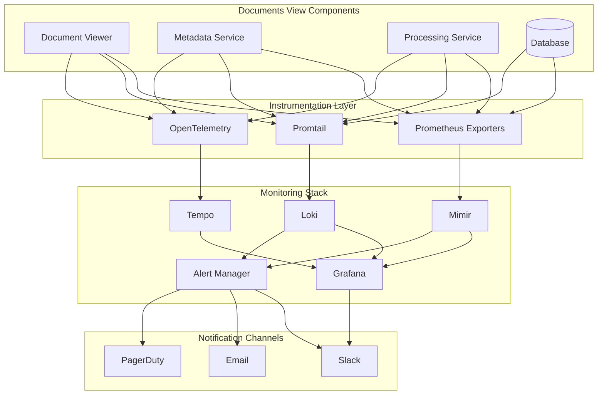
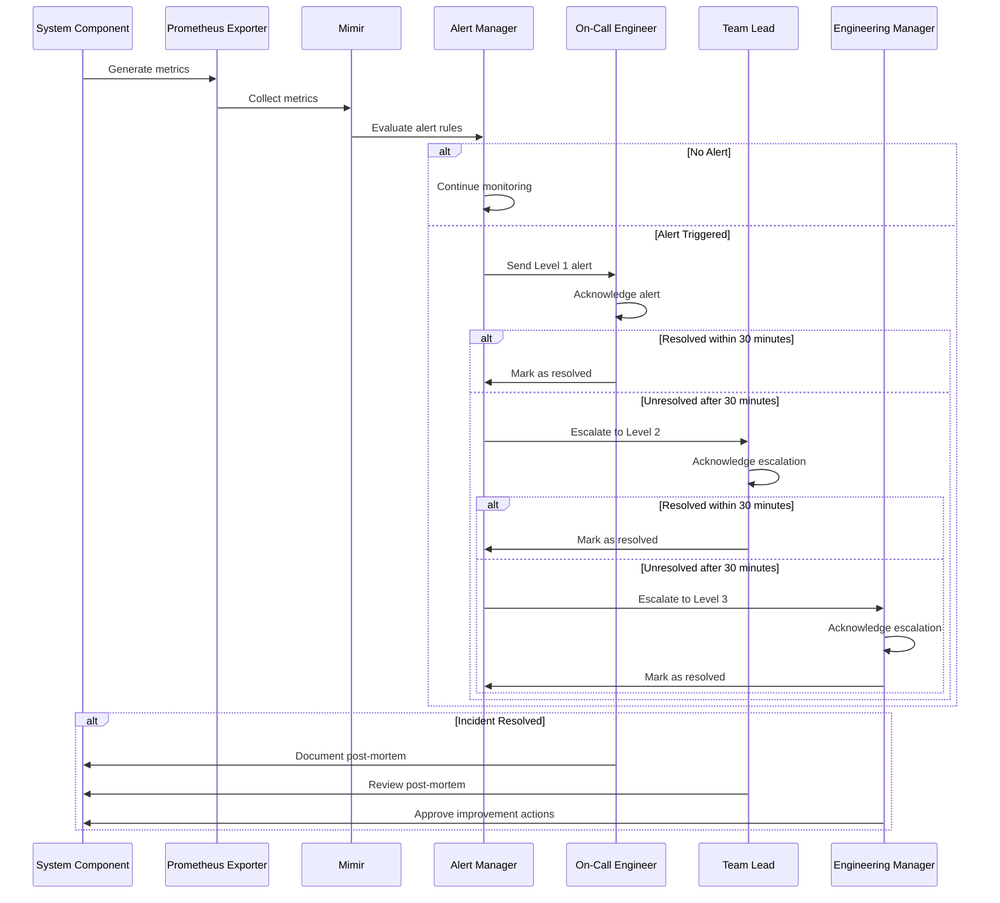
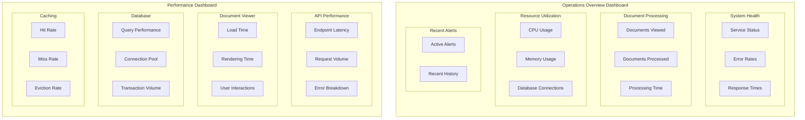
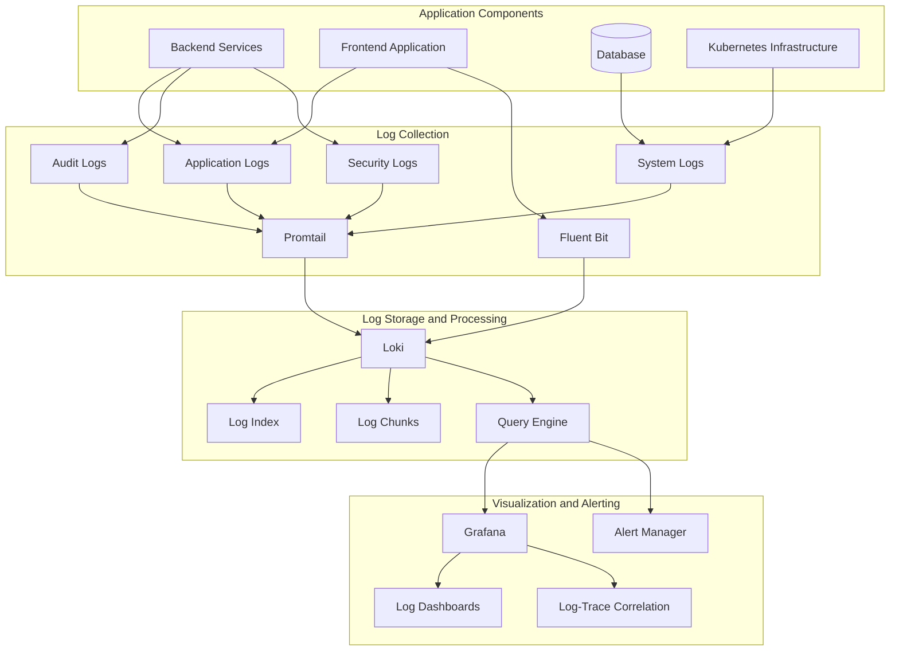
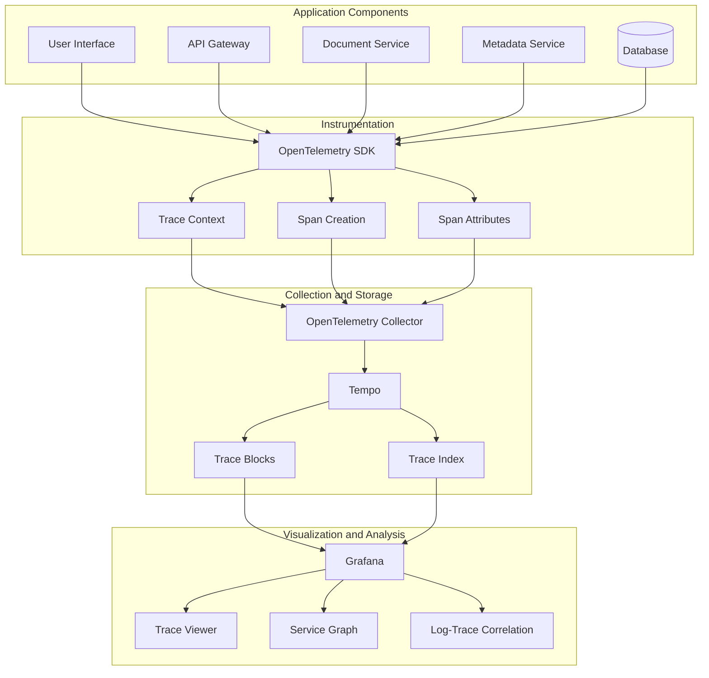
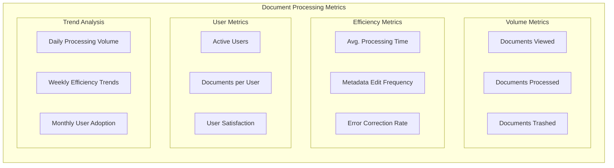

# Monitoring and Observability Architecture for Documents View

## Introduction

### Purpose and Scope
This document describes the monitoring and observability architecture for the Documents View feature in Insure Pilot. It provides a comprehensive overview of the monitoring infrastructure, metrics collection, log aggregation, tracing, alerting, and dashboard configurations that ensure the reliability, performance, and security of the Documents View feature.

The scope of this document includes:
- Monitoring infrastructure using the LGTM stack (Loki, Grafana, Tempo, Mimir)
- Metrics collection and analysis for system and application components
- Log aggregation and analysis strategy
- Distributed tracing implementation
- Alerting framework and incident response procedures
- Dashboard design and visualization
- Health checks and SLA monitoring
- Capacity planning and resource optimization

### Monitoring Philosophy
The monitoring philosophy for the Documents View feature is based on the following principles:
- **Comprehensive observability**: Collect metrics, logs, and traces for complete visibility
- **Proactive monitoring**: Detect issues before they impact users
- **Data-driven decisions**: Use monitoring data to drive improvements
- **Automation**: Automate alerting, escalation, and remediation where possible
- **Continuous improvement**: Regularly review and enhance monitoring capabilities

### Key Monitoring Objectives
1. **Ensure reliability**: Monitor system health and availability to ensure the Documents View feature is reliable
2. **Optimize performance**: Track performance metrics to identify bottlenecks and opportunities for optimization
3. **Enhance user experience**: Monitor user-facing metrics to ensure a positive experience
4. **Support compliance**: Maintain audit trails for compliance requirements
5. **Enable capacity planning**: Track resource utilization for effective capacity planning
6. **Facilitate troubleshooting**: Provide detailed information for efficient problem resolution

## Monitoring Infrastructure

### LGTM Stack Overview
The Documents View feature uses the LGTM (Loki, Grafana, Tempo, Mimir) stack for comprehensive monitoring and observability:

- **Loki**: Log aggregation system that stores and indexes log data
- **Grafana**: Visualization platform for metrics, logs, and traces
- **Tempo**: Distributed tracing system for request flow visualization
- **Mimir**: Long-term metrics storage for scalable and reliable metrics

This integrated stack provides unified observability across all components of the Documents View feature, enabling correlation between metrics, logs, and traces for efficient troubleshooting and analysis.

### Component Interactions
The LGTM components interact as follows:

1. **Metrics Flow**:
   - Application components expose metrics endpoints
   - Prometheus scrapes metrics from endpoints
   - Prometheus forwards metrics to Mimir for long-term storage
   - Grafana queries metrics from Prometheus (real-time) and Mimir (historical)

2. **Logs Flow**:
   - Application components write structured logs
   - Promtail collects logs from files and Kubernetes pods
   - Logs are forwarded to Loki for storage and indexing
   - Grafana queries logs from Loki for visualization

3. **Traces Flow**:
   - Application components instrument code with OpenTelemetry
   - Traces are sent to OpenTelemetry Collector
   - Collector forwards traces to Tempo for storage
   - Grafana queries traces from Tempo for visualization

4. **Alerting Flow**:
   - AlertManager receives alerts from Prometheus, Mimir, and Loki
   - Alerts are grouped, deduplicated, and routed to notification channels
   - On-call engineers receive alerts through appropriate channels

### Deployment Architecture
The monitoring infrastructure is deployed using Kubernetes, with components distributed to ensure high availability and scalability:

- Each LGTM component runs as a separate deployment in Kubernetes
- Components are configured with appropriate resource limits and requests
- Persistent storage is used for data that must survive pod restarts
- Services expose components to each other and to the application
- Ingress controllers provide external access to Grafana

### Infrastructure Requirements
The monitoring infrastructure has the following resource requirements:

| Component | CPU (Request/Limit) | Memory (Request/Limit) | Storage |
|-----------|---------------------|------------------------|---------|
| Prometheus | 2 CPU / 4 CPU | 8GB / 16GB | 100GB |
| Loki | 2 CPU / 4 CPU | 4GB / 8GB | 500GB |
| Tempo | 1 CPU / 2 CPU | 2GB / 4GB | 200GB |
| Mimir | 2 CPU / 4 CPU | 8GB / 16GB | 1TB |
| Grafana | 0.5 CPU / 1 CPU | 1GB / 2GB | 10GB |
| AlertManager | 0.5 CPU / 1 CPU | 1GB / 2GB | 5GB |

## Metrics Collection

### System Metrics
System-level metrics are collected from all components of the Documents View feature, including:

- **Node-level metrics**: CPU usage, memory usage, disk I/O, network traffic
- **Container metrics**: CPU usage, memory usage, restarts, resource limits/requests
- **Kubernetes metrics**: Pod status, deployment status, replica counts, resource utilization
- **Network metrics**: Request count, latency, error rate, bandwidth usage

These metrics are collected using the Prometheus Node Exporter and kube-state-metrics, with a collection interval of 15 seconds.

### Application Metrics
Application-specific metrics for the Documents View feature include:

- **Document Viewer metrics**:
  - `document_load_time_seconds`: Time taken to load a document
  - `pdf_render_time_seconds`: Time taken to render a PDF in the viewer
  - `documents_viewed_total`: Total number of documents viewed

- **API metrics**:
  - `api_response_time_seconds`: Response time for API endpoints
  - `api_requests_total`: Total number of API requests
  - `api_errors_total`: Total number of API errors

- **Metadata metrics**:
  - `metadata_save_time_seconds`: Time taken to save metadata changes
  - `metadata_updates_total`: Total number of metadata updates
  - `metadata_validation_errors_total`: Total number of metadata validation errors

- **Document Processing metrics**:
  - `documents_processed_total`: Total number of documents marked as processed
  - `document_processing_time_seconds`: Time taken to mark a document as processed
  - `document_actions_total`: Total number of document actions by type

These metrics are collected through custom instrumentation in the application code, with automatic export to Prometheus endpoints.

### Business Metrics
Business metrics provide insights into operational aspects of the Documents View feature:

- **Efficiency metrics**:
  - `average_processing_time_seconds`: Average time to process a document
  - `documents_per_user_hour`: Documents processed per user hour
  - `error_correction_rate`: Rate of metadata corrections

- **Adoption metrics**:
  - `active_users_total`: Number of active users
  - `feature_usage_ratio`: Ratio of feature usage to available users
  - `new_user_onboarding_rate`: Rate of new users adopting the feature

- **Quality metrics**:
  - `metadata_accuracy_percent`: Percentage of accurate metadata entries
  - `rework_percentage`: Percentage of documents requiring rework
  - `user_satisfaction_score`: User satisfaction rating (if available)

Business metrics are collected through a combination of application instrumentation and backend analytics processing.

### Custom Instrumentation
The Documents View feature uses the following custom instrumentation approaches:

1. **Backend instrumentation**:
   - Laravel middleware for API request metrics
   - Custom metric collectors for document operations
   - Database query monitoring through Laravel events
   - Cache operation tracking through interceptors

2. **Frontend instrumentation**:
   - React component instrumentation for UI interactions
   - Performance API integration for user experience metrics
   - Error boundary instrumentation for frontend error tracking
   - Custom events for user interaction tracking

Code example (simplified) for backend instrumentation:

```php
// Document loading time tracking
$startTime = microtime(true);
$document = $this->documentService->loadDocument($documentId);
$loadTime = microtime(true) - $startTime;

// Record metric
$this->metricsService->recordHistogram(
    'document_load_time_seconds',
    $loadTime,
    ['document_size' => $document->size, 'document_type' => $document->type]
);
```

### Metric Naming Conventions
The Documents View feature follows these metric naming conventions to ensure consistency and clarity:

1. **Namespace**: All metrics are prefixed with appropriate namespaces
   - System metrics: `system_*`
   - Document-specific metrics: `document_*`
   - API metrics: `api_*`
   - Metadata metrics: `metadata_*`

2. **Units**: Metrics include appropriate unit suffixes
   - Time-based metrics: `*_seconds`
   - Count-based metrics: `*_total`
   - Ratio-based metrics: `*_ratio`
   - Percentage-based metrics: `*_percent`

3. **Labels**: Metrics include descriptive labels for better filtering and aggregation
   - Common labels: `environment`, `service`, `component`
   - Document-specific labels: `document_type`, `document_size`
   - User-specific labels: `user_role`
   - Operation-specific labels: `operation_type`, `status_code`

## Log Aggregation

### Log Sources and Types
The Documents View feature generates logs from various sources:

1. **Application logs**:
   - Document viewer component logs
   - Metadata service logs
   - Document processing service logs
   - API service logs

2. **System logs**:
   - Kubernetes container logs
   - Node-level system logs
   - Web server logs (NGINX)
   - Database logs (MariaDB)

3. **Security logs**:
   - Authentication events
   - Authorization decisions
   - Security-related errors
   - Access attempts

4. **Audit logs**:
   - Document access events
   - Metadata changes
   - Document state changes (processed, trashed)
   - User actions

### Structured Logging Format
All logs in the Documents View feature use a structured JSON format to facilitate parsing, indexing, and querying:

```json
{
  "timestamp": "2023-06-15T14:23:45.123Z",
  "level": "info",
  "service": "document-viewer",
  "component": "metadata-service",
  "trace_id": "1234567890abcdef",
  "span_id": "fedcba0987654321",
  "user_id": "user-123",
  "message": "Updated document metadata",
  "document_id": "doc-456",
  "operation": "metadata_update",
  "fields_updated": ["policy_number", "loss_sequence"],
  "duration_ms": 145,
  "status": "success"
}
```

Key attributes in the log structure:
- **Temporal**: timestamp, duration
- **Identity**: service, component, user_id, document_id
- **Operational**: level, message, operation, status
- **Tracing**: trace_id, span_id (for correlation with traces)
- **Contextual**: Additional fields relevant to the specific event

### Log Levels and Filtering
The Documents View feature uses the following log levels, with specific filtering rules:

| Log Level | Usage | Retention | Alert |
|-----------|-------|-----------|-------|
| ERROR | System failures, critical issues | 90 days | Yes |
| WARN | Potential issues, degraded operations | 90 days | Aggregated |
| INFO | Normal operations, significant events | 30 days | No |
| DEBUG | Detailed troubleshooting information | 7 days | No |
| TRACE | Extremely detailed developer information | 3 days | No |

Log filtering rules:
- Development environment: TRACE and above
- Staging environment: DEBUG and above
- Production environment: INFO and above (with selective DEBUG for critical components)

### Retention Policies
The Documents View feature implements the following log retention policies:

| Log Type | Retention Period | Storage Location | Archival Strategy |
|----------|------------------|------------------|-------------------|
| Application Logs | 30 days | Loki | Compressed archive for 90 days |
| System Logs | 14 days | Loki | No archival |
| Audit Logs | 90 days | Loki | Compressed archive for 7 years |
| Security Logs | 90 days | Loki | Compressed archive for 1 year |
| Performance Logs | 30 days | Loki | Aggregated metrics retained in Mimir |

Retention policies are implemented through Loki's configuration, with automated policies for log deletion and archival.

### Log Correlation with Traces
The Documents View feature implements log correlation with traces to provide context-rich debugging:

1. **Correlation identifiers**:
   - All logs include `trace_id` and `span_id` fields
   - The same IDs are used in application metrics where applicable
   - This enables correlation across logs, metrics, and traces

2. **Unified search**:
   - Grafana dashboards include linked logs and traces
   - Clicking on a trace shows related logs
   - Logs include links to relevant traces

3. **Implementation**:
   - OpenTelemetry context propagation for trace IDs
   - Custom log processors to inject trace context
   - Integration between Loki and Tempo for correlated queries

## Distributed Tracing

### Trace Collection
The Documents View feature uses OpenTelemetry for distributed tracing collection:

1. **Instrumentation points**:
   - Frontend: React components and API calls
   - Backend: API endpoints, service methods, database queries
   - External dependencies: Adobe PDF viewer integration, third-party services

2. **Collection mechanism**:
   - OpenTelemetry SDK in application components
   - Automatic instrumentation for frameworks (Laravel, React)
   - Manual instrumentation for critical business logic
   - Trace context propagation across service boundaries

3. **Transport**:
   - OTLP protocol for trace data
   - gRPC for efficient binary transport
   - Integration with OpenTelemetry Collector for preprocessing

### Sampling Strategy
To balance observability needs with resource constraints, the Documents View feature implements a strategic sampling approach:

1. **Sampling rates**:
   - Critical paths (document loading, processing): 100% sampling
   - Standard operations (metadata viewing): 50% sampling
   - Background operations: 10% sampling

2. **Dynamic sampling**:
   - Increase sampling during incidents
   - Capture 100% of error cases
   - Adjust sampling based on system load

3. **Sampling configuration**:
   - Configured in OpenTelemetry Collector
   - Adjustable without application restart
   - Environment-specific sampling rates (higher in staging/dev)

### Span Attributes
Spans in the Documents View feature include the following attributes to provide rich context:

1. **Common attributes**:
   - `service.name`: Service generating the span
   - `service.version`: Service version
   - `environment`: Deployment environment

2. **Document-specific attributes**:
   - `document.id`: Document identifier
   - `document.type`: Type of document
   - `document.size`: Size of document in bytes
   - `document.operation`: Operation being performed

3. **User context**:
   - `user.id`: User identifier
   - `user.role`: User role
   - `session.id`: User session identifier

4. **Error information**:
   - `error`: Boolean indicating error state
   - `error.message`: Error message
   - `error.type`: Error type/category
   - `error.stack`: Error stack trace (in development)

### Trace Visualization
Traces are visualized in Grafana using the Tempo data source:

1. **Visualization capabilities**:
   - Waterfall diagrams for request execution
   - Service graphs showing dependencies
   - Span details with attributes and events
   - Flame graphs for performance analysis

2. **Integration points**:
   - Links from metrics dashboards to relevant traces
   - Links from logs to corresponding traces
   - Search capability by trace ID, service, operation

3. **Custom dashboards**:
   - Document processing flow visualization
   - Error analysis dashboards
   - Performance bottleneck identification

### Performance Analysis
Traces are used for performance analysis in the Documents View feature:

1. **Latency analysis**:
   - Identify slow operations in request flow
   - Compare performance across environments
   - Track performance changes over time

2. **Dependency analysis**:
   - Identify external service dependencies
   - Measure impact of dependencies on performance
   - Detect cascading failures

3. **Error path analysis**:
   - Trace execution path leading to errors
   - Identify common error patterns
   - Correlate errors with system conditions

4. **Resource utilization**:
   - Correlate traces with resource metrics
   - Identify resource-intensive operations
   - Optimize resource allocation based on trace data

## Alert Management

### Alert Definitions
The Documents View feature implements a comprehensive set of alerts to detect issues proactively:

1. **Availability alerts**:
   - Service unavailability
   - Component failures
   - API endpoint errors

2. **Performance alerts**:
   - Slow document loading
   - High API response times
   - Database query performance degradation

3. **Error rate alerts**:
   - Elevated error rates
   - Authentication failures
   - Validation errors

4. **Resource alerts**:
   - High CPU/memory usage
   - Disk space warnings
   - Network saturation

5. **Business alerts**:
   - Document processing rate drops
   - User activity anomalies
   - SLA violations

Example alert definition (PromQL):

```yaml
- alert: DocumentLoadTimeExceeded
  expr: histogram_quantile(0.95, sum(rate(document_load_time_seconds_bucket[5m])) by (le)) > 3
  for: 10m
  labels:
    severity: warning
    team: frontend
  annotations:
    summary: "Document load time exceeding threshold"
    description: "95th percentile document load time is above 3 seconds for more than 10 minutes"
```

### Severity Levels
Alerts are categorized by severity to enable appropriate response:

| Severity | Description | Response Time | Example |
|----------|-------------|---------------|---------|
| Critical | Service outage, data loss risk, security breach | Immediate (24/7) | Document viewer service down |
| Warning | Degraded performance, potential issues | During business hours | Document load time exceeding threshold |
| Info | Notable events, non-urgent issues | Next business day | Increased error rate but below critical threshold |

Severity level determination is based on:
- Business impact
- Number of affected users
- Data integrity risks
- Security implications
- Recovery complexity

### Notification Channels
Alerts are routed to appropriate notification channels based on severity and team responsibility:

1. **Critical alerts**:
   - PagerDuty for on-call notification
   - SMS for immediate attention
   - Slack #critical-alerts channel
   - Email to leadership team

2. **Warning alerts**:
   - Slack team channels
   - Email to responsible team
   - Dashboard notification

3. **Info alerts**:
   - Slack informational channels
   - Digest emails
   - Dashboard notification

Channel configuration is maintained in AlertManager, with redundancy to ensure alerts are delivered even if one channel fails.

### Alert Grouping and Deduplication
To prevent alert fatigue, the Documents View feature implements intelligent alert grouping and deduplication:

1. **Grouping strategies**:
   - Group by service and alert name
   - Group related alerts from the same component
   - Combine identical alerts affecting multiple instances

2. **Deduplication rules**:
   - Suppress duplicate alerts within time windows
   - Prevent notification storms during cascading failures
   - Collapse similar alerts into a single notification

3. **Smart routing**:
   - Route related alerts to the same recipient
   - Ensure complete context is available for troubleshooting
   - Prevent multiple teams from investigating the same issue

### Silencing and Maintenance Windows
To reduce noise during planned activities, the system supports silencing and maintenance windows:

1. **Maintenance windows**:
   - Scheduled in advance for planned work
   - Can be service-specific or system-wide
   - Alerts are still recorded but notifications are suppressed

2. **Ad-hoc silencing**:
   - Silence specific alerts during incident response
   - Temporary suppression while addressing known issues
   - Requires documentation and expiration time

3. **Alert inhibition**:
   - Automatically suppress consequential alerts
   - Prevent notification spam during cascading failures
   - Focus attention on root cause rather than symptoms

## Dashboard Design

### Operations Overview Dashboard
The Operations Overview Dashboard provides a high-level view of the Documents View feature's health and performance:

**Panel Groups:**
1. **System Health**
   - Service status indicators
   - Error rates
   - API response times

2. **Document Processing**
   - Documents viewed counter
   - Documents processed counter
   - Processing time trends

3. **Resource Utilization**
   - CPU usage
   - Memory usage
   - Database connections

4. **Recent Alerts**
   - Active alerts list
   - Recent alert history

This dashboard serves as the primary entry point for operations monitoring, with links to more detailed dashboards for specific areas.

### Performance Dashboard
The Performance Dashboard focuses on detailed performance metrics:

**Panel Groups:**
1. **API Performance**
   - Endpoint latency by percentile
   - Request volume by endpoint
   - Error breakdown by status code

2. **Document Viewer**
   - Document load time
   - PDF rendering time
   - User interaction metrics

3. **Database Performance**
   - Query latency by query type
   - Connection pool status
   - Transaction volume

4. **Caching**
   - Cache hit/miss ratio
   - Cache eviction rate
   - Cache size

This dashboard helps identify performance bottlenecks and track optimization efforts over time.

### Business Metrics Dashboard
The Business Metrics Dashboard tracks operational impact and business value:

**Panel Groups:**
1. **Document Volume Metrics**
   - Documents viewed trend
   - Documents processed trend
   - Documents trashed trend

2. **Efficiency Metrics**
   - Average processing time
   - Metadata edit frequency
   - Error correction rate

3. **User Metrics**
   - Active users trend
   - Documents per user
   - User satisfaction (if available)

4. **Trend Analysis**
   - Daily processing volume
   - Weekly efficiency trends
   - Monthly user adoption

This dashboard helps business stakeholders understand the operational impact and value of the Documents View feature.

### SLA Compliance Dashboard
The SLA Compliance Dashboard monitors compliance with service level agreements:

**Panel Groups:**
1. **Document Viewer SLAs**
   - Availability percentage
   - Document load time compliance
   - Error rate compliance

2. **API SLAs**
   - Endpoint availability
   - Response time compliance
   - Error rate compliance

3. **Processing SLAs**
   - Document processing time compliance
   - Metadata update time compliance
   - Feature functionality compliance

4. **Trend Analysis**
   - SLA compliance over time
   - SLA violation frequency
   - Recovery time metrics

This dashboard helps track compliance with defined SLAs and identify areas for improvement.

### Error Analysis Dashboard
The Error Analysis Dashboard provides detailed error information:

**Panel Groups:**
1. **Error Rates**
   - Error rate by component
   - Error rate by operation type
   - Error rate trend

2. **Error Categories**
   - Document loading errors
   - Metadata validation errors
   - API request errors
   - PDF rendering errors

3. **Error Details**
   - Top error messages
   - Error distribution by user role
   - Error correlation with system metrics

4. **User Impact**
   - Users affected by errors
   - Error impact on processing time
   - Error recovery metrics

This dashboard helps identify and diagnose error patterns to improve system reliability.

## Health Checks

### Component Health Checks
The Documents View feature implements health checks for all components:

1. **Frontend component health checks**:
   - Document viewer component: `/health`
   - Metadata panel component: `/health/metadata`
   - Action controller component: `/health/actions`

2. **Backend service health checks**:
   - Document service: `/api/health`
   - Metadata service: `/api/metadata/health`
   - Processing service: `/api/processing/health`

3. **Health check implementation**:
   - Lightweight endpoint that verifies basic functionality
   - Returns status code 200 for healthy, non-200 for unhealthy
   - Includes detailed health information in response body

Example health check response:

```json
{
  "status": "healthy",
  "version": "1.2.3",
  "checks": {
    "database": {
      "status": "healthy",
      "latency_ms": 12
    },
    "cache": {
      "status": "healthy",
      "latency_ms": 3
    },
    "storage": {
      "status": "healthy",
      "latency_ms": 45
    }
  },
  "timestamp": "2023-06-15T14:23:45.123Z"
}
```

### Dependency Health Checks
Health checks also verify dependencies to detect issues in the service ecosystem:

1. **Database health**:
   - Connection availability
   - Query execution time
   - Replication status

2. **Cache health**:
   - Connection availability
   - Read/write operations
   - Latency checks

3. **External service health**:
   - Adobe PDF viewer availability
   - Policy service connectivity
   - Producer service connectivity

4. **Infrastructure health**:
   - Storage availability
   - Network connectivity
   - Resource availability

Dependency health is checked both as part of component health checks and through dedicated monitoring.

### Synthetic Monitoring
The Documents View feature uses synthetic monitoring to proactively detect issues:

1. **Synthetic transactions**:
   - Document viewing flow
   - Metadata editing flow
   - Document processing flow

2. **Implementation approach**:
   - Scheduled execution (every 5 minutes)
   - Runs from multiple geographic locations
   - Simulates user interactions with the system

3. **Monitoring capabilities**:
   - End-to-end transaction success
   - Performance metrics for each step
   - Screenshot capture for visual verification
   - Alert generation for failures

Synthetic monitoring complements real user monitoring by providing consistent baselines and proactive detection of issues before they affect users.

### Health Status Aggregation
Health status from all components is aggregated to provide a unified view:

1. **Aggregation levels**:
   - Component level (e.g., document viewer)
   - Service level (e.g., document service)
   - Feature level (Documents View as a whole)
   - System level (Insure Pilot platform)

2. **Status determination rules**:
   - Critical dependency failure results in unhealthy status
   - Non-critical dependency issues result in degraded status
   - Healthy requires all critical checks to pass

3. **Visualization**:
   - Status dashboard with component health indicators
   - Service health history for trend analysis
   - Dependency map with health overlays

Health status aggregation enables quick assessment of system health and helps identify the scope of issues.

## Performance Monitoring

### Document Load Time
Document load time is a critical performance metric for user experience:

1. **Measurement approach**:
   - Client-side timing from request to rendered document
   - Server-side timing of document retrieval and processing
   - Network transfer time tracking

2. **Performance targets**:
   - Target: < 3 seconds
   - Warning threshold: 3-5 seconds
   - Critical threshold: > 5 seconds

3. **Analysis dimensions**:
   - Document size
   - Document type
   - User location
   - Network conditions
   - Backend processing time

4. **Optimization tracking**:
   - Performance trend analysis
   - Impact assessment of optimization efforts
   - Comparison across environments

### API Response Time
API response time affects overall system responsiveness:

1. **Measurement approach**:
   - Server-side timing of request processing
   - Client-side timing of complete request lifecycle
   - Percentile-based analysis (p50, p95, p99)

2. **Performance targets**:
   - Target: < 200ms
   - Warning threshold: 200-500ms
   - Critical threshold: > 500ms

3. **Analysis dimensions**:
   - Endpoint
   - HTTP method
   - Authentication status
   - Request payload size
   - Response size

4. **Performance breakdown**:
   - Authentication/authorization time
   - Business logic processing time
   - Database query time
   - External service call time
   - Response serialization time

### Database Query Performance
Database performance directly impacts system scalability:

1. **Measurement approach**:
   - Query execution time tracking
   - Query plan analysis
   - Resource utilization during queries

2. **Performance targets**:
   - Target: < 100ms for typical queries
   - Warning threshold: 100-300ms
   - Critical threshold: > 300ms

3. **Analysis dimensions**:
   - Query type
   - Table accessed
   - Query complexity
   - Result set size
   - Index utilization

4. **Optimization metrics**:
   - Index hit ratio
   - Cache hit ratio
   - Lock contention
   - Execution plan efficiency

### Resource Utilization
Resource utilization tracking helps identify capacity limits:

1. **CPU utilization**:
   - Per-pod CPU usage
   - CPU usage by container
   - CPU throttling events
   - Target: < 70% sustained utilization

2. **Memory utilization**:
   - Per-pod memory usage
   - Memory usage by container
   - Garbage collection metrics
   - Target: < 80% sustained utilization

3. **Disk utilization**:
   - Storage usage by volume
   - I/O operations per second
   - I/O latency
   - Target: < 80% capacity, < 100ms I/O latency

4. **Network utilization**:
   - Network traffic by pod
   - Connection count
   - Network errors
   - Target: < 70% of available bandwidth

### Performance Degradation Detection
The system actively detects performance degradation:

1. **Detection methods**:
   - Statistical anomaly detection
   - Comparison to historical baselines
   - Threshold-based alerting
   - Trend analysis

2. **Early warning indicators**:
   - Increasing 95th percentile response times
   - Growing request queues
   - Increasing error rates
   - Resource utilization spikes

3. **Degradation alerting**:
   - Early warnings for potential issues
   - Critical alerts for significant degradation
   - Correlation with deployment events
   - User impact assessment

4. **Automated responses**:
   - Scaling triggers based on performance metrics
   - Cache warming for frequent access patterns
   - Connection pool adjustments
   - Query optimization suggestions

## SLA Monitoring

### SLA Definitions
The Documents View feature has the following Service Level Agreements (SLAs):

| Service | Metric | Target | Measurement Window | Exclusions |
|---------|--------|--------|-------------------|------------|
| Document Viewer | Availability | 99.9% | Monthly | Scheduled Maintenance |
| Document Viewer | P95 Load Time | < 3 seconds | Daily | Files > 10MB |
| Metadata Service | Availability | 99.95% | Monthly | Scheduled Maintenance |
| Metadata Service | P95 Response Time | < 500ms | Hourly | Bulk Operations |
| Database | Availability | 99.99% | Monthly | Scheduled Maintenance |
| Database | Data Durability | 100% | Continuous | None |
| PDF Renderer | Success Rate | 99.5% | Daily | Corrupted Files |
| PDF Renderer | P95 Rendering Time | < 2 seconds | Hourly | Files > 5MB |

These SLAs represent commitments to service quality and user experience and are monitored continuously.

### Measurement Methodology
SLA compliance is measured using the following methodology:

1. **Availability measurement**:
   - Synthetic monitoring probes
   - Health check endpoint monitoring
   - Error rate calculation from API requests
   - Formula: `Success Requests / Total Requests * 100%`

2. **Performance measurement**:
   - Histogram metrics for timing data
   - Percentile calculations (p95, p99)
   - Real user monitoring data
   - Synthetic transaction timing

3. **Data quality measurement**:
   - Validation success rates
   - Data integrity checks
   - Consistency verification
   - Audit log analysis

4. **Sampling approach**:
   - 100% of requests for availability metrics
   - Statistically significant sample for performance
   - Stratified sampling across user groups

### Reporting Frequency
SLA compliance is reported at different frequencies depending on the stakeholder needs:

1. **Real-time monitoring**:
   - Live dashboards for operations teams
   - Immediate alerts for SLA violations
   - Ongoing trending analysis

2. **Daily reporting**:
   - Daily summary of SLA performance
   - 24-hour trending analysis
   - Incident summary for any violations

3. **Weekly reporting**:
   - Weekly performance summary
   - Trend analysis and patterns
   - Improvement recommendations

4. **Monthly reporting**:
   - Comprehensive SLA compliance report
   - Month-over-month comparison
   - Root cause analysis for any violations
   - Action plans for improvement

### Compliance Tracking
SLA compliance is tracked using dedicated tooling:

1. **Compliance dashboard**:
   - Real-time compliance status
   - Historical compliance trends
   - Violation details and impact

2. **SLA calculator**:
   - Automated calculation of compliance percentages
   - Exclusion handling for maintenance windows
   - Error margin calculations

3. **Violation tracking**:
   - Detailed record of each violation
   - Root cause categorization
   - Impact assessment
   - Resolution time tracking

4. **Improvement tracking**:
   - Performance trends over time
   - Effectiveness of improvement initiatives
   - Compliance forecasting

### SLA Violation Alerts
SLA violations trigger specific alerts and response processes:

1. **Alert configuration**:
   - Early warning at approaching thresholds
   - Violation alert when SLA is breached
   - Escalating severity based on duration

2. **Response procedures**:
   - Immediate investigation for critical SLAs
   - Incident creation and tracking
   - Stakeholder notification
   - War room activation for extended violations

3. **Post-violation analysis**:
   - Root cause analysis requirement
   - Corrective action planning
   - Prevention strategy development
   - SLA adjustment evaluation if needed

4. **Business impact assessment**:
   - User impact quantification
   - Operational impact assessment
   - Compensation/credit determination if applicable
   - Reputation impact analysis

## Capacity Monitoring

### Resource Utilization Tracking
The Documents View feature tracks resource utilization across all components:

1. **Compute resources**:
   - CPU utilization by pod and container
   - Memory utilization by pod and container
   - Pod scaling events and triggers
   - Resource request vs. actual usage

2. **Storage resources**:
   - Document storage utilization
   - Database storage utilization
   - Temporary storage utilization
   - Storage I/O metrics

3. **Network resources**:
   - Bandwidth utilization
   - Connection counts
   - Network latency
   - DNS resolution times

4. **Database resources**:
   - Connection pool utilization
   - Query throughput
   - Index size and growth
   - Transaction volume

### Growth Trend Analysis
Capacity planning is informed by growth trend analysis:

1. **User growth metrics**:
   - Active user count trend
   - New user onboarding rate
   - Session duration trends
   - Concurrent user patterns

2. **Document growth metrics**:
   - Document count growth rate
   - Average document size trend
   - Document type distribution changes
   - Retention policy effects

3. **Transaction growth metrics**:
   - API request growth rate
   - Document view growth rate
   - Metadata update growth rate
   - Processing action growth rate

4. **Seasonal patterns**:
   - Time-of-day usage patterns
   - Day-of-week patterns
   - Monthly/quarterly patterns
   - Business cycle correlations

### Capacity Planning
Capacity planning ensures adequate resources for future growth:

1. **Forecasting methodology**:
   - Linear regression for steady growth
   - Seasonal decomposition for cyclical patterns
   - Machine learning for complex patterns
   - Scenario-based planning for business changes

2. **Planning horizons**:
   - Short-term (1-4 weeks)
   - Medium-term (1-3 months)
   - Long-term (6-12 months)

3. **Resource planning factors**:
   - Current utilization baseline
   - Growth projections
   - Performance requirements
   - Redundancy/headroom requirements

4. **Capacity planning artifacts**:
   - Capacity forecasts by resource type
   - Scaling recommendations
   - Infrastructure investment roadmap
   - Cost projections

### Scaling Triggers
Automated scaling is driven by defined triggers:

1. **Horizontal scaling triggers**:
   - CPU utilization > 70% for 3 minutes
   - Memory utilization > 80% for 3 minutes
   - Request queue length > 100 for 1 minute
   - Response time > 1 second for 5 minutes

2. **Vertical scaling considerations**:
   - Memory limited workloads
   - CPU limited workloads
   - Database performance bottlenecks
   - Storage IOPS limitations

3. **Scaling limitations**:
   - Minimum and maximum instance counts
   - Resource quotas and limits
   - Database connection pooling limits
   - License restrictions

4. **Scaling notifications**:
   - Automatic scaling event alerts
   - Capacity threshold warnings
   - Scaling failure notifications
   - Cost impact estimates

### Resource Optimization
Ongoing resource optimization ensures efficient utilization:

1. **Right-sizing initiatives**:
   - Container resource request/limit tuning
   - Database instance sizing
   - Cache size optimization
   - Storage tier selection

2. **Efficiency metrics**:
   - Cost per transaction
   - Resource utilization percentage
   - Idle resource identification
   - Performance per resource unit

3. **Optimization techniques**:
   - Workload scheduling for better distribution
   - Spot instance utilization where appropriate
   - Archival policies for old data
   - Cache strategy optimization

4. **Cost management**:
   - Resource utilization dashboards
   - Cost allocation by feature/component
   - Anomaly detection for unexpected usage
   - Regular optimization reviews

## Incident Response

### Alert Routing
Alerts are routed to the appropriate teams based on component and severity:

| Component | Severity | Primary Responder | Secondary Responder |
|-----------|----------|-------------------|---------------------|
| Document Viewer | High | Frontend Team | DevOps |
| Metadata Service | High | Backend Team | DevOps |
| Database | High | Database Team | DevOps |
| PDF Renderer | Medium | Frontend Team | Backend Team |

Routing rules ensure that the right expertise is engaged quickly when issues arise:

1. **Team-based routing**:
   - Component-specific alerts to specialized teams
   - Cross-cutting concerns to platform teams
   - Security alerts to security team

2. **Time-based routing**:
   - Business hours vs. after-hours routing
   - Weekend and holiday coverage
   - Follow-the-sun support for global teams

3. **Escalation-based routing**:
   - Level 1 to on-call engineers
   - Level 2 to senior engineers/team leads
   - Level 3 to engineering managers
   - Level 4 to executive leadership

4. **Geography-based routing**:
   - Region-specific alerts to local teams
   - Global alerts to primary support region
   - Failover routing if primary team unavailable

### Escalation Procedures
Clear escalation procedures ensure incidents are resolved efficiently:

| Escalation Level | Time Threshold | Responders | Communication Channel |
|------------------|----------------|------------|----------------------|
| Level 1 | Initial | On-call Engineer | Slack |
| Level 2 | 30 minutes | Team Lead | Slack, Phone |
| Level 3 | 1 hour | Engineering Manager | Phone, Email |
| Level 4 | 2 hours | CTO, Product Owner | Phone, Email |

The escalation process includes:

1. **Initial assessment and acknowledgment**:
   - Alert acknowledgment
   - Initial investigation
   - Severity confirmation or adjustment
   - Status update posting

2. **Regular status updates**:
   - Consistent communication cadence
   - Status update templates
   - Stakeholder notification
   - ETA updates

3. **Clear handoff procedures**:
   - Documented current status
   - Investigation history
   - Attempted solutions
   - Relevant context

4. **Post-resolution documentation**:
   - Resolution actions
   - Root cause identification
   - Corrective actions
   - Lessons learned

### Incident Classification
Incidents are classified to ensure appropriate response:

1. **Severity levels**:
   - Critical: Service outage, data loss
   - High: Major functionality impacted
   - Medium: Limited functionality impacted
   - Low: Minor issues, workarounds available

2. **Impact dimensions**:
   - User impact: Number of affected users
   - Functionality impact: Critical vs. non-critical features
   - Data impact: Data integrity, availability, confidentiality
   - Business impact: Financial, operational, reputational

3. **Response requirements**:
   - Critical: 24/7 immediate response, war room
   - High: Business hours immediate, after-hours within 1 hour
   - Medium: Business hours within 4 hours
   - Low: Next business day

4. **Resolution targets**:
   - Critical: < 4 hours
   - High: < 8 hours
   - Medium: < 24 hours
   - Low: < 5 business days

### Communication Protocols
Incident communication follows established protocols:

1. **Internal communication**:
   - Dedicated incident channel in Slack
   - Regular status updates
   - Clear ownership and next steps
   - Relevant stakeholder inclusion

2. **External communication (if needed)**:
   - System status page updates
   - User notifications
   - Leadership briefings
   - Regulatory disclosures if applicable

3. **Communication cadence**:
   - Critical incidents: Updates every 30 minutes
   - High severity: Updates every hour
   - Medium severity: Updates every 4 hours
   - Low severity: Daily updates

4. **Communication templates**:
   - Initial notification template
   - Status update template
   - Resolution notification template
   - Post-mortem summary template

### Resolution Workflow
The incident resolution workflow guides the response process:

1. **Detection and triage**:
   - Alert detection
   - Initial assessment
   - Severity classification
   - Team assignment

2. **Investigation and diagnosis**:
   - Root cause analysis
   - Impact assessment
   - Resolution options evaluation
   - Action plan development

3. **Resolution implementation**:
   - Apply fixes or mitigations
   - Verification testing
   - Monitoring for effectiveness
   - Rollback if needed

4. **Closure and follow-up**:
   - Resolution confirmation
   - All-clear communication
   - Post-mortem scheduling
   - Improvement task creation

This structured workflow ensures consistent and effective incident handling.

## Runbooks

### Document Loading Issues
**Symptoms:**
- Users report slow document loading
- Document viewer shows loading spinner for extended periods
- Error messages when attempting to view documents

**Diagnostic Steps:**
1. Check document viewer service health
   - Verify frontend service status
   - Check health endpoints
   - Examine error logs

2. Verify file storage accessibility
   - Test storage connectivity
   - Check permissions
   - Verify file existence

3. Check network connectivity
   - Test network paths
   - Check for latency issues
   - Verify DNS resolution

4. Review recent deployments or changes
   - Check deployment logs
   - Review configuration changes
   - Check for dependency updates

**Resolution Steps:**
1. Restart document viewer service if unresponsive
   - Scale down/up or restart pods
   - Clear cache if necessary
   - Verify service health after restart

2. Verify file permissions and access
   - Correct permissions if needed
   - Update service accounts if required
   - Test access after changes

3. Check for storage capacity issues
   - Free up space if needed
   - Expand storage if approaching limits
   - Implement emergency cleanup if necessary

4. Scale up resources if under heavy load
   - Increase pod count
   - Adjust resource limits
   - Enable additional caching

### Metadata Update Failures
**Symptoms:**
- Users unable to save metadata changes
- Error messages during metadata updates
- Metadata fields not updating correctly

**Diagnostic Steps:**
1. Check metadata service health
   - Verify service status
   - Check health endpoints
   - Examine error logs

2. Verify database connectivity
   - Test database connection
   - Check connection pool status
   - Verify query execution

3. Review validation errors
   - Check application logs for validation failures
   - Verify schema constraints
   - Test API endpoints directly

4. Check for schema or migration issues
   - Review recent migrations
   - Check table structures
   - Verify index health

**Resolution Steps:**
1. Restart metadata service if unresponsive
   - Scale down/up or restart pods
   - Clear application cache
   - Verify service health after restart

2. Verify database connection pool settings
   - Adjust pool size if needed
   - Reset stale connections
   - Check for connection leaks

3. Check for database locks or contention
   - Identify blocking queries
   - Kill long-running transactions if necessary
   - Optimize high-contention queries

4. Rollback recent schema changes if applicable
   - Apply emergency fixes
   - Revert to known good state
   - Plan proper fix for next deployment

### PDF Rendering Problems
**Symptoms:**
- PDF documents not displaying correctly
- Blank or partial document display
- PDF viewer controls not functioning

**Diagnostic Steps:**
1. Check Adobe Acrobat PDF viewer integration
   - Verify SDK availability
   - Check for JavaScript errors
   - Test with sample documents

2. Verify document format and integrity
   - Check file format validity
   - Verify file is not corrupted
   - Test with known good documents

3. Check browser console for JavaScript errors
   - Inspect browser console logs
   - Check for CORS issues
   - Verify script loading

4. Review recent frontend deployments
   - Check deployment logs
   - Review configuration changes
   - Verify dependency versions

**Resolution Steps:**
1. Refresh Adobe Acrobat PDF viewer integration
   - Reload SDK
   - Clear browser cache
   - Update SDK version if needed

2. Verify document compatibility with viewer
   - Convert document to compatible format
   - Check for unsupported features
   - Provide alternative viewing method

3. Clear browser cache and cookies
   - Guide users to clear cache
   - Provide clear instructions
   - Test in incognito/private mode

4. Rollback recent frontend changes if applicable
   - Deploy previous known good version
   - Apply emergency fixes
   - Plan proper fix for next deployment

## Post-Mortem Process

### Incident Timeline Construction
After an incident is resolved, a detailed timeline is constructed:

1. **Timeline data sources**:
   - Alert logs
   - System metrics
   - Communication logs (Slack, emails)
   - Incident management system
   - User reports

2. **Timeline elements**:
   - Initial detection time
   - Key investigation actions
   - Mitigation attempts
   - Resolution actions
   - All-clear declaration

3. **Timeline format**:
   - Chronological order
   - Timestamp precision to the minute
   - Actor attribution for each action
   - Clear description of each event
   - Links to relevant logs or metrics

4. **Timeline tools**:
   - Collaborative document for initial capture
   - Incident management system for structured storage
   - Visual timeline generation for analysis
   - Permanent record in documentation system

### Root Cause Analysis
Root cause analysis identifies the underlying issue:

1. **Analysis techniques**:
   - 5 Whys methodology
   - Fishbone/Ishikawa diagrams
   - Fault tree analysis
   - Change analysis

2. **Investigation areas**:
   - Code and configuration changes
   - Infrastructure changes
   - External dependencies
   - User behavior patterns
   - System design limitations

3. **Evidence collection**:
   - Logs and metrics
   - Configuration snapshots
   - Deployment records
   - Test results
   - User reports

4. **Causal chain documentation**:
   - Primary cause identification
   - Trigger event description
   - Contributing factors list
   - Environmental conditions
   - Impact amplifiers

### Contributing Factors Identification
Beyond the root cause, contributing factors are analyzed:

1. **Technical factors**:
   - Design limitations
   - Implementation flaws
   - Resource constraints
   - Technical debt
   - Monitoring gaps

2. **Process factors**:
   - Change management issues
   - Testing inadequacies
   - Deployment processes
   - Monitoring configuration
   - Runbook limitations

3. **People factors**:
   - Knowledge gaps
   - Communication issues
   - Training needs
   - Staffing limitations
   - Role clarity

4. **External factors**:
   - Vendor issues
   - External service disruptions
   - Unexpected user behavior
   - Environmental conditions
   - Regulatory requirements

### Corrective Actions
Corrective actions are identified to prevent recurrence:

1. **Action categories**:
   - Immediate fixes (already implemented)
   - Short-term actions (within 1-2 weeks)
   - Medium-term improvements (within 1-2 months)
   - Long-term strategic changes (3+ months)

2. **Action attributes**:
   - Clear description
   - Expected impact
   - Owner assignment
   - Due date
   - Success criteria

3. **Action prioritization**:
   - Impact on reliability
   - Effort required
   - Breadth of applicability
   - Business priority
   - Resource availability

4. **Action tracking**:
   - Enter into project management system
   - Regular progress reviews
   - Verification testing
   - Effectiveness measurement
   - Feedback loop to incident process

### Knowledge Sharing
Post-mortem findings are shared to spread learning:

1. **Documentation**:
   - Detailed post-mortem document
   - Simplified executive summary
   - Updated runbooks and playbooks
   - Knowledge base articles

2. **Sharing mechanisms**:
   - Team review meetings
   - Company-wide learning sessions
   - Documentation repositories
   - Training materials

3. **Focused improvements**:
   - System design changes
   - Monitoring enhancements
   - Process improvements
   - Training programs

4. **Industry sharing (when appropriate)**:
   - Blog posts
   - Conference presentations
   - Community forums
   - Industry groups

## Monitoring Architecture Diagrams

### Overall Monitoring Architecture



### Alert Flow Diagram



### Dashboard Layout



### Log Aggregation Architecture



### Distributed Tracing Architecture



## Alert Threshold Matrix

| Component | Metric | Warning Threshold | Critical Threshold | Recovery Threshold |
|-----------|--------|-------------------|--------------------|---------------------|
| Document Viewer | Availability | < 99.5% | < 99% | ≥ 99.5% |
| Document Viewer | Load Time | > 3 seconds | > 5 seconds | ≤ 2.5 seconds |
| Metadata Service | Availability | < 99.9% | < 99.5% | ≥ 99.9% |
| Metadata Service | Response Time | > 500ms | > 1 second | ≤ 400ms |
| Database | Connection Errors | > 1% | > 5% | ≤ 0.5% |
| Database | Query Latency | > 200ms | > 500ms | ≤ 150ms |
| PDF Renderer | Error Rate | > 2% | > 5% | ≤ 1% |
| PDF Renderer | Rendering Time | > 2 seconds | > 4 seconds | ≤ 1.5 seconds |

## SLA Requirements

| Service | Metric | Target | Measurement Window | Exclusions |
|---------|--------|--------|-------------------|------------|
| Document Viewer | Availability | 99.9% | Monthly | Scheduled Maintenance |
| Document Viewer | P95 Load Time | < 3 seconds | Daily | Files > 10MB |
| Metadata Service | Availability | 99.95% | Monthly | Scheduled Maintenance |
| Metadata Service | P95 Response Time | < 500ms | Hourly | Bulk Operations |
| Database | Availability | 99.99% | Monthly | Scheduled Maintenance |
| Database | Data Durability | 100% | Continuous | None |
| PDF Renderer | Success Rate | 99.5% | Daily | Corrupted Files |
| PDF Renderer | P95 Rendering Time | < 2 seconds | Hourly | Files > 5MB |

## Business Metrics Dashboard



This dashboard provides business stakeholders with insights into operational metrics that reflect the business value and efficiency of the Documents View feature.

## Appendices

### Appendix A: Metric Catalog

This appendix contains a comprehensive list of all metrics collected for the Documents View feature, including:
- Metric name
- Description
- Type (counter, gauge, histogram)
- Labels
- Unit
- Collection frequency
- Alert thresholds
- Dashboard references

### Appendix B: Log Format Reference

This appendix details the structured logging format used by the Documents View feature, including:
- Field definitions
- Field types
- Required vs. optional fields
- Example log entries
- Special formatting rules

### Appendix C: Alert Reference

This appendix lists all configured alerts for the Documents View feature, including:
- Alert name
- Description
- PromQL query
- Severity
- Response procedures
- Silencing rules
- Historical frequency

### Appendix D: Dashboard Export Instructions

This appendix provides instructions for exporting and importing Grafana dashboards for the Documents View feature, including:
- Export procedures
- Import procedures
- Version control guidelines
- Custom variable handling
- Dashboard organization

### Appendix E: Monitoring Tool Documentation Links

This appendix contains links to external documentation for all monitoring tools used in the LGTM stack:
- Loki documentation
- Grafana documentation
- Tempo documentation
- Mimir documentation
- Prometheus documentation
- AlertManager documentation
- OpenTelemetry documentation